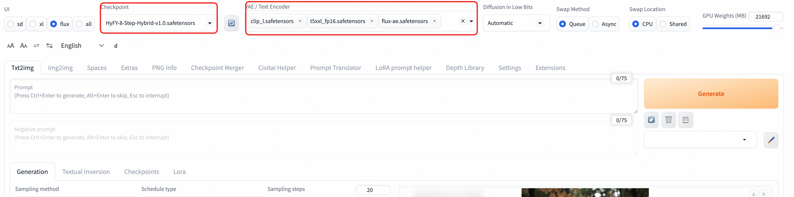

# Flux1-Dev 文生图模型部署指南

## 模型简介

Flux1-Dev 是由 Black Forest Labs 开发的先进文本到图像生成模型，代表了当前开源图像生成技术的最高水准。该模型基于流匹配（Flow Matching）技术，在图像质量、文本理解能力和生成速度方面都有显著提升。

### 核心特性
- **先进架构**: 基于流匹配技术的扩散变换器架构
- **卓越质量**: 生成图像质量接近商业级模型水准
- **强大文本理解**: 集成完整FP16版CLIP-L与T5文本编码器
- **高分辨率支持**: 原生支持1024×1024及更高分辨率
- **快速生成**: 优化的推理速度，支持少步生成
- **开源友好**: 完全开源，支持商业使用
- **多样化风格**: 支持写实、艺术、概念设计等多种风格

### 技术规格
- **模型类型**: 文本到图像生成（Text-to-Image）
- **架构**: 流匹配扩散变换器
- **参数规模**: 约12B参数
- **文本编码器**: T5-XXL + CLIP-L
- **VAE**: 专用的flux-ae变分自编码器
- **原生分辨率**: 1024×1024
- **支持分辨率**: 512×512 到 2048×2048
- **推荐步数**: 4-50步（8步为最佳平衡点）

### 模型优势
- **图像质量**: 细节丰富，色彩自然，构图合理
- **文本遵循**: 精确理解复杂文本描述
- **风格多样**: 从照片级写实到抽象艺术
- **一致性**: 生成结果稳定可控
- **效率**: 相比同级别模型推理速度更快

## 配置说明

### Stable Diffusion WebUI Forge 部署

#### 系统要求
- **显存**: 12GB以上推荐（8GB最低要求）


#### 模型文件
核心模型清单如下：
- **主模型**: `flux.1_dev_8x8_e4m3fn.safetensors` 或其他Flux1-Dev变体
- **VAE**: `flux-ae.safetensors`
- **文本编码器**:
    - `t5xxl_fp16.safetensors`
    - `clip_l.safetensors`
    - `clip_g.safetensors`


## 使用指南

### Web UI 使用

#### 界面操作
1. **模型切换**: 在Checkpoint模型选择器中选择Flux1-Dev（HyFY-8-Step-Hybrid-v1.0.safetensors）模型
2. **VAE和CLIP模型选择**: 选择Clip_l.safetensors,t5xxl_fp16.safetensors,flux-ae.safetensors
2. **提示词输入**:
    - 正向提示词：详细描述想要生成的图像
    - 负向提示词：描述不想要的元素（Flux模型对负向提示词不敏感）
3. **参数设置**:
    - **步数**: 推荐8-20步
    - **CFG**: 推荐1.0-3.5（较低值效果更好）
    - **采样器**: 推荐Euler或DPM++ 2M
    - **分辨率**: 1024×1024或其他支持的尺寸
4. **生成图像**: 点击"Generate"按钮开始生成
5. **结果处理**: 查看、保存或进一步编辑生成的图像


### 分辨率设置
常用分辨率：
- **1024×1024**: 标准正方形
- **1024×768**: 横向4:3
- **768×1024**: 纵向3:4
- **1152×896**: 横向宽屏
- **896×1152**: 纵向宽屏
- **1216×832**: 超宽横向
- **832×1216**: 超高纵向
- 
```

#### 示例提示词
```python
# 写实风格
"a professional portrait of a young woman, natural lighting, high resolution, detailed skin texture, photorealistic"

# 艺术风格
"an impressionist painting of a garden in spring, soft brushstrokes, vibrant colors, artistic masterpiece"

# 概念设计
"futuristic robot design, sleek metallic surface, glowing blue accents, concept art, highly detailed"

# 风景摄影
"mountain landscape at golden hour, dramatic clouds, professional photography, ultra-wide angle, HDR"
```

ui界面使用示例


## api调用示例
```python
import requests
import base64
import time
import uuid

# 配置
base_url = "http://127.0.0.1:7680"
auth = ("admin", "${APIKEY}")
session_hash = str(uuid.uuid4())[:12]

# 设置VAE/Text Encoder
print("正在设置VAE/Text Encoder...")
requests.post(f"{base_url}/run/predict", json={
    "data": [["flux-ae.safetensors", "t5xxl_fp16.safetensors", "clip_l.safetensors", "clip_g.safetensors"]],
    "event_data": None,
    "fn_index": 9,
    "trigger_id": 1001,
    "session_hash": session_hash
}, auth=auth)
time.sleep(3)

# 切换FLUX模型
print("正在切换FLUX模型...")
requests.post(f"{base_url}/queue/join", json={
    "data": ["HyFY-8-Step-Hybrid-v1.0.safetensors"],
    "event_data": None,
    "fn_index": 8,
    "trigger_id": 1002,
    "session_hash": session_hash
}, auth=auth)
time.sleep(15)

# 生成图片
print("正在生成图片...")
result = requests.post(f"{base_url}/sdapi/v1/txt2img", json={
    "prompt": "a beautiful cat",
    "steps": 8,
    "width": 1024,
    "height": 1024,
    "cfg_scale": 1.0,
    "sampler_name": "Euler"
}, auth=auth).json()

# 保存图片
if "images" in result:
    with open("output.png", "wb") as f:
        f.write(base64.b64decode(result["images"][0]))
    print("图片已保存为 output.png")
else:
    print("错误:", result)


```

## 其他内置模型
当前服务中，Flux模型会部署到ECS实例中。除了当前的Flux-dev模型，还支持了SD1.5和SD3模型，可在Webui Forge界面进行动态切换提示。

