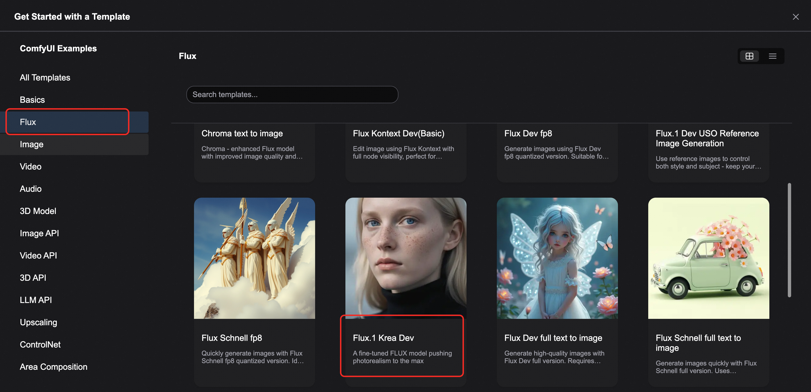

<div style="background: linear-gradient(135deg, #2563eb, #1e40af); padding: 24px; border-radius: 8px; color: white; text-align: center; margin-bottom: 24px;">
  <h1 style="font-size: 2.5em; margin: 0; font-weight: 600;">🎨 Flux.1 Krea Dev Image Generation</h1>
  <p style="font-size: 1.2em; margin: 16px 0 0 0; opacity: 0.9;">ComfyUI Native Workflow - Perfect Combination of Unique Aesthetic Style and Natural Details</p>
  <div style="margin-top: 20px;">
    <span style="background: rgba(255,255,255,0.2); color: white; padding: 4px 12px; border-radius: 12px; font-size: 14px; margin: 0 8px;">🎯 Unique Aesthetics</span>
    <span style="background: rgba(255,255,255,0.2); color: white; padding: 4px 12px; border-radius: 12px; font-size: 14px; margin: 0 8px;">✨ Natural Details</span>
    <span style="background: rgba(255,255,255,0.2); color: white; padding: 4px 12px; border-radius: 12px; font-size: 14px; margin: 0 8px;">🏆 Exceptional Realism</span>
  </div>
</div>

## 📋 Flux.1 Krea Dev Model Overview

<div style="background: #f8fafc; border: 1px solid #e2e8f0; border-radius: 8px; padding: 20px; margin: 16px 0;">

<div style="text-align: center; margin: 20px 0;">
  
</div>

[Flux.1 Krea Dev](https://huggingface.co/black-forest-labs/FLUX.1-Krea-dev) is an advanced text-to-image model developed through collaboration between Black Forest Labs (BFL) and Krea. This is currently the best open-source FLUX model, specifically designed for text-to-image generation.

<div style="display: grid; grid-template-columns: repeat(auto-fit, minmax(280px, 1fr)); gap: 16px; margin: 16px 0;">

<div style="background: #eff6ff; border-left: 4px solid #2563eb; padding: 16px; border-radius: 4px; text-align: center;">
<div style="font-size: 2.5em; margin-bottom: 12px; color: #2563eb;">🎯</div>
<h4 style="margin: 0 0 8px 0; color: #1e40af;">Unique Aesthetic Style</h4>
<p style="margin: 0; color: #1e40af;">Focuses on generating images with unique aesthetics, avoiding common "AI-generated" appearance</p>
</div>

<div style="background: #f0fdf4; border-left: 4px solid #059669; padding: 16px; border-radius: 4px; text-align: center;">
<div style="font-size: 2.5em; margin-bottom: 12px; color: #059669;">✨</div>
<h4 style="margin: 0 0 8px 0; color: #059669;">Natural Details</h4>
<p style="margin: 0; color: #065f46;">Avoids overexposed highlights, maintaining natural detail representation</p>
</div>

<div style="background: #fff7ed; border-left: 4px solid #ea580c; padding: 16px; border-radius: 4px; text-align: center;">
<div style="font-size: 2.5em; margin-bottom: 12px; color: #ea580c;">🏆</div>
<h4 style="margin: 0 0 8px 0; color: #ea580c;">Exceptional Realism</h4>
<p style="margin: 0; color: #9a3412;">Provides outstanding realism and image quality</p>
</div>

<div style="background: #f5f3ff; border-left: 4px solid #7c3aed; padding: 16px; border-radius: 4px; text-align: center;">
<div style="font-size: 2.5em; margin-bottom: 12px; color: #7c3aed;">🔧</div>
<h4 style="margin: 0 0 8px 0; color: #7c3aed;">Fully Compatible Architecture</h4>
<p style="margin: 0; color: #5b21b6;">Completely compatible architecture design with FLUX.1 [dev]</p>
</div>

</div>

<div style="background: #eff6ff; border-left: 4px solid #2563eb; padding: 16px; margin: 16px 0; border-radius: 4px;">
  <strong>📄 Model License</strong><br>
  This model is released under the <a href="https://huggingface.co/black-forest-labs/FLUX.1-Krea-dev/blob/main/LICENSE.md" target="_blank" style="color: #2563eb;">flux-1-dev-non-commercial-license</a>, for non-commercial use only.
</div>

</div>

## 🚀 Flux.1 Krea Dev ComfyUI Workflow

### ⚠️ Environment Requirements

<div style="background: #fef3c7; border-left: 4px solid #d97706; padding: 16px; margin: 16px 0; border-radius: 4px;">
  <strong>📋 Pre-usage Checklist</strong><br>
  • Ensure ComfyUI is updated to the latest version<br>
  • Recommend using the latest development version (nightly) for full functionality<br>
  • The workflow in this guide can be found in ComfyUI's workflow templates<br>
  • If nodes are missing when loading the workflow, check ComfyUI version or node import status
</div>

<div style="display: grid; grid-template-columns: 1fr 1fr; gap: 16px; margin: 16px 0;">

<div style="background: #dcfce7; border-left: 4px solid #059669; padding: 16px; border-radius: 4px;">
<h4 style="color: #059669; margin: 0 0 8px 0;">📥 Download Links</h4>
<ul style="margin: 0; padding-left: 20px; color: #065f46;">
  <li><a href="https://www.comfy.org/download" target="_blank" style="color: #059669;">ComfyUI Download</a></li>
  <li><a href="/installation/update_comfyui" target="_blank" style="color: #059669;">ComfyUI Update Tutorial</a></li>
  <li><a href="/interface/features/template" target="_blank" style="color: #059669;">Workflow Templates</a></li>
</ul>
</div>

<div style="background: #fef2f2; border-left: 4px solid #dc2626; padding: 16px; border-radius: 4px;">
<h4 style="color: #dc2626; margin: 0 0 8px 0;">🔧 Common Issues</h4>
<ul style="margin: 0; padding-left: 20px; color: #991b1b;">
  <li>Missing nodes: Version too old or import failed</li>
  <li>Incomplete features: Using stable version instead of dev version</li>
  <li>Loading failure: Node import exception during startup</li>
</ul>
</div>

</div>

### 📥 Step 1: Download Workflow Files

<div style="background: #f8fafc; border: 1px solid #e2e8f0; border-radius: 8px; padding: 20px; margin: 16px 0;">

Download the following image or JSON file and drag it into ComfyUI to load the corresponding workflow.

<div style="text-align: center; margin: 20px 0;">
  
  <p style="margin: 8px 0 0 0; color: #64748b; font-size: 14px;">Click image to download, drag into ComfyUI to load workflow</p>
</div>

<div style="text-align: center; margin: 20px 0;">
  <a href="https://raw.githubusercontent.com/Comfy-Org/workflow_templates/refs/heads/main/templates/flux1_krea_dev.json" target="_blank" style="display: inline-block; background: linear-gradient(135deg, #2563eb, #1e40af); color: white; padding: 12px 24px; border-radius: 8px; text-decoration: none; font-weight: bold; box-shadow: 0 4px 8px rgba(37, 99, 235, 0.3);">
    📄 Download JSON Workflow File
  </a>
</div>

</div>

### 🔗 Step 2: Model Files

<div style="background: #f8fafc; border: 1px solid #e2e8f0; border-radius: 8px; padding: 20px; margin: 16px 0;">

#### 📂 Model File Structure

<div style="background: #1e293b; border-radius: 6px; padding: 16px; margin: 16px 0;">
<pre style="margin: 0; color: #e2e8f0; font-family: 'Courier New', monospace; font-size: 14px;"><code>ComfyUI/
├── models/
│   ├── diffusion_models/
│   │   └── flux1-krea-dev_fp8_scaled.safetensors or flux1-krea-dev.safetensors
│   ├── text_encoders/
│   │   ├── clip_l.safetensors
│   │   └── t5xxl_fp16.safetensors or t5xxl_fp8_e4m3fn.safetensors
│   └── vae/
│       └── ae.safetensors</code></pre>
</div>


#### 💡 Model Version Selection Guide

<div style="display: grid; grid-template-columns: 1fr 1fr; gap: 16px; margin: 16px 0;">

<div style="background: #dcfce7; border-left: 4px solid #059669; padding: 16px; border-radius: 4px;">
<h4 style="color: #059669; margin: 0 0 8px 0;">💚 FP8 Quantized Version</h4>
<ul style="margin: 0; padding-left: 20px; color: #065f46; font-size: 14px;">
  <li>VRAM requirement: 12-16GB</li>
  <li>Suitable for: RTX 4060 Ti 16GB, RTX 4070, etc.</li>
  <li>Quality: Close to original, VRAM friendly</li>
</ul>
</div>

<div style="background: #fff7ed; border-left: 4px solid #ea580c; padding: 16px; border-radius: 4px;">
<h4 style="color: #ea580c; margin: 0 0 8px 0;">🔥 Original Weights Version</h4>
<ul style="margin: 0; padding-left: 20px; color: #9a3412; font-size: 14px;">
  <li>VRAM requirement: 24GB+</li>
  <li>Suitable for: RTX 4090, A100, etc.</li>
  <li>Quality: Highest quality output</li>
</ul>
</div>

</div>

<div style="background: #fef2f2; border-left: 4px solid #dc2626; padding: 16px; margin: 16px 0; border-radius: 4px;">
  <strong>⚠️ Important Notes</strong><br>
  • The <code>flux1-krea-dev.safetensors</code> file requires agreeing to the <a href="https://huggingface.co/black-forest-labs/FLUX.1-Krea-dev/" target="_blank" style="color: #dc2626;">black-forest-labs/FLUX.1-Krea-dev</a> license before download<br>
  • If you've used other Flux workflows, Text Encoders and VAE files can be reused without re-downloading
</div>

</div>

### 🔧 Step 3: Workflow Configuration Operations

<div style="background: #f8fafc; border: 1px solid #e2e8f0; border-radius: 8px; padding: 20px; margin: 16px 0;">
open the comfyui template:


<div style="background: #fef3c7; border-left: 4px solid #d97706; padding: 16px; margin: 16px 0; border-radius: 4px;">
  <strong>⚠️ Low VRAM User Notice</strong><br>
  For low VRAM users, this model may not run smoothly on your device. Consider waiting for community-optimized versions or use the FP8 quantized version.
</div>

<div style="text-align: center; margin: 20px 0;">
  
</div>

#### 📋 Detailed Configuration Steps

<div style="display: grid; grid-template-columns: repeat(auto-fit, minmax(300px, 1fr)); gap: 16px; margin: 16px 0;">

<div style="background: #eff6ff; border-left: 4px solid #2563eb; padding: 16px; border-radius: 4px;">
<h4 style="color: #2563eb; margin: 0 0 8px 0;">🔧 Diffusion Model Loading</h4>
<p style="margin: 0 0 8px 0; color: #1e40af; font-size: 14px;">In the <strong>Load Diffusion Model</strong> node, select:</p>
<ul style="margin: 0; padding-left: 20px; color: #1e40af; font-size: 13px;">
  <li><code>flux1-krea-dev_fp8_scaled.safetensors</code> (recommended)</li>
  <li>or <code>flux1-krea-dev.safetensors</code> (high VRAM)</li>
</ul>
</div>

<div style="background: #f0fdf4; border-left: 4px solid #059669; padding: 16px; border-radius: 4px;">
<h4 style="color: #059669; margin: 0 0 8px 0;">📝 Text Encoders Configuration</h4>
<p style="margin: 0 0 8px 0; color: #065f46; font-size: 14px;">In the <strong>DualCLIPLoader</strong> node, ensure:</p>
<ul style="margin: 0; padding-left: 20px; color: #065f46; font-size: 13px;">
  <li><strong>clip_name1</strong>: t5xxl_fp16.safetensors or t5xxl_fp8_e4m3fn.safetensors</li>
  <li><strong>clip_name2</strong>: clip_l.safetensors</li>
</ul>
</div>

<div style="background: #fff7ed; border-left: 4px solid #ea580c; padding: 16px; border-radius: 4px;">
<h4 style="color: #ea580c; margin: 0 0 8px 0;">🎨 VAE Loading</h4>
<p style="margin: 0; color: #9a3412; font-size: 14px;">In the <strong>Load VAE</strong> node, load <code>ae.safetensors</code></p>
</div>

<div style="background: #f3e8ff; border-left: 4px solid #7c3aed; padding: 16px; border-radius: 4px;">
<h4 style="color: #7c3aed; margin: 0 0 8px 0;">📝 Prompt Settings</h4>
<p style="margin: 0; color: #5b21b6; font-size: 14px;">Enter your creative prompts in the <strong>CLIP Text Encode</strong> node</p>
</div>

</div>

#### 🎛️ Text Encoder Selection Guide

<div style="overflow-x: auto; margin: 16px 0;">
<table style="width: 100%; border-collapse: collapse; background: white; border-radius: 6px; overflow: hidden; box-shadow: 0 1px 3px rgba(0,0,0,0.1);">
  <thead style="background: #f8fafc;">
    <tr>
      <th style="padding: 12px; text-align: left; border-bottom: 1px solid #e2e8f0; color: #1e40af; font-weight: 600;">VRAM Capacity</th>
      <th style="padding: 12px; text-align: left; border-bottom: 1px solid #e2e8f0; color: #1e40af; font-weight: 600;">Recommended T5 Version</th>
      <th style="padding: 12px; text-align: left; border-bottom: 1px solid #e2e8f0; color: #1e40af; font-weight: 600;">Description</th>
    </tr>
  </thead>
  <tbody>
    <tr>
      <td style="padding: 12px; border-bottom: 1px solid #f1f5f9; font-weight: 500;">< 16GB</td>
      <td style="padding: 12px; border-bottom: 1px solid #f1f5f9; font-family: monospace; font-size: 12px;">t5xxl_fp8_e4m3fn.safetensors</td>
      <td style="padding: 12px; border-bottom: 1px solid #f1f5f9;">Low VRAM optimized version</td>
    </tr>
    <tr>
      <td style="padding: 12px; border-bottom: 1px solid #f1f5f9; font-weight: 500;">16-24GB</td>
      <td style="padding: 12px; border-bottom: 1px solid #f1f5f9; font-family: monospace; font-size: 12px;">t5xxl_fp8_e4m3fn.safetensors</td>
      <td style="padding: 12px; border-bottom: 1px solid #f1f5f9;">Balanced performance and quality</td>
    </tr>
    <tr>
      <td style="padding: 12px; font-weight: 500;">≥ 32GB</td>
      <td style="padding: 12px; font-family: monospace; font-size: 12px;">t5xxl_fp16.safetensors</td>
      <td style="padding: 12px;">Best quality experience</td>
    </tr>
  </tbody>
</table>
</div>

#### 🚀 Execute Generation

<div style="text-align: center; margin: 20px 0;">
  <div style="background: linear-gradient(135deg, #059669, #047857); color: white; padding: 16px 32px; border-radius: 8px; display: inline-block; box-shadow: 0 4px 8px rgba(5, 150, 105, 0.3);">
    <strong>⌨️ Click Queue button or use shortcut Ctrl(Cmd) + Enter to run workflow</strong>
  </div>
</div>

</div>

## API Execute
<details style="border: 2px solid #2563eb; border-radius: 12px; padding: 20px; margin: 20px 0; background: linear-gradient(145deg, #f8fafc, #eff6ff); box-shadow: 0 8px 16px rgba(37, 99, 235, 0.15);">
<summary style="font-weight: bold; font-size: 18px; color: white; cursor: pointer; padding: 16px; background: linear-gradient(135deg, #2563eb, #1e40af); border-radius: 8px; margin: -20px -20px 20px -20px; text-shadow: 1px 1px 2px rgba(0,0,0,0.2); transition: all 0.3s ease; display: flex; align-items: center; box-shadow: 0 4px 8px rgba(37, 99, 235, 0.3);">
📋 ComfyUI API Python
</summary>

```python

import requests
import json
import uuid
import time
import random
import os

# Configuration Parameters - Flux Krea Specific
COMFYUI_SERVER = "127.0.0.1:8188"  # Local server
COMFYUI_TOKEN = ""  # Usually no token needed for local
UNET_MODEL = "flux1-krea-dev_fp8_scaled.safetensors"
VAE_MODEL = "flux-ae.safetensors"
CLIP_L_MODEL = "clip_l_bf16.safetensors"
CLIP_T5_MODEL = "t5xxl_fp16.safetensors"

# Default Parameters
DEFAULT_PROMPT = "Highly realistic portrait of a Nordic woman with blonde hair and blue eyes, very few freckles on her face, gaze sharp and intellectual. The lighting should reflect the unique coolness of Northern Europe. Outfit is minimalist and modern, background is blurred in cool tones. Needs to perfectly capture the characteristics of a Scandinavian woman. solo, Centered composition"

class ComfyUIFluxKreaClient:
def __init__(self, server=COMFYUI_SERVER, token=COMFYUI_TOKEN):
self.base_url = f"http://{server}"
self.token = token
self.client_id = str(uuid.uuid4())
self.headers = {"Content-Type": "application/json"}
if token:
self.headers["Authorization"] = f"Bearer {token}"

    def generate_flux_krea_image(self, prompt, steps=20, cfg=1, 
                                width=1024, height=1024, seed=None):
        """Generate Flux Krea text-to-image based on original JSON workflow"""
        print("Starting Flux Krea text-to-image generation...")
        
        # Generate random seed if not provided
        if seed is None:
            seed = random.randint(1, 1000000000000000)

        # Workflow based on your provided JSON
        workflow = {
            "8": {
                "inputs": {
                    "samples": ["31", 0],
                    "vae": ["39", 0]
                },
                "class_type": "VAEDecode",
                "_meta": {"title": "VAE Decode"}
            },
            "9": {
                "inputs": {
                    "filename_prefix": "flux_krea/flux_krea",
                    "images": ["8", 0]
                },
                "class_type": "SaveImage",
                "_meta": {"title": "Save Image"}
            },
            "27": {
                "inputs": {
                    "width": width,
                    "height": height,
                    "batch_size": 1
                },
                "class_type": "EmptySD3LatentImage",
                "_meta": {"title": "Empty SD3 Latent Image"}
            },
            "31": {
                "inputs": {
                    "seed": seed,
                    "steps": steps,
                    "cfg": cfg,
                    "sampler_name": "euler",
                    "scheduler": "simple",
                    "denoise": 1,
                    "model": ["38", 0],
                    "positive": ["45", 0],
                    "negative": ["42", 0],
                    "latent_image": ["27", 0]
                },
                "class_type": "KSampler",
                "_meta": {"title": "K Sampler"}
            },
            "38": {
                "inputs": {
                    "unet_name": UNET_MODEL,
                    "weight_dtype": "default"
                },
                "class_type": "UNETLoader",
                "_meta": {"title": "UNet Loader"}
            },
            "39": {
                "inputs": {
                    "vae_name": VAE_MODEL
                },
                "class_type": "VAELoader",
                "_meta": {"title": "VAE Loader"}
            },
            "40": {
                "inputs": {
                    "clip_name1": CLIP_L_MODEL,
                    "clip_name2": CLIP_T5_MODEL,
                    "type": "flux",
                    "device": "default"
                },
                "class_type": "DualCLIPLoader",
                "_meta": {"title": "Dual CLIP Loader"}
            },
            "42": {
                "inputs": {
                    "conditioning": ["45", 0]
                },
                "class_type": "ConditioningZeroOut",
                "_meta": {"title": "Conditioning Zero Out"}
            },
            "45": {
                "inputs": {
                    "text": prompt,
                    "clip": ["40", 0]
                },
                "class_type": "CLIPTextEncode",
                "_meta": {"title": "CLIP Text Encode"}
            }
        }

        print("Submitting Flux Krea text-to-image workflow...")
        print(f"Prompt: {prompt}")
        print(f"Random Seed: {seed}")
        
        response = requests.post(
            f"{self.base_url}/prompt", 
            headers=self.headers, 
            json={"prompt": workflow, "client_id": self.client_id}
        )
        
        print(f"API Response: {response.text}")

        if response.status_code != 200:
            raise Exception(f"API request failed with status code: {response.status_code}")

        result = response.json()
        if "error" in result:
            raise Exception(f"Workflow error: {result['error']}")
        if "prompt_id" not in result:
            raise Exception(f"No prompt_id in response: {result}")
        
        return result["prompt_id"], seed

    def get_status(self, task_id):
        """Get task status"""
        try:
            # Check queue status
            queue_data = requests.get(f"{self.base_url}/queue", headers=self.headers).json()
            
            # Check if in running queue
            if any(item[1] == task_id for item in queue_data.get("queue_running", [])):
                return "processing"
            
            # Check if in pending queue
            if any(item[1] == task_id for item in queue_data.get("queue_pending", [])):
                return "pending"
            
            # Check history
            history_response = requests.get(f"{self.base_url}/history/{task_id}", headers=self.headers)
            if history_response.status_code == 200:
                history = history_response.json()
                if task_id in history:
                    return "completed"
            
            return "processing"
        except Exception as e:
            print(f"Status check error: {e}")
            return "processing"

    def download_image(self, task_id, output_dir="outputs"):
        """Download generated images"""
        try:
            # Ensure output directory exists
            os.makedirs(output_dir, exist_ok=True)
            
            response = requests.get(f"{self.base_url}/history/{task_id}", headers=self.headers)
            history = response.json()
            
            if task_id in history:
                outputs = history[task_id]['outputs']
                downloaded_files = []
                
                for node_id, output in outputs.items():
                    if 'images' in output:
                        for img_info in output['images']:
                            filename = img_info['filename']
                            # Download image
                            img_response = requests.get(
                                f"{self.base_url}/view?filename={filename}", 
                                headers=self.headers
                            )
                            
                            if img_response.status_code == 200:
                                output_path = os.path.join(output_dir, filename)
                                with open(output_path, "wb") as f:
                                    f.write(img_response.content)
                                downloaded_files.append(output_path)
                                print(f"Image saved: {output_path}")
                
                return downloaded_files
                
        except Exception as e:
            print(f"Download error: {e}")
        
        return []

    def generate_batch(self, prompts_list, **kwargs):
        """Batch generate images"""
        results = []
        
        for i, prompt in enumerate(prompts_list):
            print(f"\nStarting task {i+1}/{len(prompts_list)}...")
            
            try:
                task_id, seed = self.generate_flux_krea_image(prompt, **kwargs)
                
                # Wait for completion
                while True:
                    status = self.get_status(task_id)
                    print(f"Task {i+1} status: {status}")
                    
                    if status == "completed":
                        files = self.download_image(task_id)
                        results.append({
                            'task_id': task_id,
                            'seed': seed,
                            'files': files,
                            'prompt': prompt
                        })
                        break
                    elif status == "failed":
                        print(f"Task {i+1} failed")
                        break
                    
                    time.sleep(5)
                    
            except Exception as e:
                print(f"Task {i+1} error: {e}")
        
        return results

    def generate_with_variations(self, base_prompt, variations, **kwargs):
        """Generate images with prompt variations"""
        prompts = [f"{base_prompt}, {variation}" for variation in variations]
        return self.generate_batch(prompts, **kwargs)

def main():
"""Main function - Execute Flux Krea text-to-image generation"""
client = ComfyUIFluxKreaClient()

    try:
        print("Flux Krea text-to-image client started...")
        
        # Single image generation example
        print("\n=== Single Image Generation ===")
        task_id, seed = client.generate_flux_krea_image(
            prompt=DEFAULT_PROMPT,
            steps=20,
            cfg=1,
            width=1024,
            height=1024
        )
        
        print(f"Task ID: {task_id}")
        print(f"Seed: {seed}")

        # Wait for task completion
        while True:
            status = client.get_status(task_id)
            print(f"Current status: {status}")
            
            if status == "completed":
                print("Image generation completed!")
                break
            elif status == "failed":
                print("Generation failed!")
                return
            
            time.sleep(5)

        # Download images
        downloaded_files = client.download_image(task_id)
        if downloaded_files:
            print(f"Successfully downloaded {len(downloaded_files)} files!")
            for file in downloaded_files:
                print(f"File path: {file}")
        else:
            print("Download failed")

        # Batch generation example
        print("\n=== Batch Generation Example ===")
        batch_prompts = [
            "Portrait of a young Asian woman with long black hair, wearing traditional kimono, cherry blossoms in background, soft lighting",
            "Professional headshot of a businessman in a navy suit, confident expression, office background, studio lighting",
            "Artistic portrait of an elderly man with a white beard, weathered face, dramatic side lighting, black and white"
        ]
        
        # Uncomment to run batch generation
        # batch_results = client.generate_batch(batch_prompts, steps=20, cfg=1)
        # print(f"Batch generation completed, generated {len(batch_results)} images")

        # Variation generation example
        print("\n=== Variation Generation Example ===")
        base_prompt = "Portrait of a woman"
        variations = [
            "smiling, warm lighting",
            "serious expression, dramatic lighting", 
            "laughing, natural outdoor lighting",
            "contemplative, soft studio lighting"
        ]
        
        # Uncomment to run variation generation
        # variation_results = client.generate_with_variations(base_prompt, variations, steps=15)
        # print(f"Variation generation completed, generated {len(variation_results)} images")

    except Exception as e:
        print(f"Error: {e}")

if __name__ == "__main__":
main()

```

</details>


## 🎯 Flux.1 Krea Dev Key Advantages

<div style="display: grid; grid-template-columns: repeat(auto-fit, minmax(280px, 1fr)); gap: 16px; margin: 16px 0;">

<div style="background: #eff6ff; border-left: 4px solid #2563eb; padding: 16px; border-radius: 4px; text-align: center;">
<div style="font-size: 2.5em; margin-bottom: 12px; color: #2563eb;">🎨</div>
<h4 style="margin: 0 0 8px 0; color: #1e40af;">Artistic Aesthetics</h4>
<p style="margin: 0; color: #1e40af;">Unique aesthetic style that avoids common AI-generated artifacts</p>
</div>

<div style="background: #f0fdf4; border-left: 4px solid #059669; padding: 16px; border-radius: 4px; text-align: center;">
<div style="font-size: 2.5em; margin-bottom: 12px; color: #059669;">📸</div>
<h4 style="margin: 0 0 8px 0; color: #059669;">Photographic Quality</h4>
<p style="margin: 0; color: #065f46;">Natural lighting treatment without overexposed highlights</p>
</div>

<div style="background: #fff7ed; border-left: 4px solid #ea580c; padding: 16px; border-radius: 4px; text-align: center;">
<div style="font-size: 2.5em; margin-bottom: 12px; color: #ea580c;">🏆</div>
<h4 style="margin: 0 0 8px 0; color: #ea580c;">Best Open Source</h4>
<p style="margin: 0; color: #9a3412;">Currently the best open-source FLUX model weights</p>
</div>

<div style="background: #f5f3ff; border-left: 4px solid #7c3aed; padding: 16px; border-radius: 4px; text-align: center;">
<div style="font-size: 2.5em; margin-bottom: 12px; color: #7c3aed;">🔄</div>
<h4 style="margin: 0 0 8px 0; color: #7c3aed;">Fully Compatible</h4>
<p style="margin: 0; color: #5b21b6;">Completely compatible with existing FLUX.1 [dev] workflows</p>
</div>

</div>

## 💡 Usage Tips and Recommendations

<div style="display: grid; grid-template-columns: 1fr 1fr; gap: 16px; margin: 16px 0;">

<div style="background: #dcfce7; border-left: 4px solid #059669; padding: 16px; border-radius: 4px;">
<h4 style="color: #059669; margin: 0 0 8px 0;">✅ Best Practices</h4>
<ul style="margin: 0; padding-left: 20px; color: #065f46;">
  <li>Use detailed, specific prompt descriptions</li>
  <li>Take full advantage of the model's aesthetic style features</li>
  <li>Choose appropriate model version based on VRAM capacity</li>
  <li>Experiment with different sampler and step combinations</li>
</ul>
</div>

<div style="background: #fef2f2; border-left: 4px solid #dc2626; padding: 16px; border-radius: 4px;">
<h4 style="color: #dc2626; margin: 0 0 8px 0;">⚠️ Important Notes</h4>
<ul style="margin: 0; padding-left: 20px; color: #991b1b;">
  <li>Ensure sufficient VRAM to run the model</li>
  <li>Original weights version requires more computational resources</li>
  <li>Note the model's non-commercial license restrictions</li>
  <li>First run may require longer loading time</li>
</ul>
</div>

</div>

## 🔧 Technical Specifications

<div style="background: #f8fafc; border: 1px solid #e2e8f0; border-radius: 8px; padding: 20px; margin: 16px 0;">

### 💻 System Requirements

<div style="overflow-x: auto; margin: 16px 0;">
<table style="width: 100%; border-collapse: collapse; background: white; border-radius: 6px; overflow: hidden; box-shadow: 0 1px 3px rgba(0,0,0,0.1);">
  <thead style="background: #f8fafc;">
    <tr>
      <th style="padding: 12px; text-align: left; border-bottom: 1px solid #e2e8f0; color: #1e40af; font-weight: 600;">Component</th>
      <th style="padding: 12px; text-align: left; border-bottom: 1px solid #e2e8f0; color: #1e40af; font-weight: 600;">FP8 Version</th>
      <th style="padding: 12px; text-align: left; border-bottom: 1px solid #e2e8f0; color: #1e40af; font-weight: 600;">Original Weights Version</th>
    </tr>
  </thead>
  <tbody>
    <tr>
      <td style="padding: 12px; border-bottom: 1px solid #f1f5f9; font-weight: 500;">GPU VRAM</td>
      <td style="padding: 12px; border-bottom: 1px solid #f1f5f9;">12-16GB</td>
      <td style="padding: 12px; border-bottom: 1px solid #f1f5f9;">24GB+</td>
    </tr>
    <tr>
      <td style="padding: 12px; border-bottom: 1px solid #f1f5f9; font-weight: 500;">System RAM</td>
      <td style="padding: 12px; border-bottom: 1px solid #f1f5f9;">16GB+</td>
      <td style="padding: 12px; border-bottom: 1px solid #f1f5f9;">32GB+</td>
    </tr>
    <tr>
      <td style="padding: 12px; border-bottom: 1px solid #f1f5f9; font-weight: 500;">Storage Space</td>
      <td style="padding: 12px; border-bottom: 1px solid #f1f5f9;">15GB</td>
      <td style="padding: 12px; border-bottom: 1px solid #f1f5f9;">25GB</td>
    </tr>
    <tr>
      <td style="padding: 12px; font-weight: 500;">Recommended GPU</td>
      <td style="padding: 12px;">RTX 4060 Ti 16GB / RTX 4070</td>
      <td style="padding: 12px;">RTX 4090 / A100</td>
    </tr>
  </tbody>
</table>
</div>

### 🎨 Generation Capabilities

<div style="display: grid; grid-template-columns: repeat(auto-fit, minmax(200px, 1fr)); gap: 12px; margin: 16px 0;">
  <div style="background: #eff6ff; padding: 12px; border-radius: 6px; text-align: center;">
    <span style="background: #2563eb; color: white; padding: 4px 12px; border-radius: 12px; font-size: 12px;">Portrait Photography</span>
  </div>
  <div style="background: #f0fdf4; padding: 12px; border-radius: 6px; text-align: center;">
    <span style="background: #059669; color: white; padding: 4px 12px; border-radius: 12px; font-size: 12px;">Landscape Photography</span>
  </div>
  <div style="background: #fff7ed; padding: 12px; border-radius: 6px; text-align: center;">
    <span style="background: #ea580c; color: white; padding: 4px 12px; border-radius: 12px; font-size: 12px;">Artistic Creation</span>
  </div>
  <div style="background: #f3e8ff; padding: 12px; border-radius: 6px; text-align: center;">
    <span style="background: #7c3aed; color: white; padding: 4px 12px; border-radius: 12px; font-size: 12px;">Product Design</span>
  </div>
  <div style="background: #fef3c7; padding: 12px; border-radius: 6px; text-align: center;">
    <span style="background: #d97706; color: white; padding: 4px 12px; border-radius: 12px; font-size: 12px;">Architectural Rendering</span>
  </div>
  <div style="background: #fef2f2; padding: 12px; border-radius: 6px; text-align: center;">
    <span style="background: #dc2626; color: white; padding: 4px 12px; border-radius: 12px; font-size: 12px;">Concept Art</span>
  </div>
</div>

</div>

## 🎯 Application Scenarios

<div style="display: grid; grid-template-columns: repeat(auto-fit, minmax(280px, 1fr)); gap: 16px; margin: 16px 0;">

<div style="background: #eff6ff; border-left: 4px solid #2563eb; padding: 16px; border-radius: 4px; text-align: center;">
<div style="font-size: 2.5em; margin-bottom: 12px; color: #2563eb;">🎨</div>
<h4 style="margin: 0 0 8px 0; color: #1e40af;">Artistic Creation</h4>
<p style="margin: 0; color: #1e40af;">Concept art, illustration design, visual art creation</p>
</div>

<div style="background: #f0fdf4; border-left: 4px solid #059669; padding: 16px; border-radius: 4px; text-align: center;">
<div style="font-size: 2.5em; margin-bottom: 12px; color: #059669;">📱</div>
<h4 style="margin: 0 0 8px 0; color: #059669;">Content Creation</h4>
<p style="margin: 0; color: #065f46;">Social media content, blog illustrations, marketing materials</p>
</div>

<div style="background: #fff7ed; border-left: 4px solid #ea580c; padding: 16px; border-radius: 4px; text-align: center;">
<div style="font-size: 2.5em; margin-bottom: 12px; color: #ea580c;">🎬</div>
<h4 style="margin: 0 0 8px 0; color: #ea580c;">Film Production</h4>
<p style="margin: 0; color: #9a3412;">Storyboard design, concept previews, visual development</p>
</div>

<div style="background: #f5f3ff; border-left: 4px solid #7c3aed; padding: 16px; border-radius: 4px; text-align: center;">
<div style="font-size: 2.5em; margin-bottom: 12px; color: #7c3aed;">🔬</div>
<h4 style="margin: 0 0 8px 0; color: #7c3aed;">Research & Experimentation</h4>
<p style="margin: 0; color: #5b21b6;">AI research, model comparison, academic studies</p>
</div>

</div>

## 🌟 Performance Comparison

<div style="background: #f8fafc; border: 1px solid #e2e8f0; border-radius: 8px; padding: 20px; margin: 16px 0;">

### 📊 Quality Metrics

<div style="display: grid; grid-template-columns: repeat(auto-fit, minmax(250px, 1fr)); gap: 16px; margin: 16px 0;">

<div style="background: #eff6ff; border-left: 4px solid #2563eb; padding: 16px; border-radius: 4px;">
<strong>🎯 Aesthetic Quality</strong><br>
<p style="margin: 8px 0 0 0; color: #1e40af; font-size: 14px;">Superior aesthetic appeal compared to standard FLUX models, with reduced AI artifacts</p>
</div>

<div style="background: #f0fdf4; border-left: 4px solid #059669; padding: 16px; border-radius: 4px;">
<strong>📸 Photorealism</strong><br>
<p style="margin: 8px 0 0 0; color: #065f46; font-size: 14px;">Enhanced natural lighting and detail preservation without overexposure issues</p>
</div>

<div style="background: #fff7ed; border-left: 4px solid #ea580c; padding: 16px; border-radius: 4px;">
<strong>⚡ Generation Speed</strong><br>
<p style="margin: 8px 0 0 0; color: #9a3412; font-size: 14px;">Comparable generation speed to FLUX.1 [dev] with improved output quality</p>
</div>

</div>

### 🔄 Compatibility

<div style="background: #f3e8ff; border-left: 4px solid #7c3aed; padding: 16px; margin: 16px 0; border-radius: 4px;">
  <strong>🔧 Workflow Compatibility</strong><br>
  Flux.1 Krea Dev is fully compatible with existing FLUX.1 [dev] workflows, making it a drop-in replacement for enhanced quality output.
</div>

</div>

---

<div style="text-align: center; padding: 16px; background: #f8fafc; border-radius: 6px; margin-top: 24px;">
  <p style="margin: 0; color: #64748b; font-size: 14px;">
    🎨 <strong>Flux.1 Krea Dev Image Generation</strong> | Perfect Combination of Unique Aesthetic Style and Natural Details
  </p>
  <p style="margin: 4px 0 0 0; color: #94a3b8; font-size: 12px;">
    © 2025 Black Forest Labs & Krea | Non-Commercial License | Making AI Image Generation More Aesthetically Beautiful
  </p>
</div>