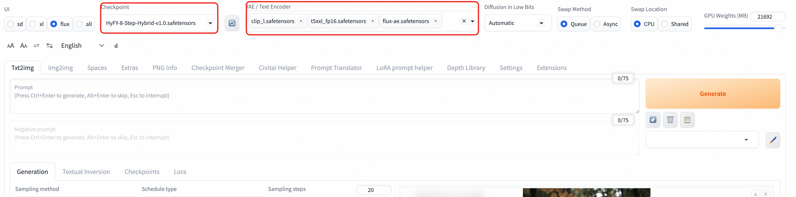

# Model Introduction

Flux1-Dev is an advanced text-to-image generation model developed by Black Forest Labs, representing the highest standard of current open-source image generation technology. This model is based on Flow Matching technology and shows significant improvements in image quality, text understanding capabilities, and generation speed.

### Core Features
- **Advanced Architecture**: Diffusion transformer architecture based on flow matching technology
- **Exceptional Quality**: Generated image quality approaches commercial-grade model standards
- **Powerful Text Understanding**: Integrated complete FP16 version CLIP-L and T5 text encoders
- **High Resolution Support**: Native support for 1024×1024 and higher resolutions
- **Fast Generation**: Optimized inference speed with support for few-step generation
- **Open Source Friendly**: Fully open source with commercial use support
- **Diverse Styles**: Supports realistic, artistic, concept design, and various other styles

### Technical Specifications
- **Model Type**: Text-to-Image Generation
- **Text Encoders**: T5-XXL + CLIP-L
- **VAE**: Dedicated flux-ae variational autoencoder
- **Native Resolution**: 1024×1024
- **Supported Resolutions**: 512×512 to 2048×2048
- **Recommended Steps**: 4-50 steps (8 steps for optimal balance)

### Model Advantages
- **Image Quality**: Rich details, natural colors, reasonable composition
- **Text Following**: Precise understanding of complex text descriptions
- **Style Diversity**: From photorealistic to abstract art
- **Consistency**: Stable and controllable generation results
- **Efficiency**: Faster inference speed compared to models of the same level

## Configuration Instructions

#### Model Files
Core model inventory as follows:
##### In WebUI
- **Main Model**: `flux.1_dev_8x8_e4m3fn.safetensors` or
- **VAE**: `flux-ae.safetensors`
- **Text Encoders**:
    - `t5xxl_fp16.safetensors`
    - `clip_l.safetensors`
    - `clip_g.safetensors`
##### In ComfyUI
- **Main Model**: `Flux1-dev.safetensors`
- **VAE**: `flux-ae.safetensors`
- **Text Encoders**:
    - `t5xxl_fp16.safetensors`
    - `clip_l.safetensors`

# Usage Guide
## ComfyUI Usage
### Interface Operations
1. Select this workflow in the workflow frame. 
2. Input the content you want. 
3. You can input some interesting content here, for example, I have "Guan Yu fighting Snow White" here.
4. You can set the image resolution and number of images here. If you want to speed up production, you can set batch_size to 1. 
5. Wait for image generation.

### ComfyUI API Calls
Click the button in the upper right corner, open the bottom panel, and get the token: 
For COMFYUI_SERVER acquisition, refer to: 
<details>
<summary>Click to expand API call Python code</summary>

```python
import requests, json, uuid, time, random, os

COMFYUI_SERVER, COMFYUI_TOKEN = "#Fill in your server address here", "Fill in your token here"  
UNET_MODEL, VAE_MODEL, CLIP1_MODEL, CLIP2_MODEL = "flux1-dev.safetensors", "ae.safetensors", "t5xxl_fp16.safetensors", "clip_l.safetensors"
PROMPT = "A beautiful anime girl with long flowing hair, wearing elegant dress, standing in a magical garden with glowing flowers, soft lighting, high quality, detailed"

class FluxClient:
    def __init__(self):
        self.base_url, self.client_id = f"http://{COMFYUI_SERVER}", str(uuid.uuid4())
        self.headers = {"Content-Type": "application/json", **({"Authorization": f"Bearer {COMFYUI_TOKEN}"} if COMFYUI_TOKEN else {})}

    def generate(self, prompt, aspect="1:1 square 1024x1024", steps=35, guidance=3.5, batch=1):
        workflow = {"6": {"inputs": {"text": prompt, "clip": ["11", 0]}, "class_type": "CLIPTextEncode"}, "8": {"inputs": {"samples": ["13", 0], "vae": ["10", 0]}, "class_type": "VAEDecode"}, "9": {"inputs": {"filename_prefix": "Flux", "images": ["8", 0]}, "class_type": "SaveImage"}, "10": {"inputs": {"vae_name": VAE_MODEL}, "class_type": "VAELoader"}, "11": {"inputs": {"clip_name1": CLIP1_MODEL, "clip_name2": CLIP2_MODEL, "type": "flux", "device": "default"}, "class_type": "DualCLIPLoader"}, "12": {"inputs": {"unet_name": UNET_MODEL, "weight_dtype": "fp8_e4m3fn"}, "class_type": "UNETLoader"}, "13": {"inputs": {"noise": ["25", 0], "guider": ["22", 0], "sampler": ["16", 0], "sigmas": ["17", 0], "latent_image": ["85", 4]}, "class_type": "SamplerCustomAdvanced"}, "16": {"inputs": {"sampler_name": "dpmpp_2m"}, "class_type": "KSamplerSelect"}, "17": {"inputs": {"scheduler": "sgm_uniform", "steps": steps, "denoise": 1, "model": ["61", 0]}, "class_type": "BasicScheduler"}, "22": {"inputs": {"model": ["61", 0], "conditioning": ["60", 0]}, "class_type": "BasicGuider"}, "25": {"inputs": {"noise_seed": random.randint(1, 1000000000000000)}, "class_type": "RandomNoise"}, "60": {"inputs": {"guidance": guidance, "conditioning": ["6", 0]}, "class_type": "FluxGuidance"}, "61": {"inputs": {"max_shift": 1.15, "base_shift": 0.5, "width": ["85", 0], "height": ["85", 1], "model": ["12", 0]}, "class_type": "ModelSamplingFlux"}, "85": {"inputs": {"width": 1024, "height": 1024, "aspect_ratio": aspect, "swap_dimensions": "Off", "upscale_factor": 1, "batch_size": batch}, "class_type": "CR SDXL Aspect Ratio"}}
        return requests.post(f"{self.base_url}/prompt", headers=self.headers, json={"prompt": workflow, "client_id": self.client_id}).json()["prompt_id"]

    def status(self, task_id):
        queue = requests.get(f"{self.base_url}/queue", headers=self.headers).json()
        return "processing" if any(item[1] == task_id for item in queue.get("queue_running", [])) else "pending" if any(item[1] == task_id for item in queue.get("queue_pending", [])) else "completed" if task_id in requests.get(f"{self.base_url}/history/{task_id}", headers=self.headers).json() else "processing"

    def download(self, task_id, output_dir="./flux_output/"):
        history = requests.get(f"{self.base_url}/history/{task_id}", headers=self.headers).json()
        files = []
        if task_id in history:
            for output in history[task_id]['outputs'].values():
                if 'images' in output:
                    os.makedirs(output_dir, exist_ok=True)
                    for img in output['images']:
                        path = os.path.join(output_dir, img['filename'])
                        with open(path, "wb") as f: f.write(requests.get(f"{self.base_url}/view?filename={img['filename']}", headers=self.headers).content)
                        files.append(path)
        return files

def main():
    client = FluxClient()
    print(f"🎨 Generating: {PROMPT}")
    task_id = client.generate(PROMPT)
    print(f"🆔 ID: {task_id}")
    while True:
        status = client.status(task_id)
        print(f"📊 {status}")
        if status == "completed": break
        time.sleep(5)
    files = client.download(task_id)
    print(f"🎉 Complete! Generated {len(files)} images: {files}")

if __name__ == "__main__": main()
```
</details>

## Web UI Usage

### Interface Operations
1. **Model Switching**: Select the Flux1-Dev (HyFY-8-Step-Hybrid-v1.0.safetensors) model in the Checkpoint model selector
2. **VAE and CLIP Model Selection**: Select Clip_l.safetensors, t5xxl_fp16.safetensors, flux-ae.safetensors 
2. **Prompt Input**:
    - Positive prompt: Detailed description of the desired image
    - Negative prompt: Description of unwanted elements (Flux model is not sensitive to negative prompts)
3. **Parameter Settings**:
    - **Steps**: Recommended 8-20 steps
    - **CFG**: Recommended 1.0-3.5 (lower values work better)
    - **Sampler**: Recommended Euler or DPM++ 2M
    - **Resolution**: 1024×1024 or other supported sizes
4. **Generate Image**: Click the "Generate" button to start generation
5. **Result Processing**: View, save, or further edit the generated images

```python
# Realistic style
"a professional portrait of a young woman, natural lighting, high resolution, detailed skin texture, photorealistic"

# Artistic style
"an impressionist painting of a garden in spring, soft brushstrokes, vibrant colors, artistic masterpiece"

# Concept design
"futuristic robot design, sleek metallic surface, glowing blue accents, concept art, highly detailed"

# Landscape photography
"mountain landscape at golden hour, dramatic clouds, professional photography, ultra-wide angle, HDR"
```

UI interface usage example

<details>
<summary>Click to expand API call Python code</summary>

### API Call Example
```python
import requests
import base64
import time
import uuid

# Configuration
base_url = "http://127.0.0.1:7680"
auth = ("admin", "${APIKEY}")
session_hash = str(uuid.uuid4())[:12]

# Set VAE/Text Encoder
print("Setting VAE/Text Encoder...")
requests.post(f"{base_url}/run/predict", json={
    "data": [["flux-ae.safetensors", "t5xxl_fp16.safetensors", "clip_l.safetensors", "clip_g.safetensors"]],
    "event_data": None,
    "fn_index": 9,
    "trigger_id": 1001,
    "session_hash": session_hash
}, auth=auth)
time.sleep(3)

# Switch FLUX model
print("Switching FLUX model...")
requests.post(f"{base_url}/queue/join", json={
    "data": ["HyFY-8-Step-Hybrid-v1.0.safetensors"],
    "event_data": None,
    "fn_index": 8,
    "trigger_id": 1002,
    "session_hash": session_hash
}, auth=auth)
time.sleep(15)

# Generate image
print("Generating image...")
result = requests.post(f"{base_url}/sdapi/v1/txt2img", json={
    "prompt": "a beautiful cat",
    "steps": 8,
    "width": 1024,
    "height": 1024,
    "cfg_scale": 1.0,
    "sampler_name": "Euler"
}, auth=auth).json()

# Save image
if "images" in result:
    with open("output.png", "wb") as f:
        f.write(base64.b64decode(result["images"][0]))
    print("Image saved as output.png")
else:
    print("Error:", result)
```
</details>

## Other Built-in Models
Currently in the service, Flux models will be deployed to ECS instances. In addition to the current Flux-dev model, SD1.5 and SD3 models are also supported, which can be dynamically switched in the Webui Forge interface.