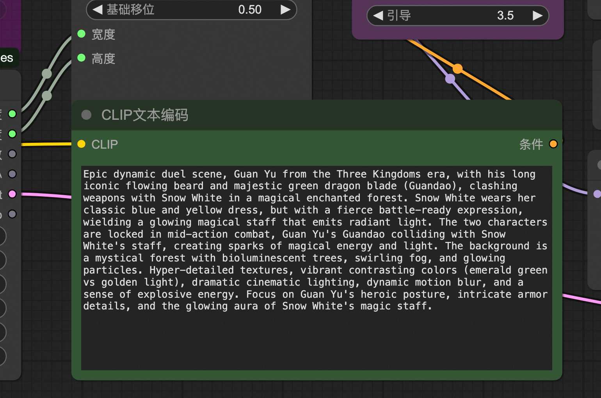
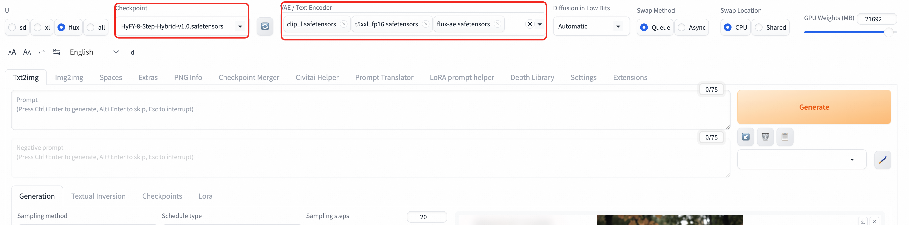

## 模型简介

Flux1-Dev 是由 Black Forest Labs 开发的先进文本到图像生成模型，代表了当前开源图像生成技术的最高水准。该模型基于流匹配（Flow Matching）技术，在图像质量、文本理解能力和生成速度方面都有显著提升。

### 核心特性
- **先进架构**: 基于流匹配技术的扩散变换器架构
- **卓越质量**: 生成图像质量接近商业级模型水准
- **强大文本理解**: 集成完整FP16版CLIP-L与T5文本编码器
- **高分辨率支持**: 原生支持1024×1024及更高分辨率
- **快速生成**: 优化的推理速度，支持少步生成
- **开源友好**: 完全开源，支持商业使用
- **多样化风格**: 支持写实、艺术、概念设计等多种风格

### 技术规格
- **模型类型**: 文本到图像生成（Text-to-Image）
- **文本编码器**: T5-XXL + CLIP-L
- **VAE**: 专用的flux-ae变分自编码器
- **原生分辨率**: 1024×1024
- **支持分辨率**: 512×512 到 2048×2048
- **推荐步数**: 4-50步（8步为最佳平衡点）

### 模型优势
- **图像质量**: 细节丰富，色彩自然，构图合理
- **文本遵循**: 精确理解复杂文本描述
- **风格多样**: 从照片级写实到抽象艺术
- **一致性**: 生成结果稳定可控
- **效率**: 相比同级别模型推理速度更快

## 配置说明

#### 模型文件
核心模型清单如下:
##### 在WebUI内
- **主模型**: `flux.1_dev_8x8_e4m3fn.safetensors` 或
- **VAE**: `flux-ae.safetensors`
- **文本编码器**:
    - `t5xxl_fp16.safetensors`
    - `clip_l.safetensors`
    - `clip_g.safetensors`
##### 在ComfyUI内
- **主模型**: `Flux1-dev.safetensors` 
- **VAE**: `flux-ae.safetensors`
- **文本编码器**:
    - `t5xxl_fp16.safetensors`
    - `clip_l.safetensors`


# 使用指南
## ComfyUI 使用
### 界面操作
1. 工作流框处选择该工作流。
2. 输入你想要的内容。
3. 这里可以输入一些比较搞怪的内容，比如我这里是关羽大战白雪公主。
4. 可以在此处设置图片的分辨率和图片的数量。如果想加快生产速度，可将batch_size设置为1.
5. 等待图片的生成。

### ComfyUI API调用
点击右上方按钮，打开底部面板，获取token：
COMFYUI_SERVER的获取可参考：


<details style="border: 2px solid #0066cc; border-radius: 8px; padding: 15px; margin: 10px 0; background-color: #f8f9fa;">
  <summary style="font-weight: bold; font-size: 18px; color: #0066cc; cursor: pointer;">
    📋 点击展开API调用Python代码
  </summary>

```python
import requests, json, uuid, time, random, os

COMFYUI_SERVER, COMFYUI_TOKEN = "#在这里填入你的服务器地址", "在这里填入你的token"  
UNET_MODEL, VAE_MODEL, CLIP1_MODEL, CLIP2_MODEL = "flux1-dev.safetensors", "ae.safetensors", "t5xxl_fp16.safetensors", "clip_l.safetensors"
PROMPT = "A beautiful anime girl with long flowing hair, wearing elegant dress, standing in a magical garden with glowing flowers, soft lighting, high quality, detailed"

class FluxClient:
    def __init__(self):
        self.base_url, self.client_id = f"http://{COMFYUI_SERVER}", str(uuid.uuid4())
        self.headers = {"Content-Type": "application/json", **({"Authorization": f"Bearer {COMFYUI_TOKEN}"} if COMFYUI_TOKEN else {})}

    def generate(self, prompt, aspect="1:1 square 1024x1024", steps=35, guidance=3.5, batch=1):
        workflow = {"6": {"inputs": {"text": prompt, "clip": ["11", 0]}, "class_type": "CLIPTextEncode"}, "8": {"inputs": {"samples": ["13", 0], "vae": ["10", 0]}, "class_type": "VAEDecode"}, "9": {"inputs": {"filename_prefix": "Flux", "images": ["8", 0]}, "class_type": "SaveImage"}, "10": {"inputs": {"vae_name": VAE_MODEL}, "class_type": "VAELoader"}, "11": {"inputs": {"clip_name1": CLIP1_MODEL, "clip_name2": CLIP2_MODEL, "type": "flux", "device": "default"}, "class_type": "DualCLIPLoader"}, "12": {"inputs": {"unet_name": UNET_MODEL, "weight_dtype": "fp8_e4m3fn"}, "class_type": "UNETLoader"}, "13": {"inputs": {"noise": ["25", 0], "guider": ["22", 0], "sampler": ["16", 0], "sigmas": ["17", 0], "latent_image": ["85", 4]}, "class_type": "SamplerCustomAdvanced"}, "16": {"inputs": {"sampler_name": "dpmpp_2m"}, "class_type": "KSamplerSelect"}, "17": {"inputs": {"scheduler": "sgm_uniform", "steps": steps, "denoise": 1, "model": ["61", 0]}, "class_type": "BasicScheduler"}, "22": {"inputs": {"model": ["61", 0], "conditioning": ["60", 0]}, "class_type": "BasicGuider"}, "25": {"inputs": {"noise_seed": random.randint(1, 1000000000000000)}, "class_type": "RandomNoise"}, "60": {"inputs": {"guidance": guidance, "conditioning": ["6", 0]}, "class_type": "FluxGuidance"}, "61": {"inputs": {"max_shift": 1.15, "base_shift": 0.5, "width": ["85", 0], "height": ["85", 1], "model": ["12", 0]}, "class_type": "ModelSamplingFlux"}, "85": {"inputs": {"width": 1024, "height": 1024, "aspect_ratio": aspect, "swap_dimensions": "Off", "upscale_factor": 1, "batch_size": batch}, "class_type": "CR SDXL Aspect Ratio"}}
        return requests.post(f"{self.base_url}/prompt", headers=self.headers, json={"prompt": workflow, "client_id": self.client_id}).json()["prompt_id"]

    def status(self, task_id):
        queue = requests.get(f"{self.base_url}/queue", headers=self.headers).json()
        return "processing" if any(item[1] == task_id for item in queue.get("queue_running", [])) else "pending" if any(item[1] == task_id for item in queue.get("queue_pending", [])) else "completed" if task_id in requests.get(f"{self.base_url}/history/{task_id}", headers=self.headers).json() else "processing"

    def download(self, task_id, output_dir="./flux_output/"):
        history = requests.get(f"{self.base_url}/history/{task_id}", headers=self.headers).json()
        files = []
        if task_id in history:
            for output in history[task_id]['outputs'].values():
                if 'images' in output:
                    os.makedirs(output_dir, exist_ok=True)
                    for img in output['images']:
                        path = os.path.join(output_dir, img['filename'])
                        with open(path, "wb") as f: f.write(requests.get(f"{self.base_url}/view?filename={img['filename']}", headers=self.headers).content)
                        files.append(path)
        return files

def main():
    client = FluxClient()
    print(f"🎨 生成: {PROMPT}")
    task_id = client.generate(PROMPT)
    print(f"🆔 ID: {task_id}")
    while True:
        status = client.status(task_id)
        print(f"📊 {status}")
        if status == "completed": break
        time.sleep(5)
    files = client.download(task_id)
    print(f"🎉 完成! 生成 {len(files)} 张图片: {files}")

if __name__ == "__main__": main()
```
</details>

## Web UI 使用

### 界面操作
1. **模型切换**: 在Checkpoint模型选择器中选择Flux1-Dev（HyFY-8-Step-Hybrid-v1.0.safetensors）模型
2. **VAE和CLIP模型选择**: 选择Clip_l.safetensors,t5xxl_fp16.safetensors,flux-ae.safetensors
2. **提示词输入**:
    - 正向提示词：详细描述想要生成的图像
    - 负向提示词：描述不想要的元素（Flux模型对负向提示词不敏感）
3. **参数设置**:
    - **步数**: 推荐8-20步
    - **CFG**: 推荐1.0-3.5（较低值效果更好）
    - **采样器**: 推荐Euler或DPM++ 2M
    - **分辨率**: 1024×1024或其他支持的尺寸
4. **生成图像**: 点击"Generate"按钮开始生成
5. **结果处理**: 查看、保存或进一步编辑生成的图像


```python
# 写实风格
"a professional portrait of a young woman, natural lighting, high resolution, detailed skin texture, photorealistic"

# 艺术风格
"an impressionist painting of a garden in spring, soft brushstrokes, vibrant colors, artistic masterpiece"

# 概念设计
"futuristic robot design, sleek metallic surface, glowing blue accents, concept art, highly detailed"

# 风景摄影
"mountain landscape at golden hour, dramatic clouds, professional photography, ultra-wide angle, HDR"
```

ui界面使用示例

<details>
<summary>点击展开API调用Python代码</summary>

### api调用示例
```python
import requests
import base64
import time
import uuid

# 配置
base_url = "http://127.0.0.1:7680"
auth = ("admin", "${APIKEY}")
session_hash = str(uuid.uuid4())[:12]

# 设置VAE/Text Encoder
print("正在设置VAE/Text Encoder...")
requests.post(f"{base_url}/run/predict", json={
    "data": [["flux-ae.safetensors", "t5xxl_fp16.safetensors", "clip_l.safetensors", "clip_g.safetensors"]],
    "event_data": None,
    "fn_index": 9,
    "trigger_id": 1001,
    "session_hash": session_hash
}, auth=auth)
time.sleep(3)

# 切换FLUX模型
print("正在切换FLUX模型...")
requests.post(f"{base_url}/queue/join", json={
    "data": ["HyFY-8-Step-Hybrid-v1.0.safetensors"],
    "event_data": None,
    "fn_index": 8,
    "trigger_id": 1002,
    "session_hash": session_hash
}, auth=auth)
time.sleep(15)

# 生成图片
print("正在生成图片...")
result = requests.post(f"{base_url}/sdapi/v1/txt2img", json={
    "prompt": "a beautiful cat",
    "steps": 8,
    "width": 1024,
    "height": 1024,
    "cfg_scale": 1.0,
    "sampler_name": "Euler"
}, auth=auth).json()

# 保存图片
if "images" in result:
    with open("output.png", "wb") as f:
        f.write(base64.b64decode(result["images"][0]))
    print("图片已保存为 output.png")
else:
    print("错误:", result)


```
</details>

## 其他内置模型
当前服务中，Flux模型会部署到ECS实例中。除了当前的Flux-dev模型，还支持了SD1.5和SD3模型，可在Webui Forge界面进行动态切换提示。

