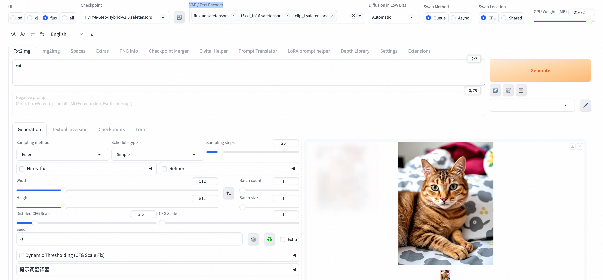

# 🎨 Flux1-Dev 模型使用指南

<div style="background: linear-gradient(135deg, #667eea 0%, #764ba2 100%); padding: 20px; border-radius: 12px; color: white; margin-bottom: 20px;">
  <h2 style="margin: 0; font-size: 28px;">✨ 模型简介</h2>
  <p style="margin: 10px 0 0 0; font-size: 16px; opacity: 0.9;">由 Black Forest Labs 开发的先进文本到图像生成模型</p>
</div>

**Flux1-Dev** 是当前开源图像生成技术的最高水准代表，基于流匹配（Flow Matching）技术，在图像质量、文本理解能力和生成速度方面都有显著提升。

## 🚀 核心特性

<div style="display: grid; grid-template-columns: repeat(auto-fit, minmax(300px, 1fr)); gap: 15px; margin: 20px 0;">

<div style="background: #f8f9fa; border-left: 4px solid #28a745; padding: 15px; border-radius: 8px;">
  <h4 style="color: #28a745; margin: 0 0 10px 0;">🏗️ 先进架构</h4>
  <p style="margin: 0;">基于流匹配技术的扩散变换器架构</p>
</div>

<div style="background: #f8f9fa; border-left: 4px solid #007bff; padding: 15px; border-radius: 8px;">
  <h4 style="color: #007bff; margin: 0 0 10px 0;">🎯 卓越质量</h4>
  <p style="margin: 0;">生成图像质量接近商业级模型水准</p>
</div>

<div style="background: #f8f9fa; border-left: 4px solid #6f42c1; padding: 15px; border-radius: 8px;">
  <h4 style="color: #6f42c1; margin: 0 0 10px 0;">🧠 强大文本理解</h4>
  <p style="margin: 0;">集成完整FP16版CLIP-L与T5文本编码器</p>
</div>

<div style="background: #f8f9fa; border-left: 4px solid #fd7e14; padding: 15px; border-radius: 8px;">
  <h4 style="color: #fd7e14; margin: 0 0 10px 0;">📐 高分辨率支持</h4>
  <p style="margin: 0;">原生支持1024×1024及更高分辨率</p>
</div>

<div style="background: #f8f9fa; border-left: 4px solid #20c997; padding: 15px; border-radius: 8px;">
  <h4 style="color: #20c997; margin: 0 0 10px 0;">⚡ 快速生成</h4>
  <p style="margin: 0;">优化的推理速度，支持少步生成</p>
</div>

<div style="background: #f8f9fa; border-left: 4px solid #e83e8c; padding: 15px; border-radius: 8px;">
  <h4 style="color: #e83e8c; margin: 0 0 10px 0;">🎨 多样化风格</h4>
  <p style="margin: 0;">支持写实、艺术、概念设计等多种风格</p>
</div>

</div>

## 📊 技术规格

<div style="background: #f8f9fa; border: 1px solid #dee2e6; border-radius: 8px; padding: 20px; margin: 20px 0;">

| 规格项目 | 详细信息 |
|---------|---------|
| **模型类型** | 文本到图像生成（Text-to-Image） |
| **文本编码器** | T5-XXL + CLIP-L |
| **VAE** | 专用的flux-ae变分自编码器 |
| **原生分辨率** | 1024×1024 |
| **支持分辨率** | 512×512 到 2048×2048 |
| **推荐步数** | 4-50步（8步为最佳平衡点） |

</div>

## 🏆 模型优势

<div style="background: linear-gradient(135deg, #ffecd2 0%, #fcb69f 100%); padding: 20px; border-radius: 12px; margin: 20px 0;">

- **🖼️ 图像质量**：细节丰富，色彩自然，构图合理
- **📝 文本遵循**：精确理解复杂文本描述
- **🎭 风格多样**：从照片级写实到抽象艺术
- **🎯 一致性**：生成结果稳定可控
- **⚡ 效率**：相比同级别模型推理速度更快

</div>

---

# ⚙️ 配置说明

## 📁 模型文件

<div style="display: grid; grid-template-columns: 1fr 1fr; gap: 20px; margin: 20px 0;">

<div style="background: #e3f2fd; border: 1px solid #2196f3; border-radius: 8px; padding: 15px;">
  <h4 style="color: #1976d2; margin: 0 0 15px 0;">🌐 WebUI 环境</h4>

**主模型**
- `flux.1_dev_8x8_e4m3fn.safetensors`

**VAE**
- `flux-ae.safetensors`

**文本编码器**
- `t5xxl_fp16.safetensors`
- `clip_l.safetensors`
- `clip_g.safetensors`
</div>

<div style="background: #f3e5f5; border: 1px solid #9c27b0; border-radius: 8px; padding: 15px;">
  <h4 style="color: #7b1fa2; margin: 0 0 15px 0;">🎛️ ComfyUI 环境</h4>

**主模型**
- `Flux1-dev.safetensors`

**VAE**
- `flux-ae.safetensors`

**文本编码器**
- `t5xxl_fp16.safetensors`
- `clip_l.safetensors`
</div>

</div>

---

# 📖 使用指南

## 🎛️ ComfyUI 使用

### 🖱️ 界面操作

<div style="background: #fff3cd; border: 1px solid #ffc107; border-radius: 8px; padding: 15px; margin: 15px 0;">

**步骤 1：选择工作流**
- 在工作流框处选择该工作流
  

**步骤 2：输入提示词**
- 输入你想要的内容描述
  

**步骤 3：创意示例**
- 可以输入一些有趣的内容，比如"关羽大战白雪公主"

**步骤 4：参数设置**
- 设置图片的分辨率和数量
- 如需加快生成速度，可将 batch_size 设置为 1
  

**步骤 5：等待生成**
- 耐心等待图片生成完成

</div>

### 🔌 ComfyUI API调用

<div style="background: #d1ecf1; border: 1px solid #17a2b8; border-radius: 8px; padding: 15px; margin: 15px 0;">

**获取Token**
- 点击右上方按钮，打开底部面板获取token
  

**获取服务器地址**
- COMFYUI_SERVER的获取参考
  

</div>

<details style="border: 2px solid #0066cc; border-radius: 8px; padding: 15px; margin: 10px 0; background-color: #f8f9fa;">
  <summary style="font-weight: bold; font-size: 18px; color: #0066cc; cursor: pointer;">
    📋 点击展开API调用Python代码
  </summary>

```python
import requests, json, uuid, time, random, os

COMFYUI_SERVER, COMFYUI_TOKEN = "#在这里填入你的服务器地址", "在这里填入你的token"  
UNET_MODEL, VAE_MODEL, CLIP1_MODEL, CLIP2_MODEL = "flux1-dev.safetensors", "ae.safetensors", "t5xxl_fp16.safetensors", "clip_l.safetensors"
PROMPT = "A beautiful anime girl with long flowing hair, wearing elegant dress, standing in a magical garden with glowing flowers, soft lighting, high quality, detailed"

class FluxClient:
    def __init__(self):
        self.base_url, self.client_id = f"http://{COMFYUI_SERVER}", str(uuid.uuid4())
        self.headers = {"Content-Type": "application/json", **({"Authorization": f"Bearer {COMFYUI_TOKEN}"} if COMFYUI_TOKEN else {})}

    def generate(self, prompt, aspect="1:1 square 1024x1024", steps=35, guidance=3.5, batch=1):
        workflow = {"6": {"inputs": {"text": prompt, "clip": ["11", 0]}, "class_type": "CLIPTextEncode"}, "8": {"inputs": {"samples": ["13", 0], "vae": ["10", 0]}, "class_type": "VAEDecode"}, "9": {"inputs": {"filename_prefix": "Flux", "images": ["8", 0]}, "class_type": "SaveImage"}, "10": {"inputs": {"vae_name": VAE_MODEL}, "class_type": "VAELoader"}, "11": {"inputs": {"clip_name1": CLIP1_MODEL, "clip_name2": CLIP2_MODEL, "type": "flux", "device": "default"}, "class_type": "DualCLIPLoader"}, "12": {"inputs": {"unet_name": UNET_MODEL, "weight_dtype": "fp8_e4m3fn"}, "class_type": "UNETLoader"}, "13": {"inputs": {"noise": ["25", 0], "guider": ["22", 0], "sampler": ["16", 0], "sigmas": ["17", 0], "latent_image": ["85", 4]}, "class_type": "SamplerCustomAdvanced"}, "16": {"inputs": {"sampler_name": "dpmpp_2m"}, "class_type": "KSamplerSelect"}, "17": {"inputs": {"scheduler": "sgm_uniform", "steps": steps, "denoise": 1, "model": ["61", 0]}, "class_type": "BasicScheduler"}, "22": {"inputs": {"model": ["61", 0], "conditioning": ["60", 0]}, "class_type": "BasicGuider"}, "25": {"inputs": {"noise_seed": random.randint(1, 1000000000000000)}, "class_type": "RandomNoise"}, "60": {"inputs": {"guidance": guidance, "conditioning": ["6", 0]}, "class_type": "FluxGuidance"}, "61": {"inputs": {"max_shift": 1.15, "base_shift": 0.5, "width": ["85", 0], "height": ["85", 1], "model": ["12", 0]}, "class_type": "ModelSamplingFlux"}, "85": {"inputs": {"width": 1024, "height": 1024, "aspect_ratio": aspect, "swap_dimensions": "Off", "upscale_factor": 1, "batch_size": batch}, "class_type": "CR SDXL Aspect Ratio"}}
        return requests.post(f"{self.base_url}/prompt", headers=self.headers, json={"prompt": workflow, "client_id": self.client_id}).json()["prompt_id"]

    def status(self, task_id):
        queue = requests.get(f"{self.base_url}/queue", headers=self.headers).json()
        return "processing" if any(item[1] == task_id for item in queue.get("queue_running", [])) else "pending" if any(item[1] == task_id for item in queue.get("queue_pending", [])) else "completed" if task_id in requests.get(f"{self.base_url}/history/{task_id}", headers=self.headers).json() else "processing"

    def download(self, task_id, output_dir="./flux_output/"):
        history = requests.get(f"{self.base_url}/history/{task_id}", headers=self.headers).json()
        files = []
        if task_id in history:
            for output in history[task_id]['outputs'].values():
                if 'images' in output:
                    os.makedirs(output_dir, exist_ok=True)
                    for img in output['images']:
                        path = os.path.join(output_dir, img['filename'])
                        with open(path, "wb") as f: f.write(requests.get(f"{self.base_url}/view?filename={img['filename']}", headers=self.headers).content)
                        files.append(path)
        return files

def main():
    client = FluxClient()
    print(f"🎨 生成: {PROMPT}")
    task_id = client.generate(PROMPT)
    print(f"🆔 ID: {task_id}")
    while True:
        status = client.status(task_id)
        print(f"📊 {status}")
        if status == "completed": break
        time.sleep(5)
    files = client.download(task_id)
    print(f"🎉 完成! 生成 {len(files)} 张图片: {files}")

if __name__ == "__main__": main()
```
</details>

---

## 🌐 Web UI 使用

### 🖱️ 界面操作

<div style="background: #d4edda; border: 1px solid #28a745; border-radius: 8px; padding: 20px; margin: 20px 0;">

**1. 模型切换**
- 在Checkpoint模型选择器中选择Flux1-Dev（HyFY-8-Step-Hybrid-v1.0.safetensors）模型

**2. VAE和CLIP模型选择**
- 选择：`Clip_l.safetensors`, `t5xxl_fp16.safetensors`, `flux-ae.safetensors`
  

**3. 提示词输入**
- **正向提示词**：详细描述想要生成的图像
- **负向提示词**：描述不想要的元素（Flux模型对负向提示词不敏感）

**4. 参数设置**
- **步数**：推荐 8-20 步
- **CFG**：推荐 1.0-3.5（较低值效果更好）
- **采样器**：推荐 Euler 或 DPM++ 2M
- **分辨率**：1024×1024 或其他支持的尺寸

**5. 生成图像**
- 点击"Generate"按钮开始生成

**6. 结果处理**
- 查看、保存或进一步编辑生成的图像

</div>

### 🎨 提示词示例

<div style="display: grid; grid-template-columns: repeat(auto-fit, minmax(250px, 1fr)); gap: 15px; margin: 20px 0;">

<div style="background: #fff3cd; border-left: 4px solid #ffc107; padding: 15px; border-radius: 8px;">
  <h4 style="color: #856404; margin: 0 0 10px 0;">📸 写实风格</h4>
  <code style="background: #f8f9fa; padding: 5px; border-radius: 4px; display: block; font-size: 12px;">
    "a professional portrait of a young woman, natural lighting, high resolution, detailed skin texture, photorealistic"
  </code>
</div>

<div style="background: #f8d7da; border-left: 4px solid #dc3545; padding: 15px; border-radius: 8px;">
  <h4 style="color: #721c24; margin: 0 0 10px 0;">🎨 艺术风格</h4>
  <code style="background: #f8f9fa; padding: 5px; border-radius: 4px; display: block; font-size: 12px;">
    "an impressionist painting of a garden in spring, soft brushstrokes, vibrant colors, artistic masterpiece"
  </code>
</div>

<div style="background: #d1ecf1; border-left: 4px solid #17a2b8; padding: 15px; border-radius: 8px;">
  <h4 style="color: #0c5460; margin: 0 0 10px 0;">🤖 概念设计</h4>
  <code style="background: #f8f9fa; padding: 5px; border-radius: 4px; display: block; font-size: 12px;">
    "futuristic robot design, sleek metallic surface, glowing blue accents, concept art, highly detailed"
  </code>
</div>

<div style="background: #d4edda; border-left: 4px solid #28a745; padding: 15px; border-radius: 8px;">
  <h4 style="color: #155724; margin: 0 0 10px 0;">🏔️ 风景摄影</h4>
  <code style="background: #f8f9fa; padding: 5px; border-radius: 4px; display: block; font-size: 12px;">
    "mountain landscape at golden hour, dramatic clouds, professional photography, ultra-wide angle, HDR"
  </code>
</div>

</div>

### 🖼️ UI界面使用示例



<details style="border: 2px solid #28a745; border-radius: 8px; padding: 15px; margin: 10px 0; background-color: #f8f9fa;">
  <summary style="font-weight: bold; font-size: 18px; color: #28a745; cursor: pointer;">
    🐍 点击展开API调用Python代码
  </summary>

```python
import requests
import base64
import time
import uuid

# 配置
base_url = "http://127.0.0.1:7680"
auth = ("admin", "${APIKEY}")
session_hash = str(uuid.uuid4())[:12]

# 设置VAE/Text Encoder
print("正在设置VAE/Text Encoder...")
requests.post(f"{base_url}/run/predict", json={
    "data": [["flux-ae.safetensors", "t5xxl_fp16.safetensors", "clip_l.safetensors", "clip_g.safetensors"]],
    "event_data": None,
    "fn_index": 9,
    "trigger_id": 1001,
    "session_hash": session_hash
}, auth=auth)
time.sleep(3)

# 切换FLUX模型
print("正在切换FLUX模型...")
requests.post(f"{base_url}/queue/join", json={
    "data": ["HyFY-8-Step-Hybrid-v1.0.safetensors"],
    "event_data": None,
    "fn_index": 8,
    "trigger_id": 1002,
    "session_hash": session_hash
}, auth=auth)
time.sleep(15)

# 生成图片
print("正在生成图片...")
result = requests.post(f"{base_url}/sdapi/v1/txt2img", json={
    "prompt": "a beautiful cat",
    "steps": 8,
    "width": 1024,
    "height": 1024,
    "cfg_scale": 1.0,
    "sampler_name": "Euler"
}, auth=auth).json()

# 保存图片
if "images" in result:
    with open("output.png", "wb") as f:
        f.write(base64.b64decode(result["images"][0]))
    print("图片已保存为 output.png")
else:
    print("错误:", result)
```
</details>

---

## 🔄 其他内置模型

<div style="background: linear-gradient(135deg, #667eea 0%, #764ba2 100%); padding: 20px; border-radius: 12px; color: white; margin: 20px 0;">

当前服务中，**Flux模型**会部署到ECS实例中。除了当前的**Flux-dev模型**，还支持了**SD1.5**和**SD3**模型，可在**WebUI Forge界面**进行动态切换。

</div>

---

<div style="text-align: center; background: #f8f9fa; padding: 20px; border-radius: 8px; margin: 20px 0;">
  <h3 style="color: #6c757d; margin: 0;">🎉 开始你的AI艺术创作之旅！</h3>
  <p style="color: #6c757d; margin: 10px 0 0 0;">使用Flux1-Dev模型，让想象力变为现实</p>
</div>