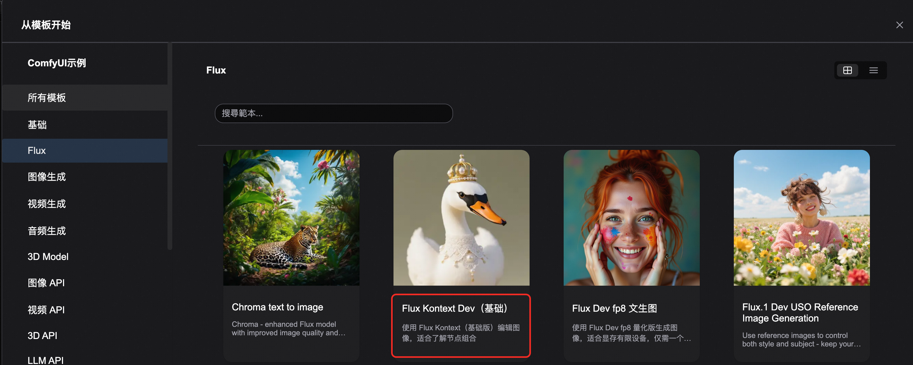

<div style="background: linear-gradient(135deg, #2563eb, #1e40af); padding: 24px; border-radius: 8px; color: white; text-align: center; margin-bottom: 24px;">
  <h1 style="font-size: 2.5em; margin: 0; font-weight: 600;">🎨 ComfyUI Flux Kontext Dev 图像编辑</h1>
  <p style="font-size: 1.2em; margin: 16px 0 0 0; opacity: 0.9;">ComfyUI 原生工作流 - 多模态智能图像编辑与角色一致性保持</p>
  <div style="margin-top: 20px;">
    <span style="background: rgba(255,255,255,0.2); color: white; padding: 4px 12px; border-radius: 12px; font-size: 14px; margin: 0 8px;">🎯 角色一致性</span>
    <span style="background: rgba(255,255,255,0.2); color: white; padding: 4px 12px; border-radius: 12px; font-size: 14px; margin: 0 8px;">✂️ 局部编辑</span>
    <span style="background: rgba(255,255,255,0.2); color: white; padding: 4px 12px; border-radius: 12px; font-size: 14px; margin: 0 8px;">🎨 风格参考</span>
  </div>
</div>


## 📋 FLUX.1 Kontext Dev 模型概览

<div style="background: #f8fafc; border: 1px solid #e2e8f0; border-radius: 8px; padding: 20px; margin: 16px 0;">

**FLUX.1 Kontext** 是 Black Forest Labs 推出的突破性多模态图像编辑模型，支持文本和图像同时输入，能够智能理解图像上下文并执行精确编辑。其开发版是一个拥有 120 亿参数的开源扩散变压器模型，具有出色的上下文理解能力和角色一致性保持，即使经过多次迭代编辑，也能确保人物特征、构图布局等关键元素保持稳定。

<div style="display: grid; grid-template-columns: repeat(auto-fit, minmax(280px, 1fr)); gap: 16px; margin: 16px 0;">

<div style="background: #eff6ff; border-left: 4px solid #2563eb; padding: 16px; border-radius: 4px; text-align: center;">
<div style="font-size: 2.5em; margin-bottom: 12px; color: #2563eb;">🎯</div>
<h4 style="margin: 0 0 8px 0; color: #1e40af;">角色一致性</h4>
<p style="margin: 0; color: #1e40af;">在多个场景和环境中保留图像的独特元素，如参考角色或物体</p>
</div>

<div style="background: #f0fdf4; border-left: 4px solid #059669; padding: 16px; border-radius: 4px; text-align: center;">
<div style="font-size: 2.5em; margin-bottom: 12px; color: #059669;">✂️</div>
<h4 style="margin: 0 0 8px 0; color: #059669;">局部编辑</h4>
<p style="margin: 0; color: #065f46;">对图像中的特定元素进行有针对性的修改，而不影响其他部分</p>
</div>

<div style="background: #fff7ed; border-left: 4px solid #ea580c; padding: 16px; border-radius: 4px; text-align: center;">
<div style="font-size: 2.5em; margin-bottom: 12px; color: #ea580c;">🎨</div>
<h4 style="margin: 0 0 8px 0; color: #ea580c;">风格参考</h4>
<p style="margin: 0; color: #9a3412;">根据文本提示，在保留参考图像独特风格的同时生成新颖场景</p>
</div>

<div style="background: #f5f3ff; border-left: 4px solid #7c3aed; padding: 16px; border-radius: 4px; text-align: center;">
<div style="font-size: 2.5em; margin-bottom: 12px; color: #7c3aed;">⚡</div>
<h4 style="margin: 0 0 8px 0; color: #7c3aed;">交互速度</h4>
<p style="margin: 0; color: #5b21b6;">图像生成和编辑的延迟极小，支持快速迭代</p>
</div>

</div>


## 🛠️ 工作流类型说明

<div style="background: #f8fafc; border: 1px solid #e2e8f0; border-radius: 8px; padding: 20px; margin: 16px 0;">

本教程提供两种工作流类型，本质上功能相同，但在使用体验上有所不同：

<div style="display: grid; grid-template-columns: 1fr 1fr; gap: 16px; margin: 16px 0;">

<div style="background: #eff6ff; border-left: 4px solid #2563eb; padding: 16px; border-radius: 4px;">
<h4 style="color: #2563eb; margin: 0 0 8px 0;">🎯 组节点版本</h4>
<p style="margin: 0 0 8px 0; color: #1e40af; font-size: 14px;">使用 <strong>FLUX.1 Kontext Image Edit</strong> 组节点</p>
<ul style="margin: 0; padding-left: 20px; color: #1e40af; font-size: 13px;">
  <li>界面简洁，易于复用</li>
  <li>快速添加组节点功能</li>
  <li>适合复杂工作流构建</li>
</ul>
</div>

<div style="background: #f0fdf4; border-left: 4px solid #059669; padding: 16px; border-radius: 4px;">
<h4 style="color: #059669; margin: 0 0 8px 0;">🔧 完整原始版本</h4>
<p style="margin: 0 0 8px 0; color: #065f46; font-size: 14px;">展示完整的节点连接结构</p>
<ul style="margin: 0; padding-left: 20px; color: #065f46; font-size: 13px;">
  <li>所有节点可见，便于学习</li>
  <li>参数调整更直观</li>
  <li>适合深度定制</li>
</ul>
</div>

</div>

### 🚀 快速添加组节点功能

<div style="text-align: center; margin: 20px 0;">
  
</div>

<div style="background: #fef3c7; border-left: 4px solid #d97706; padding: 16px; margin: 16px 0; border-radius: 4px;">
  <strong>⚠️ 实验性功能</strong><br>
  这个功能目前只是一个实验性的新功能，可能在未来版本中进行调整。
</div>

</div>


## 🔗 模型文件

<div style="background: #f8fafc; border: 1px solid #e2e8f0; border-radius: 8px; padding: 20px; margin: 16px 0;">


#### 📂 模型文件结构

<div style="background: #1e293b; border-radius: 6px; padding: 16px; margin: 16px 0;">
<pre style="margin: 0; color: #e2e8f0; font-family: 'Courier New', monospace; font-size: 14px;"><code>📂 ComfyUI/
├── 📂 models/
│   ├── 📂 diffusion_models/
│   │   └── flux1-dev-kontext_fp8_scaled.safetensors
│   ├── 📂 vae/
│   │   └── ae.safetensors
│   └── 📂 text_encoders/
│       ├── clip_l.safetensors
│       └── t5xxl_fp16.safetensors 或 t5xxl_fp8_e4m3fn_scaled.safetensors</code></pre>
</div>


## 🚀 Flux.1 Kontext Dev 工作流示例

<div style="background: #f8fafc; border: 1px solid #e2e8f0; border-radius: 8px; padding: 20px; margin: 16px 0;">

打开Comfyui模版工作流，参考下图选择：


这个工作流使用了 `Load Image(from output)` 节点来加载需要编辑的图像，可以让你更方便地获取到编辑后的图像，从而进行多轮次编辑。

### 📥 步骤一：工作流及输入图片下载

<div style="text-align: center; margin: 20px 0;">
  
  <p style="margin: 8px 0 0 0; color: #64748b; font-size: 14px;">点击图片下载，拖入 ComfyUI 加载工作流</p>
</div>

### 📁 示例输入图片

<div style="background: #f0fdf4; border-left: 4px solid #059669; padding: 16px; border-radius: 4px; margin: 16px 0; text-align: center;">
<h4 style="color: #059669; margin: 0 0 12px 0;">🐰 示例输入图片</h4>

<p style="margin: 8px 0 0 0; color: #065f46; font-size: 13px;">右键保存图片，用于工作流测试</p>
</div>

### 🔧 步骤二：工作流配置操作

<div style="text-align: center; margin: 20px 0;">
  
</div>

#### 📋 详细配置步骤

<div style="display: grid; grid-template-columns: repeat(auto-fit, minmax(300px, 1fr)); gap: 16px; margin: 16px 0;">

<div style="background: #eff6ff; border-left: 4px solid #2563eb; padding: 16px; border-radius: 4px;">
<h4 style="color: #2563eb; margin: 0 0 8px 0;">🔧 模型加载</h4>
<ul style="margin: 0; padding-left: 20px; color: #1e40af; font-size: 14px;">
  <li><strong>Load Diffusion Model</strong>：<br><code>flux1-dev-kontext_fp8_scaled.safetensors</code></li>
  <li><strong>DualCLIP Load</strong>：<br><code>clip_l.safetensors</code> 和 <code>t5xxl_fp16.safetensors</code></li>
  <li><strong>Load VAE</strong>：<br><code>ae.safetensors</code></li>
</ul>
</div>

<div style="background: #f0fdf4; border-left: 4px solid #059669; padding: 16px; border-radius: 4px;">
<h4 style="color: #059669; margin: 0 0 8px 0;">📁 图片加载</h4>
<p style="margin: 0; color: #065f46; font-size: 14px;">在 <strong>Load Image(from output)</strong> 节点中加载提供的输入图像</p>
</div>

<div style="background: #fff7ed; border-left: 4px solid #ea580c; padding: 16px; border-radius: 4px;">
<h4 style="color: #ea580c; margin: 0 0 8px 0;">📝 提示词设置</h4>
<p style="margin: 0; color: #9a3412; font-size: 14px;">在 <strong>CLIP Text Encode</strong> 节点中修改提示词，<strong>仅支持英文</strong></p>
</div>

</div>

#### 🚀 执行生成

<div style="text-align: center; margin: 20px 0;">
  <div style="background: linear-gradient(135deg, #059669, #047857); color: white; padding: 16px 32px; border-radius: 8px; display: inline-block; box-shadow: 0 4px 8px rgba(5, 150, 105, 0.3);">
    <strong>⌨️ 点击 Queue 按钮或使用快捷键 Ctrl(Cmd) + Enter 运行工作流</strong>
  </div>
</div>

</div>

## 🔌 API 调用方式

## 🔑 获取认证信息


<div style="display: grid; grid-template-columns: 1fr 1fr; gap: 16px; margin: 16px 0;">
<div style="background: #eff6ff; border-left: 4px solid #2563eb; padding: 16px; border-radius: 4px;">
<h4 style="color: #2563eb; margin: 0 0 8px 0;">🌐 获取服务器地址</h4>
<p style="margin: 0 0 12px 0;">记录 ComfyUI 服务器的访问地址</p>


</div>
<div style="background: #fff7ed; border-left: 4px solid #ea580c; padding: 16px; border-radius: 4px;">
<h4 style="color: #ea580c; margin: 0 0 8px 0;">🔐 获取 API Token</h4>
<p style="margin: 0 0 12px 0;">在 ComfyUI 界面右上角获取访问令牌</p>


</div>


</div>

## 💻 Python API 调用示例

<details style="border: 2px solid #2563eb; border-radius: 12px; padding: 20px; margin: 20px 0; background: linear-gradient(145deg, #f8fafc, #eff6ff); box-shadow: 0 8px 16px rgba(37, 99, 235, 0.15);">
<summary style="font-weight: bold; font-size: 18px; color: white; cursor: pointer; padding: 16px; background: linear-gradient(135deg, #2563eb, #1e40af); border-radius: 8px; margin: -20px -20px 20px -20px; text-shadow: 1px 1px 2px rgba(0,0,0,0.2); transition: all 0.3s ease; display: flex; align-items: center; box-shadow: 0 4px 8px rgba(37, 99, 235, 0.3);">
🐍 点击展开完整 Python API 调用代码
</summary>

```python

import requests
import json
import uuid
import time
import random
import os

# 🔧 配置参数 - Flux 专用
COMFYUI_SERVER = "127.0.0.1:8188"  # 本地服务器
COMFYUI_TOKEN = ""
UNET_MODEL = "flux1-dev.safetensors"
VAE_MODEL = "flux-ae.safetensors"
CLIP_L_MODEL = "clip_l_bf16.safetensors"
CLIP_T5_MODEL = "t5xxl_fp16.safetensors"

# 🎯 预设参数
DEFAULT_PROMPT = "A beautiful fantasy girl with long curly silver hair and big blue eyes, wearing a white transparent fairy dress with lace and puffed sleeves. Surrounded by iridescent butterflies and giant glass roses, dreamy lighting, ethereal atmosphere, soft glow, magical realism, highly detailed, cinematic, 8K render."
DEFAULT_T5_PROMPT = "A fairy tale scene of a young girl with silver curly hair wearing a delicate white dress, standing among crystal butterflies and glowing glass roses. The scene is filled with soft magical light, like a dream from a fantasy world."

class ComfyUIFluxClient:
    def __init__(self, server=COMFYUI_SERVER, token=COMFYUI_TOKEN):
        self.base_url = f"http://{server}"
        self.token = token
        self.client_id = str(uuid.uuid4())
        self.headers = {"Content-Type": "application/json"}
        if token:
            self.headers["Authorization"] = f"Bearer {token}"

    def generate_flux_image(self, clip_l_prompt, t5xxl_prompt=None,
                            steps=20, cfg=1, guidance=3.5,
                            width=1024, height=1024, seed=None):
        """🎨 Flux 文生图生成 - 基于原始JSON工作流"""
        print("🎨 开始 Flux 文生图任务...")

        # 如果没有提供T5提示词，使用CLIP_L提示词
        if t5xxl_prompt is None:
            t5xxl_prompt = clip_l_prompt

        # 如果没有提供种子，随机生成
        if seed is None:
            seed = random.randint(1, 1000000000000000)

        # 完全基于你提供的JSON工作流
        workflow = {
            "8": {
                "inputs": {
                    "samples": ["31", 0],
                    "vae": ["39", 0]
                },
                "class_type": "VAEDecode",
                "_meta": {"title": "VAE解码"}
            },
            "9": {
                "inputs": {
                    "filename_prefix": "flux_output",
                    "images": ["8", 0]
                },
                "class_type": "SaveImage",
                "_meta": {"title": "保存图像"}
            },
            "27": {
                "inputs": {
                    "width": width,
                    "height": height,
                    "batch_size": 1
                },
                "class_type": "EmptySD3LatentImage",
                "_meta": {"title": "空Latent图像（SD3）"}
            },
            "31": {
                "inputs": {
                    "seed": seed,
                    "steps": steps,
                    "cfg": cfg,
                    "sampler_name": "euler",
                    "scheduler": "simple",
                    "denoise": 1,
                    "model": ["38", 0],
                    "positive": ["41", 0],
                    "negative": ["42", 0],
                    "latent_image": ["27", 0]
                },
                "class_type": "KSampler",
                "_meta": {"title": "K采样器"}
            },
            "38": {
                "inputs": {
                    "unet_name": UNET_MODEL,
                    "weight_dtype": "default"
                },
                "class_type": "UNETLoader",
                "_meta": {"title": "UNet加载器"}
            },
            "39": {
                "inputs": {
                    "vae_name": VAE_MODEL
                },
                "class_type": "VAELoader",
                "_meta": {"title": "加载VAE"}
            },
            "40": {
                "inputs": {
                    "clip_name1": CLIP_L_MODEL,
                    "clip_name2": CLIP_T5_MODEL,
                    "type": "flux",
                    "device": "default"
                },
                "class_type": "DualCLIPLoader",
                "_meta": {"title": "双CLIP加载器"}
            },
            "41": {
                "inputs": {
                    "clip_l": clip_l_prompt,
                    "t5xxl": t5xxl_prompt,
                    "guidance": guidance,
                    "clip": ["40", 0]
                },
                "class_type": "CLIPTextEncodeFlux",
                "_meta": {"title": "CLIP文本编码Flux"}
            },
            "42": {
                "inputs": {
                    "conditioning": ["41", 0]
                },
                "class_type": "ConditioningZeroOut",
                "_meta": {"title": "条件零化"}
            }
        }

        print("📤 提交 Flux 文生图工作流...")
        print(f"🎯 CLIP-L 提示词: {clip_l_prompt}")
        print(f"🎯 T5XXL 提示词: {t5xxl_prompt}")
        print(f"🎲 随机种子: {seed}")

        response = requests.post(
            f"{self.base_url}/prompt",
            headers=self.headers,
            json={"prompt": workflow, "client_id": self.client_id}
        )

        print(f"API Response: {response.text}")

        if response.status_code != 200:
            raise Exception(f"API请求失败，状态码: {response.status_code}")

        result = response.json()
        if "error" in result:
            raise Exception(f"Workflow error: {result['error']}")
        if "prompt_id" not in result:
            raise Exception(f"No prompt_id in response: {result}")

        return result["prompt_id"], seed

    def get_status(self, task_id):
        """📊 获取任务状态"""
        try:
            # 检查队列状态
            queue_data = requests.get(f"{self.base_url}/queue", headers=self.headers).json()

            # 检查是否在运行队列中
            if any(item[1] == task_id for item in queue_data.get("queue_running", [])):
                return "processing"

            # 检查是否在等待队列中
            if any(item[1] == task_id for item in queue_data.get("queue_pending", [])):
                return "pending"

            # 检查历史记录
            history_response = requests.get(f"{self.base_url}/history/{task_id}", headers=self.headers)
            if history_response.status_code == 200:
                history = history_response.json()
                if task_id in history:
                    return "completed"

            return "processing"
        except Exception as e:
            print(f"Status check error: {e}")
            return "processing"

    def download_image(self, task_id, output_dir="outputs"):
        """📥 下载生成的图像"""
        try:
            # 确保输出目录存在
            os.makedirs(output_dir, exist_ok=True)

            response = requests.get(f"{self.base_url}/history/{task_id}", headers=self.headers)
            history = response.json()

            if task_id in history:
                outputs = history[task_id]['outputs']
                downloaded_files = []

                for node_id, output in outputs.items():
                    if 'images' in output:
                        for img_info in output['images']:
                            filename = img_info['filename']
                            # 下载图像
                            img_response = requests.get(
                                f"{self.base_url}/view?filename={filename}",
                                headers=self.headers
                            )

                            if img_response.status_code == 200:
                                output_path = os.path.join(output_dir, filename)
                                with open(output_path, "wb") as f:
                                    f.write(img_response.content)
                                downloaded_files.append(output_path)
                                print(f"📁 图像已保存: {output_path}")

                return downloaded_files

        except Exception as e:
            print(f"Download error: {e}")

        return []

    def generate_batch(self, prompts_list, **kwargs):
        """🔄 批量生成图像"""
        results = []

        for i, prompt_data in enumerate(prompts_list):
            print(f"\n🎨 开始第 {i+1}/{len(prompts_list)} 个任务...")

            if isinstance(prompt_data, str):
                # 如果是字符串，作为CLIP-L提示词
                clip_l = prompt_data
                t5xxl = None
            elif isinstance(prompt_data, dict):
                # 如果是字典，提取CLIP-L和T5XXL提示词
                clip_l = prompt_data.get('clip_l', prompt_data.get('prompt', ''))
                t5xxl = prompt_data.get('t5xxl')
            else:
                print(f"❌ 无效的提示词格式: {prompt_data}")
                continue

            try:
                task_id, seed = self.generate_flux_image(clip_l, t5xxl, **kwargs)

                # 等待完成
                while True:
                    status = self.get_status(task_id)
                    print(f"📊 任务 {i+1} 状态: {status}")

                    if status == "completed":
                        files = self.download_image(task_id)
                        results.append({
                            'task_id': task_id,
                            'seed': seed,
                            'files': files,
                            'prompt': {'clip_l': clip_l, 't5xxl': t5xxl}
                        })
                        break
                    elif status == "failed":
                        print(f"❌ 任务 {i+1} 失败")
                        break

                    time.sleep(5)

            except Exception as e:
                print(f"❌ 任务 {i+1} 错误: {e}")

        return results

def main():
    """🚀 主函数 - 执行 Flux 文生图任务"""
    client = ComfyUIFluxClient()

    try:
        print("🎨 Flux 文生图客户端启动...")

        # 单个图像生成示例
        print("\n=== 单个图像生成 ===")
        task_id, seed = client.generate_flux_image(
            clip_l_prompt=DEFAULT_PROMPT,
            t5xxl_prompt=DEFAULT_T5_PROMPT,
            steps=20,
            guidance=3.5,
            width=1024,
            height=1024
        )

        print(f"🆔 Task ID: {task_id}")
        print(f"🎲 Seed: {seed}")

        # 等待任务完成
        while True:
            status = client.get_status(task_id)
            print(f"📊 当前状态: {status}")

            if status == "completed":
                print("✅ 图像生成完成!")
                break
            elif status == "failed":
                print("❌ 生成失败!")
                return

            time.sleep(5)

        # 下载图像
        downloaded_files = client.download_image(task_id)
        if downloaded_files:
            print(f"🎉 成功下载 {len(downloaded_files)} 个文件!")
            for file in downloaded_files:
                print(f"📁 文件路径: {file}")
        else:
            print("❌ 下载失败")

        # 批量生成示例（可选）
        print("\n=== 批量生成示例 ===")
        batch_prompts = [
            "A majestic dragon flying over a medieval castle at sunset",
            "A cyberpunk cityscape with neon lights and flying cars",
            {
                'clip_l': "A serene forest with magical creatures",
                't5xxl': "An enchanted woodland scene with fairies and unicorns dancing in moonlight"
            }
        ]

        # 取消注释下面的代码来执行批量生成
        # batch_results = client.generate_batch(batch_prompts, steps=15, guidance=3.0)
        # print(f"🎉 批量生成完成，共生成 {len(batch_results)} 个图像")

    except Exception as e:
        print(f"❌ 错误: {e}")

if __name__ == "__main__":
    main()
```
</details>


## 💡 Flux Kontext 提示词技巧

<div style="background: #f8fafc; border: 1px solid #e2e8f0; border-radius: 8px; padding: 20px; margin: 16px 0;">

掌握正确的提示词技巧是获得理想编辑效果的关键。以下是经过验证的最佳实践：

### 🎯 基础修改技巧

<div style="display: grid; grid-template-columns: 1fr 1fr; gap: 16px; margin: 16px 0;">

<div style="background: #dcfce7; border-left: 4px solid #059669; padding: 16px; border-radius: 4px;">
<h4 style="color: #059669; margin: 0 0 8px 0;">✅ 推荐做法</h4>
<ul style="margin: 0; padding-left: 20px; color: #065f46;">
  <li><strong>简单直接</strong>：<code>"Change the car color to red"</code></li>
  <li><strong>保持风格</strong>：<code>"Change to daytime while maintaining the same style of the painting"</code></li>
</ul>
</div>

<div style="background: #fef2f2; border-left: 4px solid #dc2626; padding: 16px; border-radius: 4px;">
<h4 style="color: #dc2626; margin: 0 0 8px 0;">❌ 避免做法</h4>
<ul style="margin: 0; padding-left: 20px; color: #991b1b;">
  <li>使用模糊词汇</li>
  <li>过于复杂的单句描述</li>
  <li>缺乏具体指向性</li>
</ul>
</div>

</div>

### 🎨 风格转换框架

<div style="background: #fff7ed; border-left: 4px solid #ea580c; padding: 16px; margin: 16px 0; border-radius: 4px;">
  <strong>🎨 风格转换原则</strong><br>
  • <strong>明确命名风格</strong>：<code>"Transform to Bauhaus art style"</code><br>
  • <strong>描述特征</strong>：<code>"Transform to oil painting with visible brushstrokes, thick paint texture"</code><br>
  • <strong>保留构图</strong>：<code>"Change to Bauhaus style while maintaining the original composition"</code>
</div>

### 👤 角色一致性保持

<div style="background: #f3e8ff; border-left: 4px solid #7c3aed; padding: 16px; margin: 16px 0; border-radius: 4px;">
  <strong>👤 角色一致性框架</strong><br>
  • <strong>具体描述</strong>：<code>"The woman with short black hair"</code> 而非 <code>"she"</code><br>
  • <strong>保留特征</strong>：<code>"while maintaining the same facial features, hairstyle, and expression"</code><br>
  • <strong>分步修改</strong>：先改背景，再改动作
</div>

### 📝 文本编辑技巧

<div style="background: #eff6ff; border-left: 4px solid #2563eb; padding: 16px; margin: 16px 0; border-radius: 4px;">
  <strong>📝 文本编辑要点</strong><br>
  • <strong>使用引号</strong>：<code>"Replace 'joy' with 'BFL'"</code><br>
  • <strong>保持格式</strong>：<code>"Replace text while maintaining the same font style"</code>
</div>

</div>

## 🚨 常见问题解决方案

<div style="background: #f8fafc; border: 1px solid #e2e8f0; border-radius: 8px; padding: 20px; margin: 16px 0;">

### 🎭 角色变化过大

<div style="display: grid; grid-template-columns: 1fr 1fr; gap: 16px; margin: 16px 0;">

<div style="background: #fef2f2; border-left: 4px solid #dc2626; padding: 16px; border-radius: 4px;">
<h4 style="color: #dc2626; margin: 0 0 8px 0;">❌ 错误示例</h4>
<code style="background: #fee2e2; color: #991b1b; padding: 4px 8px; border-radius: 4px; font-size: 13px;">"Transform the person into a Viking"</code>
</div>

<div style="background: #dcfce7; border-left: 4px solid #059669; padding: 16px; border-radius: 4px;">
<h4 style="color: #059669; margin: 0 0 8px 0;">✅ 正确示例</h4>
<code style="background: #d1fae5; color: #065f46; padding: 4px 8px; border-radius: 4px; font-size: 13px;">"Change the clothes to be a viking warrior while preserving facial features"</code>
</div>

</div>

### 📐 构图位置改变

<div style="display: grid; grid-template-columns: 1fr 1fr; gap: 16px; margin: 16px 0;">

<div style="background: #fef2f2; border-left: 4px solid #dc2626; padding: 16px; border-radius: 4px;">
<h4 style="color: #dc2626; margin: 0 0 8px 0;">❌ 错误示例</h4>
<code style="background: #fee2e2; color: #991b1b; padding: 4px 8px; border-radius: 4px; font-size: 13px;">"Put him on a beach"</code>
</div>

<div style="background: #dcfce7; border-left: 4px solid #059669; padding: 16px; border-radius: 4px;">
<h4 style="color: #059669; margin: 0 0 8px 0;">✅ 正确示例</h4>
<code style="background: #d1fae5; color: #065f46; padding: 4px 8px; border-radius: 4px; font-size: 13px;">"Change the background to a beach while keeping the person in the exact same position, scale, and pose"</code>
</div>

</div>

### 🎨 风格应用不准确

<div style="display: grid; grid-template-columns: 1fr 1fr; gap: 16px; margin: 16px 0;">

<div style="background: #fef2f2; border-left: 4px solid #dc2626; padding: 16px; border-radius: 4px;">
<h4 style="color: #dc2626; margin: 0 0 8px 0;">❌ 错误示例</h4>
<code style="background: #fee2e2; color: #991b1b; padding: 4px 8px; border-radius: 4px; font-size: 13px;">"Make it a sketch"</code>
</div>

<div style="background: #dcfce7; border-left: 4px solid #059669; padding: 16px; border-radius: 4px;">
<h4 style="color: #059669; margin: 0 0 8px 0;">✅ 正确示例</h4>
<code style="background: #d1fae5; color: #065f46; padding: 4px 8px; border-radius: 4px; font-size: 13px;">"Convert to pencil sketch with natural graphite lines, cross-hatching, and visible paper texture"</code>
</div>

</div>

</div>

## 🎯 核心原则与最佳实践

<div style="background: #f8fafc; border: 1px solid #e2e8f0; border-radius: 8px; padding: 20px; margin: 16px 0;">

### 🔑 四大核心原则

<div style="display: grid; grid-template-columns: repeat(auto-fit, minmax(250px, 1fr)); gap: 16px; margin: 16px 0;">

<div style="background: #eff6ff; border-left: 4px solid #2563eb; padding: 16px; border-radius: 4px;">
<strong>🎯 具体明确</strong><br>
<p style="margin: 8px 0 0 0; color: #1e40af; font-size: 14px;">使用精确描述，避免模糊词汇</p>
</div>

<div style="background: #f0fdf4; border-left: 4px solid #059669; padding: 16px; border-radius: 4px;">
<strong>📝 分步编辑</strong><br>
<p style="margin: 8px 0 0 0; color: #065f46; font-size: 14px;">复杂修改分为多个简单步骤</p>
</div>

<div style="background: #fff7ed; border-left: 4px solid #ea580c; padding: 16px; border-radius: 4px;">
<strong>🔒 明确保留</strong><br>
<p style="margin: 8px 0 0 0; color: #9a3412; font-size: 14px;">说明哪些要保持不变</p>
</div>

<div style="background: #f3e8ff; border-left: 4px solid #7c3aed; padding: 16px; border-radius: 4px;">
<strong>🔤 动词选择</strong><br>
<p style="margin: 8px 0 0 0; color: #5b21b6; font-size: 14px;">用"change"、"replace"而非"transform"</p>
</div>

</div>

### 📋 最佳实践模板

<div style="display: grid; grid-template-columns: 1fr 1fr; gap: 16px; margin: 16px 0;">

<div style="background: #fef3c7; border-left: 4px solid #d97706; padding: 16px; border-radius: 4px;">
<h4 style="color: #d97706; margin: 0 0 8px 0;">🎯 对象修改模板</h4>
<code style="background: #fef3c7; color: #9a3412; padding: 4px 8px; border-radius: 4px; font-size: 13px; display: block; margin: 8px 0;">"Change [object] to [new state], keep [content to preserve] unchanged"</code>
</div>

<div style="background: #f3e8ff; border-left: 4px solid #7c3aed; padding: 16px; border-radius: 4px;">
<h4 style="color: #7c3aed; margin: 0 0 8px 0;">🎨 风格转换模板</h4>
<code style="background: #f3e8ff; color: #5b21b6; padding: 4px 8px; border-radius: 4px; font-size: 13px; display: block; margin: 8px 0;">"Transform to [specific style], while maintaining [composition/character/other] unchanged"</code>
</div>

<div style="background: #dcfce7; border-left: 4px solid #059669; padding: 16px; border-radius: 4px;">
<h4 style="color: #059669; margin: 0 0 8px 0;">🖼️ 背景替换模板</h4>
<code style="background: #dcfce7; color: #065f46; padding: 4px 8px; border-radius: 4px; font-size: 13px; display: block; margin: 8px 0;">"Change the background to [new background], keep the subject in the exact same position and pose"</code>
</div>

<div style="background: #eff6ff; border-left: 4px solid #2563eb; padding: 16px; border-radius: 4px;">
<h4 style="color: #2563eb; margin: 0 0 8px 0;">📝 文本编辑模板</h4>
<code style="background: #eff6ff; color: #1e40af; padding: 4px 8px; border-radius: 4px; font-size: 13px; display: block; margin: 8px 0;">"Replace '[original text]' with '[new text]', maintain the same font style"</code>
</div>

</div>

<div style="background: #eff6ff; border-left: 4px solid #2563eb; padding: 16px; margin: 16px 0; border-radius: 4px;">
  <strong>💡 关键提醒</strong><br>
  越具体越好，Kontext 擅长理解详细指令并保持一致性。
</div>

</div>

## 🔧 技术规格

<div style="background: #f8fafc; border: 1px solid #e2e8f0; border-radius: 8px; padding: 20px; margin: 16px 0;">

### 💻 系统要求

<div style="overflow-x: auto; margin: 16px 0;">
<table style="width: 100%; border-collapse: collapse; background: white; border-radius: 6px; overflow: hidden; box-shadow: 0 1px 3px rgba(0,0,0,0.1);">
  <thead style="background: #f8fafc;">
    <tr>
      <th style="padding: 12px; text-align: left; border-bottom: 1px solid #e2e8f0; color: #1e40af; font-weight: 600;">配置项</th>
      <th style="padding: 12px; text-align: left; border-bottom: 1px solid #e2e8f0; color: #1e40af; font-weight: 600;">最低要求</th>
      <th style="padding: 12px; text-align: left; border-bottom: 1px solid #e2e8f0; color: #1e40af; font-weight: 600;">推荐配置</th>
    </tr>
  </thead>
  <tbody>
    <tr>
      <td style="padding: 12px; border-bottom: 1px solid #f1f5f9; font-weight: 500;">GPU 显存</td>
      <td style="padding: 12px; border-bottom: 1px solid #f1f5f9;">16GB</td>
      <td style="padding: 12px; border-bottom: 1px solid #f1f5f9;">24GB+</td>
    </tr>
    <tr>
      <td style="padding: 12px; border-bottom: 1px solid #f1f5f9; font-weight: 500;">系统内存</td>
      <td style="padding: 12px; border-bottom: 1px solid #f1f5f9;">32GB</td>
      <td style="padding: 12px; border-bottom: 1px solid #f1f5f9;">64GB+</td>
    </tr>
    <tr>
      <td style="padding: 12px; border-bottom: 1px solid #f1f5f9; font-weight: 500;">存储空间</td>
      <td style="padding: 12px; border-bottom: 1px solid #f1f5f9;">50GB</td>
      <td style="padding: 12px; border-bottom: 1px solid #f1f5f9;">100GB+ SSD</td>
    </tr>
    <tr>
      <td style="padding: 12px; font-weight: 500;">推荐 GPU</td>
      <td style="padding: 12px;">RTX 4080</td>
      <td style="padding: 12px;">RTX 4090 / A100</td>
    </tr>
  </tbody>
</table>
</div>

### 🎯 编辑能力范围

<div style="display: grid; grid-template-columns: repeat(auto-fit, minmax(200px, 1fr)); gap: 12px; margin: 16px 0;">
  <div style="background: #eff6ff; padding: 12px; border-radius: 6px; text-align: center;">
    <span style="background: #2563eb; color: white; padding: 4px 12px; border-radius: 12px; font-size: 12px;">角色一致性</span>
  </div>
  <div style="background: #f0fdf4; padding: 12px; border-radius: 6px; text-align: center;">
    <span style="background: #059669; color: white; padding: 4px 12px; border-radius: 12px; font-size: 12px;">局部编辑</span>
  </div>
  <div style="background: #fff7ed; padding: 12px; border-radius: 6px; text-align: center;">
    <span style="background: #ea580c; color: white; padding: 4px 12px; border-radius: 12px; font-size: 12px;">风格转换</span>
  </div>
  <div style="background: #f3e8ff; padding: 12px; border-radius: 6px; text-align: center;">
    <span style="background: #7c3aed; color: white; padding: 4px 12px; border-radius: 12px; font-size: 12px;">背景替换</span>
  </div>
  <div style="background: #fef3c7; padding: 12px; border-radius: 6px; text-align: center;">
    <span style="background: #d97706; color: white; padding: 4px 12px; border-radius: 12px; font-size: 12px;">文本编辑</span>
  </div>
  <div style="background: #fef2f2; padding: 12px; border-radius: 6px; text-align: center;">
    <span style="background: #dc2626; color: white; padding: 4px 12px; border-radius: 12px; font-size: 12px;">多轮迭代</span>
  </div>
</div>

### 🌐 语言支持

<div style="background: #f8fafc; border: 1px solid #e2e8f0; border-radius: 8px; padding: 20px; margin: 16px 0;">

<div style="display: grid; grid-template-columns: 1fr 1fr; gap: 16px; margin: 16px 0;">

<div style="background: #eff6ff; border-left: 4px solid #2563eb; padding: 16px; border-radius: 4px;">
<strong>🔤 提示词语言</strong><br>
<p style="margin: 8px 0 0 0; color: #1e40af; font-size: 14px;">目前仅支持英文提示词输入</p>
</div>

<div style="background: #f0fdf4; border-left: 4px solid #059669; padding: 16px; border-radius: 4px;">
<strong>🎯 编辑精度</strong><br>
<p style="margin: 8px 0 0 0; color: #065f46; font-size: 14px;">支持像素级精确编辑和语义级理解</p>
</div>

</div>

</div>

</div>

---

<div style="text-align: center; padding: 16px; background: #f8fafc; border-radius: 6px; margin-top: 24px;">
  <p style="margin: 0; color: #64748b; font-size: 14px;">
    🎨 <strong>ComfyUI Flux Kontext Dev 图像编辑</strong> | 多模态智能图像编辑与角色一致性保持的完美结合
  </p>
  <p style="margin: 4px 0 0 0; color: #94a3b8; font-size: 12px;">
    © 2025 Black Forest Labs | 开源协议 | 让图像编辑变得智能精准
  </p>
</div>