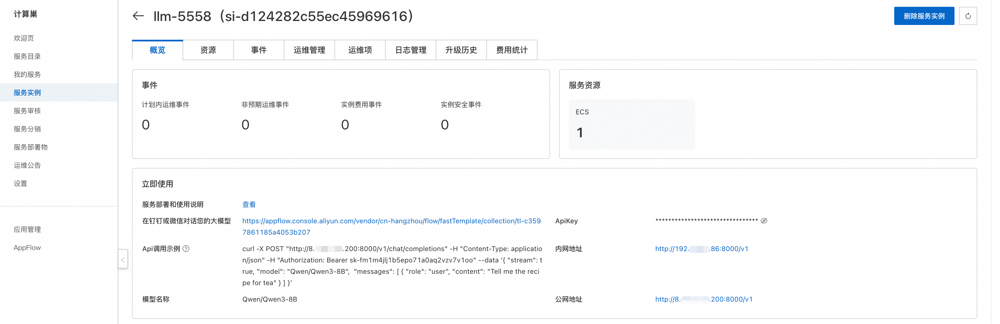
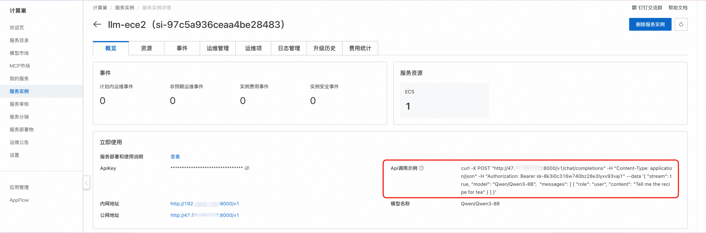
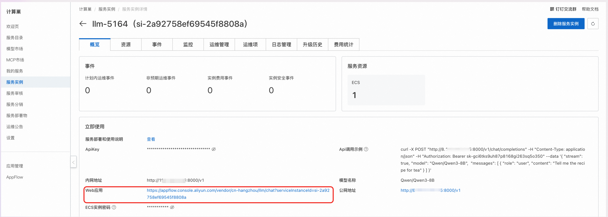
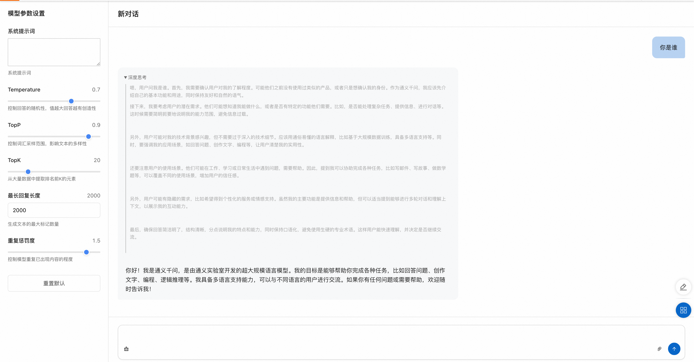

## Model Introduction

MiniMax large language models are a series of advanced AI language models developed by MiniMax. MiniMax models excel in natural language understanding, text generation, and logical reasoning, capable of handling complex dialogue scenarios and multi-turn interaction tasks.

MiniMax large language models have the following features:

- **Powerful language understanding**: Accurately understand user intent and handle complex semantic expressions
- **Fluent text generation**: Generate natural, fluent, and logically clear text content
- **Multi-scenario adaptation**: Suitable for various application scenarios such as customer service dialogue, content creation, and intelligent assistants
- **Continuous optimization**: Trained on massive amounts of data, with model capabilities continuously iterated and upgraded

## Usage Instructions

**Quick Start**

After completing the model deployment, you can see the model usage methods on the service instance overview page, which provides API call examples, intranet access address, public network access address, Web application address, and ApiKey.



### API Call Methods

#### Curl Command Call



**Parameter Description**

- `${ServerIP}`: IP address in the intranet address or public network address
- `${ApiKey}`: ApiKey provided on the page
- `${ModelName}`: Model name

Curl command calls can directly use the API call examples in the service instance overview page. The specific structure of calling the model API is as follows:

```bash
curl -X Post http://${ServerIP}:8000/v1/chat/completions \
  -H "Content-Type: application/json" \
  -H "Authorization: Bearer ${ApiKey}" \
  -d '{
    "model": "${ModelName}",
    "messages": [
      {
        "role": "user",
        "content": "Write a letter from the future 2035 to my daughter, telling her to study science and technology well, become the master of science and technology, promote science and technology, and economic development; she is currently in 3rd grade"
      }
    ]
  }'
```

#### Python SDK Call

**Configuration Description**

- `${ApiKey}`: Fill in the ApiKey on the page
- `${ServerUrl}`: Fill in the public network address or intranet address on the page, need to add `/v1`

The following is the Python example code:

```python
from openai import OpenAI

##### API Configuration #####
openai_api_key = "${ApiKey}"
openai_api_base = "${ServerUrl}"

client = OpenAI(
    api_key=openai_api_key,
    base_url=openai_api_base,
)

models = client.models.list()
model = models.data[0].id
print(model)

def main():
    stream = True

    chat_completion = client.chat.completions.create(
        messages=[
            {
                "role": "user",
                "content": [
                    {
                        "type": "text",
                        "text": "Hello, please introduce yourself in as much detail as possible.",
                    }
                ],
            }
        ],
        model=model,
        max_completion_tokens=1024,
        stream=stream,
    )

    if stream:
        for chunk in chat_completion:
            print(chunk.choices[0].delta.content, end="")
    else:
        result = chat_completion.choices[0].message.content
        print(result)

if __name__ == "__main__":
    main()
```

### Web Application Access

1. On the service instance overview page, click the link corresponding to the Web application.



2. Enter your question in the input box on the model service Web page to converse with the large model.


