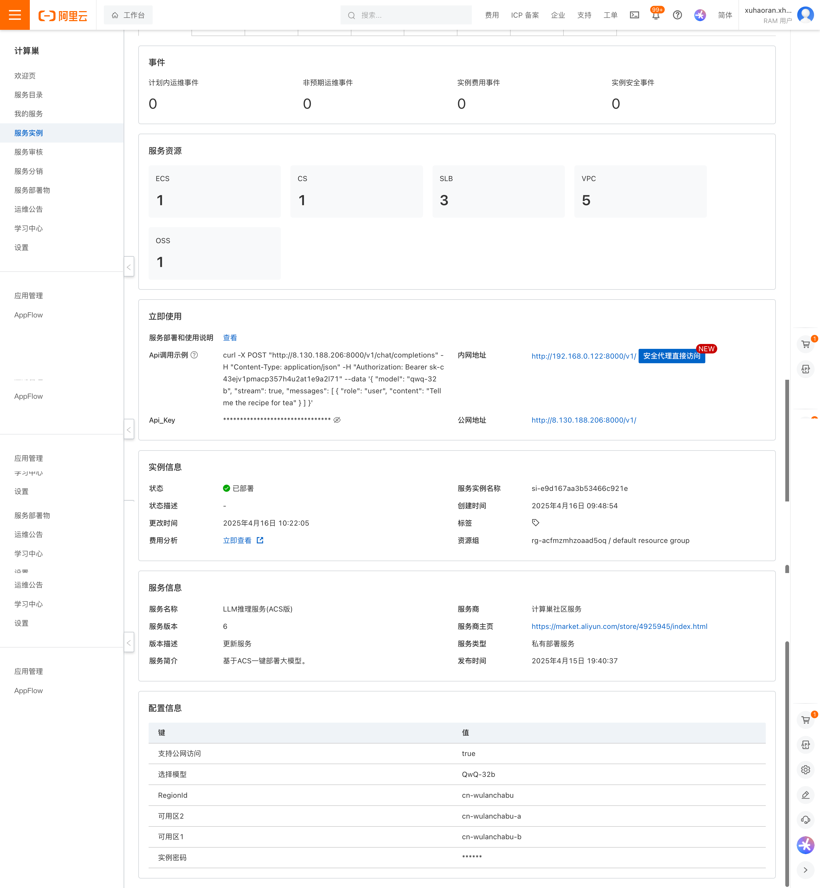
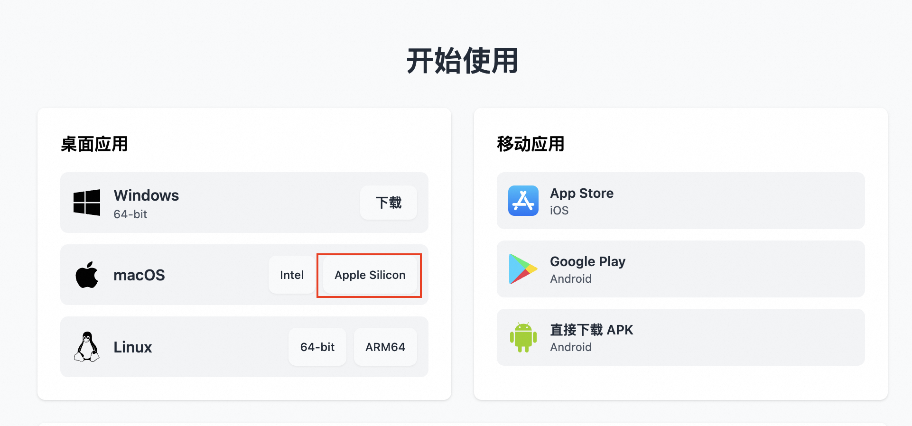
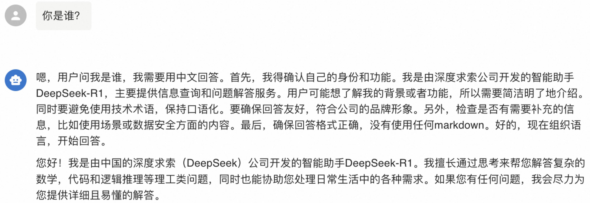
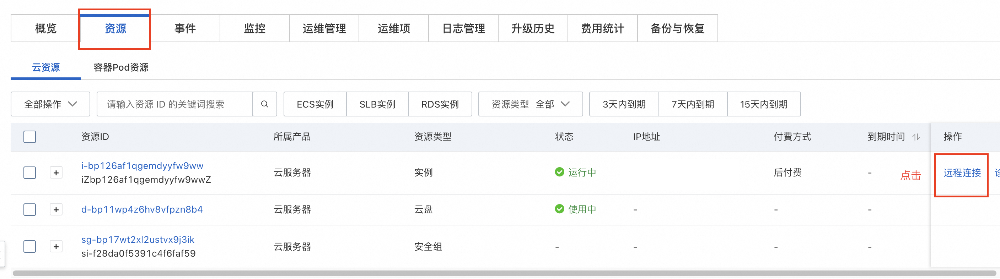
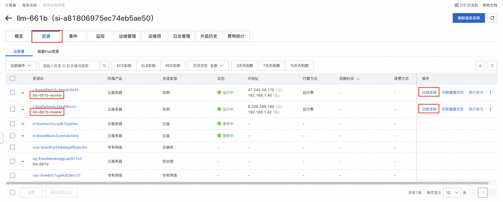

## 简介
Qwen3 是 Qwen 系列最新一代的大语言模型，提供了一系列密集（Dense）和混合专家(MOE）模型。基于广泛的训练，Qwen3 在推理、指令跟随、代理能力和多语言支持方面取得了突破性的进展，具有以下关键特性：

- 独特支持在思考模式（用于复杂逻辑推理、数学和编码）和 非思考模式（用于高效通用对话）之间无缝切换，确保在各种场景下的最佳性能。
- 显著增强的推理能力，在数学、代码生成和常识逻辑推理方面超越了之前的 QwQ （在思考模式下）和 Qwen2.5 指令模型（在非思考模式下）。
- 卓越的人类偏好对齐，在创意写作、角色扮演、多轮对话和指令跟随方面表现出色，提供更自然、更吸引人和更具沉浸感的对话体验。
- 擅长 Agent 能力，可以在思考和非思考模式下精确集成外部工具，在复杂的基于代理的任务中在开源模型中表现领先。
- 支持 100 多种语言和方言，具有强大的多语言理解、推理、指令跟随和生成能力。

## 部署配置
0.6B、1.7B、4B、8B 模型部署需要最低配置为 24G 显存

14B 模型部署需要最低配置为 48G 显存

30B、32B 模型部署需要最低配置为 96G 显存

235B 模型部署需要最低配置为 8* 96G 显存

## 使用说明
在完成模型部署后，可以在计算巢服务实例详情概览页面看到模型的使用方式，里面提供了Api调用示例、内网访问地址、公网访问地址（开启公网访问后会有）和Api_Key，下面会分别介绍如何访问使用。

### 私网API访问
在和部署服务器同一VPC内的ECS中调用概览页面中的Api调用示例，其中的${PrivateIP}要替换成内网IP,${API_KEY}替换成对应的Api_Key。
```shell
# 私网有认证请求，流式访问，若想关闭流式访问，删除stream即可。
curl http://{$PrivateIP}:8000/v1/chat/completions \
  -H "Content-Type: application/json" \
  -H "Authorization: Bearer ${API_KEY}" \
  -d '{
    "model": "ds",
    "messages": [
      {
        "role": "user",
        "content": "给闺女写一份来自未来2035的信，同时告诉她要好好学习科技，做科技的主人，推动科技，经济发展；她现在是3年级"
      }
    ],
    "max_tokens": 1024,
    "temperature": 0,
    "top_p": 0.9,
    "seed": 10,
    "stream": true
  }'
```

### 公网API访问
在开通公网访问权限的情况下，公网API访问和私网API访问一样，只是访问地址不同，具体参见下面的API调用示例，其中的${PublicIp}要替换成公网IP, ${API_KEY}替换成对应的Api_Key。
```shell
curl http://${PublicIp}:8000/v1/chat/completions \
  -H "Content-Type: application/json" \
  -H "Authorization: Bearer ${API_KEY}" \
  -d '{
    "model": "ds",
    "messages": [
      {
        "role": "user",
        "content": "给闺女写一份来自未来2035的信，同时告诉她要好好学习科技，做科技的主人，推动科技，经济发展；她现在是3年级"
      }
    ],
    "max_tokens": 1024,
    "temperature": 0,
    "top_p": 0.9,
    "seed": 10,
    "stream": true
  }'
```

### 使用 Chatbox 客户端配置 vLLM API 进行对话
在开通公网访问权限的情况下，除了使用Curl命令进行API调用，还可以使用Chatbox客户端进行对话，具体操作步骤如下：
1. 访问 Chatbox [下载地址](https://chatboxai.app/zh#download)下载并安装客户端，本方案以 macOS M3 为例。

2. 运行并配置 vLLM API ，单击设置。

3. 在弹出的看板中按照如下表格进行配置。

| 项目     | 说明               | 示例值                       |
|--------|------------------|---------------------------|
| 模型提供方  | 下拉选择模型提供方。       | 添加自定义提供方                  |
| 名称     | 填写定义模型提供方名称。     | vLLM API                  |
| API 域名 | 填写模型服务调用地址。      | http://<公网IP>:8000        |
| API 路径 | 填写 API 路径。       | /v1/chat/completions      |
| 网络兼容性  | 点击开启改善网络兼容性      | 开启                        |
| API 密钥 | 填写模型服务调用 API 密钥。 | 部署服务实例后，在服务实例页面可获取Api_Key |
| 模型     | 填写调用的模型。         | Qwen/QwQ-32B              |

4. 保存配置。在文本输入框中可以进行对话交互。输入问题你是谁？或者其他指令后，调用模型服务获得相应的响应。


## 自定义模型部署参数
如果您有自定义的模型部署参数的需求，可以在部署服务实例后，手动进行修改。
### Ecs单机版
1. 通过服务实例详情中的资源页面，进行ECS远程登录。


2. 执行下面的命令，将现有docker启动的模型服务进行停止并删除。
```shell
sudo docker stop vllm
sudo docker rm vllm
```

3. 下面是vllm部署的参考脚本，您可参考参数注释自定义模型部署参数，修改实际执行的脚本，具体的vllm镜像版本以ECS上已有的镜像版本为准，会定时进行更新。
```shell
docker run -d -t --net=host --gpus all \
 --entrypoint /bin/bash \
 --privileged \
 --ipc=host \
 --name vllm \
 -v /root:/root \
 egs-registry.cn-hangzhou.cr.aliyuncs.com/egs/vllm:0.7.2-pytorch2.5.1-cuda12.4-ubuntu22.04 \
 -c "pip install --upgrade vllm==0.8.2 && # 可自定义版本，如 pip install vllm==0.7.1
 export GLOO_SOCKET_IFNAME=eth0 && # 采用vpc进行网络通信所需环境变量，勿删改
 export NCCL_SOCKET_IFNAME=eth0 && # 采用vpc进行网络通信所需环境变量，勿删改
 vllm serve /root/llm-model/${ModelName} \
 --served-model-name ${ModelName} \
 --gpu-memory-utilization 0.98 \ # Gpu占用率，过高可能导致其他进程触发OOM。取值范围:0~1
 --max-model-len ${MaxModelLen} \ # 模型最大长度，取值范围与模型本身有关。
 --enable-chunked-prefill \
 --host=0.0.0.0 \
 --port 8080 \
 --trust-remote-code \
 --api-key "${VLLM_API_KEY}" \ # 可选，如不需要可去掉。
 --tensor-parallel-size $(nvidia-smi --query-gpu=index --format=csv,noheader | wc -l | awk '{print $1}')" # 使用GPU数量，默认使用全部GPU。
```

### Ecs双机版
1. 通过服务实例详情中的资源页面，进行ECS远程登录，分别登入master节点和worker节点（两台实例分别命名为llm-xxxx-master和llm-xxxx-worker）。

2. 在master节点和worker节点中执行下面的命令，将现有docker启动的模型服务进行停止并删除。
```shell
sudo docker stop vllm
sudo docker rm vllm
```
3. 下面是vllm部署的参考脚本，您可参考参数注释自定义模型部署参数，修改实际执行的脚本。
修改后，先在master节点上执行，执行成功后，再在worker节点上执行。
   - master节点执行下面的命令。
   ```shell
   docker run -t -d \
    --entrypoint /bin/bash \
    --name=vllm \
    --ipc=host \
    --cap-add=SYS_PTRACE \
    --network=host \
    --gpus all \
    --privileged \
    --ulimit memlock=-1 \
    --ulimit stack=67108864 \
    -v /root:/root \
    egs-registry.cn-hangzhou.cr.aliyuncs.com/egs/vllm:0.7.2-sglang0.4.3.post2-pytorch2.5-cuda12.4-20250224 \
    -c "pip install --upgrade vllm==0.8.2 && # 可自定义版本，如 pip install vllm==0.7.1。必须与worker节点保持一致。
    export NCCL_IB_DISABLE=0 && # 采用弹性RDMA进行高速网络通信所需环境变量，不建议改变
    export NCCL_DEBUG=INFO && # 采用弹性RDMA进行高速网络通信所需环境变量，不建议改变
    export NCCL_NET_GDR_LEVEL=5 && # 采用弹性RDMA进行高速网络通信所需环境变量，不建议改变
    export NCCL_P2P_LEVEL=5 && # 采用弹性RDMA进行高速网络通信所需环境变量，不建议改变
    export NCCL_IB_GID_INDEX=1 && # 采用弹性RDMA进行高速网络通信所需环境变量，不建议改变
    export GLOO_SOCKET_IFNAME=eth0 && # 采用vpc进行网络通信所需环境变量，勿删改
    export NCCL_SOCKET_IFNAME=eth0 && # 采用vpc进行网络通信所需环境变量，勿删改
    ray start --head --dashboard-host 0.0.0.0 --port=6379 &&
    tail -f /dev/null"
   ```
   - worker节点执行下面的命令。
   ```shell
    docker run -t -d \
    --entrypoint /bin/bash \
    --name=vllm \
    --ipc=host \
    --cap-add=SYS_PTRACE \
    --network=host \
    --gpus all \
    --privileged \
    --ulimit memlock=-1 \
    --ulimit stack=67108864 \
    -v /root:/root \
    egs-registry.cn-hangzhou.cr.aliyuncs.com/egs/vllm:0.7.2-sglang0.4.3.post2-pytorch2.5-cuda12.4-20250224 \
    -c "pip install --upgrade vllm==0.8.2 && # 可自定义版本，如 pip install vllm==0.7.1。必须与master节点保持一致。
    export NCCL_IB_DISABLE=0 && # 采用弹性RDMA进行高速网络通信所需环境变量，不建议改变
    export NCCL_DEBUG=INFO && # 采用弹性RDMA进行高速网络通信所需环境变量，不建议改变
    export NCCL_NET_GDR_LEVEL=5 && # 采用弹性RDMA进行高速网络通信所需环境变量，不建议改变
    export NCCL_P2P_LEVEL=5 && # 采用弹性RDMA进行高速网络通信所需环境变量，不建议改变
    export NCCL_IB_GID_INDEX=1 && # 采用弹性RDMA进行高速网络通信所需环境变量，不建议改变
    export GLOO_SOCKET_IFNAME=eth0 && # 采用vpc进行网络通信所需环境变量，勿删改
    export NCCL_SOCKET_IFNAME=eth0 && # 采用vpc进行网络通信所需环境变量，勿删改
    ray start --address='${HEAD_NODE_ADDRESS}:6379' && # 填写master节点的内网IP地址。
    vllm serve /root/llm-model/${ModelName} \
    --served-model-name ${ModelName} \
    --gpu-memory-utilization 0.98 \  # Gpu占用率，过高可能导致其他进程触发OOM。取值范围:0~1
    --max-model-len ${MaxModelLen} \ # 模型最大长度，取值范围与模型本身有关。
    --enable-chunked-prefill \
    --host=0.0.0.0 \
    --port 8080 \
    --trust-remote-code \
    --api-key "${VLLM_API_KEY}" \
    --tensor-parallel-size $(nvidia-smi --query-gpu=index --format=csv,noheader | wc -l | awk '{print $1}') \ # 单节点使用GPU数量，默认使用单台ECS实例的全部GPU。
    --pipeline-parallel-size 2" # 流线并行数，推荐设置为节点总数。
   ```

### Acs集群版
Acs集群的部署方式支持两种方式来修改模型部署参数，下面分别进行说明。
#### 跳板机方式
1. 进入计算巢控制台服务实例的资源界面，可以看到对应的ECS跳板机，执行远程连接，选择免密登录。

2. 进入跳板机后执行命令
```shell
[root@iZ0jl6qbv1gs36mzvvl1gaZ ~]# cd /root
[root@iZ0jl6qbv1gs36mzvvl1gaZ ~]# ls
download.log  kubectl  llm-k8s-resource  llm-k8s-resource.tar.gz  llm-model  logtail.sh  ossutil-2.1.0-linux-amd64  ossutil-2.1.0-linux-amd64.zip
[root@iZ0jl6qbv1gs36mzvvl1gaZ ~]# cd llm-k8s-resource/
[root@iZ0jl6qbv1gs36mzvvl1gaZ llm-k8s-resource]# ll
total 28
-rw-r--r-- 1  502 games 2235 Apr 14 17:54 deepseek-h20-application.yaml
-rw-r--r-- 1  502 games 3348 Apr 14 17:54 deepseek-ppu-application.yaml
-rw-r--r-- 1 root root  2594 Apr 16 10:04 model.yaml
-rw-r--r-- 1  502 games  930 Apr 16 10:04 pre-deploy-application.yaml
-rw-r--r-- 1  502 games  426 Apr 16 10:21 private-service.yaml
-rw-r--r-- 1  502 games  456 Apr 16 10:21 public-service.yaml
-rw-r--r-- 1  502 games 2586 Apr 14 17:30 qwq-application.yaml

# 如果需要更改模型参数，修改了model.yaml后直接执行apply命令即可
kubectl apply -f /root/llm-k8s-resource/model.yaml
```

#### 控制台方式
1. 进入计算巢控制台，点击服务实例，点击资源，找到对应的ACS实例，点击进入。

2. 进入ACS控制台后点击工作负载，查看无状态，以qwq-32b为例：可以看到对应的Deployment。

3. 点击该Deployment后进入详情页面，点击编辑可以修改一些基本参数，或者点击查看yaml修改后更新。


