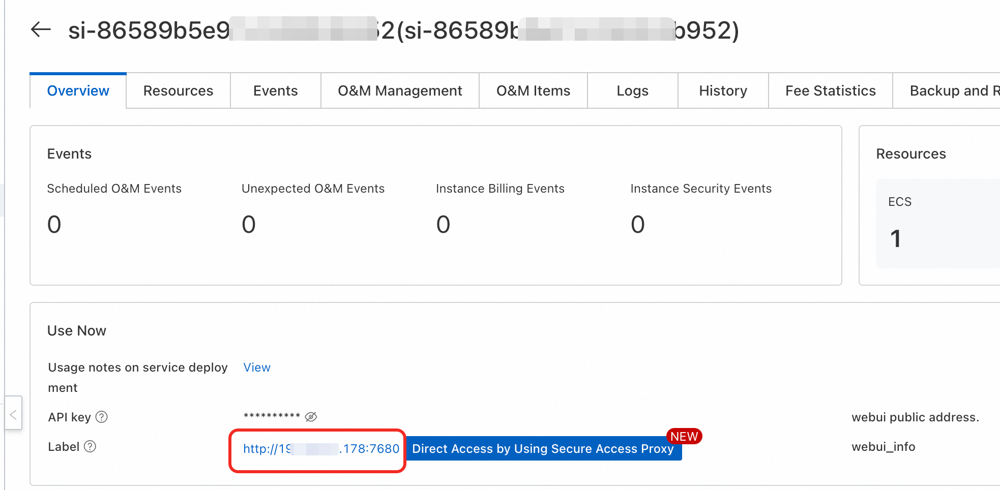

<div style="background: linear-gradient(135deg, #2563eb, #1e40af); padding: 24px; border-radius: 8px; color: white; text-align: center; margin-bottom: 24px;">
  <h2 style="margin: 0; color: white;">🎨 Stable Diffusion 1.5 Complete Guide</h2>
  <p style="margin: 8px 0 0 0; opacity: 0.9;">The ultimate text-to-image generation model for creators and developers</p>
</div>

## 🌟 Model Introduction

<div style="background: #f8fafc; border: 1px solid #e2e8f0; border-radius: 8px; padding: 20px; margin: 16px 0;">

**Stable Diffusion 1.5** is a revolutionary text-to-image generation model developed by **Stability AI**. As a groundbreaking milestone in the open-source AI image generation landscape, it continues to be one of the most beloved and extensively utilized models in the community. This model has earned its reputation through its **lightweight architecture**, **exceptional efficiency**, and **vibrant ecosystem**, making it the go-to choice for both AI newcomers and seasoned professionals.

</div>

## ✨ Core Features

<div style="display: grid; grid-template-columns: repeat(auto-fit, minmax(300px, 1fr)); gap: 16px; margin: 16px 0;">

<div style="background: #f0fdf4; border-left: 4px solid #059669; padding: 16px; border-radius: 4px;">
<h4 style="color: #059669; margin: 0 0 8px 0;">🚀 Performance Excellence</h4>
<ul style="margin: 0; padding-left: 20px; color: #065f46;">
  <li><strong>Lightweight & Efficient</strong>: Only 6GB VRAM required</li>
  <li><strong>Lightning Fast</strong>: Optimized for batch and real-time generation</li>
  <li><strong>Rock Solid</strong>: Battle-tested across millions of generations</li>
</ul>
</div>

<div style="background: #eff6ff; border-left: 4px solid #2563eb; padding: 16px; border-radius: 4px;">
<h4 style="color: #2563eb; margin: 0 0 8px 0;">🎨 Creative Powerhouse</h4>
<ul style="margin: 0; padding-left: 20px; color: #1e40af;">
  <li><strong>Style Versatility</strong>: Photorealistic, anime, artistic styles</li>
  <li><strong>Highly Customizable</strong>: LoRA, Textual Inversion support</li>
  <li><strong>Thriving Ecosystem</strong>: Massive community & extensions</li>
</ul>
</div>

<div style="background: #f5f3ff; border-left: 4px solid #7c3aed; padding: 16px; border-radius: 4px;">
<h4 style="color: #7c3aed; margin: 0 0 8px 0;">🆓 Open Source Freedom</h4>
<ul style="margin: 0; padding-left: 20px; color: #5b21b6;">
  <li><strong>100% Open Source</strong>: Complete transparency</li>
  <li><strong>Commercial Use Allowed</strong>: No licensing restrictions</li>
  <li><strong>Community Driven</strong>: Continuous improvements</li>
</ul>
</div>

</div>

## 📊 Technical Specifications

<div style="overflow-x: auto; margin: 16px 0;">
<table style="width: 100%; border-collapse: collapse; background: white; border-radius: 6px; overflow: hidden; box-shadow: 0 1px 3px rgba(0,0,0,0.1);">
  <thead style="background: #f8fafc;">
    <tr>
      <th style="padding: 12px; text-align: left; border-bottom: 1px solid #e2e8f0; color: #1e40af; font-weight: 600;">Specification</th>
      <th style="padding: 12px; text-align: left; border-bottom: 1px solid #e2e8f0; color: #1e40af; font-weight: 600;">Details</th>
    </tr>
  </thead>
  <tbody>
    <tr>
      <td style="padding: 12px; border-bottom: 1px solid #f1f5f9; font-weight: 500;">Model Type</td>
      <td style="padding: 12px; border-bottom: 1px solid #f1f5f9;">Text-to-Image / Image-to-Image Generation</td>
    </tr>
    <tr>
      <td style="padding: 12px; border-bottom: 1px solid #f1f5f9; font-weight: 500;">Parameters</td>
      <td style="padding: 12px; border-bottom: 1px solid #f1f5f9;">~860M parameters</td>
    </tr>
    <tr>
      <td style="padding: 12px; border-bottom: 1px solid #f1f5f9; font-weight: 500;">Text Encoder</td>
      <td style="padding: 12px; border-bottom: 1px solid #f1f5f9;">CLIP ViT-L/14</td>
    </tr>
    <tr>
      <td style="padding: 12px; border-bottom: 1px solid #f1f5f9; font-weight: 500;">VAE Resolution</td>
      <td style="padding: 12px; border-bottom: 1px solid #f1f5f9;">512×512 (Native)</td>
    </tr>
    <tr>
      <td style="padding: 12px; border-bottom: 1px solid #f1f5f9; font-weight: 500;">Optimal Steps</td>
      <td style="padding: 12px; border-bottom: 1px solid #f1f5f9;">20-50 steps</td>
    </tr>
    <tr>
      <td style="padding: 12px; font-weight: 500;">License</td>
      <td style="padding: 12px;">CreativeML Open RAIL-M</td>
    </tr>
  </tbody>
</table>
</div>

---

# ⚙️ Configuration Setup

## 💻 System Requirements

<div style="background: #eff6ff; border-left: 4px solid #2563eb; padding: 16px; margin: 16px 0; border-radius: 4px;">
  <strong>💡 Minimum Hardware Specifications</strong><br>
  <strong>GPU Memory</strong>: 6GB VRAM or higher<br>
  <small>Recommended: 8GB+ for optimal performance and larger resolutions</small>
</div>

## 📁 Essential Model Files

<div style="display: grid; grid-template-columns: repeat(auto-fit, minmax(280px, 1fr)); gap: 16px; margin: 16px 0;">

<div style="background: #f0fdf4; border-left: 4px solid #059669; padding: 16px; border-radius: 4px;">
<h4 style="color: #059669; margin: 0 0 8px 0;">🎯 Main Model</h4>
<div style="background: #f8fafc; padding: 8px; border-radius: 4px; margin: 8px 0; font-family: monospace; font-size: 12px;">
v1-5-pruned-emaonly.safetensors
</div>
<p style="margin: 8px 0 0 0; color: #065f46; font-size: 14px;">Core generation model file</p>
</div>

<div style="background: #eff6ff; border-left: 4px solid #2563eb; padding: 16px; border-radius: 4px;">
<h4 style="color: #2563eb; margin: 0 0 8px 0;">🎨 Enhanced VAE</h4>
<div style="background: #f8fafc; padding: 8px; border-radius: 4px; margin: 8px 0; font-family: monospace; font-size: 12px;">
vae-ft-mse-840000-ema-pruned.safetensors
</div>
<p style="margin: 8px 0 0 0; color: #1e40af; font-size: 14px;">Optional high-quality VAE</p>
</div>

<div style="background: #f5f3ff; border-left: 4px solid #7c3aed; padding: 16px; border-radius: 4px;">
<h4 style="color: #7c3aed; margin: 0 0 8px 0;">📝 Text Encoder</h4>
<div style="background: #f8fafc; padding: 8px; border-radius: 4px; margin: 8px 0; text-align: center; font-style: italic; color: #64748b;">
Built into main model
</div>
<p style="margin: 8px 0 0 0; color: #5b21b6; font-size: 14px;">CLIP ViT-L/14 integrated</p>
</div>

</div>

---

# 📖 Usage Guide

## 🌐 Web UI Interface

### 📋 Step-by-Step Workflow

<div style="background: #f8fafc; border: 1px solid #e2e8f0; border-radius: 8px; padding: 20px; margin: 16px 0;">

**1. Model Selection**
- Navigate to the upper-left model selector and choose your SD1.5 model


**2. Prompt Engineering**
- **Positive Prompt**: Describe your desired image in vivid detail
- **Negative Prompt**: Specify unwanted elements (SD1.5 excels here!)

**3. Parameter Tuning**
- **Steps**: 20-30 (balance of quality and speed)
- **CFG Scale**: 7-12 (prompt adherence strength)
- **Sampler**: DPM++ 2M Karras / Euler a
- **Resolution**: 512×512 (native resolution)

**4. Advanced Configuration**
- **Seed**: Control randomness (-1 = random)
- **Batch Size**: Multiple generations
- **Hi-Res Fix**: Upscale for larger images

</div>

### 🎨 Optimized Parameter Presets

<div style="display: grid; grid-template-columns: repeat(auto-fit, minmax(280px, 1fr)); gap: 16px; margin: 16px 0;">

<div style="background: #f0fdf4; border-left: 4px solid #059669; padding: 16px; border-radius: 4px;">
<h4 style="color: #059669; margin: 0 0 8px 0;">⚡ Speed Mode</h4>
<ul style="margin: 0; padding-left: 20px; color: #065f46;">
  <li><strong>Steps</strong>: 20 | <strong>CFG</strong>: 7</li>
  <li><strong>Sampler</strong>: Euler a</li>
  <li><strong>Size</strong>: 512×512</li>
</ul>
<p style="margin: 8px 0 0 0; color: #065f46; font-size: 14px;">Perfect for rapid prototyping</p>
</div>

<div style="background: #eff6ff; border-left: 4px solid #2563eb; padding: 16px; border-radius: 4px;">
<h4 style="color: #2563eb; margin: 0 0 8px 0;">💎 Quality Mode</h4>
<ul style="margin: 0; padding-left: 20px; color: #1e40af;">
  <li><strong>Steps</strong>: 30 | <strong>CFG</strong>: 9-11</li>
  <li><strong>Sampler</strong>: DPM++ 2M Karras</li>
  <li><strong>Size</strong>: 768×768</li>
</ul>
<p style="margin: 8px 0 0 0; color: #1e40af; font-size: 14px;">Maximum detail and fidelity</p>
</div>

<div style="background: #f5f3ff; border-left: 4px solid #7c3aed; padding: 16px; border-radius: 4px;">
<h4 style="color: #7c3aed; margin: 0 0 8px 0;">🎨 Artistic Mode</h4>
<ul style="margin: 0; padding-left: 20px; color: #5b21b6;">
  <li><strong>Steps</strong>: 25 | <strong>CFG</strong>: 8-10</li>
  <li><strong>Sampler</strong>: DDIM</li>
  <li><strong>Size</strong>: 512×768</li>
</ul>
<p style="margin: 8px 0 0 0; color: #5b21b6; font-size: 14px;">Enhanced creative expression</p>
</div>

</div>

---

## 🔌 API Integration

<div style="background: #eff6ff; border-left: 4px solid #2563eb; padding: 16px; margin: 16px 0; border-radius: 4px;">
  <strong>💡 Configuration Requirements</strong><br>
  Replace <code style="background: #f8fafc; padding: 2px 6px; border-radius: 4px;">BASE_URL</code> and <code style="background: #f8fafc; padding: 2px 6px; border-radius: 4px;">APIKEY</code> with your actual deployment values. For public network access, use public IP:port.
</div>



<details style="border: 2px solid #2563eb; border-radius: 12px; padding: 20px; margin: 20px 0; background: linear-gradient(145deg, #f8fafc, #eff6ff); box-shadow: 0 8px 16px rgba(37, 99, 235, 0.15);">
<summary style="font-weight: bold; font-size: 18px; color: white; cursor: pointer; padding: 16px; background: linear-gradient(135deg, #2563eb, #1e40af); border-radius: 8px; margin: -20px -20px 20px -20px; text-shadow: 1px 1px 2px rgba(0,0,0,0.2); transition: all 0.3s ease; display: flex; align-items: center; box-shadow: 0 4px 8px rgba(37, 99, 235, 0.3);">
🐍 Complete Python API Implementation
</summary>

```python
import requests
import base64
import json
from typing import Optional, Dict, Any
import time

class StableDiffusionAPI:
    """
    🎨 Stable Diffusion 1.5 API Client
    A comprehensive wrapper for SD1.5 API interactions with advanced features
    """
    
    def __init__(self, base_url: str, username: str = "admin", apikey: Optional[str] = None):
        """Initialize the API client with connection details"""
        self.base_url = base_url.rstrip('/')
        self.auth = (username, apikey) if apikey else None
        self.session = requests.Session()
        
    def switch_model(self, model_name: str = "v1-5-pruned-emaonly.safetensors") -> bool:
        """🔄 Switch to SD1.5 model with error handling"""
        model_data = {"sd_model_checkpoint": model_name}
        
        try:
            print("🔄 Switching to Stable Diffusion 1.5...")
            response = self.session.post(
                f"{self.base_url}/sdapi/v1/options", 
                json=model_data, 
                auth=self.auth,
                timeout=30
            )
            response.raise_for_status()
            print("✅ Model switch completed successfully!")
            return True
        except requests.RequestException as e:
            print(f"❌ Model switch failed: {e}")
            return False
    
    def generate_image(
        self, 
        prompt: str,
        negative_prompt: str = "blurry, low quality, distorted, ugly",
        steps: int = 20,
        cfg_scale: float = 7.0,
        width: int = 512,
        height: int = 512,
        sampler_name: str = "Euler a",
        seed: int = -1,
        batch_size: int = 1
    ) -> Optional[Dict[str, Any]]:
        """🎨 Generate image with SD1.5 - Enhanced version"""
        
        generation_data = {
            "prompt": prompt,
            "negative_prompt": negative_prompt,
            "steps": steps,
            "cfg_scale": cfg_scale,
            "width": width,
            "height": height,
            "sampler_name": sampler_name,
            "seed": seed,
            "batch_size": batch_size,
            "restore_faces": False,
            "tiling": False,
            "enable_hr": False
        }
        
        try:
            print(f"🎨 Generating: '{prompt[:50]}...'")
            start_time = time.time()
            
            response = self.session.post(
                f"{self.base_url}/sdapi/v1/txt2img",
                json=generation_data,
                auth=self.auth,
                timeout=300  # 5 minutes timeout
            )
            response.raise_for_status()
            result = response.json()
            
            generation_time = time.time() - start_time
            
            if "images" in result and result["images"]:
                print(f"✅ Image generated successfully in {generation_time:.2f}s!")
                return {
                    "images": [base64.b64decode(img) for img in result["images"]],
                    "info": result.get("info", {}),
                    "generation_time": generation_time
                }
            else:
                print("❌ No image data received")
                return None
                
        except requests.RequestException as e:
            print(f"❌ Generation failed: {e}")
            return None
    
    def save_images(self, image_data_list: list, base_filename: str = "sd15_output") -> list:
        """💾 Save multiple generated images with timestamps"""
        saved_files = []
        timestamp = int(time.time())
        
        for i, image_data in enumerate(image_data_list):
            try:
                if len(image_data_list) > 1:
                    filename = f"{base_filename}_{timestamp}_{i+1}.png"
                else:
                    filename = f"{base_filename}_{timestamp}.png"
                    
                with open(filename, "wb") as f:
                    f.write(image_data)
                print(f"💾 Image saved as: {filename}")
                saved_files.append(filename)
            except Exception as e:
                print(f"❌ Save failed for image {i+1}: {e}")
        
        return saved_files

# 🚀 Usage Example
def main():
    """Comprehensive example with error handling"""
    
    # Initialize API client
    api = StableDiffusionAPI(
        base_url="<Your-Deployment-URL>",
        username="admin",
        apikey="${APIKEY}"  # Remove if no API key required
    )
    
    # Switch to SD1.5
    if not api.switch_model():
        print("❌ Failed to switch model. Exiting...")
        return
    
    # Generate image
    result = api.generate_image(
        prompt="a majestic cat sitting on a golden throne, royal crown, detailed fur, 4k, photorealistic",
        negative_prompt="blurry, low quality, distorted, cartoon",
        steps=25,
        cfg_scale=8.0,
        width=512,
        height=512,
        sampler_name="DPM++ 2M Karras"
    )
    
    if result and result["images"]:
        saved_files = api.save_images(result["images"], "sd15_cat")
        print(f"✅ Generation completed! Files: {saved_files}")
    else:
        print("❌ Failed to generate image")

if __name__ == "__main__":
    main()
```

</details>

<div style="background: #eff6ff; border-left: 4px solid #2563eb; padding: 16px; margin: 16px 0; border-radius: 4px;">
  <strong>💡 No API Key Setup</strong><br>
  If authentication is disabled, modify requests like this:<br>
  <code style="background: #f8fafc; padding: 2px 6px; border-radius: 4px;">response = requests.post(f"{base_url}/sdapi/v1/options", json=model_data)</code>
</div>

---

## 📚 Essential Resources & Community

<div style="display: grid; grid-template-columns: repeat(auto-fit, minmax(280px, 1fr)); gap: 16px; margin: 16px 0;">

<div style="background: #f8fafc; border: 1px solid #e2e8f0; border-radius: 8px; padding: 20px;">
<h4 style="margin-top: 0; color: #1e40af;">📖 Official Documentation</h4>
<a href="https://stability.ai/stable-diffusion" style="color: #2563eb; text-decoration: none; font-weight: 500;">Stability AI Docs →</a>
<p style="margin-top: 8px; color: #64748b; font-size: 14px;">Comprehensive guides and technical specifications</p>
</div>

<div style="background: #f8fafc; border: 1px solid #e2e8f0; border-radius: 8px; padding: 20px;">
<h4 style="margin-top: 0; color: #1e40af;">🖥️ Web Interface</h4>
<a href="https://github.com/AUTOMATIC1111/stable-diffusion-webui" style="color: #2563eb; text-decoration: none; font-weight: 500;">Automatic1111 WebUI →</a>
<p style="margin-top: 8px; color: #64748b; font-size: 14px;">Most popular SD web interface with extensive features</p>
</div>

<div style="background: #f8fafc; border: 1px solid #e2e8f0; border-radius: 8px; padding: 20px;">
<h4 style="margin-top: 0; color: #1e40af;">🎨 Model Hub</h4>
<a href="https://civitai.com/" style="color: #2563eb; text-decoration: none; font-weight: 500;">Civitai Community →</a>
<p style="margin-top: 8px; color: #64748b; font-size: 14px;">Thousands of custom models, LoRAs, and embeddings</p>
</div>

<div style="background: #f8fafc; border: 1px solid #e2e8f0; border-radius: 8px; padding: 20px;">
<h4 style="margin-top: 0; color: #1e40af;">✍️ Prompt Mastery</h4>
<a href="https://prompthero.com/stable-diffusion-prompts" style="color: #2563eb; text-decoration: none; font-weight: 500;">Prompt Engineering Guide →</a>
<p style="margin-top: 8px; color: #64748b; font-size: 14px;">Master the art of crafting perfect prompts</p>
</div>

</div>

---

## 🎯 Best Practices & Pro Tips

<div style="display: grid; grid-template-columns: 1fr 1fr; gap: 16px; margin: 16px 0;">

<div style="background: #f0fdf4; border-left: 4px solid #059669; padding: 16px; border-radius: 4px;">
<h4 style="color: #059669; margin: 0 0 8px 0;">✍️ Prompt Engineering Mastery</h4>
<ul style="margin: 0; padding-left: 20px; color: #065f46;">
  <li>Use specific descriptive words instead of abstract concepts</li>
  <li>Add artist names to define artistic styles</li>
  <li>Use weight syntax (word:1.2) to emphasize key elements</li>
  <li>Leverage negative prompts to exclude unwanted content</li>
</ul>
</div>

<div style="background: #eff6ff; border-left: 4px solid #2563eb; padding: 16px; border-radius: 4px;">
<h4 style="color: #2563eb; margin: 0 0 8px 0;">⚙️ Parameter Optimization</h4>
<ul style="margin: 0; padding-left: 20px; color: #1e40af;">
  <li>Start with low step counts, gradually increase for quality</li>
  <li>High CFG values can cause over-saturation</li>
  <li>Different samplers excel at different artistic styles</li>
  <li>Use fixed seeds to reproduce satisfactory results</li>
</ul>
</div>

</div>

---

## ❓ Troubleshooting & FAQ

<details style="border: 2px solid #dc2626; border-radius: 12px; padding: 20px; margin: 15px 0; background: linear-gradient(145deg, #fef2f2, #fee2e2); box-shadow: 0 4px 15px rgba(0,0,0,0.1);">
<summary style="font-weight: bold; font-size: 16px; color: #dc2626; cursor: pointer;">❓ Poor image quality - How to improve results?</summary>
<div style="margin-top: 15px; color: #991b1b;">
<p><strong>Solution Strategies:</strong></p>
<ul>
<li>Increase generation steps to 30-50 for higher quality</li>
<li>Adjust CFG Scale to 8-12 for better prompt adherence</li>
<li>Use more detailed prompts with specific descriptors</li>
<li>Try different samplers (DPM++ 2M Karras recommended)</li>
<li>Consider using a high-quality VAE for better colors</li>
</ul>
</div>
</details>

<details style="border: 2px solid #ea580c; border-radius: 12px; padding: 20px; margin: 15px 0; background: linear-gradient(145deg, #fff7ed, #fed7aa); box-shadow: 0 4px 15px rgba(0,0,0,0.1);">
<summary style="font-weight: bold; font-size: 16px; color: #ea580c; cursor: pointer;">❓ Out of memory errors - How to optimize VRAM usage?</summary>
<div style="margin-top: 15px; color: #9a3412;">
<p><strong>Memory Optimization Tips:</strong></p>
<ul>
<li>Reduce resolution to 512×512 or lower</li>
<li>Decrease batch size to 1 image at a time</li>
<li>Enable low VRAM mode in settings</li>
<li>Disable unnecessary extensions and features</li>
<li>Use precision optimization (half precision/fp16)</li>
<li>Restart the application to clear memory leaks</li>
</ul>
</div>
</details>

<details style="border: 2px solid #7c3aed; border-radius: 12px; padding: 20px; margin: 15px 0; background: linear-gradient(145deg, #faf5ff, #f3e8ff); box-shadow: 0 4px 15px rgba(0,0,0,0.1);">
<summary style="font-weight: bold; font-size: 16px; color: #7c3aed; cursor: pointer;">❓ How to achieve specific artistic styles?</summary>
<div style="margin-top: 15px; color: #5b21b6;">
<p><strong>Style Control Methods:</strong></p>
<ul>
<li>Add artist names to prompts (e.g., "by Greg Rutkowski")</li>
<li>Use style keywords ("oil painting", "anime style", "photorealistic")</li>
<li>Download specialized LoRAs for specific styles from Civitai</li>
<li>Reference community prompt templates for proven combinations</li>
<li>Adjust CFG Scale to control style intensity (7-15 range)</li>
<li>Experiment with different samplers for style variations</li>
</ul>
</div>
</details>

---

<div style="text-align: center; padding: 16px; background: #f8fafc; border-radius: 6px; margin-top: 24px;">
  <p style="margin: 0; color: #64748b; font-size: 14px;">
    🎨 <strong>Ready to Create Magic?</strong> | Transform your imagination into stunning visuals with Stable Diffusion 1.5
  </p>
</div>