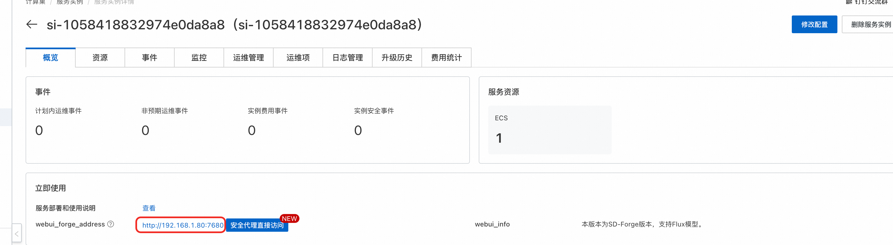

## 模型简介

Stable Diffusion 1.5 是由 Stability AI 开发的经典文本到图像生成模型，作为开源AI图像生成领域的里程碑之作，至今仍是最受欢迎和应用最广泛的模型之一。该模型以其轻量化、高效率和丰富的生态系统而闻名，是AI图像生成的入门首选。

### 核心特性
- **轻量高效**: 仅需6GB显存即可运行，硬件要求低
- **生态丰富**: 拥有庞大的社区和丰富的扩展生态
- **风格多样**: 支持写实、二次元、艺术等多种风格
- **稳定可靠**: 经过大量实际应用验证，生成结果稳定
- **易于定制**: 支持LoRA、Textual Inversion等微调技术
- **快速生成**: 推理速度快，适合批量生成和实时应用
- **开源免费**: 完全开源，支持商业使用

### 技术规格
- **模型类型**: 文本到图像生成（Text-to-Image）或图像到图像生成（Image-to-Image）
- **参数规模**: 约860M参数
- **文本编码器**: CLIP ViT-L/14
- **VAE**: 512×512原生分辨率VAE
- **推荐步数**: 20-50步


## 配置说明

#### 系统要求
- **ECS的GPU显存**: 6GB以上


#### 模型文件
- **主模型**: `v1-5-pruned-emaonly.safetensors`
- **VAE**: 可选择更高质量的VAE如 `vae-ft-mse-840000-ema-pruned.safetensors`
- **文本编码器**: 内置于主模型中


## 使用指南

### Web UI 使用

#### 基础操作
1. **模型选择**: 在左上角模型选择器中选择SD1.5模型
2. **提示词输入**:
    - **正向提示词**: 详细描述想要生成的图像内容
    - **负向提示词**: 描述不想要的元素（SD1.5对负向提示词响应良好）
3. **参数设置**:
    - **步数**: 推荐20-30步
    - **CFG Scale**: 推荐7-12
    - **采样器**: 推荐DPM++ 2M Karras或Euler a
    - **分辨率**: 512×512（原生）或其他支持尺寸
4. **高级设置**:
    - **种子**: 控制随机性，-1为随机
    - **批次**: 设置生成数量
    - **高分辨率修复**: 生成更大尺寸图像

#### 推荐参数组合
- **快速生成**: 20步 + CFG 7 + Euler a + 512×512
- **高质量**: 30步 + CFG 9-11 + DPM++ 2M Karras + 768×768
- **艺术风格**: 25步 + CFG 8-10 + DDIM + 512×768

### API 调用

需要将BASE_URL和APIKEY替换。
如果要用公网调用，则选择公网的ip:端口

<details style="border: 2px solid #0066cc; border-radius: 8px; padding: 15px; margin: 10px 0; background-color: #f8f9fa;">
  <summary style="font-weight: bold; font-size: 18px; color: #0066cc; cursor: pointer;">
    📋 点击展开API调用Python代码
  </summary>

```python
import requests
import base64

# 配置
base_url = "<部署服务的Output URL>"
username = "admin"
apikey = "${APIKEY}"
auth = (username, apikey)

# 1. 切换模型
model_data = {
    "sd_model_checkpoint": "v1-5-pruned-emaonly.safetensors"
}

print("正在切换模型...")
model_response = requests.post(f"{base_url}/sdapi/v1/options", json=model_data, auth=auth)
print("模型切换完成")

# 2. 生成图片
prompt = "a beautiful cat"
data = {
    "prompt": prompt,
    "steps": 20,
    "width": 512,
    "height": 512
}

print("正在生成图片...")
response = requests.post(f"{base_url}/sdapi/v1/txt2img", json=data, auth=auth)
result = response.json()

# 3. 保存图片
if "images" in result:
    image_data = base64.b64decode(result["images"][0])
    with open("output.png", "wb") as f:
        f.write(image_data)
    print("图片已保存为 output.png")
else:
    print("错误:", result)

```

</details>

若未开启APIKEY，参考下述代码修改请求：
```python
model_response = requests.post(f"{base_url}/sdapi/v1/options", json=model_data)

```


### 相关资源

- [Stable Diffusion官方文档](https://stability.ai/stable-diffusion)
- [Automatic1111 WebUI](https://github.com/AUTOMATIC1111/stable-diffusion-webui)
- [Civitai模型社区](https://civitai.com/)
- [提示词工程指南](https://prompthero.com/stable-diffusion-prompts)
- [LoRA训练教程](https://github.com/cloneofsimo/lora)
