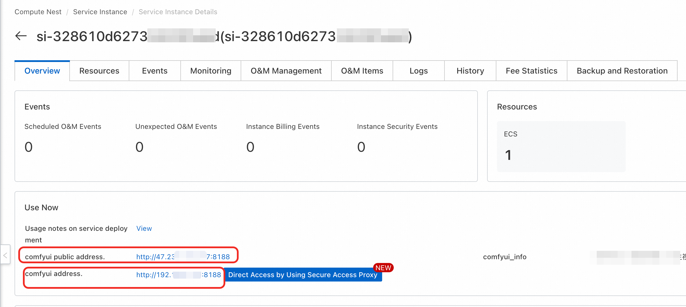

## Model Introduction

Wan2.1-I2V-14B is a powerful image-to-video generation model that can generate high-quality video content based on input images and text prompts. The model maintains the main characteristics of the input image while adding dynamic effects and scene changes according to text descriptions.

### Core Features
- **Parameter Scale**: 14B parameters, providing powerful image understanding and video generation capabilities
- **Image-Driven**: Generates coherent video sequences based on input images
- **Multi-language Support**: Supports Chinese and English text prompts
- **Image Consistency**: Maintains main features and style of the input image

### Technical Specifications
- **Model Type**: Image-to-Video Generation
- **Quantization**: FP8 quantized version
- **Supported Resolution**: 480p
- **Maximum Frames**: 81 frames
- **Recommended Frame Rate**: 16fps
- **Input Format**: Common image formats like JPEG, PNG

## Usage Instructions

### Web UI Usage
1. **Access Interface**: Click the access link at the service instance. 
2. Select `wanx-21.json` workflow and open it, choose the image-to-video function option
3. **Upload Image**:
    - Select sample image in LoadImage node
    - Or upload custom image from local computer
4. **Set Text Description**:
    - Fill in description words in TextEncode node
    - Top: Describe desired actions and scene changes
    - Bottom: Content you don't want to generate
5. **Configure Parameters**:
    - Set resolution and frame count in ImageClip Encode
6. Execute workflow

### API Calls

#### Standard API Interface

Click the button in the upper right corner, open the bottom panel, and get the token: 
For COMFYUI_SERVER acquisition, refer to: 

<details style="border: 2px solid #0066cc; border-radius: 8px; padding: 15px; margin: 10px 0; background-color: #f8f9fa;">
  <summary style="font-weight: bold; font-size: 18px; color: #0066cc; cursor: pointer;">
    📋 Click to expand API call Python code
  </summary>

```python
import requests, json, uuid, time, random, os

# Configuration parameters
COMFYUI_SERVER, COMFYUI_TOKEN = "Enter your server address", "Enter your token"
T5_MODEL = "wan2.1/umt5-xxl-enc-bf16.safetensors"
VIDEO_MODEL = "Wan2_1-I2V-14B-480P_fp8_e4m3fn.safetensors"
VAE_MODEL = "wan2.1/Wan2_1_VAE_bf16.safetensors"
CLIP_MODEL = "wan2.1/open-clip-xlm-roberta-large-vit-huge-14_visual_fp16.safetensors"

# Preset parameters
IMAGE_PATH = "girl.png"
PROMPT = "A beautiful anime girl with long flowing hair, graceful movements, smooth animation, cinematic lighting, high quality"
NEG_PROMPT = "bad quality video, low quality, blurry, distorted, choppy animation, static, bad anatomy"

class ComfyUIClient:
   def __init__(self, server=COMFYUI_SERVER, token=COMFYUI_TOKEN):
      self.base_url, self.token, self.client_id = f"http://{server}", token, str(uuid.uuid4())
      self.headers = {"Content-Type": "application/json", **({"Authorization": f"Bearer {token}"} if token else {})}

   def upload_image(self, image_path):
      """Upload image to ComfyUI"""
      if not os.path.exists(image_path):
         raise Exception(f"Image file does not exist: {image_path}")

      try:
         with open(image_path, 'rb') as f:
            files = {'image': (os.path.basename(image_path), f, 'image/png')}
            headers = {}
            if self.token:
               headers["Authorization"] = f"Bearer {self.token}"

            response = requests.post(f"{self.base_url}/upload/image", files=files, headers=headers)
            print(f"Upload response: {response.text}")

            if response.status_code != 200:
               raise Exception(f"Upload failed, status code: {response.status_code}")

            result = response.json()
            if 'name' not in result:
               raise Exception(f"No filename in upload response: {result}")

            return result['name']
      except Exception as e:
         raise Exception(f"Image upload failed: {e}")

   def generate_i2v(self, image_path, prompt, neg_prompt, steps=10, cfg=6, width=512, height=512, frames=81):
      """Image-to-Video - Fixed clip_vision input"""
      print("📤 Uploading image...")
      image_name = self.upload_image(image_path)
      print(f"✅ Image uploaded successfully: {image_name}")

      workflow = {
         "42": {"inputs": {"image": image_name, "upload": "image"}, "class_type": "LoadImage"},
         "43": {"inputs": {"model_name": VAE_MODEL, "precision": "bf16"}, "class_type": "WanVideoVAELoader"},
         "44": {"inputs": {"model_name": CLIP_MODEL, "precision": "fp16", "load_device": "offload_device"}, "class_type": "LoadWanVideoClipTextEncoder"},
         "45": {"inputs": {"model_name": T5_MODEL, "precision": "bf16", "load_device": "offload_device", "quantization": "disabled"}, "class_type": "LoadWanVideoT5TextEncoder"},
         "46": {"inputs": {"blocks_to_swap": 10, "offload_img_emb": False, "offload_txt_emb": False, "use_non_blocking": True, "vace_blocks_to_swap": 0}, "class_type": "WanVideoBlockSwap"},
         "47": {"inputs": {"backend": "inductor", "fullgraph": False, "mode": "default", "dynamic": False, "dynamo_cache_size_limit": 64, "compile_transformer_blocks_only": True, "dynamo_recompile_limit": 128}, "class_type": "WanVideoTorchCompileSettings"},
         "48": {"inputs": {"model": VIDEO_MODEL, "base_precision": "bf16", "quantization": "fp8_e4m3fn", "load_device": "offload_device", "attention_mode": "sageattn", "block_swap_args": ["46", 0]}, "class_type": "WanVideoModelLoader"},
         "49": {"inputs": {"positive_prompt": prompt, "negative_prompt": neg_prompt, "force_offload": True, "t5": ["45", 0]}, "class_type": "WanVideoTextEncode"},
         "50": {
            "inputs": {
               "generation_width": width,
               "generation_height": height,
               "num_frames": frames,
               "force_offload": True,
               "noise_aug_strength": 0,
               "latent_strength": 1,
               "clip_embed_strength": 1,
               "adjust_resolution": True,
               "image": ["42", 0],
               "vae": ["43", 0],
               "clip_vision": ["44", 0]  # Modified to clip_vision
            },
            "class_type": "WanVideoImageClipEncode"
         },
         "52": {"inputs": {"steps": steps, "cfg": cfg, "shift": 5, "seed": random.randint(1, 1000000), "force_offload": True, "scheduler": "dpm++", "riflex_freq_index": 0, "denoise_strength": 1, "batched_cfg": False, "rope_function": "comfy", "model": ["48", 0], "text_embeds": ["49", 0], "image_embeds": ["50", 0]}, "class_type": "WanVideoSampler"},
         "53": {"inputs": {"enable_vae_tiling": True, "tile_x": 272, "tile_y": 272, "tile_stride_x": 144, "tile_stride_y": 128, "vae": ["43", 0], "samples": ["52", 0]}, "class_type": "WanVideoDecode"},
         "54": {"inputs": {"frame_rate": 16, "loop_count": 0, "filename_prefix": "WanVideo2_1", "format": "video/h264-mp4", "pix_fmt": "yuv420p", "crf": 19, "save_metadata": True, "trim_to_audio": False, "pingpong": False, "save_output": True, "images": ["53", 0]}, "class_type": "VHS_VideoCombine"}
      }

      print("📤 Submitting workflow...")
      response = requests.post(f"{self.base_url}/prompt", headers=self.headers, json={"prompt": workflow, "client_id": self.client_id})
      print(f"API Response: {response.text}")
      result = response.json()
      if "error" in result: raise Exception(f"Workflow error: {result['error']}")
      if "prompt_id" not in result: raise Exception(f"No prompt_id in response: {result}")
      return result["prompt_id"]

   def get_status(self, task_id):
      try:
         queue_data = requests.get(f"{self.base_url}/queue", headers=self.headers).json()
         if any(item[1] == task_id for item in queue_data.get("queue_running", [])): return "processing"
         if any(item[1] == task_id for item in queue_data.get("queue_pending", [])): return "pending"
         history_response = requests.get(f"{self.base_url}/history/{task_id}", headers=self.headers)
         return "completed" if history_response.status_code == 200 and task_id in history_response.json() else "processing"
      except: return "processing"

   def download_video(self, task_id, output_path="i2v_output.mp4"):
      try:
         response = requests.get(f"{self.base_url}/history/{task_id}", headers=self.headers)
         history = response.json()
         if task_id in history:
            for output in history[task_id]['outputs'].values():
               if 'gifs' in output:
                  filename = output['gifs'][0]['filename']
                  video_response = requests.get(f"{self.base_url}/view?filename={filename}", headers=self.headers)
                  with open(output_path, "wb") as f: f.write(video_response.content)
                  return output_path
      except Exception as e: print(f"Download error: {e}")
      return None

def main():
   client = ComfyUIClient()
   try:
      print(f"🎬 Starting image-to-video task...")
      print(f"📷 Input image: {IMAGE_PATH}")
      print(f"📝 Prompt: {PROMPT}")

      if not os.path.exists(IMAGE_PATH):
         print(f"❌ Image file does not exist: {IMAGE_PATH}")
         print("Please ensure there is a girl.png file in the current directory")
         return

      task_id = client.generate_i2v(IMAGE_PATH, PROMPT, NEG_PROMPT, 10, 6, 512, 512, 81)
      print(f"🆔 Task ID: {task_id}")

      while True:
         status = client.get_status(task_id)
         print(f"📊 Current status: {status}")
         if status == "completed": print("✅ Video ready!"); break
         elif status == "failed": print("❌ Generation failed!"); exit(1)
         time.sleep(10)

      output_file = client.download_video(task_id, "i2v_output.mp4")
      print("🎉 Video downloaded successfully!" if output_file else "❌ Failed to download video")
      if output_file: print(f"📁 Saved as: {output_file}")

   except Exception as e: print(f"❌ Error: {e}")

if __name__ == "__main__": main()
```

</details>

#### ComfyUI API Endpoints

| Endpoint | Method | Function | Description |
|----------|--------|----------|-------------|
| `/queue` | GET | Get queue status | View current task queue |
| `/prompt` | POST | Submit workflow | Execute generation task |
| `/history/{prompt_id}` | GET | Get execution history | View task execution results |
| `/upload/image` | POST | Upload image | Upload input image file |
| `/view` | GET | Download output file | Get generated result files |

## Parameter Description

### Generation Parameters
- **steps**: Inference steps (recommended 20-30)
- **cfg**: CFG guidance strength (recommended 6-8)
- **shift**: Noise schedule offset (recommended 5)
- **seed**: Random seed (controls randomness of generation results)
- **denoise_strength**: Denoising strength (0.6-0.9, controls preservation of original image)

### Image Requirements
- **Resolution**: Recommended 512×512 or higher
- **Format**: JPEG, PNG, WebP, etc.
- **Content**: Clear main subject, avoid overly complex backgrounds
- **Quality**: High-quality images yield better video effects

### Prompt Suggestions

#### Positive Prompt Examples
- "The person in the image is walking slowly through a garden"
- "The cat in the photo is playing with a ball of yarn"
- "The car in the image is driving down a winding mountain road"
- "The dancer in the picture is performing elegant ballet movements"

#### Negative Prompt Suggestions
- "static, motionless, frozen, distorted, blurry"
- "unnatural movement, jerky motion, inconsistent"
- "low quality, artifacts, noise, compression"

## Best Practices

### Input Image Selection
1. **Clarity**: Choose high-definition images
2. **Clear Subject**: Ensure main objects are clearly visible
3. **Reasonable Composition**: Avoid overly complex backgrounds
4. **Good Lighting**: Images with even lighting work better

### Prompt Writing
1. **Specific Description**: Describe desired actions and scenes in detail
2. **Maintain Consistency**: Ensure descriptions match image content
3. **Reasonable Actions**: Describe actions that follow physical laws
4. **Unified Style**: Maintain descriptions consistent with original image style

### Parameter Tuning
1. **Denoising Strength**:
    - 0.6-0.7: Preserve more original image features
    - 0.8-0.9: Allow more changes and dynamic effects
2. **CFG Value**:
    - 6-7: Balanced guidance strength
    - 8-10: Stronger text guidance
3. **Steps**:
    - 20-25: Fast generation
    - 25-30: Higher quality

## Important Notes

1. **Memory Management**: Image-to-video requires more VRAM than text-to-video
2. **Image Preprocessing**: Ensure input image size is appropriate, avoid too large or too small
3. **Consistency Preservation**: Denoising strength should not be too high to maintain image consistency
4. **Action Reasonableness**: Described actions should match characteristics of objects in the image
5. **Batch Processing**: Recommend processing one task at a time to avoid memory overflow

## Application Scenarios

- **Character Animation**: Bring static character photos to life
- **Product Showcase**: Add dynamic effects to product images
- **Artistic Creation**: Convert paintings into dynamic videos
- **Educational Demonstration**: Make teaching images have dynamic effects
- **Social Media**: Create interesting dynamic content

## Related Resources

- [ComfyUI Official Documentation](https://comfyui-wiki.com/zh/interface/node-options)
- [WanVideo Plugin Documentation](https://github.com/kijai/ComfyUI-WanVideoWrapper/blob/main/readme.md)