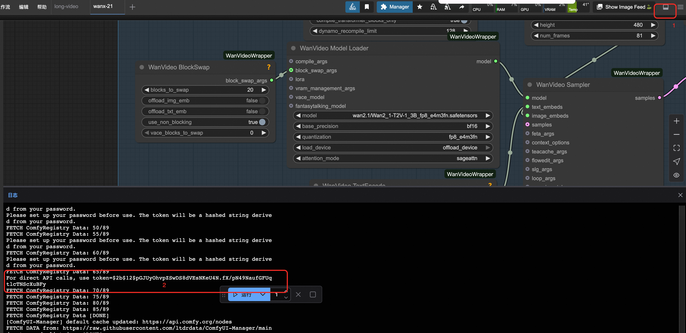

## 模型简介

Wan2.1-I2V-14B 是一个强大的图像到视频生成模型，能够基于输入图像和文本提示生成高质量的视频内容。该模型在保持输入图像主体特征的同时，根据文本描述添加动态效果和场景变化。

### 核心特性
- **参数规模**: 14B参数，提供强大的图像理解和视频生成能力
- **图像驱动**: 以输入图像为基础，生成连贯的视频序列
- **多语言支持**: 支持中文和英文文本提示
- **图像一致性**: 保持输入图像的主要特征和风格

### 技术规格
- **模型类型**: 图像到视频生成（Image-to-Video）
- **量化方式**: FP8量化版本
- **支持分辨率**: 480p
- **最大帧数**: 81帧
- **推荐帧率**: 16fps
- **输入格式**: JPEG、PNG等常见图像格式

## 使用说明

### Web UI使用
1. **访问界面**: 单击服务实例处的访问链接。
2. 选择 `wanx-21.json` 工作流并打开，选择图生视频功能选项
3. **上传图像**:
    - 在LoadImage节点选择示例图片
    - 或从本机电脑上传自定义图像
    - 
4. **设置文本描述**:
    - 在TextEncode节点填写描述词
    - 上方：描述希望的动作和场景变化
    - 下方：不想要生成的内容
5. **配置参数**:
    - 在ImageClip Encode设置分辨率和帧数
6. 执行工作流

### API调用

#### 标准API接口

点击右上方按钮，打开底部面板，获取token：
COMFYUI_SERVER的获取可参考：

<details style="border: 2px solid #0066cc; border-radius: 8px; padding: 15px; margin: 10px 0; background-color: #f8f9fa;">
  <summary style="font-weight: bold; font-size: 18px; color: #0066cc; cursor: pointer;">
    📋 点击展开API调用Python代码
  </summary>

```python
import requests, json, uuid, time, random, os

# 配置参数
COMFYUI_SERVER, COMFYUI_TOKEN = "输入您的服务器地址", "输入您的token"
T5_MODEL = "wan2.1/umt5-xxl-enc-bf16.safetensors"
VIDEO_MODEL = "Wan2_1-I2V-14B-480P_fp8_e4m3fn.safetensors"
VAE_MODEL = "wan2.1/Wan2_1_VAE_bf16.safetensors"
CLIP_MODEL = "wan2.1/open-clip-xlm-roberta-large-vit-huge-14_visual_fp16.safetensors"

# 预设参数
IMAGE_PATH = "girl.png"
PROMPT = "A beautiful anime girl with long flowing hair, graceful movements, smooth animation, cinematic lighting, high quality"
NEG_PROMPT = "bad quality video, low quality, blurry, distorted, choppy animation, static, bad anatomy"

class ComfyUIClient:
   def __init__(self, server=COMFYUI_SERVER, token=COMFYUI_TOKEN):
      self.base_url, self.token, self.client_id = f"http://{server}", token, str(uuid.uuid4())
      self.headers = {"Content-Type": "application/json", **({"Authorization": f"Bearer {token}"} if token else {})}

   def upload_image(self, image_path):
      """上传图片到ComfyUI"""
      if not os.path.exists(image_path):
         raise Exception(f"图片文件不存在: {image_path}")

      try:
         with open(image_path, 'rb') as f:
            files = {'image': (os.path.basename(image_path), f, 'image/png')}
            headers = {}
            if self.token:
               headers["Authorization"] = f"Bearer {self.token}"

            response = requests.post(f"{self.base_url}/upload/image", files=files, headers=headers)
            print(f"Upload response: {response.text}")

            if response.status_code != 200:
               raise Exception(f"上传失败，状态码: {response.status_code}")

            result = response.json()
            if 'name' not in result:
               raise Exception(f"上传响应中没有文件名: {result}")

            return result['name']
      except Exception as e:
         raise Exception(f"图片上传失败: {e}")

   def generate_i2v(self, image_path, prompt, neg_prompt, steps=10, cfg=6, width=512, height=512, frames=81):
      """图生视频 - 修复clip_vision输入"""
      print("📤 正在上传图片...")
      image_name = self.upload_image(image_path)
      print(f"✅ 图片上传成功: {image_name}")

      workflow = {
         "42": {"inputs": {"image": image_name, "upload": "image"}, "class_type": "LoadImage"},
         "43": {"inputs": {"model_name": VAE_MODEL, "precision": "bf16"}, "class_type": "WanVideoVAELoader"},
         "44": {"inputs": {"model_name": CLIP_MODEL, "precision": "fp16", "load_device": "offload_device"}, "class_type": "LoadWanVideoClipTextEncoder"},
         "45": {"inputs": {"model_name": T5_MODEL, "precision": "bf16", "load_device": "offload_device", "quantization": "disabled"}, "class_type": "LoadWanVideoT5TextEncoder"},
         "46": {"inputs": {"blocks_to_swap": 10, "offload_img_emb": False, "offload_txt_emb": False, "use_non_blocking": True, "vace_blocks_to_swap": 0}, "class_type": "WanVideoBlockSwap"},
         "47": {"inputs": {"backend": "inductor", "fullgraph": False, "mode": "default", "dynamic": False, "dynamo_cache_size_limit": 64, "compile_transformer_blocks_only": True, "dynamo_recompile_limit": 128}, "class_type": "WanVideoTorchCompileSettings"},
         "48": {"inputs": {"model": VIDEO_MODEL, "base_precision": "bf16", "quantization": "fp8_e4m3fn", "load_device": "offload_device", "attention_mode": "sageattn", "block_swap_args": ["46", 0]}, "class_type": "WanVideoModelLoader"},
         "49": {"inputs": {"positive_prompt": prompt, "negative_prompt": neg_prompt, "force_offload": True, "t5": ["45", 0]}, "class_type": "WanVideoTextEncode"},
         "50": {
            "inputs": {
               "generation_width": width,
               "generation_height": height,
               "num_frames": frames,
               "force_offload": True,
               "noise_aug_strength": 0,
               "latent_strength": 1,
               "clip_embed_strength": 1,
               "adjust_resolution": True,
               "image": ["42", 0],
               "vae": ["43", 0],
               "clip_vision": ["44", 0]  # 修改为clip_vision
            },
            "class_type": "WanVideoImageClipEncode"
         },
         "52": {"inputs": {"steps": steps, "cfg": cfg, "shift": 5, "seed": random.randint(1, 1000000), "force_offload": True, "scheduler": "dpm++", "riflex_freq_index": 0, "denoise_strength": 1, "batched_cfg": False, "rope_function": "comfy", "model": ["48", 0], "text_embeds": ["49", 0], "image_embeds": ["50", 0]}, "class_type": "WanVideoSampler"},
         "53": {"inputs": {"enable_vae_tiling": True, "tile_x": 272, "tile_y": 272, "tile_stride_x": 144, "tile_stride_y": 128, "vae": ["43", 0], "samples": ["52", 0]}, "class_type": "WanVideoDecode"},
         "54": {"inputs": {"frame_rate": 16, "loop_count": 0, "filename_prefix": "WanVideo2_1", "format": "video/h264-mp4", "pix_fmt": "yuv420p", "crf": 19, "save_metadata": True, "trim_to_audio": False, "pingpong": False, "save_output": True, "images": ["53", 0]}, "class_type": "VHS_VideoCombine"}
      }

      print("📤 提交工作流...")
      response = requests.post(f"{self.base_url}/prompt", headers=self.headers, json={"prompt": workflow, "client_id": self.client_id})
      print(f"API Response: {response.text}")
      result = response.json()
      if "error" in result: raise Exception(f"Workflow error: {result['error']}")
      if "prompt_id" not in result: raise Exception(f"No prompt_id in response: {result}")
      return result["prompt_id"]

   def get_status(self, task_id):
      try:
         queue_data = requests.get(f"{self.base_url}/queue", headers=self.headers).json()
         if any(item[1] == task_id for item in queue_data.get("queue_running", [])): return "processing"
         if any(item[1] == task_id for item in queue_data.get("queue_pending", [])): return "pending"
         history_response = requests.get(f"{self.base_url}/history/{task_id}", headers=self.headers)
         return "completed" if history_response.status_code == 200 and task_id in history_response.json() else "processing"
      except: return "processing"

   def download_video(self, task_id, output_path="i2v_output.mp4"):
      try:
         response = requests.get(f"{self.base_url}/history/{task_id}", headers=self.headers)
         history = response.json()
         if task_id in history:
            for output in history[task_id]['outputs'].values():
               if 'gifs' in output:
                  filename = output['gifs'][0]['filename']
                  video_response = requests.get(f"{self.base_url}/view?filename={filename}", headers=self.headers)
                  with open(output_path, "wb") as f: f.write(video_response.content)
                  return output_path
      except Exception as e: print(f"Download error: {e}")
      return None

def main():
   client = ComfyUIClient()
   try:
      print(f"🎬 开始图生视频任务...")
      print(f"📷 输入图片: {IMAGE_PATH}")
      print(f"📝 提示词: {PROMPT}")

      if not os.path.exists(IMAGE_PATH):
         print(f"❌ 图片文件不存在: {IMAGE_PATH}")
         print("请确保当前目录下有 girl.png 文件")
         return

      task_id = client.generate_i2v(IMAGE_PATH, PROMPT, NEG_PROMPT, 10, 6, 512, 512, 81)
      print(f"🆔 Task ID: {task_id}")

      while True:
         status = client.get_status(task_id)
         print(f"📊 Current status: {status}")
         if status == "completed": print("✅ Video ready!"); break
         elif status == "failed": print("❌ Generation failed!"); exit(1)
         time.sleep(10)

      output_file = client.download_video(task_id, "i2v_output.mp4")
      print("🎉 Video downloaded successfully!" if output_file else "❌ Failed to download video")
      if output_file: print(f"📁 Saved as: {output_file}")

   except Exception as e: print(f"❌ Error: {e}")

if __name__ == "__main__": main()

```

</details>

#### ComfyUI API端点

| 端点 | 方法 | 功能 | 说明 |
|------|------|------|------|
| `/queue` | GET | 获取队列状态 | 查看当前任务队列 |
| `/prompt` | POST | 提交工作流 | 执行生成任务 |
| `/history/{prompt_id}` | GET | 获取执行历史 | 查看任务执行结果 |
| `/upload/image` | POST | 上传图片 | 上传输入图片文件 |
| `/view` | GET | 下载输出文件 | 获取生成的结果文件 |


## 参数说明

### 生成参数
- **steps**: 推理步数（建议20-30）
- **cfg**: CFG引导强度（建议6-8）
- **shift**: 噪声调度偏移（建议5）
- **seed**: 随机种子（控制生成结果的随机性）
- **denoise_strength**: 去噪强度（0.6-0.9，控制对原图的保持程度）

### 图像要求
- **分辨率**: 建议512×512以上
- **格式**: JPEG、PNG、WebP等
- **内容**: 清晰的主体对象，避免过于复杂的背景
- **质量**: 高质量图像能获得更好的视频效果


### 提示词建议

#### 正向提示词示例
- "The person in the image is walking slowly through a garden"
- "The cat in the photo is playing with a ball of yarn"
- "The car in the image is driving down a winding mountain road"
- "The dancer in the picture is performing elegant ballet movements"

#### 负向提示词建议
- "static, motionless, frozen, distorted, blurry"
- "unnatural movement, jerky motion, inconsistent"
- "low quality, artifacts, noise, compression"

## 最佳实践

### 输入图像选择
1. **清晰度**: 选择高清晰度的图像
2. **主体明确**: 确保主要对象清晰可见
3. **构图合理**: 避免过于复杂的背景
4. **光照良好**: 光照均匀的图像效果更佳

### 提示词编写
1. **具体描述**: 详细描述希望的动作和场景
2. **保持一致**: 确保描述与图像内容相符
3. **动作合理**: 描述符合物理规律的动作
4. **风格统一**: 保持与原图风格一致的描述

### 参数调优
1. **去噪强度**:
    - 0.6-0.7: 保持原图特征较多
    - 0.8-0.9: 允许更多变化和动态效果
2. **CFG值**:
    - 6-7: 平衡的引导强度
    - 8-10: 更强的文本引导
3. **步数**:
    - 20-25: 快速生成
    - 25-30: 更高质量

## 注意事项

1. **内存管理**: 图生视频比文生视频需要更多显存
2. **图像预处理**: 确保输入图像尺寸合适，避免过大或过小
3. **一致性保持**: 去噪强度不宜过高，以保持图像一致性
4. **动作合理性**: 描述的动作应符合图像中对象的特征
5. **批处理**: 建议单次处理一个任务，避免内存溢出

## 应用场景

- **人物动画**: 让静态人物照片动起来
- **产品展示**: 为产品图片添加动态效果
- **艺术创作**: 将绘画作品转换为动态视频
- **教育演示**: 让教学图片具有动态效果
- **社交媒体**: 创建有趣的动态内容

## 相关资源

- [ComfyUI官方文档](https://comfyui-wiki.com/zh/interface/node-options)
- [WanVideo插件文档](https://github.com/kijai/ComfyUI-WanVideoWrapper/blob/main/readme.md)
- [Comfyui文档](https://docs.comfy.org/essentials/image_preprocessing)