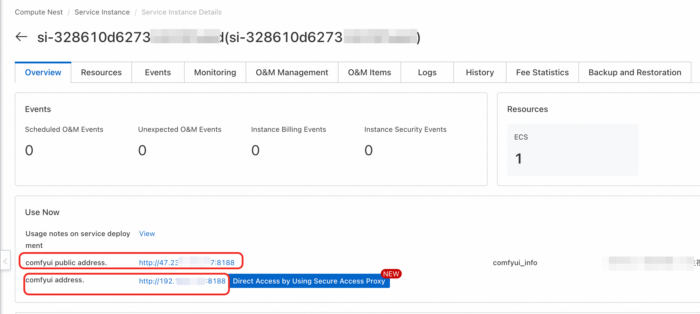

# 🎬 Wan2.1-T2V-1.3B 文本到视频生成完整指南

<div style="background: linear-gradient(135deg, #667eea 0%, #764ba2 100%); padding: 30px; border-radius: 15px; color: white; text-align: center; margin-bottom: 30px; box-shadow: 0 10px 30px rgba(0,0,0,0.2);">
  <h2 style="margin: 0; font-size: 2.5em; text-shadow: 2px 2px 4px rgba(0,0,0,0.3);">🚀 轻量级文本到视频生成技术</h2>
  <p style="font-size: 1.2em; margin: 10px 0 0 0; opacity: 0.9;">T2V (Text-to-Video) 专业级视频生成技术</p>
</div>

## 🌟 模型简介

**Wan2.1-T2V-1.3B** 是 WanVideo 2.1 系列文本到视频生成模型的轻量级版本，专为资源受限环境设计。该模型在保持良好视频生成质量的同时，显著降低了硬件要求，让更多用户能够在消费级设备上体验文本到视频技术。

### ✨ 核心特性

<div style="display: grid; grid-template-columns: repeat(auto-fit, minmax(300px, 1fr)); gap: 20px; margin: 20px 0;">

<div style="background: linear-gradient(135deg, #667eea, #764ba2); padding: 20px; border-radius: 12px; color: white; box-shadow: 0 5px 15px rgba(0,0,0,0.1);">
  <h4 style="margin-top: 0;">⚡ 参数规模</h4>
  <p style="margin-bottom: 0;">1.3B 参数，轻量高效</p>
</div>

<div style="background: linear-gradient(135deg, #f093fb, #f5576c); padding: 20px; border-radius: 12px; color: white; box-shadow: 0 5px 15px rgba(0,0,0,0.1);">
  <h4 style="margin-top: 0;">🎥 文本到视频专用</h4>
  <p style="margin-bottom: 0;">专门针对文本到视频生成任务优化</p>
</div>

<div style="background: linear-gradient(135deg, #4facfe, #00f2fe); padding: 20px; border-radius: 12px; color: white; box-shadow: 0 5px 15px rgba(0,0,0,0.1);">
  <h4 style="margin-top: 0;">⏰ 时序连贯性</h4>
  <p style="margin-bottom: 0;">保持视频帧间的流畅性和一致性</p>
</div>

<div style="background: linear-gradient(135deg, #43e97b, #38f9d7); padding: 20px; border-radius: 12px; color: white; box-shadow: 0 5px 15px rgba(0,0,0,0.1);">
  <h4 style="margin-top: 0;">🛠️ 多样化生成</h4>
  <p style="margin-bottom: 0;">支持各种风格和主题的视频生成</p>
</div>

<div style="background: linear-gradient(135deg, #fa709a, #fee140); padding: 20px; border-radius: 12px; color: white; box-shadow: 0 5px 15px rgba(0,0,0,0.1);">
  <h4 style="margin-top: 0;">🚀 快速生成</h4>
  <p style="margin-bottom: 0;">轻量化架构，生成速度快</p>
</div>

<div style="background: linear-gradient(135deg, #a8edea, #fed6e3); padding: 20px; border-radius: 12px; color: #333; box-shadow: 0 5px 15px rgba(0,0,0,0.1);">
  <h4 style="margin-top: 0;">🌐 多语言支持</h4>
  <p style="margin-bottom: 0;">支持中文和英文文本提示</p>
</div>

</div>

### 📊 技术规格

<div style="background: #f8f9fa; border-radius: 12px; padding: 25px; margin: 20px 0; box-shadow: 0 5px 15px rgba(0,0,0,0.05);">

| 规格项目 | 详细信息 |
|---------|---------|
| **模型类型** | 文本到视频生成（Text-to-Video） |
| **参数规模** | 1.3B |
| **量化方式** | FP8量化版本 |
| **部署架构** | ECS单机部署/ACS集群部署 |
| **最大帧数** | 81 帧 |
| **推荐帧率** | 16fps |
| **推荐步数** | 15-25 步 |
| **输出格式** | MP4（H.264编码） |

</div>

### 🎨 生成能力

<div style="display: grid; grid-template-columns: repeat(auto-fit, minmax(250px, 1fr)); gap: 15px; margin: 20px 0;">

<div style="background: #e8f5e8; padding: 15px; border-radius: 8px; border-left: 4px solid #4caf50;">
  <strong>🎭 风格多样</strong><br>
  <small>支持动漫、写实、艺术等多种风格</small>
</div>

<div style="background: #e3f2fd; padding: 15px; border-radius: 8px; border-left: 4px solid #2196f3;">
  <strong>🌈 场景丰富</strong><br>
  <small>室内外、自然、城市等各种场景</small>
</div>

<div style="background: #fce4ec; padding: 15px; border-radius: 8px; border-left: 4px solid #e91e63;">
  <strong>🏞️ 动作流畅</strong><br>
  <small>人物动作、物体运动自然流畅</small>
</div>

<div style="background: #f3e5f5; padding: 15px; border-radius: 8px; border-left: 4px solid #9c27b0;">
  <strong>🎯 细节精准</strong><br>
  <small>根据文本描述精确生成细节</small>
</div>

<div style="background: #fff3e0; padding: 15px; border-radius: 8px; border-left: 4px solid #ff9800;">
  <strong>✨ 创意无限</strong><br>
  <small>支持创意和想象力丰富的内容</small>
</div>

<div style="background: #e0f2f1; padding: 15px; border-radius: 8px; border-left: 4px solid #009688;">
  <strong>📈 质量稳定</strong><br>
  <small>保持一致的高质量输出</small>
</div>

</div>

---

## 🚀 部署方式

### 🏗️ 部署架构（推荐）

<div style="background: linear-gradient(135deg, #e3f2fd, #bbdefb); padding: 25px; border-radius: 12px; border-left: 5px solid #2196f3; margin: 20px 0;">
  <h4 style="color: #1976d2; margin-top: 0;">⚙️ 部署配置</h4>
  <ul style="margin-bottom: 0;">
    <li><strong>部署架构</strong>: ECS单机部署或ACS集群部署</li>
    <li><strong>显存需求</strong>: 6GB+ 显存，适合消费级设备</li>
    <li><strong>扩展性</strong>: 支持单机和集群部署</li>
  </ul>
</div>

---

## 🎯 使用指南

### 🌐 ComfyUI 使用

<div style="background: linear-gradient(135deg, #fff3e0, #ffe0b2); padding: 25px; border-radius: 12px; border-left: 5px solid #ff9800; margin: 20px 0;">

#### 🔧 操作步骤

**1. 访问界面**
- 单击服务实例处的访问链接
- 

**2. 选择工作流**
- 选择适合的文本到视频生成工作流
- 确认已选择 Wan2.1-T2V-1.3B 模型

**3. 设置参数**
- 输入文本描述（支持中英文）
- 设置视频分辨率和帧数
- 调整生成参数（步数、CFG 等）

**4. 开始生成**
- 点击生成按钮开始处理
- 等待生成完成并下载结果

</div>

### 🔌 API 调用

<div style="background: #f3e5f5; padding: 20px; border-radius: 12px; margin: 20px 0;">

**设置说明：**
- 点击右上方按钮，打开底部面板，获取token：
- COMFYUI_SERVER的获取可参考：

</div>

<details style="border: 2px solid #2196f3; border-radius: 12px; padding: 20px; margin: 15px 0; background: linear-gradient(135deg, #e3f2fd, #bbdefb);">
<summary style="font-weight: bold; font-size: 18px; color: #1976d2; cursor: pointer;">
📋 点击展开API调用Python代码
</summary>

```python
import requests, json, uuid, time, random

# 配置参数
COMFYUI_SERVER, COMFYUI_TOKEN = "输入您的服务器地址", "输入您的token"
T5_MODEL, VIDEO_MODEL, VAE_MODEL = "wan2.1/umt5-xxl-enc-bf16.safetensors", "wan2.1/Wan2_1-T2V-1_3B_fp8_e4m3fn.safetensors", "wan2.1/Wan2_1_VAE_bf16.safetensors"

class ComfyUIClient:
    def __init__(self, server=COMFYUI_SERVER, token=COMFYUI_TOKEN):
        self.base_url, self.token, self.client_id = f"http://{server}", token, str(uuid.uuid4())
        self.headers = {"Content-Type": "application/json", **({"Authorization": f"Bearer {token}"} if token else {})}

    def generate(self, prompt, neg_prompt="", steps=15, cfg=6, width=832, height=480, frames=81):
        workflow = {
            "1": {"inputs": {"model_name": T5_MODEL, "precision": "bf16"}, "class_type": "LoadWanVideoT5TextEncoder"},
            "2": {"inputs": {"positive_prompt": prompt, "negative_prompt": neg_prompt, "force_offload": True, "t5": ["1", 0]}, "class_type": "WanVideoTextEncode"},
            "3": {"inputs": {"model": VIDEO_MODEL, "base_precision": "bf16", "quantization": "fp8_e4m3fn", "load_device": "offload_device"}, "class_type": "WanVideoModelLoader"},
            "4": {"inputs": {"width": width, "height": height, "num_frames": frames}, "class_type": "WanVideoEmptyEmbeds"},
            "5": {"inputs": {"model_name": VAE_MODEL, "precision": "bf16"}, "class_type": "WanVideoVAELoader"},
            "6": {"inputs": {"steps": steps, "cfg": cfg, "shift": 5, "seed": random.randint(1, 1000000), "force_offload": True, "scheduler": "dpm++", "riflex_freq_index": 0, "model": ["3", 0], "text_embeds": ["2", 0], "image_embeds": ["4", 0]}, "class_type": "WanVideoSampler"},
            "7": {"inputs": {"enable_vae_tiling": True, "tile_x": 272, "tile_y": 272, "tile_stride_x": 144, "tile_stride_y": 128, "vae": ["5", 0], "samples": ["6", 0]}, "class_type": "WanVideoDecode"},
            "8": {"inputs": {"frame_rate": 16, "loop_count": 0, "filename_prefix": "generated_video", "format": "video/h264-mp4", "save_output": True, "pingpong": False, "images": ["7", 0]}, "class_type": "VHS_VideoCombine"}
        }
        response = requests.post(f"{self.base_url}/prompt", headers=self.headers, json={"prompt": workflow, "client_id": self.client_id})
        print(f"API 响应: {response.text}")
        result = response.json()
        if "error" in result: raise Exception(f"工作流错误: {result['error']}")
        if "prompt_id" not in result: raise Exception(f"响应中没有 prompt_id: {result}")
        return result["prompt_id"]

    def get_status(self, task_id):
        try:
            queue_data = requests.get(f"{self.base_url}/queue", headers=self.headers).json()
            if any(item[1] == task_id for item in queue_data.get("queue_running", [])): return "processing"
            if any(item[1] == task_id for item in queue_data.get("queue_pending", [])): return "pending"
            history_response = requests.get(f"{self.base_url}/history/{task_id}", headers=self.headers)
            return "completed" if history_response.status_code == 200 and task_id in history_response.json() else "processing"
        except: return "processing"

    def download_video(self, task_id, output_path="generated_video.mp4"):
        try:
            response = requests.get(f"{self.base_url}/history/{task_id}", headers=self.headers)
            history = response.json()
            if task_id in history:
                for output in history[task_id]['outputs'].values():
                    if 'gifs' in output:
                        filename = output['gifs'][0]['filename']
                        video_response = requests.get(f"{self.base_url}/view?filename={filename}", headers=self.headers)
                        with open(output_path, "wb") as f: f.write(video_response.content)
                        return output_path
        except Exception as e: print(f"下载错误: {e}")
        return None

def main():
    client = ComfyUIClient()
    try:
        print("🎬 开始文本到视频生成任务...")
        task_id = client.generate("一个美丽的动漫女孩，长长的黑发，优雅地跳舞", "低质量，模糊，扭曲", 15, 6, 832, 480, 81)
        print(f"🆔 任务ID: {task_id}")
        
        while True:
            status = client.get_status(task_id)
            print(f"📊 当前状态: {status}")
            if status == "completed": print("✅ 视频准备就绪!"); break
            elif status == "failed": print("❌ 生成失败!"); exit(1)
            time.sleep(10)
            
        output_file = client.download_video(task_id, "generated_video.mp4")
        print("🎉 视频下载成功!" if output_file else "❌ 视频下载失败")
        if output_file: print(f"📁 保存为: {output_file}")
        
    except Exception as e: print(f"❌ 错误: {e}")

if __name__ == "__main__": main()
```

</details>

---

## 💡 最佳实践

<div style="display: grid; grid-template-columns: repeat(auto-fit, minmax(300px, 1fr)); gap: 20px; margin: 20px 0;">

<div style="background: linear-gradient(135deg, #e8f5e8, #c8e6c9); padding: 25px; border-radius: 12px;">
  <h4 style="color: #2e7d32; margin-top: 0;">🎯 提示词优化</h4>
  <ul style="margin-bottom: 0;">
    <li>使用清晰具体的描述</li>
    <li>包含动作和场景关键词</li>
    <li>指定风格和氛围</li>
    <li>避免过于复杂的描述</li>
  </ul>
</div>

<div style="background: linear-gradient(135deg, #e3f2fd, #bbdefb); padding: 25px; border-radius: 12px;">
  <h4 style="color: #1976d2; margin-top: 0;">⚙️ 参数调优</h4>
  <ul style="margin-bottom: 0;">
    <li>从默认设置开始（15步，CFG 6）</li>
    <li>根据内容复杂度调整帧数</li>
    <li>监控显存使用以获得最佳性能</li>
    <li>使用推荐分辨率 832x480</li>
  </ul>
</div>

<div style="background: linear-gradient(135deg, #fce4ec, #f8bbd9); padding: 25px; border-radius: 12px;">
  <h4 style="color: #c2185b; margin-top: 0;">🎬 视频质量</h4>
  <ul style="margin-bottom: 0;">
    <li>使用具体的动作描述</li>
    <li>确保提示词逻辑清晰</li>
    <li>先用短片段测试效果</li>
    <li>注意时序连贯性</li>
  </ul>
</div>

</div>

---

## 🔧 常见问题与解决方案

<div style="display: grid; grid-template-columns: repeat(auto-fit, minmax(300px, 1fr)); gap: 20px; margin: 20px 0;">

<div style="background: #ffebee; padding: 20px; border-radius: 12px; border-left: 5px solid #f44336;">
  <h4 style="color: #d32f2f; margin-top: 0;">🎨 生成质量问题</h4>
  <ol style="margin-bottom: 0;">
    <li><strong>提示词不够详细</strong>：增加更具体的描述</li>
    <li><strong>参数设置不当</strong>：调整步数和CFG值</li>
    <li><strong>内容过于复杂</strong>：简化提示词描述</li>
  </ol>
</div>

<div style="background: #fff3e0; padding: 20px; border-radius: 12px; border-left: 5px solid #ff9800;">
  <h4 style="color: #f57c00; margin-top: 0;">⚡ 性能问题</h4>
  <ol style="margin-bottom: 0;">
    <li><strong>显存不足</strong>：降低分辨率或减少帧数</li>
    <li><strong>生成缓慢</strong>：减少步数或使用更快的采样器</li>
    <li><strong>模型加载慢</strong>：确保网络连接稳定</li>
  </ol>
</div>

<div style="background: #e8f5e8; padding: 20px; border-radius: 12px; border-left: 5px solid #4caf50;">
  <h4 style="color: #2e7d32; margin-top: 0;">🔧 技术问题</h4>
  <ol style="margin-bottom: 0;">
    <li><strong>ComfyUI版本</strong>：确保使用支持T2V的最新版本</li>
    <li><strong>模型路径</strong>：检查模型文件路径是否正确</li>
    <li><strong>参数范围</strong>：注意T2V的推荐参数范围</li>
  </ol>
</div>

</div>

---

## 📚 相关资源

<div style="background: linear-gradient(135deg, #f8f9fa, #e9ecef); padding: 25px; border-radius: 12px; margin: 20px 0;">

<div style="display: grid; grid-template-columns: repeat(auto-fit, minmax(250px, 1fr)); gap: 15px;">

<div style="background: white; padding: 15px; border-radius: 8px; box-shadow: 0 2px 8px rgba(0,0,0,0.1);">
  <h4 style="margin-top: 0; color: #1976d2;">📄 技术文档</h4>
  <ul style="margin-bottom: 0; list-style: none; padding: 0;">
    <li>• <a href="https://github.com/WanVideo/Wan2.1" style="color: #1976d2; text-decoration: none;">WanVideo 2.1 官方文档</a></li>
    <li>• <a href="https://docs.comfy.org/video/best_practices" style="color: #1976d2; text-decoration: none;">视频生成最佳实践</a></li>
  </ul>
</div>

<div style="background: white; padding: 15px; border-radius: 8px; box-shadow: 0 2px 8px rgba(0,0,0,0.1);">
  <h4 style="margin-top: 0; color: #f57c00;">🛠️ 工具与指南</h4>
  <ul style="margin-bottom: 0; list-style: none; padding: 0;">
    <li>• <a href="https://huggingface.co/WanVideo/Wan2.1-T2V-1.3B" style="color: #f57c00; text-decoration: none;">模型下载地址</a></li>
    <li>• <a href="https://github.com/kijai/ComfyUI-WanVideoWrapper" style="color: #f57c00; text-decoration: none;">ComfyUI插件文档</a></li>
  </ul>
</div>

</div>

</div>

---

<div style="background: linear-gradient(135deg, #667eea 0%, #764ba2 100%); padding: 20px; border-radius: 12px; color: white; text-align: center; margin-top: 40px;">
  <p style="margin: 0; font-size: 1.1em;">🎉 开始使用 T2V 技术创作精彩视频吧！🎬</p>
</div>