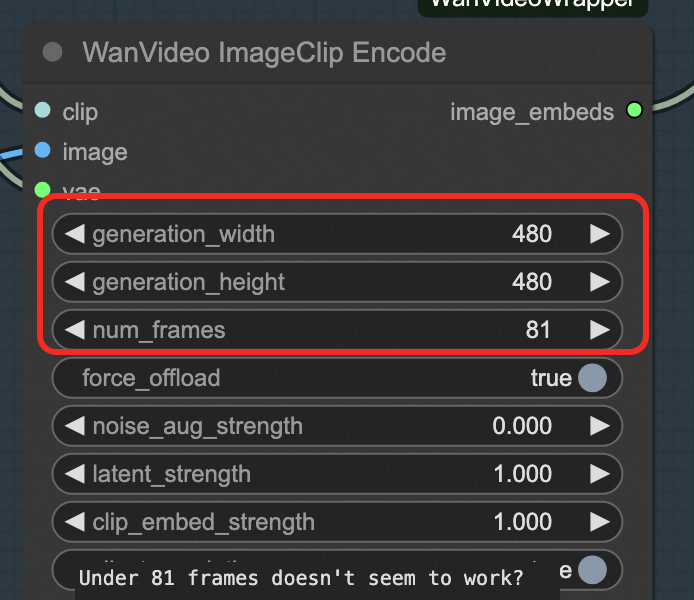

## Model Introduction

Wan2.1-T2V-14B is a powerful text-to-video generation model that can generate high-quality video content given text prompts. This model has the following characteristics:

### Core Features
- **Parameter Scale**: 14B
- **Advanced Architecture**: Combines diffusion transformer architecture with Variational Autoencoder (VAE)
- **Memory Optimization**: Uses FP8 quantization technology for efficient generation with limited GPU memory
- **Multi-language Support**: Supports Chinese and English text prompts
- **Complex Scene Understanding**: Can process complex text descriptions and generate realistic video scenes

### Technical Specifications
- **Model Type**: Text-to-Video Generation
- **Quantization**: FP8 quantized version
- **Maximum Frames**: 81 frames
- **Recommended Frame Rate**: 16fps

## Usage Instructions

### Method 1: ComfyUI Interface

1. **Access Interface**: Click the access link at the service instance. 
2. Follow the guidance in the image to select the workflow sidebar, choose wanx-21.json or wans.json and open it. 
2. Select text-to-video at the location shown in the image below. 
3. Fill in description words at TextEncode. The upper part is the content you want to generate, and the lower part is the content you don't want to generate. 
4. You can set the image resolution and frame count at ImageClip Encode. 
5. For other parameters, refer to the official website: https://comfyui-wiki.com/zh/interface/node-options or the following documentation: https://github.com/kijai/ComfyUI-WanVideoWrapper/blob/main/readme.md

#### ComfyUI API Call Example
Click the button in the upper right corner, open the bottom panel, and get the token: 
For COMFYUI_SERVER acquisition, refer to: 
<details>
<summary>Click to expand API call Python code</summary>

```python
import requests, json, uuid, time, random

# Configuration parameters
COMFYUI_SERVER, COMFYUI_TOKEN = "Enter your server address", "Enter your token"
T5_MODEL, VIDEO_MODEL, VAE_MODEL = "wan2.1/umt5-xxl-enc-bf16.safetensors", "Wan2_1-T2V-14B_fp8_e4m3fn.safetensors", "wan2.1/Wan2_1_VAE_bf16.safetensors"

class ComfyUIClient:
    def __init__(self, server=COMFYUI_SERVER, token=COMFYUI_TOKEN):
        self.base_url, self.token, self.client_id = f"http://{server}", token, str(uuid.uuid4())
        self.headers = {"Content-Type": "application/json", **({"Authorization": f"Bearer {token}"} if token else {})}

    def generate(self, prompt, neg_prompt="", steps=15, cfg=6, width=832, height=480, frames=81):
        workflow = {
            "1": {"inputs": {"model_name": T5_MODEL, "precision": "bf16"}, "class_type": "LoadWanVideoT5TextEncoder"},
            "2": {"inputs": {"positive_prompt": prompt, "negative_prompt": neg_prompt, "force_offload": True, "t5": ["1", 0]}, "class_type": "WanVideoTextEncode"},
            "3": {"inputs": {"model": VIDEO_MODEL, "base_precision": "bf16", "quantization": "fp8_e4m3fn", "load_device": "offload_device"}, "class_type": "WanVideoModelLoader"},
            "4": {"inputs": {"width": width, "height": height, "num_frames": frames}, "class_type": "WanVideoEmptyEmbeds"},
            "5": {"inputs": {"model_name": VAE_MODEL, "precision": "bf16"}, "class_type": "WanVideoVAELoader"},
            "6": {"inputs": {"steps": steps, "cfg": cfg, "shift": 5, "seed": random.randint(1, 1000000), "force_offload": True, "scheduler": "dpm++", "riflex_freq_index": 0, "model": ["3", 0], "text_embeds": ["2", 0], "image_embeds": ["4", 0]}, "class_type": "WanVideoSampler"},
            "7": {"inputs": {"enable_vae_tiling": True, "tile_x": 272, "tile_y": 272, "tile_stride_x": 144, "tile_stride_y": 128, "vae": ["5", 0], "samples": ["6", 0]}, "class_type": "WanVideoDecode"},
            "8": {"inputs": {"frame_rate": 16, "loop_count": 0, "filename_prefix": "generated_video", "format": "video/h264-mp4", "save_output": True, "pingpong": False, "images": ["7", 0]}, "class_type": "VHS_VideoCombine"}
        }
        response = requests.post(f"{self.base_url}/prompt", headers=self.headers, json={"prompt": workflow, "client_id": self.client_id})
        print(f"API Response: {response.text}")
        result = response.json()
        if "prompt_id" not in result: raise Exception(f"No prompt_id in response: {result}")
        return result["prompt_id"]

    def get_status(self, task_id):
        queue_data = requests.get(f"{self.base_url}/queue", headers=self.headers).json()
        if any(item[1] == task_id for item in queue_data.get("queue_running", [])): return "processing"
        if any(item[1] == task_id for item in queue_data.get("queue_pending", [])): return "pending"
        history_response = requests.get(f"{self.base_url}/history/{task_id}", headers=self.headers)
        return "completed" if history_response.status_code == 200 and task_id in history_response.json() else "processing"

    def download_video(self, task_id, output_path="generated_video.mp4"):
        response = requests.get(f"{self.base_url}/history/{task_id}", headers=self.headers)
        history = response.json()
        if task_id in history:
            for output in history[task_id]['outputs'].values():
                if 'gifs' in output:
                    filename = output['gifs'][0]['filename']
                    video_response = requests.get(f"{self.base_url}/view?filename={filename}", headers=self.headers)
                    with open(output_path, "wb") as f: f.write(video_response.content)
                    return output_path
        return None

def main():
    client = ComfyUIClient()
    try:
        task_id = client.generate("A beautiful anime girl with long black hair dancing gracefully", "low quality, blurry, distorted", 15, 6, 832, 480, 81)
        print(f"Task ID: {task_id}")
        while True:
            status = client.get_status(task_id)
            print(f"Current status: {status}")
            if status == "completed": print("Video ready!"); break
            elif status == "failed": print("Generation failed!"); exit(1)
            time.sleep(10)
        output_file = client.download_video(task_id, "generated_video.mp4")
        print("Video downloaded successfully!" if output_file else "Failed to download video")
        if output_file: print(f"Saved as: {output_file}")
    except Exception as e: print(f"Error: {e}")

if __name__ == "__main__": main()
```
</details>

## Related Resources

- [ComfyUI Official Documentation](https://comfyui-wiki.com/zh/interface/node-options)
- [WanVideo Plugin Documentation](https://github.com/kijai/ComfyUI-WanVideoWrapper/blob/main/readme.md)