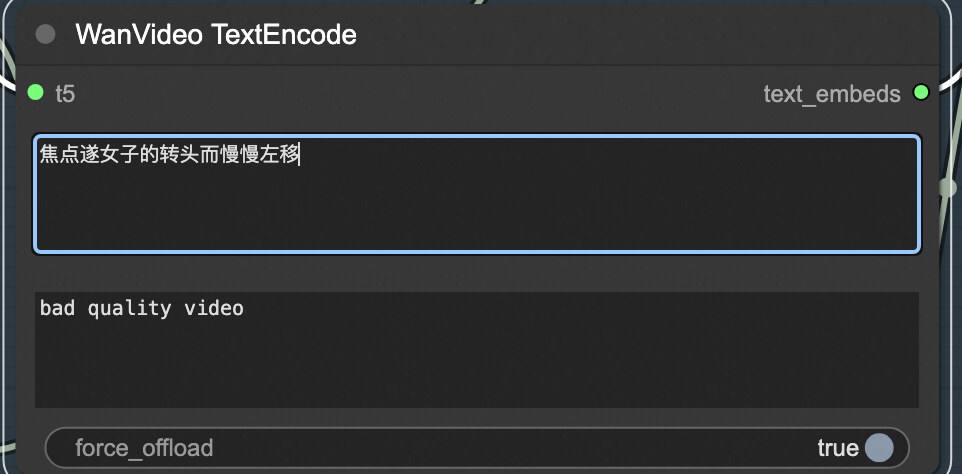

<div style="background: linear-gradient(135deg, #2563eb, #1e40af); padding: 24px; border-radius: 8px; color: white; text-align: center; margin-bottom: 24px;">
  <h1 style="font-size: 2.5em; margin: 0; font-weight: 600;">🎬 Wan2.1-T2V-14B Text-to-Video Model</h1>
  <p style="font-size: 1.2em; margin: 16px 0 0 0; opacity: 0.9;">Transform Words into Cinematic Magic! Revolutionary AI-powered video generation</p>
  <div style="margin-top: 20px;">
    <span style="background: rgba(255,255,255,0.2); color: white; padding: 4px 12px; border-radius: 12px; font-size: 14px; margin: 0 8px;">🧠 14B Parameters</span>
    <span style="background: rgba(255,255,255,0.2); color: white; padding: 4px 12px; border-radius: 12px; font-size: 14px; margin: 0 8px;">🎯 High Quality</span>
    <span style="background: rgba(255,255,255,0.2); color: white; padding: 4px 12px; border-radius: 12px; font-size: 14px; margin: 0 8px;">⚡ Professional</span>
  </div>
</div>

## 🌟 Model Introduction

<div style="background: #f8fafc; border: 1px solid #e2e8f0; border-radius: 8px; padding: 20px; margin: 16px 0;">

**Wan2.1-T2V-14B** is a groundbreaking text-to-video generation model that creates stunning, high-quality video content from simple text descriptions. Whether for creative expression or commercial applications, this model opens up infinite possibilities for content creation!

</div>

## ✨ Core Features

<div style="display: grid; grid-template-columns: repeat(auto-fit, minmax(280px, 1fr)); gap: 16px; margin: 16px 0;">

<div style="background: #eff6ff; border-left: 4px solid #2563eb; padding: 16px; border-radius: 4px;">
<h4 style="color: #1e40af; margin: 0 0 8px 0;">🧠 Massive Parameter Scale</h4>
<p style="margin: 0; color: #1e40af;">14B parameters delivering exceptional understanding and generation capabilities</p>
</div>

<div style="background: #fef2f2; border-left: 4px solid #dc2626; padding: 16px; border-radius: 4px;">
<h4 style="color: #dc2626; margin: 0 0 8px 0;">🏗️ Advanced Architecture</h4>
<p style="margin: 0; color: #991b1b;">Cutting-edge Diffusion Transformer + VAE technology</p>
</div>

<div style="background: #f0fdf4; border-left: 4px solid #059669; padding: 16px; border-radius: 4px;">
<h4 style="color: #059669; margin: 0 0 8px 0;">⚡ Memory Optimization</h4>
<p style="margin: 0; color: #065f46;">FP8 quantization for efficient GPU utilization</p>
</div>

<div style="background: #f5f3ff; border-left: 4px solid #7c3aed; padding: 16px; border-radius: 4px;">
<h4 style="color: #7c3aed; margin: 0 0 8px 0;">🌍 Multi-language Support</h4>
<p style="margin: 0; color: #5b21b6;">Seamless Chinese and English text processing</p>
</div>

<div style="background: #fff7ed; border-left: 4px solid #ea580c; padding: 16px; border-radius: 4px;">
<h4 style="color: #ea580c; margin: 0 0 8px 0;">🎭 Complex Scene Understanding</h4>
<p style="margin: 0; color: #9a3412;">Deep text comprehension for realistic scene generation</p>
</div>

<div style="background: #ecfdf5; border-left: 4px solid #10b981; padding: 16px; border-radius: 4px;">
<h4 style="color: #10b981; margin: 0 0 8px 0;">🎥 Professional Quality</h4>
<p style="margin: 0; color: #047857;">Cinema-grade video quality, ready for commercial use</p>
</div>

</div>

## 🔧 Technical Specifications

<div style="overflow-x: auto; margin: 16px 0;">
<table style="width: 100%; border-collapse: collapse; background: white; border-radius: 6px; overflow: hidden; box-shadow: 0 1px 3px rgba(0,0,0,0.1);">
  <thead style="background: #f8fafc;">
    <tr>
      <th style="padding: 12px; text-align: left; border-bottom: 1px solid #e2e8f0; color: #1e40af; font-weight: 600;">Specification</th>
      <th style="padding: 12px; text-align: left; border-bottom: 1px solid #e2e8f0; color: #1e40af; font-weight: 600;">Details</th>
    </tr>
  </thead>
  <tbody>
    <tr>
      <td style="padding: 12px; border-bottom: 1px solid #f1f5f9; font-weight: 500;">Model Type</td>
      <td style="padding: 12px; border-bottom: 1px solid #f1f5f9;">Text-to-Video Generation</td>
    </tr>
    <tr>
      <td style="padding: 12px; border-bottom: 1px solid #f1f5f9; font-weight: 500;">Parameters</td>
      <td style="padding: 12px; border-bottom: 1px solid #f1f5f9;">14B</td>
    </tr>
    <tr>
      <td style="padding: 12px; border-bottom: 1px solid #f1f5f9; font-weight: 500;">Quantization</td>
      <td style="padding: 12px; border-bottom: 1px solid #f1f5f9;">FP8 Quantized Version</td>
    </tr>
    <tr>
      <td style="padding: 12px; border-bottom: 1px solid #f1f5f9; font-weight: 500;">Maximum Frames</td>
      <td style="padding: 12px; border-bottom: 1px solid #f1f5f9;">81 frames</td>
    </tr>
    <tr>
      <td style="padding: 12px; border-bottom: 1px solid #f1f5f9; font-weight: 500;">Recommended Frame Rate</td>
      <td style="padding: 12px; border-bottom: 1px solid #f1f5f9;">16fps</td>
    </tr>
    <tr>
      <td style="padding: 12px; border-bottom: 1px solid #f1f5f9; font-weight: 500;">Recommended Steps</td>
      <td style="padding: 12px; border-bottom: 1px solid #f1f5f9;">15-25</td>
    </tr>
    <tr>
      <td style="padding: 12px; border-bottom: 1px solid #f1f5f9; font-weight: 500;">VRAM Requirements</td>
      <td style="padding: 12px; border-bottom: 1px solid #f1f5f9;">12GB+</td>
    </tr>
    <tr>
      <td style="padding: 12px; font-weight: 500;">Output Format</td>
      <td style="padding: 12px;">MP4 (H.264)</td>
    </tr>
  </tbody>
</table>
</div>

---

# 📖 Usage Guide

## 🌐 Method 1: ComfyUI Visual Interface

<div style="background: #f8fafc; border: 1px solid #e2e8f0; border-radius: 8px; padding: 20px; margin: 16px 0;">

### 🚀 Quick Start Guide

**Step 1: Access Interface**  
Click the access link at the service instance

<div style="text-align: center; margin: 16px 0;">
  
</div>

**Step 2: Select Workflow**  
Follow the guidance to select the workflow sidebar, choose `wanx-21.json` or `wans.json` and open it

**Step 3: Choose Function**  
Select text-to-video at the designated location

**Step 4: Write Prompts**  
Fill in description words at TextEncode

<div style="display: grid; grid-template-columns: 1fr 1fr; gap: 16px; margin: 16px 0;">

<div style="background: #f0fdf4; border-left: 4px solid #059669; padding: 16px; border-radius: 4px;">
<h4 style="color: #059669; margin: 0 0 8px 0;">✅ Upper Section</h4>
<p style="margin: 0; color: #065f46;">Content you want to generate</p>
</div>

<div style="background: #fff7ed; border-left: 4px solid #ea580c; padding: 16px; border-radius: 4px;">
<h4 style="color: #ea580c; margin: 0 0 8px 0;">❌ Lower Section</h4>
<p style="margin: 0; color: #9a3412;">Content you don't want to generate</p>
</div>

</div>

<div style="text-align: center; margin: 16px 0;">
  
</div>

**Step 5: Configure Settings**  
Set image resolution and frame count at ImageClip Encode

<div style="text-align: center; margin: 16px 0;">
  
</div>

### 📚 Additional Resources
- [ComfyUI Official Documentation](https://comfyui-wiki.com/zh/interface/node-options)
- [WanVideo Plugin Detailed Guide](https://github.com/kijai/ComfyUI-WanVideoWrapper/blob/main/readme.md)

</div>

## 🔌 Method 2: API Integration

### 🔑 Authentication Setup

<div style="display: grid; grid-template-columns: 1fr 1fr; gap: 16px; margin: 16px 0;">

<div style="background: #fff7ed; border-left: 4px solid #ea580c; padding: 16px; border-radius: 4px;">
<h4 style="color: #ea580c; margin: 0 0 8px 0;">🎫 Get Token</h4>
<p style="margin: 0 0 12px 0;">Click the button in the upper right corner, open the bottom panel to get token</p>
<div style="text-align: center; padding: 12px; background: #f8fafc; border-radius: 6px;">
  
</div>
</div>

<div style="background: #eff6ff; border-left: 4px solid #2563eb; padding: 16px; border-radius: 4px;">
<h4 style="color: #2563eb; margin: 0 0 8px 0;">🌐 Get Server Address</h4>
<p style="margin: 0 0 12px 0;">For COMFYUI_SERVER acquisition, refer to:</p>
<div style="text-align: center; padding: 12px; background: #f8fafc; border-radius: 6px;">
  
</div>
</div>

</div>

### 💻 Python Implementation

<details style="border: 2px solid #2563eb; border-radius: 12px; padding: 20px; margin: 20px 0; background: linear-gradient(145deg, #f8fafc, #eff6ff); box-shadow: 0 8px 16px rgba(37, 99, 235, 0.15);">
<summary style="font-weight: bold; font-size: 18px; color: white; cursor: pointer; padding: 16px; background: linear-gradient(135deg, #2563eb, #1e40af); border-radius: 8px; margin: -20px -20px 20px -20px; text-shadow: 1px 1px 2px rgba(0,0,0,0.2); transition: all 0.3s ease; display: flex; align-items: center; box-shadow: 0 4px 8px rgba(37, 99, 235, 0.3);">
🐍 Click to Expand Complete Python API Code
</summary>

```python
import requests, json, uuid, time, random

# 🔧 Configuration parameters
COMFYUI_SERVER, COMFYUI_TOKEN = "Enter your server address", "Enter your token"
T5_MODEL = "wan2.1/umt5-xxl-enc-bf16.safetensors"
VIDEO_MODEL = "Wan2_1-T2V-14B_fp8_e4m3fn.safetensors"
VAE_MODEL = "wan2.1/Wan2_1_VAE_bf16.safetensors"

class ComfyUIClient:
    """🎬 ComfyUI Video Generation Client"""
    
    def __init__(self, server=COMFYUI_SERVER, token=COMFYUI_TOKEN):
        self.base_url = f"http://{server}"
        self.token = token
        self.client_id = str(uuid.uuid4())
        self.headers = {
            "Content-Type": "application/json",
            **({"Authorization": f"Bearer {token}"} if token else {})
        }

    def generate_t2v(self, prompt, neg_prompt="", steps=15, cfg=6, width=832, height=480, frames=81):
        """
        🎥 Generate Video
        
        Args:
            prompt (str): Positive prompt
            neg_prompt (str): Negative prompt
            steps (int): Inference steps
            cfg (float): CFG guidance strength
            width (int): Video width
            height (int): Video height
            frames (int): Number of frames
        
        Returns:
            str: Task ID
        """
        print(f"🎬 Starting text-to-video generation task...")
        print(f"📝 Prompt: {prompt}")
        
        workflow = {
            "1": {
                "inputs": {
                    "model_name": T5_MODEL,
                    "precision": "bf16",
                    "load_device": "offload_device",
                    "quantization": "disabled"
                },
                "class_type": "LoadWanVideoT5TextEncoder"
            },
            "2": {
                "inputs": {
                    "positive_prompt": prompt,
                    "negative_prompt": neg_prompt,
                    "force_offload": True,
                    "t5": ["1", 0]
                },
                "class_type": "WanVideoTextEncode"
            },
            "3": {
                "inputs": {
                    "model": VIDEO_MODEL,
                    "base_precision": "bf16",
                    "quantization": "fp8_e4m3fn",
                    "load_device": "offload_device",
                    "attention_mode": "sageattn"
                },
                "class_type": "WanVideoModelLoader"
            },
            "4": {
                "inputs": {
                    "width": width,
                    "height": height,
                    "num_frames": frames
                },
                "class_type": "WanVideoEmptyEmbeds"
            },
            "5": {
                "inputs": {
                    "model_name": VAE_MODEL,
                    "precision": "bf16"
                },
                "class_type": "WanVideoVAELoader"
            },
            "6": {
                "inputs": {
                    "steps": steps,
                    "cfg": cfg,
                    "shift": 5,
                    "seed": random.randint(1, 1000000),
                    "force_offload": True,
                    "scheduler": "dpm++",
                    "riflex_freq_index": 0,
                    "denoise_strength": 1,
                    "batched_cfg": False,
                    "rope_function": "comfy",
                    "model": ["3", 0],
                    "text_embeds": ["2", 0],
                    "image_embeds": ["4", 0]
                },
                "class_type": "WanVideoSampler"
            },
            "7": {
                "inputs": {
                    "enable_vae_tiling": True,
                    "tile_x": 272,
                    "tile_y": 272,
                    "tile_stride_x": 144,
                    "tile_stride_y": 128,
                    "vae": ["5", 0],
                    "samples": ["6", 0]
                },
                "class_type": "WanVideoDecode"
            },
            "8": {
                "inputs": {
                    "frame_rate": 16,
                    "loop_count": 0,
                    "filename_prefix": "T2V_14B_generated",
                    "format": "video/h264-mp4",
                    "pix_fmt": "yuv420p",
                    "crf": 19,
                    "save_metadata": True,
                    "trim_to_audio": False,
                    "pingpong": False,
                    "save_output": True,
                    "images": ["7", 0]
                },
                "class_type": "VHS_VideoCombine"
            }
        }
        
        print("🚀 Submitting video generation task...")
        response = requests.post(
            f"{self.base_url}/prompt",
            headers=self.headers,
            json={"prompt": workflow, "client_id": self.client_id}
        )
        
        print(f"📡 API Response: {response.text}")
        result = response.json()
        
        if "error" in result:
            raise Exception(f"❌ Workflow error: {result['error']}")
        
        if "prompt_id" not in result:
            raise Exception(f"❌ No prompt_id in response: {result}")
        
        return result["prompt_id"]

    def get_status(self, task_id):
        """📊 Get task status"""
        try:
            queue_data = requests.get(f"{self.base_url}/queue", headers=self.headers).json()
            
            # Check if in running queue
            if any(item[1] == task_id for item in queue_data.get("queue_running", [])):
                return "processing"
            
            # Check if in pending queue
            if any(item[1] == task_id for item in queue_data.get("queue_pending", [])):
                return "pending"
            
            # Check history
            history_response = requests.get(f"{self.base_url}/history/{task_id}", headers=self.headers)
            if history_response.status_code == 200 and task_id in history_response.json():
                return "completed"
            
            return "processing"
        except:
            return "processing"

    def download_video(self, task_id, output_path="t2v_14b_generated.mp4"):
        """📥 Download generated video"""
        try:
            response = requests.get(f"{self.base_url}/history/{task_id}", headers=self.headers)
            history = response.json()
            
            if task_id in history:
                for output in history[task_id]['outputs'].values():
                    if 'gifs' in output:
                        filename = output['gifs'][0]['filename']
                        video_response = requests.get(
                            f"{self.base_url}/view?filename={filename}",
                            headers=self.headers
                        )
                        
                        with open(output_path, "wb") as f:
                            f.write(video_response.content)
                        
                        return output_path
            
            return None
        except Exception as e:
            print(f"❌ Download error: {e}")
            return None

def main():
    """🎬 Main function - Video generation example"""
    client = ComfyUIClient()
    
    try:
        print("🎭 Starting text-to-video generation task...")
        
        # 🎨 Example prompts
        prompt = "A beautiful anime girl with long black hair dancing gracefully in a cherry blossom garden, soft lighting, cinematic quality, high detail, smooth animation"
        neg_prompt = "low quality, blurry, distorted, bad anatomy, static, choppy animation, artifacts"
        
        print(f"📝 Prompt: {prompt}")
        print(f"🚫 Negative prompt: {neg_prompt}")
        
        # 🚀 Submit generation task
        task_id = client.generate_t2v(
            prompt=prompt,
            neg_prompt=neg_prompt,
            steps=20,
            cfg=7,
            width=832,
            height=480,
            frames=81
        )
        
        print(f"🆔 Task ID: {task_id}")
        
        # 📊 Monitor task status
        while True:
            status = client.get_status(task_id)
            print(f"📈 Current status: {status}")
            
            if status == "completed":
                print("✅ Video generation completed!")
                break
            elif status == "failed":
                print("❌ Generation failed!")
                exit(1)
            
            time.sleep(10)
        
        # 📥 Download video
        output_file = client.download_video(task_id, "my_t2v_14b_video.mp4")
        
        if output_file:
            print("🎉 Video downloaded successfully!")
            print(f"📁 Saved as: {output_file}")
        else:
            print("❌ Failed to download video!")
            
    except Exception as e:
        print(f"💥 Error occurred: {e}")

if __name__ == "__main__":
    main()
```

</details>

---

# 🎯 Creative Tips & Best Practices

## ✍️ Prompt Writing Guide

<div style="display: grid; grid-template-columns: 1fr 1fr; gap: 16px; margin: 16px 0;">

<div style="background: #f0fdf4; border-left: 4px solid #059669; padding: 16px; border-radius: 4px;">
<h4 style="color: #059669; margin: 0 0 8px 0;">✅ Positive Prompt Tips</h4>
<ul style="margin: 0; padding-left: 20px; color: #065f46;">
  <li><strong>Detailed Description</strong>: Describe scenes, characters, and actions in detail</li>
  <li><strong>Style Specification</strong>: Add artistic styles and lighting effects</li>
  <li><strong>Quality Keywords</strong>: Use "high quality", "cinematic", etc.</li>
  <li><strong>Motion Description</strong>: Clearly specify desired dynamic effects</li>
</ul>
</div>

<div style="background: #fff7ed; border-left: 4px solid #ea580c; padding: 16px; border-radius: 4px;">
<h4 style="color: #ea580c; margin: 0 0 8px 0;">❌ Negative Prompt Suggestions</h4>
<ul style="margin: 0; padding-left: 20px; color: #9a3412;">
  <li><strong>Quality Control</strong>: "low quality", "blurry", "distorted"</li>
  <li><strong>Avoid Static</strong>: "static", "motionless", "frozen"</li>
  <li><strong>Anatomical Accuracy</strong>: "bad anatomy", "deformed"</li>
  <li><strong>Technical Issues</strong>: "artifacts", "noise", "compression"</li>
</ul>
</div>

</div>

## 🎨 Creative Examples

<div style="background: #f8fafc; border: 1px solid #e2e8f0; border-radius: 8px; padding: 20px; margin: 16px 0;">

**🌸 Anime Style**
```
A beautiful anime girl with flowing pink hair dancing in a field of cherry blossoms, 
soft wind, petals falling, golden hour lighting, studio ghibli style, high quality
```

**🏙️ Sci-Fi Scene**
```
Futuristic cityscape at night, neon lights reflecting on wet streets, 
flying cars in the distance, cyberpunk aesthetic, cinematic composition
```

**🌊 Natural Landscape**
```
Majestic waterfall cascading down moss-covered rocks, rainbow mist, 
lush green forest, birds flying, peaceful atmosphere, 4K quality
```

**🎭 Fantasy Adventure**
```
Epic dragon soaring through stormy clouds, lightning illuminating its scales, 
medieval castle below, dramatic atmosphere, fantasy art style
```

</div>

## 🎛️ Parameter Optimization Guide

<div style="display: grid; grid-template-columns: repeat(auto-fit, minmax(280px, 1fr)); gap: 16px; margin: 16px 0;">

<div style="background: #eff6ff; border-left: 4px solid #2563eb; padding: 16px; border-radius: 4px;">
<h4 style="color: #1e40af; margin: 0 0 8px 0;">🔢 Steps Configuration</h4>
<ul style="margin: 0; padding-left: 20px; color: #1e40af;">
  <li><strong>10-15 steps</strong>: Fast generation, good for testing</li>
  <li><strong>15-20 steps</strong>: Balanced quality and speed</li>
  <li><strong>20-30 steps</strong>: High quality, longer processing time</li>
</ul>
</div>

<div style="background: #f5f3ff; border-left: 4px solid #7c3aed; padding: 16px; border-radius: 4px;">
<h4 style="color: #7c3aed; margin: 0 0 8px 0;">🎯 CFG Settings</h4>
<ul style="margin: 0; padding-left: 20px; color: #5b21b6;">
  <li><strong>4-6</strong>: More creative, less adherence to prompt</li>
  <li><strong>6-8</strong>: Balanced guidance (recommended)</li>
  <li><strong>8-12</strong>: Strong prompt adherence</li>
</ul>
</div>

<div style="background: #f0fdf4; border-left: 4px solid #059669; padding: 16px; border-radius: 4px;">
<h4 style="color: #059669; margin: 0 0 8px 0;">📐 Resolution Options</h4>
<ul style="margin: 0; padding-left: 20px; color: #065f46;">
  <li><strong>512x512</strong>: Square format, fast generation</li>
  <li><strong>832x480</strong>: Widescreen, cinematic feel</li>
  <li><strong>Custom</strong>: Adjust based on your needs</li>
</ul>
</div>

</div>

---

# 🎪 Application Scenarios

<div style="display: grid; grid-template-columns: repeat(auto-fit, minmax(280px, 1fr)); gap: 16px; margin: 16px 0;">

<div style="background: #fef2f2; border-left: 4px solid #dc2626; padding: 16px; border-radius: 4px; text-align: center;">
<div style="font-size: 2.5em; margin-bottom: 12px; color: #dc2626;">🎬</div>
<h4 style="margin: 0 0 8px 0; color: #dc2626;">Content Creation</h4>
<p style="margin: 0; color: #991b1b;">Social media videos, marketing content, storytelling</p>
</div>

<div style="background: #ecfdf5; border-left: 4px solid #10b981; padding: 16px; border-radius: 4px; text-align: center;">
<div style="font-size: 2.5em; margin-bottom: 12px; color: #10b981;">🎨</div>
<h4 style="margin: 0 0 8px 0; color: #10b981;">Artistic Expression</h4>
<p style="margin: 0; color: #047857;">Digital art, creative projects, visual experiments</p>
</div>

<div style="background: #fff7ed; border-left: 4px solid #ea580c; padding: 16px; border-radius: 4px; text-align: center;">
<div style="font-size: 2.5em; margin-bottom: 12px; color: #ea580c;">📚</div>
<h4 style="margin: 0 0 8px 0; color: #ea580c;">Educational Content</h4>
<p style="margin: 0; color: #9a3412;">Learning materials, demonstrations, tutorials</p>
</div>

<div style="background: #f0fdf4; border-left: 4px solid #059669; padding: 16px; border-radius: 4px; text-align: center;">
<div style="font-size: 2.5em; margin-bottom: 12px; color: #059669;">🚀</div>
<h4 style="margin: 0 0 8px 0; color: #059669;">Prototyping</h4>
<p style="margin: 0; color: #065f46;">Concept visualization, storyboarding, idea development</p>
</div>

</div>

---

# 📚 Resources & Documentation

<div style="display: grid; grid-template-columns: repeat(auto-fit, minmax(280px, 1fr)); gap: 16px; margin: 16px 0;">

<div style="background: #f8fafc; border: 1px solid #e2e8f0; border-radius: 8px; padding: 20px;">
<h4 style="margin-top: 0; color: #1e40af;">📖 ComfyUI Official Docs</h4>
<a href="https://comfyui-wiki.com/zh/interface/node-options" style="color: #2563eb; text-decoration: none; font-weight: 500;">View Detailed Guide →</a>
<p style="margin-top: 8px; color: #64748b; font-size: 14px;">ComfyUI interface operations and node configuration guide</p>
</div>

<div style="background: #f8fafc; border: 1px solid #e2e8f0; border-radius: 8px; padding: 20px;">
<h4 style="margin-top: 0; color: #1e40af;">🎥 WanVideo Plugin Docs</h4>
<a href="https://github.com/kijai/ComfyUI-WanVideoWrapper/blob/main/readme.md" style="color: #2563eb; text-decoration: none; font-weight: 500;">GitHub Repository →</a>
<p style="margin-top: 8px; color: #64748b; font-size: 14px;">WanVideo plugin installation and usage instructions</p>
</div>

<div style="background: #f8fafc; border: 1px solid #e2e8f0; border-radius: 8px; padding: 20px;">
<h4 style="margin-top: 0; color: #1e40af;">🔧 Technical Documentation</h4>
<a href="https://docs.comfy.org/video/advanced_techniques" style="color: #2563eb; text-decoration: none; font-weight: 500;">Advanced Techniques Guide →</a>
<p style="margin-top: 8px; color: #64748b; font-size: 14px;">Advanced techniques and optimization methods for video generation</p>
</div>

<div style="background: #f8fafc; border: 1px solid #e2e8f0; border-radius: 8px; padding: 20px;">
<h4 style="margin-top: 0; color: #1e40af;">💡 Best Practices</h4>
<a href="https://github.com/WanVideo/best-practices" style="color: #2563eb; text-decoration: none; font-weight: 500;">Creation Guide →</a>
<p style="margin-top: 8px; color: #64748b; font-size: 14px;">Professional video creation tips and experience sharing</p>
</div>

</div>

---

<div style="text-align: center; padding: 16px; background: #f8fafc; border-radius: 6px; margin-top: 24px;">
  <p style="margin: 0; color: #64748b; font-size: 14px;">
    🎬 <strong>Start Your Video Creation Journey!</strong> | Transform your ideas into stunning videos with Wan2.1-T2V-14B
  </p>
</div>