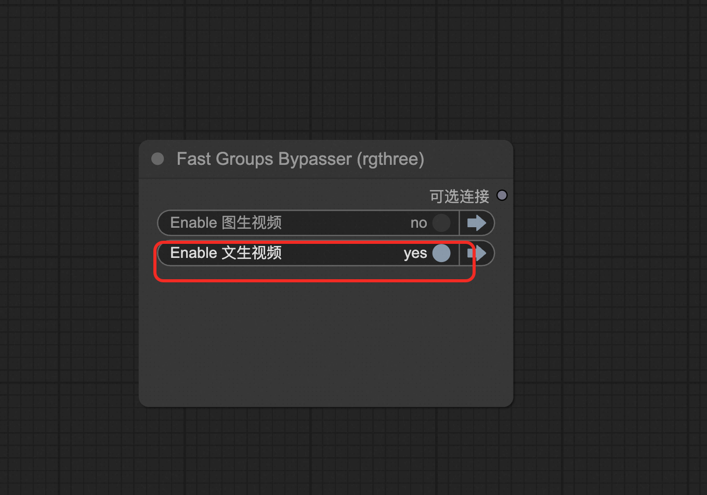

# 🎬 Wan2.1-T2V-14B 文本生视频模型

> 🚀 从文字到视频，让想象力成为现实！强大的AI视频生成引擎，只需一句话就能创造精彩视频内容。

---

## 🌟 模型简介

**Wan2.1-T2V-14B** 是一个革命性的文本到视频生成模型，能够在给定文本提示的情况下生成令人惊叹的高质量视频内容。无论是创意表达还是商业应用，都能为您带来无限可能！

### ✨ 核心特性

<div style="display: grid; grid-template-columns: repeat(auto-fit, minmax(280px, 1fr)); gap: 25px; margin: 30px 0;">

<div style="background: linear-gradient(135deg, #667eea 0%, #764ba2 100%); padding: 25px; border-radius: 15px; color: white; text-align: center; box-shadow: 0 10px 20px rgba(102, 126, 234, 0.3); transform: translateY(0); transition: transform 0.3s ease;">
<h4 style="margin: 0 0 15px 0; font-size: 18px;">🧠 强大参数规模</h4>
<p style="margin: 0; font-size: 16px; opacity: 0.9;">14B参数量，提供卓越的理解和生成能力</p>
</div>

<div style="background: linear-gradient(135deg, #f093fb 0%, #f5576c 100%); padding: 25px; border-radius: 15px; color: white; text-align: center; box-shadow: 0 10px 20px rgba(240, 147, 251, 0.3); transform: translateY(0); transition: transform 0.3s ease;">
<h4 style="margin: 0 0 15px 0; font-size: 18px;">🏗️ 先进架构</h4>
<p style="margin: 0; font-size: 16px; opacity: 0.9;">扩散变换器 + VAE，技术领先</p>
</div>

<div style="background: linear-gradient(135deg, #4facfe 0%, #00f2fe 100%); padding: 25px; border-radius: 15px; color: white; text-align: center; box-shadow: 0 10px 20px rgba(79, 172, 254, 0.3); transform: translateY(0); transition: transform 0.3s ease;">
<h4 style="margin: 0 0 15px 0; font-size: 18px;">⚡ 内存优化</h4>
<p style="margin: 0; font-size: 16px; opacity: 0.9;">FP8量化技术，高效GPU利用</p>
</div>

<div style="background: linear-gradient(135deg, #43e97b 0%, #38f9d7 100%); padding: 25px; border-radius: 15px; color: white; text-align: center; box-shadow: 0 10px 20px rgba(67, 233, 123, 0.3); transform: translateY(0); transition: transform 0.3s ease;">
<h4 style="margin: 0 0 15px 0; font-size: 18px;">🌍 多语言支持</h4>
<p style="margin: 0; font-size: 16px; opacity: 0.9;">中英文双语，无障碍创作</p>
</div>

<div style="background: linear-gradient(135deg, #fa709a 0%, #fee140 100%); padding: 25px; border-radius: 15px; color: white; text-align: center; box-shadow: 0 10px 20px rgba(250, 112, 154, 0.3); transform: translateY(0); transition: transform 0.3s ease;">
<h4 style="margin: 0 0 15px 0; font-size: 18px;">🎭 复杂场景理解</h4>
<p style="margin: 0; font-size: 16px; opacity: 0.9;">深度理解文本，生成逼真场景</p>
</div>

</div>

### 🔧 技术规格

<div style="background: linear-gradient(145deg, #f0f8ff, #e6f3ff); border: 3px solid #2196F3; border-radius: 20px; padding: 30px; margin: 30px 0; box-shadow: 0 15px 30px rgba(33, 150, 243, 0.2);">

<div style="display: grid; grid-template-columns: repeat(auto-fit, minmax(200px, 1fr)); gap: 20px;">

<div style="text-align: center; padding: 15px;">
<div style="font-size: 24px; margin-bottom: 10px;">🤖</div>
<strong>模型类型</strong><br>
<span style="color: #2196F3;">文本到视频生成</span>
</div>

<div style="text-align: center; padding: 15px;">
<div style="font-size: 24px; margin-bottom: 10px;">⚡</div>
<strong>量化方式</strong><br>
<span style="color: #2196F3;">FP8量化版本</span>
</div>

<div style="text-align: center; padding: 15px;">
<div style="font-size: 24px; margin-bottom: 10px;">🎞️</div>
<strong>最大帧数</strong><br>
<span style="color: #2196F3;">81帧</span>
</div>

<div style="text-align: center; padding: 15px;">
<div style="font-size: 24px; margin-bottom: 10px;">🎬</div>
<strong>推荐帧率</strong><br>
<span style="color: #2196F3;">16fps</span>
</div>

</div>

</div>

---

## 📖 使用指南

### 🌐 方式一：ComfyUI 可视化界面

<div style="background: linear-gradient(135deg, #ffecd2 0%, #fcb69f 100%); border-radius: 20px; padding: 30px; margin: 25px 0; box-shadow: 0 10px 20px rgba(255, 236, 210, 0.4);">

#### 🚀 快速开始

<div style="background: rgba(255, 255, 255, 0.3); border-radius: 12px; padding: 20px; margin: 20px 0;">

**步骤 1：访问界面**  
单击服务实例处的访问链接


**步骤 2：选择工作流**  
按图中指引选择工作流侧栏，选择 `wanx-21.json` 或 `wans.json` 并打开


**步骤 3：选择功能**  
在下图处选择文生视频功能


**步骤 4：编写提示词**  
在 TextEncode 处填写描述词
- **上方**：你想要生成的内容 ✅
- **下方**：你不想要生成的内容 ❌


**步骤 5：设置参数**  
在 ImageClip Encode 处可设置图片的分辨率和帧数


</div>

#### 📚 更多参数说明
- [ComfyUI官方文档](https://comfyui-wiki.com/zh/interface/node-options)
- [WanVideo插件详细文档](https://github.com/kijai/ComfyUI-WanVideoWrapper/blob/main/readme.md)

</div>

### 🔌 方式二：API 程序化调用

#### 🔑 获取认证信息

<div style="background-color: #fff3cd; border: 2px solid #ffeaa7; border-radius: 15px; padding: 25px; margin: 25px 0;">

**🎫 获取 Token**  
点击右上方按钮，打开底部面板，获取token


**🌐 获取服务器地址**  
COMFYUI_SERVER 的获取可参考


</div>

#### 💻 Python 代码实现

<details style="border: 3px solid #2196F3; border-radius: 18px; padding: 30px; margin: 30px 0; background: linear-gradient(145deg, #f0f8ff, #e3f2fd); box-shadow: 0 15px 30px rgba(33, 150, 243, 0.3);">
<summary style="font-weight: bold; font-size: 24px; color: white; cursor: pointer; padding: 25px; background: linear-gradient(135deg, #2196F3, #1976D2); border-radius: 15px; margin: -30px -30px 30px -30px; text-shadow: 2px 2px 4px rgba(0,0,0,0.3); transition: all 0.3s ease; display: flex; align-items: center; justify-content: center; box-shadow: 0 8px 16px rgba(33, 150, 243, 0.4);">
🐍 点击展开完整 Python API 代码
</summary>

```python
import requests, json, uuid, time, random

# 🔧 配置参数
COMFYUI_SERVER, COMFYUI_TOKEN = "输入您的服务器地址", "输入您的token"
T5_MODEL = "wan2.1/umt5-xxl-enc-bf16.safetensors"
VIDEO_MODEL = "Wan2_1-T2V-14B_fp8_e4m3fn.safetensors"
VAE_MODEL = "wan2.1/Wan2_1_VAE_bf16.safetensors"

class ComfyUIClient:
    """🎬 ComfyUI 视频生成客户端"""
    
    def __init__(self, server=COMFYUI_SERVER, token=COMFYUI_TOKEN):
        self.base_url = f"http://{server}"
        self.token = token
        self.client_id = str(uuid.uuid4())
        self.headers = {
            "Content-Type": "application/json",
            **({"Authorization": f"Bearer {token}"} if token else {})
        }

    def generate(self, prompt, neg_prompt="", steps=15, cfg=6, width=832, height=480, frames=81):
        """
        🎥 生成视频
        
        Args:
            prompt (str): 正向提示词
            neg_prompt (str): 负向提示词
            steps (int): 推理步数
            cfg (float): CFG引导强度
            width (int): 视频宽度
            height (int): 视频高度
            frames (int): 视频帧数
        
        Returns:
            str: 任务ID
        """
        workflow = {
            "1": {
                "inputs": {
                    "model_name": T5_MODEL,
                    "precision": "bf16"
                },
                "class_type": "LoadWanVideoT5TextEncoder"
            },
            "2": {
                "inputs": {
                    "positive_prompt": prompt,
                    "negative_prompt": neg_prompt,
                    "force_offload": True,
                    "t5": ["1", 0]
                },
                "class_type": "WanVideoTextEncode"
            },
            "3": {
                "inputs": {
                    "model": VIDEO_MODEL,
                    "base_precision": "bf16",
                    "quantization": "fp8_e4m3fn",
                    "load_device": "offload_device"
                },
                "class_type": "WanVideoModelLoader"
            },
            "4": {
                "inputs": {
                    "width": width,
                    "height": height,
                    "num_frames": frames
                },
                "class_type": "WanVideoEmptyEmbeds"
            },
            "5": {
                "inputs": {
                    "model_name": VAE_MODEL,
                    "precision": "bf16"
                },
                "class_type": "WanVideoVAELoader"
            },
            "6": {
                "inputs": {
                    "steps": steps,
                    "cfg": cfg,
                    "shift": 5,
                    "seed": random.randint(1, 1000000),
                    "force_offload": True,
                    "scheduler": "dpm++",
                    "riflex_freq_index": 0,
                    "model": ["3", 0],
                    "text_embeds": ["2", 0],
                    "image_embeds": ["4", 0]
                },
                "class_type": "WanVideoSampler"
            },
            "7": {
                "inputs": {
                    "enable_vae_tiling": True,
                    "tile_x": 272,
                    "tile_y": 272,
                    "tile_stride_x": 144,
                    "tile_stride_y": 128,
                    "vae": ["5", 0],
                    "samples": ["6", 0]
                },
                "class_type": "WanVideoDecode"
            },
            "8": {
                "inputs": {
                    "frame_rate": 16,
                    "loop_count": 0,
                    "filename_prefix": "generated_video",
                    "format": "video/h264-mp4",
                    "save_output": True,
                    "pingpong": False,
                    "images": ["7", 0]
                },
                "class_type": "VHS_VideoCombine"
            }
        }
        
        print("🚀 提交视频生成任务...")
        response = requests.post(
            f"{self.base_url}/prompt",
            headers=self.headers,
            json={"prompt": workflow, "client_id": self.client_id}
        )
        
        print(f"📡 API Response: {response.text}")
        result = response.json()
        
        if "prompt_id" not in result:
            raise Exception(f"❌ 响应中没有 prompt_id: {result}")
        
        return result["prompt_id"]

    def get_status(self, task_id):
        """📊 获取任务状态"""
        try:
            queue_data = requests.get(f"{self.base_url}/queue", headers=self.headers).json()
            
            # 检查是否在运行队列中
            if any(item[1] == task_id for item in queue_data.get("queue_running", [])):
                return "processing"
            
            # 检查是否在等待队列中
            if any(item[1] == task_id for item in queue_data.get("queue_pending", [])):
                return "pending"
            
            # 检查历史记录
            history_response = requests.get(f"{self.base_url}/history/{task_id}", headers=self.headers)
            if history_response.status_code == 200 and task_id in history_response.json():
                return "completed"
            
            return "processing"
        except:
            return "processing"

    def download_video(self, task_id, output_path="generated_video.mp4"):
        """📥 下载生成的视频"""
        try:
            response = requests.get(f"{self.base_url}/history/{task_id}", headers=self.headers)
            history = response.json()
            
            if task_id in history:
                for output in history[task_id]['outputs'].values():
                    if 'gifs' in output:
                        filename = output['gifs'][0]['filename']
                        video_response = requests.get(
                            f"{self.base_url}/view?filename={filename}",
                            headers=self.headers
                        )
                        
                        with open(output_path, "wb") as f:
                            f.write(video_response.content)
                        
                        return output_path
            
            return None
        except Exception as e:
            print(f"❌ 下载错误: {e}")
            return None

def main():
    """🎬 主函数 - 视频生成示例"""
    client = ComfyUIClient()
    
    try:
        print("🎭 开始文本生视频任务...")
        
        # 🎨 示例提示词
        prompt = "A beautiful anime girl with long black hair dancing gracefully in a cherry blossom garden, soft lighting, cinematic quality"
        neg_prompt = "low quality, blurry, distorted, bad anatomy, static"
        
        print(f"📝 提示词: {prompt}")
        print(f"🚫 负向提示词: {neg_prompt}")
        
        # 🚀 提交生成任务
        task_id = client.generate(
            prompt=prompt,
            neg_prompt=neg_prompt,
            steps=15,
            cfg=6,
            width=832,
            height=480,
            frames=81
        )
        
        print(f"🆔 任务ID: {task_id}")
        
        # 📊 监控任务状态
        while True:
            status = client.get_status(task_id)
            print(f"📈 当前状态: {status}")
            
            if status == "completed":
                print("✅ 视频生成完成!")
                break
            elif status == "failed":
                print("❌ 生成失败!")
                exit(1)
            
            time.sleep(10)
        
        # 📥 下载视频
        output_file = client.download_video(task_id, "my_generated_video.mp4")
        
        if output_file:
            print("🎉 视频下载成功!")
            print(f"📁 保存位置: {output_file}")
        else:
            print("❌ 视频下载失败!")
            
    except Exception as e:
        print(f"💥 发生错误: {e}")

if __name__ == "__main__":
    main()
```

</details>

---

## 🎯 创作技巧与最佳实践

### ✍️ 提示词编写指南

<div style="display: grid; grid-template-columns: repeat(auto-fit, minmax(300px, 1fr)); gap: 25px; margin: 30px 0;">

<div style="background: linear-gradient(135deg, #d4edda, #c3e6cb); border: 2px solid #28a745; border-radius: 15px; padding: 25px;">
<h4 style="color: #155724; margin-top: 0;">✅ 正向提示词技巧</h4>
<ul style="color: #155724; margin: 0;">
<li><strong>具体描述</strong>：详细描述场景、人物、动作</li>
<li><strong>风格指定</strong>：添加艺术风格、光照效果</li>
<li><strong>质量词汇</strong>：使用 "high quality", "cinematic" 等</li>
<li><strong>动作描述</strong>：明确指定想要的动态效果</li>
</ul>
</div>

<div style="background: linear-gradient(135deg, #f8d7da, #f5c6cb); border: 2px solid #dc3545; border-radius: 15px; padding: 25px;">
<h4 style="color: #721c24; margin-top: 0;">❌ 负向提示词建议</h4>
<ul style="color: #721c24; margin: 0;">
<li><strong>质量控制</strong>："low quality", "blurry", "distorted"</li>
<li><strong>避免静态</strong>："static", "motionless", "frozen"</li>
<li><strong>解剖正确</strong>："bad anatomy", "deformed"</li>
<li><strong>技术问题</strong>："artifacts", "noise", "compression"</li>
</ul>
</div>

</div>

### 🎨 创意示例

<div style="background: linear-gradient(145deg, #f8f9fa, #e9ecef); border-radius: 15px; padding: 25px; margin: 25px 0;">

**🌸 动漫风格**
```
A beautiful anime girl with flowing pink hair dancing in a field of cherry blossoms, 
soft wind, petals falling, golden hour lighting, studio ghibli style, high quality
```

**🏙️ 科幻场景**
```
Futuristic cityscape at night, neon lights reflecting on wet streets, 
flying cars in the distance, cyberpunk aesthetic, cinematic composition
```

**🌊 自然风光**
```
Majestic waterfall cascading down moss-covered rocks, rainbow mist, 
lush green forest, birds flying, peaceful atmosphere, 4K quality
```

</div>

---

## 📚 相关资源与文档

<div style="background: linear-gradient(135deg, #667eea 0%, #764ba2 100%); border-radius: 20px; padding: 30px; margin: 30px 0; color: white; text-align: center;">

### 🔗 官方文档链接

<div style="display: grid; grid-template-columns: repeat(auto-fit, minmax(250px, 1fr)); gap: 20px; margin: 20px 0;">

<div style="background: rgba(255, 255, 255, 0.2); border-radius: 12px; padding: 20px;">
<h4 style="margin: 0 0 15px 0;">📖 ComfyUI 官方文档</h4>
<a href="https://comfyui-wiki.com/zh/interface/node-options" style="color: #fff; text-decoration: none; font-weight: bold;">查看详细说明 →</a>
</div>

<div style="background: rgba(255, 255, 255, 0.2); border-radius: 12px; padding: 20px;">
<h4 style="margin: 0 0 15px 0;">🎥 WanVideo 插件文档</h4>
<a href="https://github.com/kijai/ComfyUI-WanVideoWrapper/blob/main/readme.md" style="color: #fff; text-decoration: none; font-weight: bold;">GitHub 仓库 →</a>
</div>

</div>

</div>

---

<div style="text-align: center; padding: 50px; background: linear-gradient(135deg, #667eea 0%, #764ba2 100%); border-radius: 25px; color: white; margin: 40px 0; box-shadow: 0 20px 40px rgba(102, 126, 234, 0.4);">

## 🎉 开始您的视频创作之旅！

**用 Wan2.1-T2V-14B 将您的创意变为现实**

*从文字到视频，只需一步之遥*

<div style="margin-top: 30px; font-size: 18px; opacity: 0.9;">
✨ 无限创意 | 🚀 极速生成 | 🎯 精准控制 | 🌟 专业品质
</div>

</div>
