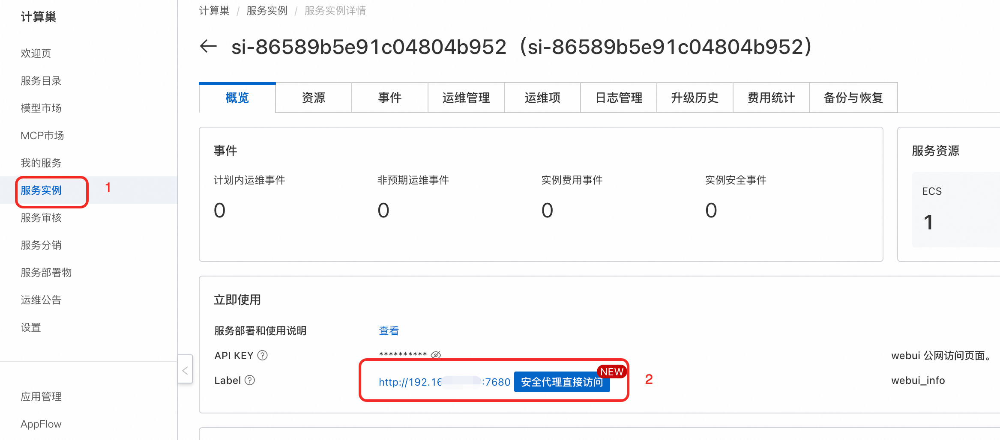

## 模型简介

Wan2.1-VACE-1.3B 是一个专门用于视频内容编辑和处理的轻量化模型。VACE（Video Adaptive Content Editing）技术专注于对现有视频进行智能编辑，包括风格转换、内容修改、场景增强等功能。该模型在保持视频时序一致性的同时，能够根据文本指令对视频内容进行精确编辑。

### 核心特性
- **参数规模**: 1.3B
- **视频编辑专用**: 专门针对视频编辑任务优化
- **时序一致性**: 保持视频帧间的连贯性和一致性
- **多种编辑功能**: 支持风格转换、内容修改、场景增强等
- **快速处理**: 轻量化架构，处理速度快
- **内存友好**: 显存需求低，适合资源受限环境
- **多语言支持**: 支持中文和英文编辑指令

### 技术规格
- **模型类型**: 视频编辑（Video Editing）
- **参数规模**: 1.3B
- **量化方式**: FP8量化版本
- **部署架构**: ECS单机部署/ACS集群部署
- **支持分辨率**: 480P
- **输入格式**: MP4、AVI、MOV等常见视频格式
- **输出格式**: MP4（H.264编码）

### 编辑能力
- **风格转换**: 将视频转换为不同艺术风格
- **色彩调整**: 调整视频的色调、饱和度、亮度
- **场景修改**: 改变视频背景或添加新元素
- **对象编辑**: 修改或替换视频中的特定对象
- **特效添加**: 为视频添加各种视觉特效
- **质量增强**: 提升视频清晰度和质量

## 部署方式

### 部署机构（推荐）

#### 部署配置
- **部署架构**: ECS单机部署或ACS部署


## 使用指南

### ComfyUI使用

1. **访问界面**: 单击服务实例处的访问链接。
2. 使用工作流vace.json
3. 输入想要生成的视频或图片的提示词，点击生成


### API调用
点击右上方按钮，打开底部面板，获取token：
COMFYUI_SERVER的获取可参考：
<details>
<summary>点击展开API调用Python代码</summary>


```python
import requests, json, uuid, time, random, os

# 配置参数
COMFYUI_SERVER, COMFYUI_TOKEN = "输入您的服务器地址", "输入您的token"
UNET_MODEL = "wan21_vace_1_3_b.safetensors"
CLIP_MODEL = "umt5_xxl_fp8_e4m3fn.safetensors"
VAE_MODEL = "wan21_vace_vae.safetensors"

# 预设参数
IMAGE_PATH = "example.png"
PROMPT = "女孩偷偷咬一口苹果"
NEG_PROMPT = "色调艳丽，过曝，静态，细节模糊不清，字幕，风格，作品，画作，画面，静止，整体发灰，最差质量，低质量，JPEG压缩残留，丑陋的，残缺的"

class VACEClient:
   def __init__(self, server=COMFYUI_SERVER, token=COMFYUI_TOKEN):
      self.base_url, self.token, self.client_id = f"http://{server}", token, str(uuid.uuid4())
      self.headers = {"Content-Type": "application/json", **({"Authorization": f"Bearer {token}"} if token else {})}

   def upload_image(self, image_path):
      """上传图片到ComfyUI"""
      if not os.path.exists(image_path):
         raise Exception(f"图片文件不存在: {image_path}")

      try:
         with open(image_path, 'rb') as f:
            files = {'image': (os.path.basename(image_path), f, 'image/png')}
            headers = {}
            if self.token:
               headers["Authorization"] = f"Bearer {self.token}"

            response = requests.post(f"{self.base_url}/upload/image", files=files, headers=headers)
            print(f"Upload response: {response.text}")

            if response.status_code != 200:
               raise Exception(f"上传失败，状态码: {response.status_code}")

            result = response.json()
            if 'name' not in result:
               raise Exception(f"上传响应中没有文件名: {result}")

            return result['name']
      except Exception as e:
         raise Exception(f"图片上传失败: {e}")

   def generate_vace(self, image_path, prompt, neg_prompt, steps=20, cfg=4, frames=49, width=480, height=480):
      """VACE视频编辑"""
      print("📤 正在上传图片...")
      image_name = self.upload_image(image_path)
      print(f"✅ 图片上传成功: {image_name}")

      workflow = {
         "11": {"inputs": {"unet_name": UNET_MODEL, "weight_dtype": "fp8_e4m3fn_fast"}, "class_type": "UNETLoader"},
         "13": {"inputs": {"clip_name": CLIP_MODEL, "type": "wan", "device": "default"}, "class_type": "CLIPLoader"},
         "14": {"inputs": {"vae_name": VAE_MODEL}, "class_type": "VAELoader"},
         "15": {"inputs": {"text": prompt, "clip": ["13", 0]}, "class_type": "CLIPTextEncode"},
         "16": {"inputs": {"text": neg_prompt, "clip": ["13", 0]}, "class_type": "CLIPTextEncode"},
         "17": {"inputs": {"width": width, "height": height, "length": ["21", 0], "batch_size": 1, "strength": 1.0, "positive": ["15", 0], "negative": ["16", 0], "vae": ["14", 0]}, "class_type": "WanVaceToVideo"},
         "18": {"inputs": {"image": image_name, "upload": "image"}, "class_type": "LoadImage"},
         "21": {"inputs": {"value": frames}, "class_type": "INTConstant"},
         "22": {"inputs": {"width": width, "height": height, "upscale_method": "nearest-exact", "keep_proportion": "crop", "pad_color": "0, 0, 0", "crop_position": "center", "divisible_by": 2, "device": "gpu", "image": ["18", 0]}, "class_type": "ImageResizeKJv2"},
         "23": {"inputs": {"images": ["22", 0]}, "class_type": "PreviewImage"},
         "24": {"inputs": {"seed": random.randint(1, 1000000000000000), "steps": steps, "cfg": cfg, "sampler_name": "uni_pc", "scheduler": "simple", "denoise": 1, "model": ["27", 0], "positive": ["17", 0], "negative": ["17", 1], "latent_image": ["17", 2]}, "class_type": "KSampler"},
         "27": {"inputs": {"shift": 8.0, "model": ["11", 0]}, "class_type": "ModelSamplingSD3"},
         "30": {"inputs": {"trim_amount": ["17", 3], "samples": ["24", 0]}, "class_type": "TrimVideoLatent"},
         "31": {"inputs": {"samples": ["30", 0], "vae": ["14", 0]}, "class_type": "VAEDecode"},
         "32": {"inputs": {"frame_rate": 16, "loop_count": 0, "filename_prefix": "VACE_video", "format": "video/h264-mp4", "pix_fmt": "yuv420p", "crf": 19, "save_metadata": True, "trim_to_audio": False, "pingpong": False, "save_output": True, "images": ["31", 0]}, "class_type": "VHS_VideoCombine"}
      }

      print("📤 提交VACE工作流...")
      response = requests.post(f"{self.base_url}/prompt", headers=self.headers, json={"prompt": workflow, "client_id": self.client_id})
      print(f"API Response: {response.text}")
      result = response.json()
      if "error" in result: raise Exception(f"Workflow error: {result['error']}")
      if "prompt_id" not in result: raise Exception(f"No prompt_id in response: {result}")
      return result["prompt_id"]

   def get_status(self, task_id):
      try:
         queue_data = requests.get(f"{self.base_url}/queue", headers=self.headers).json()
         if any(item[1] == task_id for item in queue_data.get("queue_running", [])): return "processing"
         if any(item[1] == task_id for item in queue_data.get("queue_pending", [])): return "pending"
         history_response = requests.get(f"{self.base_url}/history/{task_id}", headers=self.headers)
         return "completed" if history_response.status_code == 200 and task_id in history_response.json() else "processing"
      except: return "processing"

   def download_video(self, task_id, output_path="vace_output.mp4"):
      try:
         response = requests.get(f"{self.base_url}/history/{task_id}", headers=self.headers)
         history = response.json()
         if task_id in history:
            for output in history[task_id]['outputs'].values():
               if 'gifs' in output:
                  filename = output['gifs'][0]['filename']
                  video_response = requests.get(f"{self.base_url}/view?filename={filename}", headers=self.headers)
                  with open(output_path, "wb") as f: f.write(video_response.content)
                  return output_path
      except Exception as e: print(f"Download error: {e}")
      return None

def main():
   client = VACEClient()
   try:
      print(f"🎬 开始VACE视频编辑任务...")
      print(f"📷 输入图片: {IMAGE_PATH}")
      print(f"📝 编辑提示: {PROMPT}")

      if not os.path.exists(IMAGE_PATH):
         print(f"❌ 图片文件不存在: {IMAGE_PATH}")
         print("请确保当前目录下有 example.png 文件")
         return

      task_id = client.generate_vace(IMAGE_PATH, PROMPT, NEG_PROMPT, 20, 4, 49, 480, 480)
      print(f"🆔 Task ID: {task_id}")

      while True:
         status = client.get_status(task_id)
         print(f"📊 Current status: {status}")
         if status == "completed": print("✅ Video ready!"); break
         elif status == "failed": print("❌ Generation failed!"); exit(1)
         time.sleep(10)

      output_file = client.download_video(task_id, "vace_output.mp4")
      print("🎉 Video downloaded successfully!" if output_file else "❌ Failed to download video")
      if output_file: print(f"📁 Saved as: {output_file}")

   except Exception as e: print(f"❌ Error: {e}")

if __name__ == "__main__": main()
```
</details>


## 相关资源

- [VACE技术论文](https://arxiv.org/abs/vace-video-editing)
- [ComfyUI视频编辑指南](https://comfyui-wiki.com/zh/video/editing)
- [视频编辑最佳实践](https://docs.comfy.org/video/best_practices)
- [VACE插件文档](https://github.com/kijai/ComfyUI-VACEWrapper)