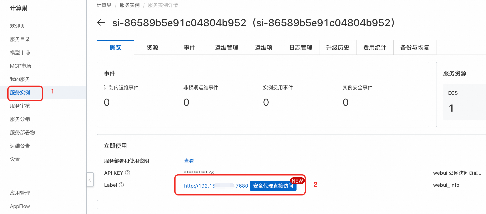
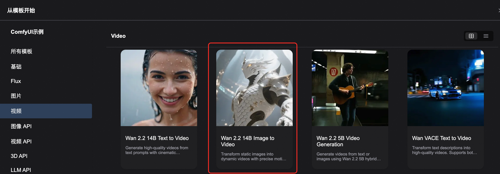

<div style="background: linear-gradient(135deg, #2563eb, #1e40af); padding: 24px; border-radius: 8px; color: white; text-align: center; margin-bottom: 24px;">
  <h1 style="font-size: 2.5em; margin: 0; font-weight: 600;">🎬 通义万相2.2-图生视频-A14B</h1>
  <p style="font-size: 1.2em; margin: 16px 0 0 0; opacity: 0.9;">开放且先进的大规模视频生成模型 - 图像到视频专业版</p>
  <div style="margin-top: 20px;">
    <span style="background: rgba(255,255,255,0.2); color: white; padding: 4px 12px; border-radius: 12px; font-size: 14px; margin: 0 8px;">🧠 27B参数 MoE</span>
    <span style="background: rgba(255,255,255,0.2); color: white; padding: 4px 12px; border-radius: 12px; font-size: 14px; margin: 0 8px;">🎯 480P & 720P</span>
    <span style="background: rgba(255,255,255,0.2); color: white; padding: 4px 12px; border-radius: 12px; font-size: 14px; margin: 0 8px;">⚡ 电影级美学</span>
  </div>
</div>

## 📋 模型概览

<div style="background: #f8fafc; border: 1px solid #e2e8f0; border-radius: 8px; padding: 20px; margin: 16px 0;">

**通义万相2.2-图生视频-A14B** 是基于混合专家(MoE)架构的革命性图像到视频生成模型。相比前代Wan2.1，该模型在数据规模、架构设计和生成质量方面实现了全面升级，支持480P和720P双分辨率输出，具备电影级美学质量和更稳定的视频合成能力。

<div style="display: grid; grid-template-columns: repeat(auto-fit, minmax(250px, 1fr)); gap: 16px; margin: 16px 0;">
  <div style="background: #eff6ff; border-left: 4px solid #2563eb; padding: 16px; border-radius: 4px;">
    <strong>🏷️ 模型标识</strong><br>
    <div style="margin-top: 8px;">
      <span style="background: #2563eb; color: white; padding: 4px 12px; border-radius: 6px; font-size: 12px; margin-right: 8px;">Wan-AI/Wan2.2-I2V-A14B</span>
    </div>
  </div>

  <div style="background: #f0fdf4; border-left: 4px solid #059669; padding: 16px; border-radius: 4px;">
    <strong>📊 架构规模</strong><br>
    <div style="margin-top: 8px;">
      <span style="background: #059669; color: white; padding: 4px 12px; border-radius: 6px; font-size: 12px; margin-right: 8px;">27B 总参数</span>
      <span style="background: #16a34a; color: white; padding: 4px 12px; border-radius: 6px; font-size: 12px;">14B 激活</span>
    </div>
  </div>

  <div style="background: #fef3c7; border-left: 4px solid #d97706; padding: 16px; border-radius: 4px;">
    <strong>🎯 核心功能</strong><br>
    <div style="margin-top: 8px;">
      <span style="background: #d97706; color: white; padding: 4px 12px; border-radius: 6px; font-size: 12px; margin-right: 8px;">图像转视频</span>
      <span style="background: #ea580c; color: white; padding: 4px 12px; border-radius: 6px; font-size: 12px;">双分辨率</span>
    </div>
  </div>
</div>

</div>

## 🚀 核心技术突破

<div style="display: grid; grid-template-columns: repeat(auto-fit, minmax(300px, 1fr)); gap: 16px; margin: 16px 0;">

<div style="background: #f8fafc; border: 1px solid #e2e8f0; border-radius: 8px; padding: 20px;">
<h3 style="margin-top: 0; color: #1e40af;">🧠 MoE 混合专家架构</h3>
<ul style="margin: 0; padding-left: 20px;">
  <li><strong>双专家设计</strong>：高噪声专家 + 低噪声专家</li>
  <li><strong>智能切换</strong>：基于信噪比(SNR)自动切换</li>
  <li><strong>高效推理</strong>：27B参数，14B激活，成本不变</li>
  <li><strong>优化去噪</strong>：专门针对扩散模型优化</li>
</ul>
</div>

<div style="background: #f8fafc; border: 1px solid #e2e8f0; border-radius: 8px; padding: 20px;">
<h3 style="margin-top: 0; color: #1e40af;">🎬 电影级美学质量</h3>
<ul style="margin: 0; padding-left: 20px;">
  <li><strong>精细标签</strong>：照明、构图、对比度、色调</li>
  <li><strong>可控生成</strong>：精确的电影风格控制</li>
  <li><strong>美学偏好</strong>：可定制的视觉风格</li>
  <li><strong>专业品质</strong>：商业级视频输出</li>
</ul>
</div>

<div style="background: #f8fafc; border: 1px solid #e2e8f0; border-radius: 8px; padding: 20px;">
<h3 style="margin-top: 0; color: #1e40af;">📈 大规模数据训练</h3>
<ul style="margin: 0; padding-left: 20px;">
  <li><strong>数据扩展</strong>：图像+65.6%，视频+83.2%</li>
  <li><strong>多维提升</strong>：运动、语义、美学全面增强</li>
  <li><strong>顶级性能</strong>：开源闭源模型中领先</li>
  <li><strong>泛化能力</strong>：显著提升的适应性</li>
</ul>
</div>

<div style="background: #f8fafc; border: 1px solid #e2e8f0; border-radius: 8px; padding: 20px;">
<h3 style="margin-top: 0; color: #1e40af;">⚡ 高效部署优化</h3>
<ul style="margin: 0; padding-left: 20px;">
  <li><strong>消费级GPU</strong>：支持RTX 4090等显卡</li>
  <li><strong>多分辨率</strong>：480P & 720P双支持</li>
  <li><strong>稳定合成</strong>：减少不真实摄像机运动</li>
  <li><strong>风格多样</strong>：增强的场景适应性</li>
</ul>
</div>

</div>

## 🔧 技术规格对比

<div style="overflow-x: auto; margin: 16px 0;">
<table style="width: 100%; border-collapse: collapse; background: white; border-radius: 6px; overflow: hidden; box-shadow: 0 1px 3px rgba(0,0,0,0.1);">
  <thead style="background: #f8fafc;">
    <tr>
      <th style="padding: 12px; text-align: left; border-bottom: 1px solid #e2e8f0; color: #1e40af; font-weight: 600;">规格项目</th>
      <th style="padding: 12px; text-align: left; border-bottom: 1px solid #e2e8f0; color: #1e40af; font-weight: 600;">Wan2.1-I2V-14B</th>
      <th style="padding: 12px; text-align: left; border-bottom: 1px solid #e2e8f0; color: #1e40af; font-weight: 600;">Wan2.2-I2V-A14B</th>
      <th style="padding: 12px; text-align: left; border-bottom: 1px solid #e2e8f0; color: #1e40af; font-weight: 600;">提升幅度</th>
    </tr>
  </thead>
  <tbody>
    <tr>
      <td style="padding: 12px; border-bottom: 1px solid #f1f5f9; font-weight: 500;">架构类型</td>
      <td style="padding: 12px; border-bottom: 1px solid #f1f5f9;">传统扩散模型</td>
      <td style="padding: 12px; border-bottom: 1px solid #f1f5f9;">MoE混合专家</td>
      <td style="padding: 12px; border-bottom: 1px solid #f1f5f9;"><span style="background: #dcfce7; color: #059669; padding: 2px 8px; border-radius: 4px; font-size: 12px;">架构升级</span></td>
    </tr>
    <tr>
      <td style="padding: 12px; border-bottom: 1px solid #f1f5f9; font-weight: 500;">参数规模</td>
      <td style="padding: 12px; border-bottom: 1px solid #f1f5f9;">14B</td>
      <td style="padding: 12px; border-bottom: 1px solid #f1f5f9;">27B (14B激活)</td>
      <td style="padding: 12px; border-bottom: 1px solid #f1f5f9;"><span style="background: #dcfce7; color: #059669; padding: 2px 8px; border-radius: 4px; font-size: 12px;">+93%</span></td>
    </tr>
    <tr>
      <td style="padding: 12px; border-bottom: 1px solid #f1f5f9; font-weight: 500;">支持分辨率</td>
      <td style="padding: 12px; border-bottom: 1px solid #f1f5f9;">480P</td>
      <td style="padding: 12px; border-bottom: 1px solid #f1f5f9;">480P & 720P</td>
      <td style="padding: 12px; border-bottom: 1px solid #f1f5f9;"><span style="background: #dcfce7; color: #059669; padding: 2px 8px; border-radius: 4px; font-size: 12px;">双分辨率</span></td>
    </tr>
    <tr>
      <td style="padding: 12px; border-bottom: 1px solid #f1f5f9; font-weight: 500;">训练数据</td>
      <td style="padding: 12px; border-bottom: 1px solid #f1f5f9;">基础数据集</td>
      <td style="padding: 12px; border-bottom: 1px solid #f1f5f9;">图像+65.6%, 视频+83.2%</td>
      <td style="padding: 12px; border-bottom: 1px solid #f1f5f9;"><span style="background: #dcfce7; color: #059669; padding: 2px 8px; border-radius: 4px; font-size: 12px;">大幅扩展</span></td>
    </tr>
    <tr>
      <td style="padding: 12px; border-bottom: 1px solid #f1f5f9; font-weight: 500;">美学质量</td>
      <td style="padding: 12px; border-bottom: 1px solid #f1f5f9;">标准质量</td>
      <td style="padding: 12px; border-bottom: 1px solid #f1f5f9;">电影级美学</td>
      <td style="padding: 12px; border-bottom: 1px solid #f1f5f9;"><span style="background: #dcfce7; color: #059669; padding: 2px 8px; border-radius: 4px; font-size: 12px;">质量飞跃</span></td>
    </tr>
    <tr>
      <td style="padding: 12px; border-bottom: 1px solid #f1f5f9; font-weight: 500;">运动稳定性</td>
      <td style="padding: 12px; border-bottom: 1px solid #f1f5f9;">基础稳定</td>
      <td style="padding: 12px; border-bottom: 1px solid #f1f5f9;">显著增强</td>
      <td style="padding: 12px; border-bottom: 1px solid #f1f5f9;"><span style="background: #dcfce7; color: #059669; padding: 2px 8px; border-radius: 4px; font-size: 12px;">稳定性提升</span></td>
    </tr>
    <tr>
      <td style="padding: 12px; font-weight: 500;">集成生态</td>
      <td style="padding: 12px;">ComfyUI</td>
      <td style="padding: 12px;">ComfyUI + Diffusers + ModelScope</td>
      <td style="padding: 12px;"><span style="background: #dcfce7; color: #059669; padding: 2px 8px; border-radius: 4px; font-size: 12px;">生态完善</span></td>
    </tr>
  </tbody>
</table>
</div>

## 💻 系统要求

<div style="background: #f8fafc; border: 1px solid #e2e8f0; border-radius: 8px; padding: 20px; margin: 16px 0;">

### 🖥️ 推荐硬件配置

<div style="overflow-x: auto; margin: 16px 0;">
<table style="width: 100%; border-collapse: collapse; background: white; border-radius: 6px; overflow: hidden; box-shadow: 0 1px 3px rgba(0,0,0,0.1);">
  <thead style="background: #f8fafc;">
    <tr>
      <th style="padding: 12px; text-align: left; border-bottom: 1px solid #e2e8f0;">配置项</th>
      <th style="padding: 12px; text-align: left; border-bottom: 1px solid #e2e8f0;">推荐规格</th>
      <th style="padding: 12px; text-align: left; border-bottom: 1px solid #e2e8f0;">说明</th>
    </tr>
  </thead>
  <tbody>
    <tr>
      <td style="padding: 12px; border-bottom: 1px solid #f1f5f9;"><strong>CPU</strong></td>
      <td style="padding: 12px; border-bottom: 1px solid #f1f5f9;">16 vCPU</td>
      <td style="padding: 12px; border-bottom: 1px solid #f1f5f9;">高性能多核处理器</td>
    </tr>
    <tr>
      <td style="padding: 12px; border-bottom: 1px solid #f1f5f9;"><strong>内存</strong></td>
      <td style="padding: 12px; border-bottom: 1px solid #f1f5f9;">60 GiB</td>
      <td style="padding: 12px; border-bottom: 1px solid #f1f5f9;">大容量系统内存</td>
    </tr>
    <tr>
      <td style="padding: 12px; border-bottom: 1px solid #f1f5f9;"><strong>GPU</strong></td>
      <td style="padding: 12px; border-bottom: 1px solid #f1f5f9;">1 × NVIDIA A10</td>
      <td style="padding: 12px; border-bottom: 1px solid #f1f5f9;">专业级显卡，80GB+ 显存</td>
    </tr>
  </tbody>
</table>
</div>

</div>

## 🎯 使用指南

# 🌐 ComfyUI 集成使用指南

## 📍 ComfyUI Web UI 使用教程

<div style="background: #f8fafc; border: 1px solid #e2e8f0; border-radius: 8px; padding: 20px; margin: 16px 0;">

### 🚀 步骤一：访问界面

<div style="background: #eff6ff; border-left: 4px solid #2563eb; padding: 16px; margin: 16px 0; border-radius: 4px;">
  <strong>🔗 界面访问</strong><br>
  单击服务实例处的访问链接，进入 ComfyUI 可视化界面
</div>



### 🔧 步骤二：选择工作流

<div style="background: #f0fdf4; border-left: 4px solid #059669; padding: 16px; border-radius: 4px;">
<p style="margin: 0; color: #065f46;">选择 <code>左上角的官方</code> 工作流并打开</p>
</div>

<div style="background: #fff7ed; border-left: 4px solid #ea580c; padding: 16px; border-radius: 4px;">




</div>

### 📤 步骤三：上传图像

<div style="background: #f8fafc; border: 1px solid #e2e8f0; border-radius: 8px; padding: 16px; margin: 16px 0;">

**在 LoadImage 节点操作：**
- 选择示例图片进行测试
- 或从本机电脑上传自定义图像
- 支持 JPEG、PNG、WebP 等格式
</div>

### ✍️ 步骤四：设置文本描述

<div style="display: grid; grid-template-columns: 1fr 1fr; gap: 16px; margin: 16px 0;">

<div style="background: #f0fdf4; border-left: 4px solid #059669; padding: 16px; border-radius: 4px;">
<h4 style="color: #059669; margin: 0 0 8px 0;">✅ 正向提示词</h4>
<p style="margin: 0 0 8px 0; color: #065f46;">在 <strong>TextEncode (Positive)</strong> 节点填写：</p>
<div style="background: #f8fafc; padding: 8px; border-radius: 4px; font-family: monospace; font-size: 12px;">
"Cinematic lighting, graceful movements, smooth animation, high quality"
</div>
</div>

<div style="background: #fff7ed; border-left: 4px solid #ea580c; padding: 16px; border-radius: 4px;">
<h4 style="color: #ea580c; margin: 0 0 8px 0;">❌ 负向提示词</h4>
<p style="margin: 0 0 8px 0; color: #9a3412;">在 <strong>TextEncode (Negative)</strong> 节点填写：</p>
<div style="background: #f8fafc; padding: 8px; border-radius: 4px; font-family: monospace; font-size: 12px;">
"bad quality, blurry, distorted, static"
</div>
</div>

</div>

### ⚙️ 步骤五：配置参数

<div style="background: #f8fafc; border: 1px solid #e2e8f0; border-radius: 8px; padding: 16px; margin: 16px 0;">

**在 WanVideoImageClipEncode 节点设置：**

<div style="overflow-x: auto; margin: 16px 0;">
<table style="width: 100%; border-collapse: collapse; background: white; border-radius: 6px; overflow: hidden; box-shadow: 0 1px 3px rgba(0,0,0,0.1);">
  <thead style="background: #f8fafc;">
    <tr>
      <th style="padding: 12px; text-align: left; border-bottom: 1px solid #e2e8f0;">参数名称</th>
      <th style="padding: 12px; text-align: left; border-bottom: 1px solid #e2e8f0;">推荐值</th>
      <th style="padding: 12px; text-align: left; border-bottom: 1px solid #e2e8f0;">说明</th>
    </tr>
  </thead>
  <tbody>
    <tr>
      <td style="padding: 12px; border-bottom: 1px solid #f1f5f9;"><strong>generation_width</strong></td>
      <td style="padding: 12px; border-bottom: 1px solid #f1f5f9;">1280 (720P) / 854 (480P)</td>
      <td style="padding: 12px; border-bottom: 1px solid #f1f5f9;">视频宽度</td>
    </tr>
    <tr>
      <td style="padding: 12px; border-bottom: 1px solid #f1f5f9;"><strong>generation_height</strong></td>
      <td style="padding: 12px; border-bottom: 1px solid #f1f5f9;">720 (720P) / 480 (480P)</td>
      <td style="padding: 12px; border-bottom: 1px solid #f1f5f9;">视频高度</td>
    </tr>
    <tr>
      <td style="padding: 12px; border-bottom: 1px solid #f1f5f9;"><strong>num_frames</strong></td>
      <td style="padding: 12px; border-bottom: 1px solid #f1f5f9;">81</td>
      <td style="padding: 12px; border-bottom: 1px solid #f1f5f9;">视频帧数</td>
    </tr>
    <tr>
      <td style="padding: 12px; border-bottom: 1px solid #f1f5f9;"><strong>noise_aug_strength</strong></td>
      <td style="padding: 12px; border-bottom: 1px solid #f1f5f9;">0</td>
      <td style="padding: 12px; border-bottom: 1px solid #f1f5f9;">噪声增强强度</td>
    </tr>
    <tr>
      <td style="padding: 12px; font-weight: 500;"><strong>adjust_resolution</strong></td>
      <td style="padding: 12px;">True</td>
      <td style="padding: 12px;">自动调整分辨率</td>
    </tr>
  </tbody>
</table>
</div>

</div>

### 🎬 步骤六：执行工作流

<div style="background: #eff6ff; border-left: 4px solid #2563eb; padding: 16px; margin: 16px 0; border-radius: 4px;">
  <strong>🚀 开始生成</strong><br>
  点击右侧面板的 <strong>"Queue Prompt"</strong> 按钮开始生成视频<br>
  生成过程中可在进度条查看实时状态
</div>

</div>

## 🔌 ComfyUI API 调用方式

### 🔑 获取认证信息

<div style="display: grid; grid-template-columns: 1fr 1fr; gap: 16px; margin: 16px 0;">

<div style="background: #fff7ed; border-left: 4px solid #ea580c; padding: 16px; border-radius: 4px;">
<h4 style="color: #ea580c; margin: 0 0 8px 0;">🔐 获取 Token</h4>
<p style="margin: 0 0 12px 0;">点击右上方设置按钮，打开底部面板获取API Token</p>
<div style="text-align: center; padding: 12px; background: #f8fafc; border-radius: 6px;">
  <div style="background: #fed7aa; color: #ea580c; padding: 8px 16px; border-radius: 6px; display: inline-block;">
    🔑 API Token 获取界面
  </div>
</div>


</div>

<div style="background: #eff6ff; border-left: 4px solid #2563eb; padding: 16px; border-radius: 4px;">
<h4 style="color: #2563eb; margin: 0 0 8px 0;">🌐 获取服务器地址</h4>
<p style="margin: 0 0 12px 0;">从服务实例信息中获取 COMFYUI_SERVER 地址</p>
<div style="text-align: center; padding: 12px; background: #f8fafc; border-radius: 6px;">
  <div style="background: #dbeafe; color: #2563eb; padding: 8px 16px; border-radius: 6px; display: inline-block;">
    🌐 服务器地址配置
  </div>
</div>


</div>

</div>

### 💻 Python API 调用示例

<details style="border: 2px solid #2563eb; border-radius: 12px; padding: 20px; margin: 20px 0; background: linear-gradient(145deg, #f8fafc, #eff6ff); box-shadow: 0 8px 16px rgba(37, 99, 235, 0.15);">
<summary style="font-weight: bold; font-size: 18px; color: white; cursor: pointer; padding: 16px; background: linear-gradient(135deg, #2563eb, #1e40af); border-radius: 8px; margin: -20px -20px 20px -20px; text-shadow: 1px 1px 2px rgba(0,0,0,0.2); transition: all 0.3s ease; display: flex; align-items: center; box-shadow: 0 4px 8px rgba(37, 99, 235, 0.3);">
🐍 点击展开完整 Python API 调用代码
</summary>

```python
import requests, json, uuid, time, random, os

# 🔧 配置参数 - Wan2.2 14B 图生视频专用
COMFYUI_SERVER = "127.0.0.1:8188"  # 本地服务器
COMFYUI_TOKEN = ""  # 本地通常不需要token
UNET_HIGH_NOISE_MODEL = "wan2.2_i2v_high_noise_14B_fp8_scaled.safetensors"
UNET_LOW_NOISE_MODEL = "wan2.2_i2v_low_noise_14B_fp8_scaled.safetensors"
CLIP_MODEL = "umt5_xxl_fp8_e4m3fn_scaled.safetensors"
VAE_MODEL = "wan_2.1_vae.safetensors"

# 🎯 预设参数
IMAGE_PATH = "input_image.jpg"
PROMPT = "The white dragon warrior stands still, eyes full of determination and strength. The camera slowly moves closer or circles around the warrior, highlighting the powerful presence and heroic spirit of the character."
NEG_PROMPT = "色调艳丽，过曝，静态，细节模糊不清，字幕，风格，作品，画作，画面，静止，整体发灰，最差质量，低质量，JPEG压缩残留，丑陋的，残缺的，多余的手指，画得不好的手部，画得不好的脸部，畸形的，毁容的，形态畸形的肢体，手指融合，静止不动的画面，杂乱的背景，三条腿，背景人很多，倒着走"

class ComfyUIWan22_14B_I2VClient:
    def __init__(self, server=COMFYUI_SERVER, token=COMFYUI_TOKEN):
        self.base_url = f"http://{server}"
        self.token = token
        self.client_id = str(uuid.uuid4())
        self.headers = {"Content-Type": "application/json"}
        if token:
            self.headers["Authorization"] = f"Bearer {token}"

    def upload_image(self, image_path):
        """📤 上传图片到ComfyUI"""
        if not os.path.exists(image_path):
            raise Exception(f"图片文件不存在: {image_path}")

        try:
            with open(image_path, 'rb') as f:
                files = {'image': (os.path.basename(image_path), f, 'image/png')}
                headers = {}
                if self.token:
                    headers["Authorization"] = f"Bearer {self.token}"

                response = requests.post(f"{self.base_url}/upload/image", files=files, headers=headers)
                print(f"Upload response: {response.text}")

                if response.status_code != 200:
                    raise Exception(f"上传失败，状态码: {response.status_code}")

                result = response.json()
                if 'name' not in result:
                    raise Exception(f"上传响应中没有文件名: {result}")

                return result['name']
        except Exception as e:
            raise Exception(f"图片上传失败: {e}")

    def generate_wan22_14b_i2v(self, image_path, prompt, neg_prompt, steps=20, cfg=3.5, width=1280, height=704, frames=81, fps=16):
        """🎬 Wan2.2 14B 图生视频生成 - 双阶段采样"""
        print("📤 正在上传图片...")
        image_name = self.upload_image(image_path)
        print(f"✅ 图片上传成功: {image_name}")

        print("🎬 开始 Wan2.2 14B 图生视频任务...")

        # 完全基于你提供的图生视频 JSON 工作流
        workflow = {
            "6": {
                "inputs": {
                    "text": prompt,
                    "clip": ["38", 0]
                },
                "class_type": "CLIPTextEncode",
                "_meta": {"title": "CLIP Text Encode (Positive Prompt)"}
            },
            "7": {
                "inputs": {
                    "text": neg_prompt,
                    "clip": ["38", 0]
                },
                "class_type": "CLIPTextEncode",
                "_meta": {"title": "CLIP Text Encode (Negative Prompt)"}
            },
            "8": {
                "inputs": {
                    "samples": ["58", 0],
                    "vae": ["39", 0]
                },
                "class_type": "VAEDecode",
                "_meta": {"title": "VAE解码"}
            },
            "37": {
                "inputs": {
                    "unet_name": UNET_HIGH_NOISE_MODEL,
                    "weight_dtype": "default"
                },
                "class_type": "UNETLoader",
                "_meta": {"title": "UNet加载器"}
            },
            "38": {
                "inputs": {
                    "clip_name": CLIP_MODEL,
                    "type": "wan",
                    "device": "default"
                },
                "class_type": "CLIPLoader",
                "_meta": {"title": "加载CLIP"}
            },
            "39": {
                "inputs": {
                    "vae_name": VAE_MODEL
                },
                "class_type": "VAELoader",
                "_meta": {"title": "加载VAE"}
            },
            "54": {
                "inputs": {
                    "shift": 8.000000000000002,
                    "model": ["37", 0]
                },
                "class_type": "ModelSamplingSD3",
                "_meta": {"title": "采样算法（SD3）"}
            },
            "55": {
                "inputs": {
                    "shift": 8,
                    "model": ["56", 0]
                },
                "class_type": "ModelSamplingSD3",
                "_meta": {"title": "采样算法（SD3）"}
            },
            "56": {
                "inputs": {
                    "unet_name": UNET_LOW_NOISE_MODEL,
                    "weight_dtype": "default"
                },
                "class_type": "UNETLoader",
                "_meta": {"title": "UNet加载器"}
            },
            "57": {
                "inputs": {
                    "add_noise": "enable",
                    "noise_seed": random.randint(1, 1000000000000000),
                    "steps": steps,
                    "cfg": cfg,
                    "sampler_name": "euler",
                    "scheduler": "simple",
                    "start_at_step": 0,
                    "end_at_step": 10,
                    "return_with_leftover_noise": "enable",
                    "model": ["54", 0],
                    "positive": ["63", 0],
                    "negative": ["63", 1],
                    "latent_image": ["63", 2]
                },
                "class_type": "KSamplerAdvanced",
                "_meta": {"title": "K采样器（高级）"}
            },
            "58": {
                "inputs": {
                    "add_noise": "disable",
                    "noise_seed": 0,
                    "steps": steps,
                    "cfg": cfg,
                    "sampler_name": "euler",
                    "scheduler": "simple",
                    "start_at_step": 10,
                    "end_at_step": 10000,
                    "return_with_leftover_noise": "disable",
                    "model": ["55", 0],
                    "positive": ["63", 0],
                    "negative": ["63", 1],
                    "latent_image": ["57", 0]
                },
                "class_type": "KSamplerAdvanced",
                "_meta": {"title": "K采样器（高级）"}
            },
            "60": {
                "inputs": {
                    "fps": fps,
                    "images": ["8", 0]
                },
                "class_type": "CreateVideo",
                "_meta": {"title": "创建视频"}
            },
            "61": {
                "inputs": {
                    "filename_prefix": "video/ComfyUI_I2V_14B",
                    "format": "auto",
                    "codec": "auto",
                    "video": ["60", 0]
                },
                "class_type": "SaveVideo",
                "_meta": {"title": "保存视频"}
            },
            "62": {
                "inputs": {
                    "image": image_name
                },
                "class_type": "LoadImage",
                "_meta": {"title": "加载图像"}
            },
            "63": {
                "inputs": {
                    "width": width,
                    "height": height,
                    "length": frames,
                    "batch_size": 1,
                    "positive": ["6", 0],
                    "negative": ["7", 0],
                    "vae": ["39", 0],
                    "start_image": ["62", 0]
                },
                "class_type": "WanImageToVideo",
                "_meta": {"title": "Wan图像到视频"}
            }
        }

        print("📤 提交 Wan2.2 14B 图生视频双阶段采样工作流...")
        response = requests.post(f"{self.base_url}/prompt", headers=self.headers, json={"prompt": workflow, "client_id": self.client_id})
        print(f"API Response: {response.text}")

        if response.status_code != 200:
            raise Exception(f"API请求失败，状态码: {response.status_code}")

        result = response.json()
        if "error" in result:
            raise Exception(f"Workflow error: {result['error']}")
        if "prompt_id" not in result:
            raise Exception(f"No prompt_id in response: {result}")
        return result["prompt_id"]

    def get_status(self, task_id):
        """📊 获取任务状态"""
        try:
            queue_data = requests.get(f"{self.base_url}/queue", headers=self.headers).json()
            if any(item[1] == task_id for item in queue_data.get("queue_running", [])):
                return "processing"
            if any(item[1] == task_id for item in queue_data.get("queue_pending", [])):
                return "pending"
            history_response = requests.get(f"{self.base_url}/history/{task_id}", headers=self.headers)
            return "completed" if history_response.status_code == 200 and task_id in history_response.json() else "processing"
        except:
            return "processing"

    def download_video(self, task_id, output_path="wan22_14b_i2v_output.mp4"):
        """📥 下载生成的视频"""
        try:
            response = requests.get(f"{self.base_url}/history/{task_id}", headers=self.headers)
            history = response.json()
            if task_id in history:
                for output in history[task_id]['outputs'].values():
                    # 查找视频文件
                    if 'videos' in output:
                        filename = output['videos'][0]['filename']
                        video_response = requests.get(f"{self.base_url}/view?filename={filename}", headers=self.headers)
                        with open(output_path, "wb") as f:
                            f.write(video_response.content)
                        return output_path
                    # 兼容其他可能的输出格式
                    elif 'gifs' in output:
                        filename = output['gifs'][0]['filename']
                        video_response = requests.get(f"{self.base_url}/view?filename={filename}", headers=self.headers)
                        with open(output_path, "wb") as f:
                            f.write(video_response.content)
                        return output_path
        except Exception as e:
            print(f"Download error: {e}")
        return None

def main():
    """🚀 主函数 - 执行 Wan2.2 14B 图生视频任务"""
    client = ComfyUIWan22_14B_I2VClient()
    try:
        print(f"🎬 开始 Wan2.2 14B 图生视频任务...")
        print(f"📷 输入图片: {IMAGE_PATH}")
        print(f"📝 正向提示词: {PROMPT}")
        print(f"🚫 负向提示词: {NEG_PROMPT}")
        print(f"🔧 使用双阶段采样：高噪声I2V模型 + 低噪声I2V模型")

        if not os.path.exists(IMAGE_PATH):
            print(f"❌ 图片文件不存在: {IMAGE_PATH}")
            print("请确保当前目录下有输入图片文件")
            return

        # 14B 图生视频生成
        task_id = client.generate_wan22_14b_i2v(IMAGE_PATH, PROMPT, NEG_PROMPT, 20, 3.5, 1280, 704, 81, 16)
        print(f"🆔 Task ID: {task_id}")

        while True:
            status = client.get_status(task_id)
            print(f"📊 Current status: {status}")
            if status == "completed":
                print("✅ Wan2.2 14B I2V Video ready!");
                break
            elif status == "failed":
                print("❌ Generation failed!");
                exit(1)
            time.sleep(15)  # 14B模型生成时间更长，增加轮询间隔

        output_file = client.download_video(task_id, "wan22_14b_i2v_output.mp4")
        print("🎉 Video downloaded successfully!" if output_file else "❌ Failed to download video")
        if output_file:
            print(f"📁 Saved as: {output_file}")

    except Exception as e:
        print(f"❌ Error: {e}")

if __name__ == "__main__":
    main()

```

</details>

### 🔗 ComfyUI API 端点说明

<div style="overflow-x: auto; margin: 16px 0;">
<table style="width: 100%; border-collapse: collapse; background: white; border-radius: 6px; overflow: hidden; box-shadow: 0 1px 3px rgba(0,0,0,0.1);">
  <thead style="background: #f8fafc;">
    <tr>
      <th style="padding: 12px; text-align: left; border-bottom: 1px solid #e2e8f0; color: #1e40af; font-weight: 600;">端点</th>
      <th style="padding: 12px; text-align: left; border-bottom: 1px solid #e2e8f0; color: #1e40af; font-weight: 600;">方法</th>
      <th style="padding: 12px; text-align: left; border-bottom: 1px solid #e2e8f0; color: #1e40af; font-weight: 600;">功能</th>
      <th style="padding: 12px; text-align: left; border-bottom: 1px solid #e2e8f0; color: #1e40af; font-weight: 600;">说明</th>
    </tr>
  </thead>
  <tbody>
    <tr>
      <td style="padding: 12px; border-bottom: 1px solid #f1f5f9; font-family: monospace; background: #f8fafc;">/queue</td>
      <td style="padding: 12px; border-bottom: 1px solid #f1f5f9;">GET</td>
      <td style="padding: 12px; border-bottom: 1px solid #f1f5f9;">获取队列状态</td>
      <td style="padding: 12px; border-bottom: 1px solid #f1f5f9;">查看当前任务队列和运行状态</td>
    </tr>
    <tr>
      <td style="padding: 12px; border-bottom: 1px solid #f1f5f9; font-family: monospace; background: #f8fafc;">/prompt</td>
      <td style="padding: 12px; border-bottom: 1px solid #f1f5f9;">POST</td>
      <td style="padding: 12px; border-bottom: 1px solid #f1f5f9;">提交工作流</td>
      <td style="padding: 12px; border-bottom: 1px solid #f1f5f9;">执行 Wan2.2 图生视频任务</td>
    </tr>
    <tr>
      <td style="padding: 12px; border-bottom: 1px solid #f1f5f9; font-family: monospace; background: #f8fafc;">/history/{prompt_id}</td>
      <td style="padding: 12px; border-bottom: 1px solid #f1f5f9;">GET</td>
      <td style="padding: 12px; border-bottom: 1px solid #f1f5f9;">获取执行历史</td>
      <td style="padding: 12px; border-bottom: 1px solid #f1f5f9;">查看任务执行结果和输出</td>
    </tr>
    <tr>
      <td style="padding: 12px; border-bottom: 1px solid #f1f5f9; font-family: monospace; background: #f8fafc;">/upload/image</td>
      <td style="padding: 12px; border-bottom: 1px solid #f1f5f9;">POST</td>
      <td style="padding: 12px; border-bottom: 1px solid #f1f5f9;">上传图片</td>
      <td style="padding: 12px; border-bottom: 1px solid #f1f5f9;">上传输入图片文件</td>
    </tr>
    <tr>
      <td style="padding: 12px; font-family: monospace; background: #f8fafc;">/view</td>
      <td style="padding: 12px;">GET</td>
      <td style="padding: 12px;">下载输出文件</td>
      <td style="padding: 12px;">获取生成的结果文件</td>
    </tr>
  </tbody>
</table>
</div>

## ⚙️ ComfyUI 节点详细说明

<div style="display: grid; grid-template-columns: repeat(auto-fit, minmax(300px, 1fr)); gap: 16px; margin: 16px 0;">

<div style="background: #f8fafc; border: 1px solid #e2e8f0; border-radius: 8px; padding: 20px;">
<h3 style="margin-top: 0; color: #1e40af;">📤 输入节点</h3>
<ul style="margin: 0; padding-left: 20px;">
  <li><strong>LoadImage</strong>：加载输入图像</li>
  <li><strong>WanVideoTextEncode</strong>：文本编码器</li>
  <li><strong>WanVideoImageClipEncode</strong>：图像编码器</li>
</ul>
</div>

<div style="background: #f8fafc; border: 1px solid #e2e8f0; border-radius: 8px; padding: 20px;">
<h3 style="margin-top: 0; color: #1e40af;">🧠 模型节点</h3>
<ul style="margin: 0; padding-left: 20px;">
  <li><strong>WanVideoModelLoader</strong>：Wan2.2 模型加载器</li>
  <li><strong>WanVideoVAELoader</strong>：VAE 模型加载器</li>
  <li><strong>LoadWanVideoT5TextEncoder</strong>：T5 文本编码器</li>
</ul>
</div>

<div style="background: #f8fafc; border: 1px solid #e2e8f0; border-radius: 8px; padding: 20px;">
<h3 style="margin-top: 0; color: #1e40af;">⚡ 处理节点</h3>
<ul style="margin: 0; padding-left: 20px;">
  <li><strong>WanVideoSampler</strong>：视频采样器</li>
  <li><strong>WanVideoDecode</strong>：视频解码器</li>
  <li><strong>WanVideoBlockSwap</strong>：内存优化</li>
</ul>
</div>

<div style="background: #f8fafc; border: 1px solid #e2e8f0; border-radius: 8px; padding: 20px;">
<h3 style="margin-top: 0; color: #1e40af;">📤 输出节点</h3>
<ul style="margin: 0; padding-left: 20px;">
  <li><strong>VHS_VideoCombine</strong>：视频合成输出</li>
  <li><strong>PreviewImage</strong>：图像预览</li>
  <li><strong>SaveImage</strong>：图像保存</li>
</ul>
</div>

</div>

## 💡 提示词编写指南

<div style="display: grid; grid-template-columns: 1fr 1fr; gap: 16px; margin: 16px 0;">

<div style="background: #f0fdf4; border-left: 4px solid #059669; padding: 16px; border-radius: 4px;">
<h4 style="color: #059669; margin: 0 0 8px 0;">✅ 正向提示词示例</h4>
<div style="background: #f8fafc; padding: 12px; border-radius: 6px; margin: 8px 0;">
<p style="margin: 0; font-style: italic; color: #065f46; font-size: 14px;">"Summer beach vacation style, a white cat wearing sunglasses sits on a surfboard. The fluffy-furred feline gazes directly at the camera with a relaxed expression."</p>
</div>
<div style="background: #f8fafc; padding: 12px; border-radius: 6px; margin: 8px 0;">
<p style="margin: 0; font-style: italic; color: #065f46; font-size: 14px;">"Cinematic lighting, graceful movements, smooth animation, high quality, professional cinematography"</p>
</div>
</div>

<div style="background: #fff7ed; border-left: 4px solid #ea580c; padding: 16px; border-radius: 4px;">
<h4 style="color: #ea580c; margin: 0 0 8px 0;">❌ 负向提示词建议</h4>
<div style="background: #f8fafc; padding: 12px; border-radius: 6px; margin: 8px 0;">
<p style="margin: 0; font-style: italic; color: #9a3412; font-size: 14px;">"bad quality video, low quality, blurry, distorted, choppy animation, static, bad anatomy"</p>
</div>
<div style="background: #f8fafc; padding: 12px; border-radius: 6px; margin: 8px 0;">
<p style="margin: 0; font-style: italic; color: #9a3412; font-size: 14px;">"unnatural movement, jerky motion, inconsistent, artifacts, noise"</p>
</div>
</div>

</div>

## 🔗 集成生态

<div style="display: grid; grid-template-columns: repeat(auto-fit, minmax(250px, 1fr)); gap: 16px; margin: 16px 0;">

<div style="background: #eff6ff; border-left: 4px solid #2563eb; padding: 16px; border-radius: 4px;">
  <strong>🎨 ComfyUI</strong><br>
  <div style="margin-top: 8px;">
    <span style="background: #dcfce7; color: #059669; padding: 4px 12px; border-radius: 12px; font-size: 12px; margin-right: 8px;">✅ 已集成</span>
    <span style="background: #dbeafe; color: #2563eb; padding: 4px 12px; border-radius: 12px; font-size: 12px;">中英文档</span>
  </div>
  <p style="margin: 8px 0 0 0; color: #1e40af; font-size: 14px;">可视化工作流，易于使用</p>
</div>

<div style="background: #f0fdf4; border-left: 4px solid #059669; padding: 16px; border-radius: 4px;">
  <strong>🤗 Diffusers</strong><br>
  <div style="margin-top: 8px;">
    <span style="background: #dcfce7; color: #059669; padding: 4px 12px; border-radius: 12px; font-size: 12px; margin-right: 8px;">✅ 已集成</span>
    <span style="background: #dbeafe; color: #2563eb; padding: 4px 12px; border-radius: 12px; font-size: 12px;">I2V-A14B</span>
  </div>
  <p style="margin: 8px 0 0 0; color: #065f46; font-size: 14px;">标准化API接口</p>
</div>

<div style="background: #fef3c7; border-left: 4px solid #d97706; padding: 16px; border-radius: 4px;">
  <strong>🤖 ModelScope</strong><br>
  <div style="margin-top: 8px;">
    <span style="background: #dcfce7; color: #059669; padding: 4px 12px; border-radius: 12px; font-size: 12px; margin-right: 8px;">✅ 官方支持</span>
    <span style="background: #dbeafe; color: #2563eb; padding: 4px 12px; border-radius: 12px; font-size: 12px;">原生集成</span>
  </div>
  <p style="margin: 8px 0 0 0; color: #9a3412; font-size: 14px;">模型托管与分发</p>
</div>

<div style="background: #f3e8ff; border-left: 4px solid #7c3aed; padding: 16px; border-radius: 4px;">
  <strong>🐙 GitHub</strong><br>
  <div style="margin-top: 8px;">
    <span style="background: #dcfce7; color: #059669; padding: 4px 12px; border-radius: 12px; font-size: 12px; margin-right: 8px;">✅ 开源</span>
    <span style="background: #dbeafe; color: #2563eb; padding: 4px 12px; border-radius: 12px; font-size: 12px;">完整代码</span>
  </div>
  <p style="margin: 8px 0 0 0; color: #5b21b6; font-size: 14px;">源码开放，社区驱动</p>
</div>

</div>

## 🎯 应用场景展示

<div style="display: grid; grid-template-columns: repeat(auto-fit, minmax(280px, 1fr)); gap: 16px; margin: 16px 0;">

<div style="background: #eff6ff; border-left: 4px solid #2563eb; padding: 16px; border-radius: 4px; text-align: center;">
<div style="font-size: 2.5em; margin-bottom: 12px; color: #2563eb;">🎬</div>
<h4 style="margin: 0 0 8px 0; color: #1e40af;">电影制作</h4>
<p style="margin: 0; color: #1e40af;">电影级美学质量，专业视频制作</p>
</div>

<div style="background: #f0fdf4; border-left: 4px solid #059669; padding: 16px; border-radius: 4px; text-align: center;">
<div style="font-size: 2.5em; margin-bottom: 12px; color: #059669;">🛍️</div>
<h4 style="margin: 0 0 8px 0; color: #059669;">商业营销</h4>
<p style="margin: 0; color: #065f46;">产品展示动画，营销视频制作</p>
</div>

<div style="background: #fff7ed; border-left: 4px solid #ea580c; padding: 16px; border-radius: 4px; text-align: center;">
<div style="font-size: 2.5em; margin-bottom: 12px; color: #ea580c;">🎨</div>
<h4 style="margin: 0 0 8px 0; color: #ea580c;">艺术创作</h4>
<p style="margin: 0; color: #9a3412;">数字艺术动画，创意视频生成</p>
</div>

<div style="background: #f5f3ff; border-left: 4px solid #7c3aed; padding: 16px; border-radius: 4px; text-align: center;">
<div style="font-size: 2.5em; margin-bottom: 12px; color: #7c3aed;">📱</div>
<h4 style="margin: 0 0 8px 0; color: #7c3aed;">社交媒体</h4>
<p style="margin: 0; color: #5b21b6;">短视频制作，社交内容创作</p>
</div>

</div>

## 📄 许可与引用

<div style="background: #f8fafc; border: 1px solid #e2e8f0; border-radius: 8px; padding: 20px; margin: 16px 0;">

### 📋 开源协议

<div style="background: #f0fdf4; border-left: 4px solid #059669; padding: 16px; margin: 16px 0; border-radius: 4px;">
  <strong>📜 Apache 2.0 许可证</strong><br>
  • 自由使用和分发<br>
  • 商业友好的开源协议<br>
  • 完整的使用权限授予<br>
  • 需遵守相关法律法规
</div>

### 📚 学术引用

```bibtex
@article{wan2025,
      title={Wan: Open and Advanced Large-Scale Video Generative Models}, 
      author={Team Wan and Ang Wang and Baole Ai and Bin Wen and Chaojie Mao and Chen-Wei Xie and Di Chen and Feiwu Yu and Haiming Zhao and Jianxiao Yang and Jianyuan Zeng and Jiayu Wang and Jingfeng Zhang and Jingren Zhou and Jinkai Wang and Jixuan Chen and Kai Zhu and Kang Zhao and Keyu Yan and Lianghua Huang and Mengyang Feng and Ningyi Zhang and Pandeng Li and Pingyu Wu and Ruihang Chu and Ruili Feng and Shiwei Zhang and Siyang Sun and Tao Fang and Tianxing Wang and Tianyi Gui and Tingyu Weng and Tong Shen and Wei Lin and Wei Wang and Wei Wang and Wenmeng Zhou and Wente Wang and Wenting Shen and Wenyuan Yu and Xianzhong Shi and Xiaoming Huang and Xin Xu and Yan Kou and Yangyu Lv and Yifei Li and Yijing Liu and Yiming Wang and Yingya Zhang and Yitong Huang and Yong Li and You Wu and Yu Liu and Yulin Pan and Yun Zheng and Yuntao Hong and Yupeng Shi and Yutong Feng and Zeyinzi Jiang and Zhen Han and Zhi-Fan Wu and Ziyu Liu},
      journal = {arXiv preprint arXiv:2503.20314},
      year={2025}
}
```

</div>

---

<div style="text-align: center; padding: 16px; background: #f8fafc; border-radius: 6px; margin-top: 24px;">
  <p style="margin: 0; color: #64748b; font-size: 14px;">
    🎬 <strong>通义万相2.2-图生视频-A14B</strong> | 开放且先进的大规模视频生成模型
  </p>
  <p style="margin: 4px 0 0 0; color: #94a3b8; font-size: 12px;">
    © 2025 通义万相团队 | Apache 2.0 开源协议 | 让每张图片都成为精彩视频
  </p>
</div>

---