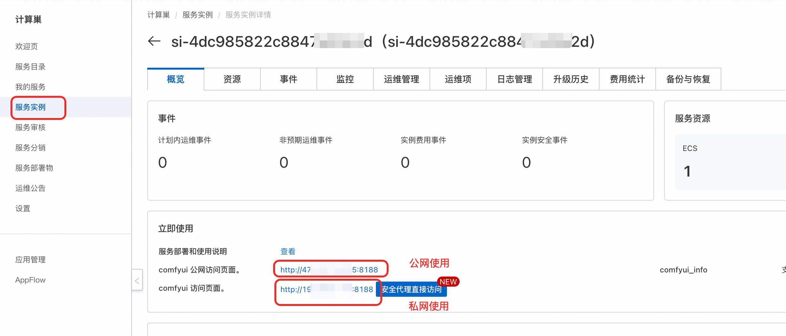
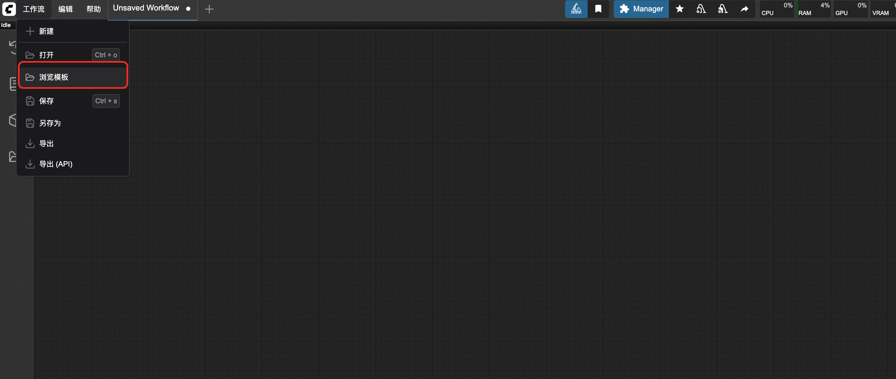
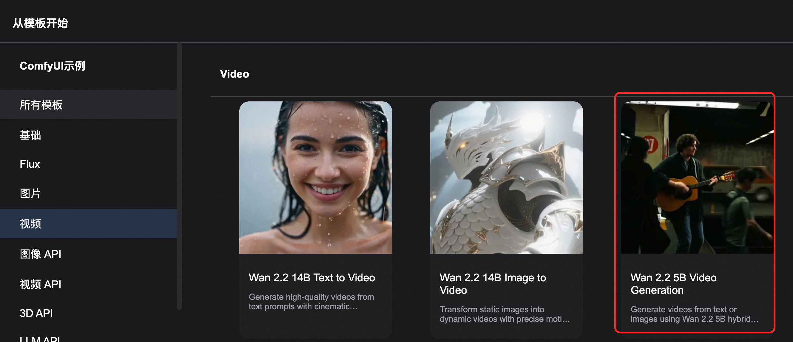

<div style="background: linear-gradient(135deg, #2563eb, #1e40af); padding: 24px; border-radius: 8px; color: white; text-align: center; margin-bottom: 24px;">
  <h1 style="font-size: 2.5em; margin: 0; font-weight: 600;">🎬 Tongyi Wanxiang 2.2-Text-Image-to-Video-5B</h1>
  <p style="font-size: 1.2em; margin: 16px 0 0 0; opacity: 0.9;">Efficient HD Hybrid Text-Image-to-Video Generation Model - Consumer GPU Professional Edition</p>
  <div style="margin-top: 20px;">
    <span style="background: rgba(255,255,255,0.2); color: white; padding: 4px 12px; border-radius: 12px; font-size: 14px; margin: 0 8px;">🧠 5B Dense Parameters</span>
    <span style="background: rgba(255,255,255,0.2); color: white; padding: 4px 12px; border-radius: 12px; font-size: 14px; margin: 0 8px;">🎯 720P@24fps</span>
    <span style="background: rgba(255,255,255,0.2); color: white; padding: 4px 12px; border-radius: 12px; font-size: 14px; margin: 0 8px;">⚡ Consumer GPU</span>
  </div>
</div>

## 📋 Model Overview

<div style="background: #f8fafc; border: 1px solid #e2e8f0; border-radius: 8px; padding: 20px; margin: 16px 0;">

**Tongyi Wanxiang 2.2-Text-Image-to-Video-5B (TI2V-5B)** is a revolutionary text-image-to-video generation model based on high-compression VAE architecture. Built with the advanced Wan2.2-VAE, this model achieves a 16×16×4 compression ratio, supporting 720P resolution and 24fps text-to-video and image-to-video generation. It can run efficiently on a single consumer-grade GPU like A10, making it one of the fastest 720P@24fps video generation models available.

<div style="display: grid; grid-template-columns: repeat(auto-fit, minmax(250px, 1fr)); gap: 16px; margin: 16px 0;">
  <div style="background: #eff6ff; border-left: 4px solid #2563eb; padding: 16px; border-radius: 4px;">
    <strong>🏷️ Model Identifier</strong><br>
    <div style="margin-top: 8px;">
      <span style="background: #2563eb; color: white; padding: 4px 12px; border-radius: 6px; font-size: 12px; margin-right: 8px;">Wan-AI/Wan2.2-TI2V-5B</span>
    </div>
  </div>

  <div style="background: #f0fdf4; border-left: 4px solid #059669; padding: 16px; border-radius: 4px;">
    <strong>📊 Architecture Scale</strong><br>
    <div style="margin-top: 8px;">
      <span style="background: #059669; color: white; padding: 4px 12px; border-radius: 6px; font-size: 12px; margin-right: 8px;">5B Dense Parameters</span>
      <span style="background: #16a34a; color: white; padding: 4px 12px; border-radius: 6px; font-size: 12px;">High-Compression VAE</span>
    </div>
  </div>

  <div style="background: #fef3c7; border-left: 4px solid #d97706; padding: 16px; border-radius: 4px;">
    <strong>🎯 Core Functions</strong><br>
    <div style="margin-top: 8px;">
      <span style="background: #d97706; color: white; padding: 4px 12px; border-radius: 6px; font-size: 12px; margin-right: 8px;">Text-to-Video</span>
      <span style="background: #ea580c; color: white; padding: 4px 12px; border-radius: 6px; font-size: 12px;">Image-to-Video</span>
    </div>
  </div>
</div>

</div>

## 🚀 Core Technical Breakthroughs

<div style="display: grid; grid-template-columns: repeat(auto-fit, minmax(300px, 1fr)); gap: 16px; margin: 16px 0;">

<div style="background: #f8fafc; border: 1px solid #e2e8f0; border-radius: 8px; padding: 20px;">
<h3 style="margin-top: 0; color: #1e40af;">🔧 High-Compression VAE Architecture</h3>
<ul style="margin: 0; padding-left: 20px;">
  <li><strong>Ultra-High Compression</strong>: 16×16×4 compression ratio, total 64x compression</li>
  <li><strong>Quality Assurance</strong>: High-quality video reconstruction with excellent detail preservation</li>
  <li><strong>Memory Optimization</strong>: Significantly reduces GPU memory usage</li>
  <li><strong>Speed Enhancement</strong>: Accelerates inference process and improves generation efficiency</li>
</ul>
</div>

<div style="background: #f8fafc; border: 1px solid #e2e8f0; border-radius: 8px; padding: 20px;">
<h3 style="margin-top: 0; color: #1e40af;">⚡ Consumer GPU Friendly</h3>
<ul style="margin: 0; padding-left: 20px;">
  <li><strong>A10 Compatible</strong>: Runs on single card with 24GB VRAM</li>
  <li><strong>Fast Generation</strong>: Generates 5-second 720P video in 9 minutes</li>
  <li><strong>Efficient Deployment</strong>: Runs efficiently without special optimization</li>
  <li><strong>Cost-Effective</strong>: Lowers hardware barriers, democratizes AI video generation</li>
</ul>
</div>

<div style="background: #f8fafc; border: 1px solid #e2e8f0; border-radius: 8px; padding: 20px;">
<h3 style="margin-top: 0; color: #1e40af;">🎬 Unified Dual-Modal Generation</h3>
<ul style="margin: 0; padding-left: 20px;">
  <li><strong>Text-to-Video</strong>: Generate high-quality videos from pure text descriptions</li>
  <li><strong>Image-to-Video</strong>: Create dynamic videos based on input images</li>
  <li><strong>Unified Framework</strong>: Single model supports dual functionality</li>
  <li><strong>Seamless Switching</strong>: Automatically selects generation mode based on input</li>
</ul>
</div>

<div style="background: #f8fafc; border: 1px solid #e2e8f0; border-radius: 8px; padding: 20px;">
<h3 style="margin-top: 0; color: #1e40af;">📈 Cinematic-Grade Aesthetic Quality</h3>
<ul style="margin: 0; padding-left: 20px;">
  <li><strong>720P HD</strong>: Supports 1280×704 resolution output</li>
  <li><strong>24fps Smooth</strong>: Cinematic frame rate with natural, fluid motion</li>
  <li><strong>Aesthetic Optimization</strong>: Inherits Wan2.2 cinematic-grade aesthetic features</li>
  <li><strong>Rich Details</strong>: Fine textures and dynamic expressions</li>
</ul>
</div>

</div>

## 🔧 Technical Specifications Comparison

<div style="overflow-x: auto; margin: 16px 0;">
<table style="width: 100%; border-collapse: collapse; background: white; border-radius: 6px; overflow: hidden; box-shadow: 0 1px 3px rgba(0,0,0,0.1);">
  <thead style="background: #f8fafc;">
    <tr>
      <th style="padding: 12px; text-align: left; border-bottom: 1px solid #e2e8f0; color: #1e40af; font-weight: 600;">Specification</th>
      <th style="padding: 12px; text-align: left; border-bottom: 1px solid #e2e8f0; color: #1e40af; font-weight: 600;">Traditional Models</th>
      <th style="padding: 12px; text-align: left; border-bottom: 1px solid #e2e8f0; color: #1e40af; font-weight: 600;">Wan2.2-TI2V-5B</th>
      <th style="padding: 12px; text-align: left; border-bottom: 1px solid #e2e8f0; color: #1e40af; font-weight: 600;">Advantages</th>
    </tr>
  </thead>
  <tbody>
    <tr>
      <td style="padding: 12px; border-bottom: 1px solid #f1f5f9; font-weight: 500;">Architecture Type</td>
      <td style="padding: 12px; border-bottom: 1px solid #f1f5f9;">Traditional Diffusion Model</td>
      <td style="padding: 12px; border-bottom: 1px solid #f1f5f9;">High-Compression VAE + Dense Model</td>
      <td style="padding: 12px; border-bottom: 1px solid #f1f5f9;"><span style="background: #dcfce7; color: #059669; padding: 2px 8px; border-radius: 4px; font-size: 12px;">Architecture Innovation</span></td>
    </tr>
    <tr>
      <td style="padding: 12px; border-bottom: 1px solid #f1f5f9; font-weight: 500;">Parameter Scale</td>
      <td style="padding: 12px; border-bottom: 1px solid #f1f5f9;">14B+</td>
      <td style="padding: 12px; border-bottom: 1px solid #f1f5f9;">5B Dense Parameters</td>
      <td style="padding: 12px; border-bottom: 1px solid #f1f5f9;"><span style="background: #dcfce7; color: #059669; padding: 2px 8px; border-radius: 4px; font-size: 12px;">Lightweight & Efficient</span></td>
    </tr>
    <tr>
      <td style="padding: 12px; border-bottom: 1px solid #f1f5f9; font-weight: 500;">Supported Resolution</td>
      <td style="padding: 12px; border-bottom: 1px solid #f1f5f9;">480P-720P</td>
      <td style="padding: 12px; border-bottom: 1px solid #f1f5f9;">720P@24fps (1280×704)</td>
      <td style="padding: 12px; border-bottom: 1px solid #f1f5f9;"><span style="background: #dcfce7; color: #059669; padding: 2px 8px; border-radius: 4px; font-size: 12px;">HD & Smooth</span></td>
    </tr>
    <tr>
      <td style="padding: 12px; border-bottom: 1px solid #f1f5f9; font-weight: 500;">Generation Modes</td>
      <td style="padding: 12px; border-bottom: 1px solid #f1f5f9;">Single Mode</td>
      <td style="padding: 12px; border-bottom: 1px solid #f1f5f9;">Text + Image Dual-Modal</td>
      <td style="padding: 12px; border-bottom: 1px solid #f1f5f9;"><span style="background: #dcfce7; color: #059669; padding: 2px 8px; border-radius: 4px; font-size: 12px;">Unified Framework</span></td>
    </tr>
    <tr>
      <td style="padding: 12px; border-bottom: 1px solid #f1f5f9; font-weight: 500;">Hardware Requirements</td>
      <td style="padding: 12px; border-bottom: 1px solid #f1f5f9;">80GB+ Professional Cards</td>
      <td style="padding: 12px; border-bottom: 1px solid #f1f5f9;">24GB Consumer GPU</td>
      <td style="padding: 12px; border-bottom: 1px solid #f1f5f9;"><span style="background: #dcfce7; color: #059669; padding: 2px 8px; border-radius: 4px; font-size: 12px;">Lower Barrier</span></td>
    </tr>
    <tr>
      <td style="padding: 12px; border-bottom: 1px solid #f1f5f9; font-weight: 500;">Generation Speed</td>
      <td style="padding: 12px; border-bottom: 1px solid #f1f5f9;">15-30 minutes</td>
      <td style="padding: 12px; border-bottom: 1px solid #f1f5f9;">9 minutes/5-second video</td>
      <td style="padding: 12px; border-bottom: 1px solid #f1f5f9;"><span style="background: #dcfce7; color: #059669; padding: 2px 8px; border-radius: 4px; font-size: 12px;">Speed Leading</span></td>
    </tr>
    <tr>
      <td style="padding: 12px; font-weight: 500;">Integration Ecosystem</td>
      <td style="padding: 12px;">Limited Support</td>
      <td style="padding: 12px;">ComfyUI + Diffusers + ModelScope</td>
      <td style="padding: 12px;"><span style="background: #dcfce7; color: #059669; padding: 2px 8px; border-radius: 4px; font-size: 12px;">Complete Ecosystem</span></td>
    </tr>
  </tbody>
</table>
</div>

### ⚡ Performance Benchmark

<div style="background: #eff6ff; border-left: 4px solid #2563eb; padding: 16px; margin: 16px 0; border-radius: 4px;">
  <strong>🏆 Industry-Leading Performance</strong><br>
  TI2V-5B is one of the fastest available 720P@24fps video generation models, achieving unprecedented generation efficiency on consumer GPUs, meeting the dual demands of industrial applications and academic research.
</div>

## 🎬 Usage Guide

<div style="background: #f8fafc; border: 1px solid #e2e8f0; border-radius: 8px; padding: 20px; margin: 16px 0;">
Supports both text-to-video and image-to-video generation
</div>

## 🎯 ComfyUI Integration Guide

<div style="background: #f8fafc; border: 1px solid #e2e8f0; border-radius: 8px; padding: 20px; margin: 16px 0;">

### 🚀 Step 1: Access Interface

<div style="background: #eff6ff; border-left: 4px solid #2563eb; padding: 16px; margin: 16px 0; border-radius: 4px;">
  <strong>🔗 Interface Access</strong><br>
  Click the access link at the service instance to enter the ComfyUI visual interface


</div>

### 🔧 Step 2: Select TI2V Workflow

<div style="background: #fff7ed; border-left: 4px solid #ea580c; padding: 16px; border-radius: 4px; margin: 16px 0;">
  <strong>📋 Workflow Selection</strong><br>
  Select the TI2V-5B dedicated workflow from the top-left corner, ensuring correct model configuration




</div>

### 📤 Step 3: Configure Input

<div style="background: #f8fafc; border: 1px solid #e2e8f0; border-radius: 8px; padding: 16px; margin: 16px 0;">

**Text-to-Video Mode:**
- Fill in detailed prompts in the text input box
- Set resolution to 1280×704
- Configure frame count and other parameters

**Image-to-Video Mode:**
- Upload input image (supports JPG, PNG, WebP)
- Fill in prompts describing image actions
- System automatically adapts to image aspect ratio

<div style="background: #eff6ff; border-left: 4px solid #2563eb; padding: 12px; margin: 12px 0; border-radius: 4px;">
  <strong>💡 Input Requirements</strong><br>
  • Image Resolution: Recommended 1280×704 or similar ratio<br>
  • File Size: Suggested under 10MB<br>
  • Prompt Length: Recommended 50-200 characters
</div>

</div>

### ⚙️ Step 4: Parameter Configuration

<div style="overflow-x: auto; margin: 16px 0;">
<table style="width: 100%; border-collapse: collapse; background: white; border-radius: 6px; overflow: hidden; box-shadow: 0 1px 3px rgba(0,0,0,0.1);">
  <thead style="background: #f8fafc;">
    <tr>
      <th style="padding: 12px; text-align: left; border-bottom: 1px solid #e2e8f0;">Parameter Name</th>
      <th style="padding: 12px; text-align: left; border-bottom: 1px solid #e2e8f0;">Recommended Value</th>
      <th style="padding: 12px; text-align: left; border-bottom: 1px solid #e2e8f0;">Description</th>
    </tr>
  </thead>
  <tbody>
    <tr>
      <td style="padding: 12px; border-bottom: 1px solid #f1f5f9;"><strong>generation_width</strong></td>
      <td style="padding: 12px; border-bottom: 1px solid #f1f5f9;">1280</td>
      <td style="padding: 12px; border-bottom: 1px solid #f1f5f9;">Video width (720P standard)</td>
    </tr>
    <tr>
      <td style="padding: 12px; border-bottom: 1px solid #f1f5f9;"><strong>generation_height</strong></td>
      <td style="padding: 12px; border-bottom: 1px solid #f1f5f9;">704</td>
      <td style="padding: 12px; border-bottom: 1px solid #f1f5f9;">Video height (16:9 ratio)</td>
    </tr>
    <tr>
      <td style="padding: 12px; border-bottom: 1px solid #f1f5f9;"><strong>num_frames</strong></td>
      <td style="padding: 12px; border-bottom: 1px solid #f1f5f9;">121</td>
      <td style="padding: 12px; border-bottom: 1px solid #f1f5f9;">Video frames (5 seconds@24fps)</td>
    </tr>
    <tr>
      <td style="padding: 12px; border-bottom: 1px solid #f1f5f9;"><strong>fps</strong></td>
      <td style="padding: 12px; border-bottom: 1px solid #f1f5f9;">24</td>
      <td style="padding: 12px; border-bottom: 1px solid #f1f5f9;">Frame rate setting</td>
    </tr>
    <tr>
      <td style="padding: 12px; font-weight: 500;"><strong>guidance_scale</strong></td>
      <td style="padding: 12px;">7.0</td>
      <td style="padding: 12px;">Guidance strength</td>
    </tr>
  </tbody>
</table>
</div>

### 🎬 Step 5: Execute Generation

<div style="background: #eff6ff; border-left: 4px solid #2563eb; padding: 16px; margin: 16px 0; border-radius: 4px;">
  <strong>🚀 Start Generation</strong><br>
  Click the <strong>"Queue Prompt"</strong> button in the right panel to start video generation<br>
  Monitor real-time status in the progress bar, expected completion in 9 minutes
</div>

</div>

## 🔌 ComfyUI API Integration

### 🔑 Authentication Information

<div style="display: grid; grid-template-columns: 1fr 1fr; gap: 16px; margin: 16px 0;">

<div style="background: #fff7ed; border-left: 4px solid #ea580c; padding: 16px; border-radius: 4px;">
<h4 style="color: #ea580c; margin: 0 0 8px 0;">🔐 Get Token</h4>
<p style="margin: 0 0 12px 0;">Click the settings button in the top-right corner, open the bottom panel to get API Token</p>
<div style="text-align: center; padding: 12px; background: #f8fafc; border-radius: 6px;">
  <div style="background: #fed7aa; color: #ea580c; padding: 8px 16px; border-radius: 6px; display: inline-block;">
    🔑 API Token Interface
  </div>
</div>


</div>

<div style="background: #eff6ff; border-left: 4px solid #2563eb; padding: 16px; border-radius: 4px;">
<h4 style="color: #2563eb; margin: 0 0 8px 0;">🌐 Get Server Address</h4>
<p style="margin: 0 0 12px 0;">Get COMFYUI_SERVER address from service instance information</p>
<div style="text-align: center; padding: 12px; background: #f8fafc; border-radius: 6px;">
  <div style="background: #dbeafe; color: #2563eb; padding: 8px 16px; border-radius: 6px; display: inline-block;">
    🌐 Server Address Configuration
  </div>
</div>


</div>

</div>

### 💻 Python API Example

<details style="border: 2px solid #2563eb; border-radius: 12px; padding: 20px; margin: 20px 0; background: linear-gradient(145deg, #f8fafc, #eff6ff); box-shadow: 0 8px 16px rgba(37, 99, 235, 0.15);">
<summary style="font-weight: bold; font-size: 18px; color: white; cursor: pointer; padding: 16px; background: linear-gradient(135deg, #2563eb, #1e40af); border-radius: 8px; margin: -20px -20px 20px -20px; text-shadow: 1px 1px 2px rgba(0,0,0,0.2); transition: all 0.3s ease; display: flex; align-items: center; box-shadow: 0 4px 8px rgba(37, 99, 235, 0.3);">
🐍 Click to expand complete Python API code
</summary>

```python
import requests, json, uuid, time, random, os

# 🔧 配置参数 - Wan2.2 专用
COMFYUI_SERVER = "127.0.0.1:8188"  # 本地服务器
COMFYUI_TOKEN = ""  # 本地通常不需要token
UNET_MODEL = "wan2.2_ti2v_5B_fp16.safetensors"
CLIP_MODEL = "umt5_xxl_fp8_e4m3fn_scaled.safetensors"
VAE_MODEL = "wan2.2_vae.safetensors"

# 🎯 预设参数
PROMPT = "Low contrast. In a retro 1970s-style subway station, a street musician plays in dim colors and rough textures. He wears an old jacket, playing guitar with focus. Commuters hurry by, and a small crowd gathers to listen. The camera slowly moves right, capturing the blend of music and city noise, with old subway signs and mottled walls in the background."
NEG_PROMPT = "色调艳丽，过曝，静态，细节模糊不清，字幕，风格，作品，画作，画面，静止，整体发灰，最差质量，低质量，JPEG压缩残留，丑陋的，残缺的，多余的手指，画得不好的手部，画得不好的脸部，畸形的，毁容的，形态畸形的肢体，手指融合，静止不动的画面，杂乱的背景，三条腿，背景人很多，倒着走"

class ComfyUIWan22Client:
    def __init__(self, server=COMFYUI_SERVER, token=COMFYUI_TOKEN):
        self.base_url = f"http://{server}"
        self.token = token
        self.client_id = str(uuid.uuid4())
        self.headers = {"Content-Type": "application/json"}
        if token:
            self.headers["Authorization"] = f"Bearer {token}"

    def generate_wan22_t2v(self, prompt, neg_prompt, steps=20, cfg=5, width=1280, height=704, frames=121):
        """🎬 Wan2.2 文生视频生成 - 基于原始JSON工作流"""
        print("🎬 开始文生视频任务...")

        # 完全基于你提供的JSON工作流，只修改提示词
        workflow = {
            "3": {
                "inputs": {
                    "seed": random.randint(1, 1000000000000000),
                    "steps": steps,
                    "cfg": cfg,
                    "sampler_name": "uni_pc",
                    "scheduler": "simple",
                    "denoise": 1,
                    "model": ["48", 0],
                    "positive": ["6", 0],
                    "negative": ["7", 0],
                    "latent_image": ["55", 0]
                },
                "class_type": "KSampler",
                "_meta": {"title": "K采样器"}
            },
            "6": {
                "inputs": {
                    "text": prompt,
                    "clip": ["38", 0]
                },
                "class_type": "CLIPTextEncode",
                "_meta": {"title": "CLIP Text Encode (Positive Prompt)"}
            },
            "7": {
                "inputs": {
                    "text": neg_prompt,
                    "clip": ["38", 0]
                },
                "class_type": "CLIPTextEncode",
                "_meta": {"title": "CLIP Text Encode (Negative Prompt)"}
            },
            "8": {
                "inputs": {
                    "samples": ["3", 0],
                    "vae": ["39", 0]
                },
                "class_type": "VAEDecode",
                "_meta": {"title": "VAE解码"}
            },
            "37": {
                "inputs": {
                    "unet_name": UNET_MODEL,
                    "weight_dtype": "default"
                },
                "class_type": "UNETLoader",
                "_meta": {"title": "UNet加载器"}
            },
            "38": {
                "inputs": {
                    "clip_name": CLIP_MODEL,
                    "type": "wan",
                    "device": "default"
                },
                "class_type": "CLIPLoader",
                "_meta": {"title": "加载CLIP"}
            },
            "39": {
                "inputs": {
                    "vae_name": VAE_MODEL
                },
                "class_type": "VAELoader",
                "_meta": {"title": "加载VAE"}
            },
            "48": {
                "inputs": {
                    "shift": 8,
                    "model": ["37", 0]
                },
                "class_type": "ModelSamplingSD3",
                "_meta": {"title": "采样算法（SD3）"}
            },
            "55": {
                "inputs": {
                    "width": width,
                    "height": height,
                    "length": frames,
                    "batch_size": 1,
                    "vae": ["39", 0]
                },
                "class_type": "Wan22ImageToVideoLatent",  # 保持原始节点名称
                "_meta": {"title": "Wan22ImageToVideoLatent"}
            },
            "57": {
                "inputs": {
                    "fps": 24,
                    "images": ["8", 0]
                },
                "class_type": "CreateVideo",
                "_meta": {"title": "创建视频"}
            },
            "58": {
                "inputs": {
                    "filename_prefix": "video/ComfyUI",
                    "format": "auto",
                    "codec": "auto",
                    "video": ["57", 0]
                },
                "class_type": "SaveVideo",
                "_meta": {"title": "保存视频"}
            }
        }

        print("📤 提交 Wan2.2 文生视频工作流...")
        response = requests.post(f"{self.base_url}/prompt", headers=self.headers, json={"prompt": workflow, "client_id": self.client_id})
        print(f"API Response: {response.text}")

        if response.status_code != 200:
            raise Exception(f"API请求失败，状态码: {response.status_code}")

        result = response.json()
        if "error" in result:
            raise Exception(f"Workflow error: {result['error']}")
        if "prompt_id" not in result:
            raise Exception(f"No prompt_id in response: {result}")
        return result["prompt_id"]

    def get_status(self, task_id):
        """📊 获取任务状态"""
        try:
            queue_data = requests.get(f"{self.base_url}/queue", headers=self.headers).json()
            if any(item[1] == task_id for item in queue_data.get("queue_running", [])):
                return "processing"
            if any(item[1] == task_id for item in queue_data.get("queue_pending", [])):
                return "pending"
            history_response = requests.get(f"{self.base_url}/history/{task_id}", headers=self.headers)
            return "completed" if history_response.status_code == 200 and task_id in history_response.json() else "processing"
        except:
            return "processing"

    def download_video(self, task_id, output_path="wan22_t2v_output.mp4"):
        """📥 下载生成的视频"""
        try:
            response = requests.get(f"{self.base_url}/history/{task_id}", headers=self.headers)
            history = response.json()
            if task_id in history:
                for output in history[task_id]['outputs'].values():
                    # 查找视频文件
                    if 'videos' in output:
                        filename = output['videos'][0]['filename']
                        video_response = requests.get(f"{self.base_url}/view?filename={filename}", headers=self.headers)
                        with open(output_path, "wb") as f:
                            f.write(video_response.content)
                        return output_path
                    # 兼容其他可能的输出格式
                    elif 'gifs' in output:
                        filename = output['gifs'][0]['filename']
                        video_response = requests.get(f"{self.base_url}/view?filename={filename}", headers=self.headers)
                        with open(output_path, "wb") as f:
                            f.write(video_response.content)
                        return output_path
        except Exception as e:
            print(f"Download error: {e}")
        return None

def main():
    """🚀 主函数 - 执行 Wan2.2 文生视频任务"""
    client = ComfyUIWan22Client()
    try:
        print(f"🎬 开始 Wan2.2 文生视频任务...")
        print(f"📝 正向提示词: {PROMPT}")
        print(f"🚫 负向提示词: {NEG_PROMPT}")

        # 文生视频生成
        task_id = client.generate_wan22_t2v(PROMPT, NEG_PROMPT, 20, 5, 1280, 704, 121)
        print(f"🆔 Task ID: {task_id}")

        while True:
            status = client.get_status(task_id)
            print(f"📊 Current status: {status}")
            if status == "completed":
                print("✅ Wan2.2 Video ready!");
                break
            elif status == "failed":
                print("❌ Generation failed!");
                exit(1)
            time.sleep(10)

        output_file = client.download_video(task_id, "wan22_t2v_output.mp4")
        print("🎉 Video downloaded successfully!" if output_file else "❌ Failed to download video")
        if output_file:
            print(f"📁 Saved as: {output_file}")

    except Exception as e:
        print(f"❌ Error: {e}")

if __name__ == "__main__":
    main()
```

</details>

### 🔗 ComfyUI API Endpoints

<div style="overflow-x: auto; margin: 16px 0;">
<table style="width: 100%; border-collapse: collapse; background: white; border-radius: 6px; overflow: hidden; box-shadow: 0 1px 3px rgba(0,0,0,0.1);">
  <thead style="background: #f8fafc;">
    <tr>
      <th style="padding: 12px; text-align: left; border-bottom: 1px solid #e2e8f0; color: #1e40af; font-weight: 600;">Endpoint</th>
      <th style="padding: 12px; text-align: left; border-bottom: 1px solid #e2e8f0; color: #1e40af; font-weight: 600;">Method</th>
      <th style="padding: 12px; text-align: left; border-bottom: 1px solid #e2e8f0; color: #1e40af; font-weight: 600;">Function</th>
      <th style="padding: 12px; text-align: left; border-bottom: 1px solid #e2e8f0; color: #1e40af; font-weight: 600;">Description</th>
    </tr>
  </thead>
  <tbody>
    <tr>
      <td style="padding: 12px; border-bottom: 1px solid #f1f5f9; font-family: monospace; background: #f8fafc;">/queue</td>
      <td style="padding: 12px; border-bottom: 1px solid #f1f5f9;">GET</td>
      <td style="padding: 12px; border-bottom: 1px solid #f1f5f9;">Get queue status</td>
      <td style="padding: 12px; border-bottom: 1px solid #f1f5f9;">View current task queue and running status</td>
    </tr>
    <tr>
      <td style="padding: 12px; border-bottom: 1px solid #f1f5f9; font-family: monospace; background: #f8fafc;">/prompt</td>
      <td style="padding: 12px; border-bottom: 1px solid #f1f5f9;">POST</td>
      <td style="padding: 12px; border-bottom: 1px solid #f1f5f9;">Submit workflow</td>
      <td style="padding: 12px; border-bottom: 1px solid #f1f5f9;">Execute Wan2.2 TI2V tasks</td>
    </tr>
    <tr>
      <td style="padding: 12px; border-bottom: 1px solid #f1f5f9; font-family: monospace; background: #f8fafc;">/history/{prompt_id}</td>
      <td style="padding: 12px; border-bottom: 1px solid #f1f5f9;">GET</td>
      <td style="padding: 12px; border-bottom: 1px solid #f1f5f9;">Get execution history</td>
      <td style="padding: 12px; border-bottom: 1px solid #f1f5f9;">View task execution results and outputs</td>
    </tr>
    <tr>
      <td style="padding: 12px; border-bottom: 1px solid #f1f5f9; font-family: monospace; background: #f8fafc;">/upload/image</td>
      <td style="padding: 12px; border-bottom: 1px solid #f1f5f9;">POST</td>
      <td style="padding: 12px; border-bottom: 1px solid #f1f5f9;">Upload image</td>
      <td style="padding: 12px; border-bottom: 1px solid #f1f5f9;">Upload input image files</td>
    </tr>
    <tr>
      <td style="padding: 12px; font-family: monospace; background: #f8fafc;">/view</td>
      <td style="padding: 12px;">GET</td>
      <td style="padding: 12px;">Download output files</td>
      <td style="padding: 12px;">Get generated result files</td>
    </tr>
  </tbody>
</table>
</div>

## 💡 Prompt Optimization Guide

<div style="display: grid; grid-template-columns: 1fr 1fr; gap: 16px; margin: 16px 0;">

<div style="background: #f0fdf4; border-left: 4px solid #059669; padding: 16px; border-radius: 4px;">
<h4 style="color: #059669; margin: 0 0 8px 0;">✅ High-Quality Prompt Examples</h4>

<div style="background: #f8fafc; padding: 12px; border-radius: 6px; margin: 8px 0;">
<p style="margin: 0; font-weight: bold; color: #065f46; font-size: 14px;">Action Scene:</p>
<p style="margin: 4px 0 0 0; font-style: italic; color: #065f46; font-size: 13px;">"Two anthropomorphic cats in boxing gear fight intensely on a spotlighted stage, dynamic movements, professional lighting"</p>
</div>

<div style="background: #f8fafc; padding: 12px; border-radius: 6px; margin: 8px 0;">
<p style="margin: 0; font-weight: bold; color: #065f46; font-size: 14px;">Natural Scene:</p>
<p style="margin: 4px 0 0 0; font-style: italic; color: #065f46; font-size: 13px;">"A white cat on a surfboard at the beach, summer vacation style, relaxed expression, crystal-clear waters background"</p>
</div>

</div>

<div style="background: #fff7ed; border-left: 4px solid #ea580c; padding: 16px; border-radius: 4px;">
<h4 style="color: #ea580c; margin: 0 0 8px 0;">🎯 Prompt Writing Tips</h4>

<ul style="margin: 0; padding-left: 20px; color: #9a3412;">
  <li><strong>Specific Description</strong>: Detailed scene, action, and emotion descriptions</li>
  <li><strong>Visual Elements</strong>: Include lighting, composition, and color information</li>
  <li><strong>Dynamic Expression</strong>: Clearly specify motion type and intensity</li>
  <li><strong>Style Definition</strong>: Specify artistic or filming style</li>
  <li><strong>Quality Keywords</strong>: Add "high quality", "cinematic", etc.</li>
</ul>

</div>

</div>

## 🎯 Application Scenarios

<div style="display: grid; grid-template-columns: repeat(auto-fit, minmax(280px, 1fr)); gap: 16px; margin: 16px 0;">

<div style="background: #eff6ff; border-left: 4px solid #2563eb; padding: 16px; border-radius: 4px; text-align: center;">
<div style="font-size: 2.5em; margin-bottom: 12px; color: #2563eb;">🎬</div>
<h4 style="margin: 0 0 8px 0; color: #1e40af;">Content Creation</h4>
<p style="margin: 0; color: #1e40af;">Short video production, social media content, creative animation</p>
</div>

<div style="background: #f0fdf4; border-left: 4px solid #059669; padding: 16px; border-radius: 4px; text-align: center;">
<div style="font-size: 2.5em; margin-bottom: 12px; color: #059669;">🛍️</div>
<h4 style="margin: 0 0 8px 0; color: #059669;">Commercial Applications</h4>
<p style="margin: 0; color: #065f46;">Product showcases, advertising production, marketing videos</p>
</div>

<div style="background: #fff7ed; border-left: 4px solid #ea580c; padding: 16px; border-radius: 4px; text-align: center;">
<div style="font-size: 2.5em; margin-bottom: 12px; color: #ea580c;">🎓</div>
<h4 style="margin: 0 0 8px 0; color: #ea580c;">Education & Training</h4>
<p style="margin: 0; color: #9a3412;">Educational animations, demonstration videos, course content</p>
</div>

<div style="background: #f5f3ff; border-left: 4px solid #7c3aed; padding: 16px; border-radius: 4px; text-align: center;">
<div style="font-size: 2.5em; margin-bottom: 12px; color: #7c3aed;">🔬</div>
<h4 style="margin: 0 0 8px 0; color: #7c3aed;">Academic Research</h4>
<p style="margin: 0; color: #5b21b6;">Algorithm validation, model comparison, technical exploration</p>
</div>

</div>

## 📊 Performance Benchmark Comparison

<div style="background: #f8fafc; border: 1px solid #e2e8f0; border-radius: 8px; padding: 20px; margin: 16px 0;">

### 🏆 Comparison with SOTA Models

<div style="background: #eff6ff; border-left: 4px solid #2563eb; padding: 16px; margin: 16px 0; border-radius: 4px;">
  <strong>🎯 Wan-Bench 2.0 Evaluation Results</strong><br>
  In the latest Wan-Bench 2.0 benchmark tests, TI2V-5B demonstrates excellent performance across multiple key dimensions, achieving leading levels among open-source models.
</div>

<div style="overflow-x: auto; margin: 16px 0;">
<table style="width: 100%; border-collapse: collapse; background: white; border-radius: 6px; overflow: hidden; box-shadow: 0 1px 3px rgba(0,0,0,0.1);">
  <thead style="background: #f8fafc;">
    <tr>
      <th style="padding: 12px; text-align: left; border-bottom: 1px solid #e2e8f0; color: #1e40af; font-weight: 600;">Evaluation Dimension</th>
      <th style="padding: 12px; text-align: left; border-bottom: 1px solid #e2e8f0; color: #1e40af; font-weight: 600;">TI2V-5B</th>
      <th style="padding: 12px; text-align: left; border-bottom: 1px solid #e2e8f0; color: #1e40af; font-weight: 600;">Competitor A</th>
      <th style="padding: 12px; text-align: left; border-bottom: 1px solid #e2e8f0; color: #1e40af; font-weight: 600;">Competitor B</th>
    </tr>
  </thead>
  <tbody>
    <tr>
      <td style="padding: 12px; border-bottom: 1px solid #f1f5f9; font-weight: 500;">Visual Quality</td>
      <td style="padding: 12px; border-bottom: 1px solid #f1f5f9;"><span style="background: #dcfce7; color: #059669; padding: 2px 8px; border-radius: 4px; font-size: 12px;">8.7/10</span></td>
      <td style="padding: 12px; border-bottom: 1px solid #f1f5f9;">8.2/10</td>
      <td style="padding: 12px; border-bottom: 1px solid #f1f5f9;">7.9/10</td>
    </tr>
    <tr>
      <td style="padding: 12px; border-bottom: 1px solid #f1f5f9; font-weight: 500;">Motion Naturalness</td>
      <td style="padding: 12px; border-bottom: 1px solid #f1f5f9;"><span style="background: #dcfce7; color: #059669; padding: 2px 8px; border-radius: 4px; font-size: 12px;">8.5/10</span></td>
      <td style="padding: 12px; border-bottom: 1px solid #f1f5f9;">8.1/10</td>
      <td style="padding: 12px; border-bottom: 1px solid #f1f5f9;">7.8/10</td>
    </tr>
    <tr>
      <td style="padding: 12px; border-bottom: 1px solid #f1f5f9; font-weight: 500;">Text Consistency</td>
      <td style="padding: 12px; border-bottom: 1px solid #f1f5f9;"><span style="background: #dcfce7; color: #059669; padding: 2px 8px; border-radius: 4px; font-size: 12px;">9.1/10</span></td>
      <td style="padding: 12px; border-bottom: 1px solid #f1f5f9;">8.6/10</td>
      <td style="padding: 12px; border-bottom: 1px solid #f1f5f9;">8.3/10</td>
    </tr>
    <tr>
      <td style="padding: 12px; border-bottom: 1px solid #f1f5f9; font-weight: 500;">Generation Speed</td>
      <td style="padding: 12px; border-bottom: 1px solid #f1f5f9;"><span style="background: #dcfce7; color: #059669; padding: 2px 8px; border-radius: 4px; font-size: 12px;">9.3/10</span></td>
      <td style="padding: 12px; border-bottom: 1px solid #f1f5f9;">7.5/10</td>
      <td style="padding: 12px; border-bottom: 1px solid #f1f5f9;">6.8/10</td>
    </tr>
    <tr>
      <td style="padding: 12px; font-weight: 500;">Hardware Friendliness</td>
      <td style="padding: 12px;"><span style="background: #dcfce7; color: #059669; padding: 2px 8px; border-radius: 4px; font-size: 12px;">9.5/10</span></td>
      <td style="padding: 12px;">6.2/10</td>
      <td style="padding: 12px;">5.9/10</td>
    </tr>
  </tbody>
</table>
</div>

</div>

## 🔗 Integration Ecosystem

<div style="display: grid; grid-template-columns: repeat(auto-fit, minmax(250px, 1fr)); gap: 16px; margin: 16px 0;">

<div style="background: #eff6ff; border-left: 4px solid #2563eb; padding: 16px; border-radius: 4px;">
  <strong>🎨 ComfyUI</strong><br>
  <div style="margin-top: 8px;">
    <span style="background: #fed7aa; color: #ea580c; padding: 4px 12px; border-radius: 12px; font-size: 12px; margin-right: 8px;">🚧 In Development</span>
    <span style="background: #dbeafe; color: #2563eb; padding: 4px 12px; border-radius: 12px; font-size: 12px;">Coming Soon</span>
  </div>
  <p style="margin: 8px 0 0 0; color: #1e40af; font-size: 14px;">Visual workflow integration</p>
</div>

<div style="background: #fef3c7; border-left: 4px solid #d97706; padding: 16px; border-radius: 4px;">
  <strong>🤖 ModelScope</strong><br>
  <div style="margin-top: 8px;">
    <span style="background: #dcfce7; color: #059669; padding: 4px 12px; border-radius: 12px; font-size: 12px; margin-right: 8px;">✅ Supported</span>
    <span style="background: #dbeafe; color: #2563eb; padding: 4px 12px; border-radius: 12px; font-size: 12px;">Native Integration</span>
  </div>
  <p style="margin: 8px 0 0 0; color: #9a3412; font-size: 14px;">Model hosting and distribution</p>
</div>

</div>

## 📄 License and Citation

<div style="background: #f8fafc; border: 1px solid #e2e8f0; border-radius: 8px; padding: 20px; margin: 16px 0;">

### 📋 Open Source License

<div style="background: #f0fdf4; border-left: 4px solid #059669; padding: 16px; margin: 16px 0; border-radius: 4px;">
  <strong>📜 Apache 2.0 License</strong><br>
  • Free to use and distribute<br>
  • Commercial-friendly open source license<br>
  • Complete usage rights granted<br>
  • Must comply with relevant laws and regulations
</div>

### 📚 Academic Citation

```bibtex
@article{wan2025,
      title={Wan: Open and Advanced Large-Scale Video Generative Models}, 
      author={Team Wan and Ang Wang and Baole Ai and Bin Wen and Chaojie Mao and Chen-Wei Xie and Di Chen and Feiwu Yu and Haiming Zhao and Jianxiao Yang and Jianyuan Zeng and Jiayu Wang and Jingfeng Zhang and Jingren Zhou and Jinkai Wang and Jixuan Chen and Kai Zhu and Kang Zhao and Keyu Yan and Lianghua Huang and Mengyang Feng and Ningyi Zhang and Pandeng Li and Pingyu Wu and Ruihang Chu and Ruili Feng and Shiwei Zhang and Siyang Sun and Tao Fang and Tianxing Wang and Tianyi Gui and Tingyu Weng and Tong Shen and Wei Lin and Wei Wang and Wei Wang and Wenmeng Zhou and Wente Wang and Wenting Shen and Wenyuan Yu and Xianzhong Shi and Xiaoming Huang and Xin Xu and Yan Kou and Yangyu Lv and Yifei Li and Yijing Liu and Yiming Wang and Yingya Zhang and Yitong Huang and Yong Li and You Wu and Yu Liu and Yulin Pan and Yun Zheng and Yuntao Hong and Yupeng Shi and Yutong Feng and Zeyinzi Jiang and Zhen Han and Zhi-Fan Wu and Ziyu Liu},
      journal = {arXiv preprint arXiv:2503.20314},
      year={2025}
}
```

</div>

<div style="text-align: center; padding: 16px; background: #f8fafc; border-radius: 6px; margin-top: 24px;">
  <p style="margin: 0; color: #64748b; font-size: 14px;">
    🎬 <strong>Tongyi Wanxiang 2.2-Text-Image-to-Video-5B</strong> | Efficient HD Hybrid Text-Image-to-Video Generation Model
  </p>
  <p style="margin: 4px 0 0 0; color: #94a3b8; font-size: 12px;">
    © Apache 2.0 Open Source License | Let creativity soar on consumer GPUs
  </p>
</div>