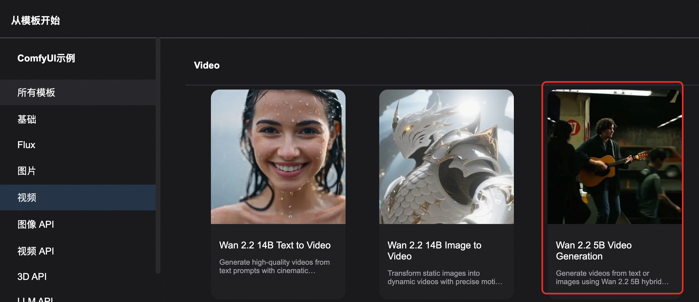

<div style="background: linear-gradient(135deg, #2563eb, #1e40af); padding: 24px; border-radius: 8px; color: white; text-align: center; margin-bottom: 24px;">
  <h2 style="margin: 0; color: white;">🎬 通义万相2.2-图文生视频-5B</h2>
  <p style="margin: 8px 0 0 0; opacity: 0.9;">高效的高清混合文本图像到视频生成模型 - 消费级GPU专业版</p>
  <div style="margin-top: 20px;">
    <span style="background: rgba(255,255,255,0.2); color: white; padding: 4px 12px; border-radius: 12px; font-size: 14px; margin: 0 8px;">🧠 5B 密集参数</span>
    <span style="background: rgba(255,255,255,0.2); color: white; padding: 4px 12px; border-radius: 12px; font-size: 14px; margin: 0 8px;">🎯 720P@24fps</span>
    <span style="background: rgba(255,255,255,0.2); color: white; padding: 4px 12px; border-radius: 12px; font-size: 14px; margin: 0 8px;">⚡ 消费级GPU</span>
  </div>
</div>

## 📋 模型概览

<div style="background: #f8fafc; border: 1px solid #e2e8f0; border-radius: 8px; padding: 20px; margin: 16px 0;">

**通义万相2.2-图文生视频-5B (TI2V-5B)** 是基于高压缩VAE架构的革命性文本图像到视频生成模型。该模型使用先进的Wan2.2-VAE构建，实现了16×16×4的压缩比，支持720P分辨率、24fps的文本到视频和图像到视频生成，可在单个消费级GPU如A10上高效运行，是目前最快的720P@24fps视频生成模型之一。

<div style="display: grid; grid-template-columns: repeat(auto-fit, minmax(250px, 1fr)); gap: 16px; margin: 16px 0;">
  <div style="background: #eff6ff; border-left: 4px solid #2563eb; padding: 16px; border-radius: 4px;">
    <strong>🏷️ 模型标识</strong><br>
    <div style="margin-top: 8px;">
      <span style="background: #2563eb; color: white; padding: 4px 12px; border-radius: 6px; font-size: 12px; margin-right: 8px;">Wan-AI/Wan2.2-TI2V-5B</span>
    </div>
  </div>

  <div style="background: #f0fdf4; border-left: 4px solid #059669; padding: 16px; border-radius: 4px;">
    <strong>📊 架构规模</strong><br>
    <div style="margin-top: 8px;">
      <span style="background: #059669; color: white; padding: 4px 12px; border-radius: 6px; font-size: 12px; margin-right: 8px;">5B 密集参数</span>
      <span style="background: #16a34a; color: white; padding: 4px 12px; border-radius: 6px; font-size: 12px;">高压缩VAE</span>
    </div>
  </div>

  <div style="background: #fef3c7; border-left: 4px solid #d97706; padding: 16px; border-radius: 4px;">
    <strong>🎯 核心功能</strong><br>
    <div style="margin-top: 8px;">
      <span style="background: #d97706; color: white; padding: 4px 12px; border-radius: 6px; font-size: 12px; margin-right: 8px;">文本生视频</span>
      <span style="background: #ea580c; color: white; padding: 4px 12px; border-radius: 6px; font-size: 12px;">图像生视频</span>
    </div>
  </div>
</div>

</div>

## 🚀 核心技术突破

<div style="display: grid; grid-template-columns: repeat(auto-fit, minmax(300px, 1fr)); gap: 16px; margin: 16px 0;">

<div style="background: #f8fafc; border: 1px solid #e2e8f0; border-radius: 8px; padding: 20px;">
<h3 style="margin-top: 0; color: #1e40af;">🔧 高压缩VAE架构</h3>
<ul style="margin: 0; padding-left: 20px;">
  <li><strong>超高压缩比</strong>：16×16×4 压缩率，总压缩比达64倍</li>
  <li><strong>质量保证</strong>：高质量视频重建，细节保持优异</li>
  <li><strong>内存优化</strong>：显著降低GPU内存占用</li>
  <li><strong>速度提升</strong>：加速推理过程，提高生成效率</li>
</ul>
</div>

<div style="background: #f8fafc; border: 1px solid #e2e8f0; border-radius: 8px; padding: 20px;">
<h3 style="margin-top: 0; color: #1e40af;">⚡ 消费级GPU友好</h3>
<ul style="margin: 0; padding-left: 20px;">
  <li><strong>A10</strong>：单卡24GB显存即可运行</li>
  <li><strong>快速生成</strong>：9分钟内生成5秒720P视频</li>
  <li><strong>高效部署</strong>：无需特殊优化即可高效运行</li>
  <li><strong>成本友好</strong>：降低硬件门槛，普及AI视频生成</li>
</ul>
</div>

<div style="background: #f8fafc; border: 1px solid #e2e8f0; border-radius: 8px; padding: 20px;">
<h3 style="margin-top: 0; color: #1e40af;">🎬 统一双模态生成</h3>
<ul style="margin: 0; padding-left: 20px;">
  <li><strong>文本生视频</strong>：纯文本描述生成高质量视频</li>
  <li><strong>图像生视频</strong>：基于输入图像生成动态视频</li>
  <li><strong>统一框架</strong>：单一模型支持双重功能</li>
  <li><strong>无缝切换</strong>：根据输入自动选择生成模式</li>
</ul>
</div>

<div style="background: #f8fafc; border: 1px solid #e2e8f0; border-radius: 8px; padding: 20px;">
<h3 style="margin-top: 0; color: #1e40af;">📈 电影级美学质量</h3>
<ul style="margin: 0; padding-left: 20px;">
  <li><strong>720P高清</strong>：支持1280×704分辨率输出</li>
  <li><strong>24fps流畅</strong>：电影级帧率，动作自然流畅</li>
  <li><strong>美学优化</strong>：继承Wan2.2电影级美学特性</li>
  <li><strong>细节丰富</strong>：精细的纹理和动态表现</li>
</ul>
</div>

</div>

## 🔧 技术规格对比

<div style="overflow-x: auto; margin: 16px 0;">
<table style="width: 100%; border-collapse: collapse; background: white; border-radius: 6px; overflow: hidden; box-shadow: 0 1px 3px rgba(0,0,0,0.1);">
  <thead style="background: #f8fafc;">
    <tr>
      <th style="padding: 12px; text-align: left; border-bottom: 1px solid #e2e8f0; color: #1e40af; font-weight: 600;">规格项目</th>
      <th style="padding: 12px; text-align: left; border-bottom: 1px solid #e2e8f0; color: #1e40af; font-weight: 600;">传统模型</th>
      <th style="padding: 12px; text-align: left; border-bottom: 1px solid #e2e8f0; color: #1e40af; font-weight: 600;">Wan2.2-TI2V-5B</th>
      <th style="padding: 12px; text-align: left; border-bottom: 1px solid #e2e8f0; color: #1e40af; font-weight: 600;">优势特点</th>
    </tr>
  </thead>
  <tbody>
    <tr>
      <td style="padding: 12px; border-bottom: 1px solid #f1f5f9; font-weight: 500;">架构类型</td>
      <td style="padding: 12px; border-bottom: 1px solid #f1f5f9;">传统扩散模型</td>
      <td style="padding: 12px; border-bottom: 1px solid #f1f5f9;">高压缩VAE + 密集模型</td>
      <td style="padding: 12px; border-bottom: 1px solid #f1f5f9;"><span style="background: #dcfce7; color: #059669; padding: 2px 8px; border-radius: 4px; font-size: 12px;">架构创新</span></td>
    </tr>
    <tr>
      <td style="padding: 12px; border-bottom: 1px solid #f1f5f9; font-weight: 500;">参数规模</td>
      <td style="padding: 12px; border-bottom: 1px solid #f1f5f9;">14B+</td>
      <td style="padding: 12px; border-bottom: 1px solid #f1f5f9;">5B 密集参数</td>
      <td style="padding: 12px; border-bottom: 1px solid #f1f5f9;"><span style="background: #dcfce7; color: #059669; padding: 2px 8px; border-radius: 4px; font-size: 12px;">轻量高效</span></td>
    </tr>
    <tr>
      <td style="padding: 12px; border-bottom: 1px solid #f1f5f9; font-weight: 500;">支持分辨率</td>
      <td style="padding: 12px; border-bottom: 1px solid #f1f5f9;">480P-720P</td>
      <td style="padding: 12px; border-bottom: 1px solid #f1f5f9;">720P@24fps (1280×704)</td>
      <td style="padding: 12px; border-bottom: 1px solid #f1f5f9;"><span style="background: #dcfce7; color: #059669; padding: 2px 8px; border-radius: 4px; font-size: 12px;">高清流畅</span></td>
    </tr>
    <tr>
      <td style="padding: 12px; border-bottom: 1px solid #f1f5f9; font-weight: 500;">生成模式</td>
      <td style="padding: 12px; border-bottom: 1px solid #f1f5f9;">单一模式</td>
      <td style="padding: 12px; border-bottom: 1px solid #f1f5f9;">文本+图像双模态</td>
      <td style="padding: 12px; border-bottom: 1px solid #f1f5f9;"><span style="background: #dcfce7; color: #059669; padding: 2px 8px; border-radius: 4px; font-size: 12px;">统一框架</span></td>
    </tr>
    <tr>
      <td style="padding: 12px; border-bottom: 1px solid #f1f5f9; font-weight: 500;">硬件要求</td>
      <td style="padding: 12px; border-bottom: 1px solid #f1f5f9;">80GB+ 专业卡</td>
      <td style="padding: 12px; border-bottom: 1px solid #f1f5f9;">24GB 消费级GPU</td>
      <td style="padding: 12px; border-bottom: 1px solid #f1f5f9;"><span style="background: #dcfce7; color: #059669; padding: 2px 8px; border-radius: 4px; font-size: 12px;">门槛降低</span></td>
    </tr>
    <tr>
      <td style="padding: 12px; border-bottom: 1px solid #f1f5f9; font-weight: 500;">生成速度</td>
      <td style="padding: 12px; border-bottom: 1px solid #f1f5f9;">15-30分钟</td>
      <td style="padding: 12px; border-bottom: 1px solid #f1f5f9;">9分钟/5秒视频</td>
      <td style="padding: 12px; border-bottom: 1px solid #f1f5f9;"><span style="background: #dcfce7; color: #059669; padding: 2px 8px; border-radius: 4px; font-size: 12px;">速度领先</span></td>
    </tr>
    <tr>
      <td style="padding: 12px; font-weight: 500;">集成生态</td>
      <td style="padding: 12px;">有限支持</td>
      <td style="padding: 12px;">ComfyUI + Diffusers + ModelScope</td>
      <td style="padding: 12px;"><span style="background: #dcfce7; color: #059669; padding: 2px 8px; border-radius: 4px; font-size: 12px;">生态完善</span></td>
    </tr>
  </tbody>
</table>
</div>


### ⚡ 性能基准测试

<div style="background: #eff6ff; border-left: 4px solid #2563eb; padding: 16px; margin: 16px 0; border-radius: 4px;">
  <strong>🏆 行业领先性能</strong><br>
  TI2V-5B是目前可用的最快720P@24fps视频生成模型之一，在消费级GPU上实现了前所未有的生成效率，满足工业应用和学术研究的双重需求。
</div>


## 🎬 使用指南

<div style="background: #f8fafc; border: 1px solid #e2e8f0; border-radius: 8px; padding: 20px; margin: 16px 0;">
支持文生视频或图生视频
</div>

## 🎯 ComfyUI 集成指南

<div style="background: #f8fafc; border: 1px solid #e2e8f0; border-radius: 8px; padding: 20px; margin: 16px 0;">

### 🚀 步骤一：访问界面

<div style="background: #eff6ff; border-left: 4px solid #2563eb; padding: 16px; margin: 16px 0; border-radius: 4px;">
  <strong>🔗 界面访问</strong><br>
  单击服务实例处的访问链接，进入 ComfyUI 可视化界面


</div>

### 🔧 步骤二：选择TI2V工作流

<div style="background: #fff7ed; border-left: 4px solid #ea580c; padding: 16px; border-radius: 4px; margin: 16px 0;">
  <strong>📋 工作流选择</strong><br>
  选择左上角的TI2V-5B专用工作流，确保使用正确的模型配置



</div>

### 📤 步骤三：配置输入

<div style="background: #f8fafc; border: 1px solid #e2e8f0; border-radius: 8px; padding: 16px; margin: 16px 0;">

**文本到视频模式：**
- 在文本输入框填写详细的提示词
- 设置分辨率为1280×704
- 配置帧数和其他参数

**图像到视频模式：**
- 上传输入图像（支持JPG、PNG、WebP）
- 填写描述图像动作的提示词
- 系统自动适配图像宽高比

<div style="background: #eff6ff; border-left: 4px solid #2563eb; padding: 12px; margin: 12px 0; border-radius: 4px;">
  <strong>💡 输入要求</strong><br>
  • 图像分辨率：推荐1280×704或相近比例<br>
  • 文件大小：建议小于10MB<br>
  • 提示词长度：建议50-200字符
</div>

</div>

### ⚙️ 步骤四：参数配置

<div style="overflow-x: auto; margin: 16px 0;">
<table style="width: 100%; border-collapse: collapse; background: white; border-radius: 6px; overflow: hidden; box-shadow: 0 1px 3px rgba(0,0,0,0.1);">
  <thead style="background: #f8fafc;">
    <tr>
      <th style="padding: 12px; text-align: left; border-bottom: 1px solid #e2e8f0;">参数名称</th>
      <th style="padding: 12px; text-align: left; border-bottom: 1px solid #e2e8f0;">推荐值</th>
      <th style="padding: 12px; text-align: left; border-bottom: 1px solid #e2e8f0;">说明</th>
    </tr>
  </thead>
  <tbody>
    <tr>
      <td style="padding: 12px; border-bottom: 1px solid #f1f5f9;"><strong>generation_width</strong></td>
      <td style="padding: 12px; border-bottom: 1px solid #f1f5f9;">1280</td>
      <td style="padding: 12px; border-bottom: 1px solid #f1f5f9;">视频宽度（720P标准）</td>
    </tr>
    <tr>
      <td style="padding: 12px; border-bottom: 1px solid #f1f5f9;"><strong>generation_height</strong></td>
      <td style="padding: 12px; border-bottom: 1px solid #f1f5f9;">704</td>
      <td style="padding: 12px; border-bottom: 1px solid #f1f5f9;">视频高度（16:9比例）</td>
    </tr>
    <tr>
      <td style="padding: 12px; border-bottom: 1px solid #f1f5f9;"><strong>num_frames</strong></td>
      <td style="padding: 12px; border-bottom: 1px solid #f1f5f9;">121</td>
      <td style="padding: 12px; border-bottom: 1px solid #f1f5f9;">视频帧数（5秒@24fps）</td>
    </tr>
    <tr>
      <td style="padding: 12px; border-bottom: 1px solid #f1f5f9;"><strong>fps</strong></td>
      <td style="padding: 12px; border-bottom: 1px solid #f1f5f9;">24</td>
      <td style="padding: 12px; border-bottom: 1px solid #f1f5f9;">帧率设置</td>
    </tr>
    <tr>
      <td style="padding: 12px; font-weight: 500;"><strong>guidance_scale</strong></td>
      <td style="padding: 12px;">7.0</td>
      <td style="padding: 12px;">引导强度</td>
    </tr>
  </tbody>
</table>
</div>

### 🎬 步骤五：执行生成

<div style="background: #eff6ff; border-left: 4px solid #2563eb; padding: 16px; margin: 16px 0; border-radius: 4px;">
  <strong>🚀 开始生成</strong><br>
  点击右侧面板的 <strong>"Queue Prompt"</strong> 按钮开始生成视频<br>
  生成过程中可在进度条查看实时状态，预计9分钟完成
</div>

</div>

## 🔌 ComfyUI API 调用方式

### 🔑 获取认证信息

<div style="display: grid; grid-template-columns: 1fr 1fr; gap: 16px; margin: 16px 0;">

<div style="background: #fff7ed; border-left: 4px solid #ea580c; padding: 16px; border-radius: 4px;">
<h4 style="color: #ea580c; margin: 0 0 8px 0;">🔐 获取 Token</h4>
<p style="margin: 0 0 12px 0;">点击右上方设置按钮，打开底部面板获取API Token</p>
<div style="text-align: center; padding: 12px; background: #f8fafc; border-radius: 6px;">
  <div style="background: #fed7aa; color: #ea580c; padding: 8px 16px; border-radius: 6px; display: inline-block;">
    🔑 API Token 获取界面
  </div>
</div>


</div>

<div style="background: #eff6ff; border-left: 4px solid #2563eb; padding: 16px; border-radius: 4px;">
<h4 style="color: #2563eb; margin: 0 0 8px 0;">🌐 获取服务器地址</h4>
<p style="margin: 0 0 12px 0;">从服务实例信息中获取 COMFYUI_SERVER 地址</p>
<div style="text-align: center; padding: 12px; background: #f8fafc; border-radius: 6px;">
  <div style="background: #dbeafe; color: #2563eb; padding: 8px 16px; border-radius: 6px; display: inline-block;">
    🌐 服务器地址配置
  </div>
</div>


</div>

</div>

### 💻 Python API 调用示例

<details style="border: 2px solid #2563eb; border-radius: 12px; padding: 20px; margin: 20px 0; background: linear-gradient(145deg, #f8fafc, #eff6ff); box-shadow: 0 8px 16px rgba(37, 99, 235, 0.15);">
<summary style="font-weight: bold; font-size: 18px; color: white; cursor: pointer; padding: 16px; background: linear-gradient(135deg, #2563eb, #1e40af); border-radius: 8px; margin: -20px -20px 20px -20px; text-shadow: 1px 1px 2px rgba(0,0,0,0.2); transition: all 0.3s ease; display: flex; align-items: center; box-shadow: 0 4px 8px rgba(37, 99, 235, 0.3);">
🐍 点击展开完整 Python API 调用代码
</summary>

```python
import requests, json, uuid, time, random, os

# 🔧 配置参数 - Wan2.2 专用
COMFYUI_SERVER = "127.0.0.1:8188"  # 本地服务器
COMFYUI_TOKEN = ""  # 本地通常不需要token
UNET_MODEL = "wan2.2_ti2v_5B_fp16.safetensors"
CLIP_MODEL = "umt5_xxl_fp8_e4m3fn_scaled.safetensors"
VAE_MODEL = "wan2.2_vae.safetensors"

# 🎯 预设参数
PROMPT = "Low contrast. In a retro 1970s-style subway station, a street musician plays in dim colors and rough textures. He wears an old jacket, playing guitar with focus. Commuters hurry by, and a small crowd gathers to listen. The camera slowly moves right, capturing the blend of music and city noise, with old subway signs and mottled walls in the background."
NEG_PROMPT = "色调艳丽，过曝，静态，细节模糊不清，字幕，风格，作品，画作，画面，静止，整体发灰，最差质量，低质量，JPEG压缩残留，丑陋的，残缺的，多余的手指，画得不好的手部，画得不好的脸部，畸形的，毁容的，形态畸形的肢体，手指融合，静止不动的画面，杂乱的背景，三条腿，背景人很多，倒着走"

class ComfyUIWan22Client:
    def __init__(self, server=COMFYUI_SERVER, token=COMFYUI_TOKEN):
        self.base_url = f"http://{server}"
        self.token = token
        self.client_id = str(uuid.uuid4())
        self.headers = {"Content-Type": "application/json"}
        if token:
            self.headers["Authorization"] = f"Bearer {token}"

    def generate_wan22_t2v(self, prompt, neg_prompt, steps=20, cfg=5, width=1280, height=704, frames=121):
        """🎬 Wan2.2 文生视频生成 - 基于原始JSON工作流"""
        print("🎬 开始文生视频任务...")

        # 完全基于你提供的JSON工作流，只修改提示词
        workflow = {
            "3": {
                "inputs": {
                    "seed": random.randint(1, 1000000000000000),
                    "steps": steps,
                    "cfg": cfg,
                    "sampler_name": "uni_pc",
                    "scheduler": "simple",
                    "denoise": 1,
                    "model": ["48", 0],
                    "positive": ["6", 0],
                    "negative": ["7", 0],
                    "latent_image": ["55", 0]
                },
                "class_type": "KSampler",
                "_meta": {"title": "K采样器"}
            },
            "6": {
                "inputs": {
                    "text": prompt,
                    "clip": ["38", 0]
                },
                "class_type": "CLIPTextEncode",
                "_meta": {"title": "CLIP Text Encode (Positive Prompt)"}
            },
            "7": {
                "inputs": {
                    "text": neg_prompt,
                    "clip": ["38", 0]
                },
                "class_type": "CLIPTextEncode",
                "_meta": {"title": "CLIP Text Encode (Negative Prompt)"}
            },
            "8": {
                "inputs": {
                    "samples": ["3", 0],
                    "vae": ["39", 0]
                },
                "class_type": "VAEDecode",
                "_meta": {"title": "VAE解码"}
            },
            "37": {
                "inputs": {
                    "unet_name": UNET_MODEL,
                    "weight_dtype": "default"
                },
                "class_type": "UNETLoader",
                "_meta": {"title": "UNet加载器"}
            },
            "38": {
                "inputs": {
                    "clip_name": CLIP_MODEL,
                    "type": "wan",
                    "device": "default"
                },
                "class_type": "CLIPLoader",
                "_meta": {"title": "加载CLIP"}
            },
            "39": {
                "inputs": {
                    "vae_name": VAE_MODEL
                },
                "class_type": "VAELoader",
                "_meta": {"title": "加载VAE"}
            },
            "48": {
                "inputs": {
                    "shift": 8,
                    "model": ["37", 0]
                },
                "class_type": "ModelSamplingSD3",
                "_meta": {"title": "采样算法（SD3）"}
            },
            "55": {
                "inputs": {
                    "width": width,
                    "height": height,
                    "length": frames,
                    "batch_size": 1,
                    "vae": ["39", 0]
                },
                "class_type": "Wan22ImageToVideoLatent",  # 保持原始节点名称
                "_meta": {"title": "Wan22ImageToVideoLatent"}
            },
            "57": {
                "inputs": {
                    "fps": 24,
                    "images": ["8", 0]
                },
                "class_type": "CreateVideo",
                "_meta": {"title": "创建视频"}
            },
            "58": {
                "inputs": {
                    "filename_prefix": "video/ComfyUI",
                    "format": "auto",
                    "codec": "auto",
                    "video": ["57", 0]
                },
                "class_type": "SaveVideo",
                "_meta": {"title": "保存视频"}
            }
        }

        print("📤 提交 Wan2.2 文生视频工作流...")
        response = requests.post(f"{self.base_url}/prompt", headers=self.headers, json={"prompt": workflow, "client_id": self.client_id})
        print(f"API Response: {response.text}")

        if response.status_code != 200:
            raise Exception(f"API请求失败，状态码: {response.status_code}")

        result = response.json()
        if "error" in result:
            raise Exception(f"Workflow error: {result['error']}")
        if "prompt_id" not in result:
            raise Exception(f"No prompt_id in response: {result}")
        return result["prompt_id"]

    def get_status(self, task_id):
        """📊 获取任务状态"""
        try:
            queue_data = requests.get(f"{self.base_url}/queue", headers=self.headers).json()
            if any(item[1] == task_id for item in queue_data.get("queue_running", [])):
                return "processing"
            if any(item[1] == task_id for item in queue_data.get("queue_pending", [])):
                return "pending"
            history_response = requests.get(f"{self.base_url}/history/{task_id}", headers=self.headers)
            return "completed" if history_response.status_code == 200 and task_id in history_response.json() else "processing"
        except:
            return "processing"

    def download_video(self, task_id, output_path="wan22_t2v_output.mp4"):
        """📥 下载生成的视频"""
        try:
            response = requests.get(f"{self.base_url}/history/{task_id}", headers=self.headers)
            history = response.json()
            if task_id in history:
                for output in history[task_id]['outputs'].values():
                    # 查找视频文件
                    if 'videos' in output:
                        filename = output['videos'][0]['filename']
                        video_response = requests.get(f"{self.base_url}/view?filename={filename}", headers=self.headers)
                        with open(output_path, "wb") as f:
                            f.write(video_response.content)
                        return output_path
                    # 兼容其他可能的输出格式
                    elif 'gifs' in output:
                        filename = output['gifs'][0]['filename']
                        video_response = requests.get(f"{self.base_url}/view?filename={filename}", headers=self.headers)
                        with open(output_path, "wb") as f:
                            f.write(video_response.content)
                        return output_path
        except Exception as e:
            print(f"Download error: {e}")
        return None

def main():
    """🚀 主函数 - 执行 Wan2.2 文生视频任务"""
    client = ComfyUIWan22Client()
    try:
        print(f"🎬 开始 Wan2.2 文生视频任务...")
        print(f"📝 正向提示词: {PROMPT}")
        print(f"🚫 负向提示词: {NEG_PROMPT}")

        # 文生视频生成
        task_id = client.generate_wan22_t2v(PROMPT, NEG_PROMPT, 20, 5, 1280, 704, 121)
        print(f"🆔 Task ID: {task_id}")

        while True:
            status = client.get_status(task_id)
            print(f"📊 Current status: {status}")
            if status == "completed":
                print("✅ Wan2.2 Video ready!");
                break
            elif status == "failed":
                print("❌ Generation failed!");
                exit(1)
            time.sleep(10)

        output_file = client.download_video(task_id, "wan22_t2v_output.mp4")
        print("🎉 Video downloaded successfully!" if output_file else "❌ Failed to download video")
        if output_file:
            print(f"📁 Saved as: {output_file}")

    except Exception as e:
        print(f"❌ Error: {e}")

if __name__ == "__main__":
    main()
```

</details>

### 🔗 ComfyUI API 端点说明

<div style="overflow-x: auto; margin: 16px 0;">
<table style="width: 100%; border-collapse: collapse; background: white; border-radius: 6px; overflow: hidden; box-shadow: 0 1px 3px rgba(0,0,0,0.1);">
  <thead style="background: #f8fafc;">
    <tr>
      <th style="padding: 12px; text-align: left; border-bottom: 1px solid #e2e8f0; color: #1e40af; font-weight: 600;">端点</th>
      <th style="padding: 12px; text-align: left; border-bottom: 1px solid #e2e8f0; color: #1e40af; font-weight: 600;">方法</th>
      <th style="padding: 12px; text-align: left; border-bottom: 1px solid #e2e8f0; color: #1e40af; font-weight: 600;">功能</th>
      <th style="padding: 12px; text-align: left; border-bottom: 1px solid #e2e8f0; color: #1e40af; font-weight: 600;">说明</th>
    </tr>
  </thead>
  <tbody>
    <tr>
      <td style="padding: 12px; border-bottom: 1px solid #f1f5f9; font-family: monospace; background: #f8fafc;">/queue</td>
      <td style="padding: 12px; border-bottom: 1px solid #f1f5f9;">GET</td>
      <td style="padding: 12px; border-bottom: 1px solid #f1f5f9;">获取队列状态</td>
      <td style="padding: 12px; border-bottom: 1px solid #f1f5f9;">查看当前任务队列和运行状态</td>
    </tr>
    <tr>
      <td style="padding: 12px; border-bottom: 1px solid #f1f5f9; font-family: monospace; background: #f8fafc;">/prompt</td>
      <td style="padding: 12px; border-bottom: 1px solid #f1f5f9;">POST</td>
      <td style="padding: 12px; border-bottom: 1px solid #f1f5f9;">提交工作流</td>
      <td style="padding: 12px; border-bottom: 1px solid #f1f5f9;">执行 Wan2.2 图生视频任务</td>
    </tr>
    <tr>
      <td style="padding: 12px; border-bottom: 1px solid #f1f5f9; font-family: monospace; background: #f8fafc;">/history/{prompt_id}</td>
      <td style="padding: 12px; border-bottom: 1px solid #f1f5f9;">GET</td>
      <td style="padding: 12px; border-bottom: 1px solid #f1f5f9;">获取执行历史</td>
      <td style="padding: 12px; border-bottom: 1px solid #f1f5f9;">查看任务执行结果和输出</td>
    </tr>
    <tr>
      <td style="padding: 12px; border-bottom: 1px solid #f1f5f9; font-family: monospace; background: #f8fafc;">/upload/image</td>
      <td style="padding: 12px; border-bottom: 1px solid #f1f5f9;">POST</td>
      <td style="padding: 12px; border-bottom: 1px solid #f1f5f9;">上传图片</td>
      <td style="padding: 12px; border-bottom: 1px solid #f1f5f9;">上传输入图片文件</td>
    </tr>
    <tr>
      <td style="padding: 12px; font-family: monospace; background: #f8fafc;">/view</td>
      <td style="padding: 12px;">GET</td>
      <td style="padding: 12px;">下载输出文件</td>
      <td style="padding: 12px;">获取生成的结果文件</td>
    </tr>
  </tbody>
</table>
</div>

## 💡 提示词优化指南

<div style="display: grid; grid-template-columns: 1fr 1fr; gap: 16px; margin: 16px 0;">

<div style="background: #f0fdf4; border-left: 4px solid #059669; padding: 16px; border-radius: 4px;">
<h4 style="color: #059669; margin: 0 0 8px 0;">✅ 高质量提示词示例</h4>

<div style="background: #f8fafc; padding: 12px; border-radius: 6px; margin: 8px 0;">
<p style="margin: 0; font-weight: bold; color: #065f46; font-size: 14px;">动作场景：</p>
<p style="margin: 4px 0 0 0; font-style: italic; color: #065f46; font-size: 13px;">"Two anthropomorphic cats in boxing gear fight intensely on a spotlighted stage, dynamic movements, professional lighting"</p>
</div>

<div style="background: #f8fafc; padding: 12px; border-radius: 6px; margin: 8px 0;">
<p style="margin: 0; font-weight: bold; color: #065f46; font-size: 14px;">自然场景：</p>
<p style="margin: 4px 0 0 0; font-style: italic; color: #065f46; font-size: 13px;">"A white cat on a surfboard at the beach, summer vacation style, relaxed expression, crystal-clear waters background"</p>
</div>

</div>

<div style="background: #fff7ed; border-left: 4px solid #ea580c; padding: 16px; border-radius: 4px;">
<h4 style="color: #ea580c; margin: 0 0 8px 0;">🎯 提示词编写技巧</h4>

<ul style="margin: 0; padding-left: 20px; color: #9a3412;">
  <li><strong>具体描述</strong>：详细描述场景、动作、情感</li>
  <li><strong>视觉元素</strong>：包含光照、构图、色彩信息</li>
  <li><strong>动态表现</strong>：明确指定运动类型和强度</li>
  <li><strong>风格定义</strong>：指定艺术风格或拍摄风格</li>
  <li><strong>质量关键词</strong>：添加"high quality"、"cinematic"等</li>
</ul>

</div>

</div>


## 🎯 应用场景展示

<div style="display: grid; grid-template-columns: repeat(auto-fit, minmax(280px, 1fr)); gap: 16px; margin: 16px 0;">

<div style="background: #eff6ff; border-left: 4px solid #2563eb; padding: 16px; border-radius: 4px; text-align: center;">
<div style="font-size: 2.5em; margin-bottom: 12px; color: #2563eb;">🎬</div>
<h4 style="margin: 0 0 8px 0; color: #1e40af;">内容创作</h4>
<p style="margin: 0; color: #1e40af;">短视频制作、社交媒体内容、创意动画</p>
</div>

<div style="background: #f0fdf4; border-left: 4px solid #059669; padding: 16px; border-radius: 4px; text-align: center;">
<div style="font-size: 2.5em; margin-bottom: 12px; color: #059669;">🛍️</div>
<h4 style="margin: 0 0 8px 0; color: #059669;">商业应用</h4>
<p style="margin: 0; color: #065f46;">产品展示、广告制作、营销视频</p>
</div>

<div style="background: #fff7ed; border-left: 4px solid #ea580c; padding: 16px; border-radius: 4px; text-align: center;">
<div style="font-size: 2.5em; margin-bottom: 12px; color: #ea580c;">🎓</div>
<h4 style="margin: 0 0 8px 0; color: #ea580c;">教育培训</h4>
<p style="margin: 0; color: #9a3412;">教学动画、演示视频、课程内容</p>
</div>

<div style="background: #f5f3ff; border-left: 4px solid #7c3aed; padding: 16px; border-radius: 4px; text-align: center;">
<div style="font-size: 2.5em; margin-bottom: 12px; color: #7c3aed;">🔬</div>
<h4 style="margin: 0 0 8px 0; color: #7c3aed;">学术研究</h4>
<p style="margin: 0; color: #5b21b6;">算法验证、模型对比、技术探索</p>
</div>

</div>

## 📊 性能基准对比

<div style="background: #f8fafc; border: 1px solid #e2e8f0; border-radius: 8px; padding: 20px; margin: 16px 0;">

### 🏆 与SOTA模型对比

<div style="background: #eff6ff; border-left: 4px solid #2563eb; padding: 16px; margin: 16px 0; border-radius: 4px;">
  <strong>🎯 Wan-Bench 2.0 评测结果</strong><br>
  在最新的Wan-Bench 2.0基准测试中，TI2V-5B在多个关键维度表现优异，在开源模型中达到领先水平。
</div>

<div style="overflow-x: auto; margin: 16px 0;">
<table style="width: 100%; border-collapse: collapse; background: white; border-radius: 6px; overflow: hidden; box-shadow: 0 1px 3px rgba(0,0,0,0.1);">
  <thead style="background: #f8fafc;">
    <tr>
      <th style="padding: 12px; text-align: left; border-bottom: 1px solid #e2e8f0; color: #1e40af; font-weight: 600;">评测维度</th>
      <th style="padding: 12px; text-align: left; border-bottom: 1px solid #e2e8f0; color: #1e40af; font-weight: 600;">TI2V-5B</th>
      <th style="padding: 12px; text-align: left; border-bottom: 1px solid #e2e8f0; color: #1e40af; font-weight: 600;">竞品A</th>
      <th style="padding: 12px; text-align: left; border-bottom: 1px solid #e2e8f0; color: #1e40af; font-weight: 600;">竞品B</th>
    </tr>
  </thead>
  <tbody>
    <tr>
      <td style="padding: 12px; border-bottom: 1px solid #f1f5f9; font-weight: 500;">视觉质量</td>
      <td style="padding: 12px; border-bottom: 1px solid #f1f5f9;"><span style="background: #dcfce7; color: #059669; padding: 2px 8px; border-radius: 4px; font-size: 12px;">8.7/10</span></td>
      <td style="padding: 12px; border-bottom: 1px solid #f1f5f9;">8.2/10</td>
      <td style="padding: 12px; border-bottom: 1px solid #f1f5f9;">7.9/10</td>
    </tr>
    <tr>
      <td style="padding: 12px; border-bottom: 1px solid #f1f5f9; font-weight: 500;">运动自然度</td>
      <td style="padding: 12px; border-bottom: 1px solid #f1f5f9;"><span style="background: #dcfce7; color: #059669; padding: 2px 8px; border-radius: 4px; font-size: 12px;">8.5/10</span></td>
      <td style="padding: 12px; border-bottom: 1px solid #f1f5f9;">8.1/10</td>
      <td style="padding: 12px; border-bottom: 1px solid #f1f5f9;">7.8/10</td>
    </tr>
    <tr>
      <td style="padding: 12px; border-bottom: 1px solid #f1f5f9; font-weight: 500;">文本一致性</td>
      <td style="padding: 12px; border-bottom: 1px solid #f1f5f9;"><span style="background: #dcfce7; color: #059669; padding: 2px 8px; border-radius: 4px; font-size: 12px;">9.1/10</span></td>
      <td style="padding: 12px; border-bottom: 1px solid #f1f5f9;">8.6/10</td>
      <td style="padding: 12px; border-bottom: 1px solid #f1f5f9;">8.3/10</td>
    </tr>
    <tr>
      <td style="padding: 12px; border-bottom: 1px solid #f1f5f9; font-weight: 500;">生成速度</td>
      <td style="padding: 12px; border-bottom: 1px solid #f1f5f9;"><span style="background: #dcfce7; color: #059669; padding: 2px 8px; border-radius: 4px; font-size: 12px;">9.3/10</span></td>
      <td style="padding: 12px; border-bottom: 1px solid #f1f5f9;">7.5/10</td>
      <td style="padding: 12px; border-bottom: 1px solid #f1f5f9;">6.8/10</td>
    </tr>
    <tr>
      <td style="padding: 12px; font-weight: 500;">硬件友好度</td>
      <td style="padding: 12px;"><span style="background: #dcfce7; color: #059669; padding: 2px 8px; border-radius: 4px; font-size: 12px;">9.5/10</span></td>
      <td style="padding: 12px;">6.2/10</td>
      <td style="padding: 12px;">5.9/10</td>
    </tr>
  </tbody>
</table>
</div>

</div>

## 🔗 集成生态

<div style="display: grid; grid-template-columns: repeat(auto-fit, minmax(250px, 1fr)); gap: 16px; margin: 16px 0;">

<div style="background: #eff6ff; border-left: 4px solid #2563eb; padding: 16px; border-radius: 4px;">
  <strong>🎨 ComfyUI</strong><br>
  <div style="margin-top: 8px;">
    <span style="background: #fed7aa; color: #ea580c; padding: 4px 12px; border-radius: 12px; font-size: 12px; margin-right: 8px;">🚧 已完成</span>
    <span style="background: #dbeafe; color: #2563eb; padding: 4px 12px; border-radius: 12px; font-size: 12px;">即将发布</span>
  </div>
  <p style="margin: 8px 0 0 0; color: #1e40af; font-size: 14px;">可视化工作流集成</p>
</div>

<div style="background: #fef3c7; border-left: 4px solid #d97706; padding: 16px; border-radius: 4px;">
  <strong>🤖 ModelScope</strong><br>
  <div style="margin-top: 8px;">
    <span style="background: #dcfce7; color: #059669; padding: 4px 12px; border-radius: 12px; font-size: 12px; margin-right: 8px;">✅ 已支持</span>
    <span style="background: #dbeafe; color: #2563eb; padding: 4px 12px; border-radius: 12px; font-size: 12px;">原生集成</span>
  </div>
  <p style="margin: 8px 0 0 0; color: #9a3412; font-size: 14px;">模型托管与分发</p>
</div>

</div>

## 📄 许可与引用

<div style="background: #f8fafc; border: 1px solid #e2e8f0; border-radius: 8px; padding: 20px; margin: 16px 0;">

### 📋 开源协议

<div style="background: #f0fdf4; border-left: 4px solid #059669; padding: 16px; margin: 16px 0; border-radius: 4px;">
  <strong>📜 Apache 2.0 许可证</strong><br>
  • 自由使用和分发<br>
  • 商业友好的开源协议<br>
  • 完整的使用权限授予<br>
  • 需遵守相关法律法规
</div>

### 📚 学术引用

```bibtex
@article{wan2025,
      title={Wan: Open and Advanced Large-Scale Video Generative Models}, 
      author={Team Wan and Ang Wang and Baole Ai and Bin Wen and Chaojie Mao and Chen-Wei Xie and Di Chen and Feiwu Yu and Haiming Zhao and Jianxiao Yang and Jianyuan Zeng and Jiayu Wang and Jingfeng Zhang and Jingren Zhou and Jinkai Wang and Jixuan Chen and Kai Zhu and Kang Zhao and Keyu Yan and Lianghua Huang and Mengyang Feng and Ningyi Zhang and Pandeng Li and Pingyu Wu and Ruihang Chu and Ruili Feng and Shiwei Zhang and Siyang Sun and Tao Fang and Tianxing Wang and Tianyi Gui and Tingyu Weng and Tong Shen and Wei Lin and Wei Wang and Wei Wang and Wenmeng Zhou and Wente Wang and Wenting Shen and Wenyuan Yu and Xianzhong Shi and Xiaoming Huang and Xin Xu and Yan Kou and Yangyu Lv and Yifei Li and Yijing Liu and Yiming Wang and Yingya Zhang and Yitong Huang and Yong Li and You Wu and Yu Liu and Yulin Pan and Yun Zheng and Yuntao Hong and Yupeng Shi and Yutong Feng and Zeyinzi Jiang and Zhen Han and Zhi-Fan Wu and Ziyu Liu},
      journal = {arXiv preprint arXiv:2503.20314},
      year={2025}
}
```

</div>


<div style="text-align: center; padding: 16px; background: #f8fafc; border-radius: 6px; margin-top: 24px;">
  <p style="margin: 0; color: #64748b; font-size: 14px;">
    🎬 <strong>通义万相2.2-图文生视频-5B</strong> | 高效的高清混合文本图像到视频生成模型
  </p>
  <p style="margin: 4px 0 0 0; color: #94a3b8; font-size: 12px;">
    ©  Apache 2.0 开源协议 | 让创意在消费级GPU上自由飞翔
  </p>
</div>