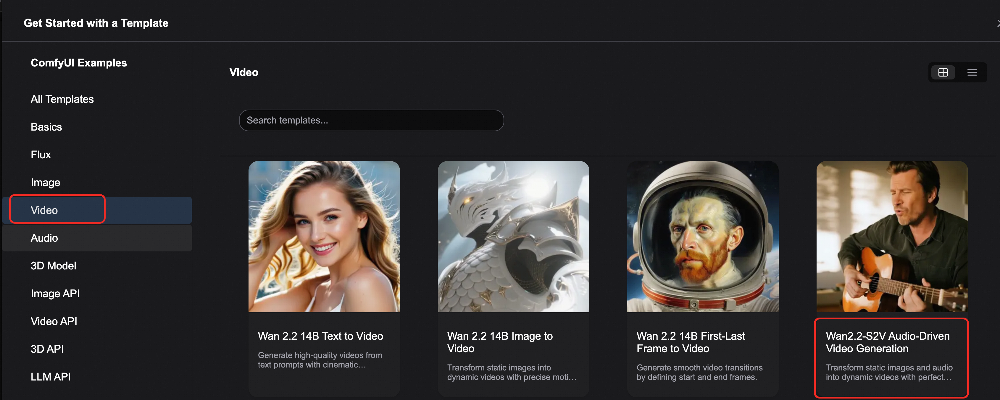

<div style="background: linear-gradient(135deg, #2563eb, #1e40af); padding: 24px; border-radius: 8px; color: white; text-align: center; margin-bottom: 24px;">
  <h1 style="font-size: 2.5em; margin: 0; font-weight: 600;">🎵 Wan2.2-S2V 音频驱动视频生成</h1>
  <p style="font-size: 1.2em; margin: 16px 0 0 0; opacity: 0.9;">ComfyUI 原生工作流 - 将静态图片与音频转化为动态视频</p>
  <div style="margin-top: 20px;">
    <span style="background: rgba(255,255,255,0.2); color: white; padding: 4px 12px; border-radius: 12px; font-size: 14px; margin: 0 8px;">🎤 音频驱动</span>
    <span style="background: rgba(255,255,255,0.2); color: white; padding: 4px 12px; border-radius: 12px; font-size: 14px; margin: 0 8px;">🎬 电影级画质</span>
    <span style="background: rgba(255,255,255,0.2); color: white; padding: 4px 12px; border-radius: 12px; font-size: 14px; margin: 0 8px;">⏱️ 分钟级生成</span>
  </div>
</div>

## 📋 模型概览

<div style="background: #f8fafc; border: 1px solid #e2e8f0; border-radius: 8px; padding: 20px; margin: 16px 0;">

我们很高兴地宣布，先进的音频驱动视频生成模型 **Wan2.2-S2V** 现已原生支持 ComfyUI！这个强大的 AI 模型可以将静态图片和音频输入转化为动态视频内容，支持对话、唱歌、表演等多种创意内容需求。

<div style="display: grid; grid-template-columns: repeat(auto-fit, minmax(250px, 1fr)); gap: 16px; margin: 16px 0;">
  <div style="background: #eff6ff; border-left: 4px solid #2563eb; padding: 16px; border-radius: 4px;">
    <strong>🎵 音频驱动视频生成</strong><br>
    <p style="margin: 8px 0 0 0; color: #1e40af; font-size: 14px;">将静态图片和音频转化为同步视频</p>
  </div>

  <div style="background: #f0fdf4; border-left: 4px solid #059669; padding: 16px; border-radius: 4px;">
    <strong>🎬 电影级画质</strong><br>
    <p style="margin: 8px 0 0 0; color: #065f46; font-size: 14px;">生成具有自然表情和动作的高质量视频</p>
  </div>

  <div style="background: #fef3c7; border-left: 4px solid #d97706; padding: 16px; border-radius: 4px;">
    <strong>⏱️ 分钟级生成</strong><br>
    <p style="margin: 8px 0 0 0; color: #9a3412; font-size: 14px;">支持长时长视频创作</p>
  </div>

  <div style="background: #f3e8ff; border-left: 4px solid #7c3aed; padding: 16px; border-radius: 4px;">
    <strong>🎭 多格式支持</strong><br>
    <p style="margin: 8px 0 0 0; color: #5b21b6; font-size: 14px;">适用于全身和半身角色</p>
  </div>
</div>

<div style="background: #eff6ff; border-left: 4px solid #2563eb; padding: 16px; margin: 16px 0; border-radius: 4px;">
  <strong>🔗 相关资源</strong><br>
  • <strong>代码仓库</strong>：<a href="https://github.com/aigc-apps/VideoX-Fun" target="_blank" style="color: #2563eb;">Github</a><br>
  • <strong>模型仓库</strong>：<a href="https://huggingface.co/Wan-AI/Wan2.2-S2V-14B" target="_blank" style="color: #2563eb;">Hugging Face</a>
</div>

</div>

## 🚀 ComfyUI 原生工作流

### 📥 步骤一：工作流文件下载

<div style="background: #f8fafc; border: 1px solid #e2e8f0; border-radius: 8px; padding: 20px; margin: 16px 0;">
直接从Comfyui模版打开


或下载以下工作流文件并拖入 ComfyUI 中加载工作流。

<div style="text-align: center; margin: 20px 0;">
  <video controls style="width: 100%; max-width: 800px; border-radius: 8px; box-shadow: 0 4px 8px rgba(0,0,0,0.1);" src="https://raw.githubusercontent.com/Comfy-Org/example_workflows/refs/heads/main/video/wan/wan2.2_s2v/wan2.2-s2v.mp4"></video>
</div>

<div style="text-align: center; margin: 20px 0;">
  <a href="https://raw.githubusercontent.com/Comfy-Org/workflow_templates/refs/heads/main/templates/video_wan2_2_14B_s2v.json" target="_blank" style="display: inline-block; background: linear-gradient(135deg, #2563eb, #1e40af); color: white; padding: 12px 24px; border-radius: 8px; text-decoration: none; font-weight: bold; box-shadow: 0 4px 8px rgba(37, 99, 235, 0.3);">
    📄 下载 JSON 工作流文件
  </a>
</div>

### 📁 示例输入文件

<div style="display: grid; grid-template-columns: 1fr 1fr; gap: 16px; margin: 16px 0;">

<div style="background: #f0fdf4; border-left: 4px solid #059669; padding: 16px; border-radius: 4px;">
<h4 style="color: #059669; margin: 0 0 12px 0;">🖼️ 示例图片</h4>
<div style="text-align: center; margin: 12px 0;">
  
</div>
</div>

<div style="background: #fff7ed; border-left: 4px solid #ea580c; padding: 16px; border-radius: 4px;">
<h4 style="color: #ea580c; margin: 0 0 12px 0;">🎵 示例音频</h4>
<div style="text-align: center; margin: 12px 0;">
  <a href="https://raw.githubusercontent.com/Comfy-Org/example_workflows/refs/heads/main/video/wan/wan2.2_s2v/input_audio.MP3" target="_blank" style="display: inline-block; background: #ea580c; color: white; padding: 8px 16px; border-radius: 6px; text-decoration: none; font-weight: bold;">
    🎧 下载输入音频
  </a>
</div>
</div>

</div>

</div>

### 🔗 步骤二：模型文件

<div style="background: #f8fafc; border: 1px solid #e2e8f0; border-radius: 8px; padding: 20px; margin: 16px 0;">


#### 📂 模型文件结构

<div style="background: #1e293b; border-radius: 6px; padding: 16px; margin: 16px 0;">
<pre style="margin: 0; color: #e2e8f0; font-family: 'Courier New', monospace; font-size: 14px;"><code>ComfyUI/
├───📂 models/
│   ├───📂 diffusion_models/
│   │   ├──── wan2.2_s2v_14B_fp8_scaled.safetensors
│   │   └──── wan2.2_s2v_14B_bf16.safetensors
│   ├───📂 text_encoders/
│   │   └──── umt5_xxl_fp8_e4m3fn_scaled.safetensors 
│   ├───📂 audio_encoders/ # 如果这个文件夹不存在请手动创建
│   │   └──── wav2vec2_large_english_fp16.safetensors 
│   └───📂 vae/
│       └──── wan_2.1_vae.safetensors</code></pre>
</div>

### 🔧 步骤三：工作流配置说明

<div style="background: #f8fafc; border: 1px solid #e2e8f0; border-radius: 8px; padding: 20px; margin: 16px 0;">

<div style="text-align: center; margin: 20px 0;">
  
</div>

#### 🎯 模型选择说明

<div style="display: grid; grid-template-columns: 1fr 1fr; gap: 16px; margin: 16px 0;">

<div style="background: #eff6ff; border-left: 4px solid #2563eb; padding: 16px; border-radius: 4px;">
<h4 style="color: #2563eb; margin: 0 0 8px 0;">💾 FP8 Scaled 模型</h4>
<p style="margin: 0 0 8px 0; color: #1e40af; font-size: 14px;"><strong>wan2.2_s2v_14B_fp8_scaled.safetensors</strong></p>
<div style="background: #dcfce7; color: #059669; padding: 4px 12px; border-radius: 12px; font-size: 12px; display: inline-block;">✅ 推荐使用</div>
<p style="margin: 8px 0 0 0; color: #64748b; font-size: 13px;">需要更少的显存，适合大多数用户</p>
</div>

<div style="background: #fff7ed; border-left: 4px solid #ea580c; padding: 16px; border-radius: 4px;">
<h4 style="color: #ea580c; margin: 0 0 8px 0;">🎯 BF16 模型</h4>
<p style="margin: 0 0 8px 0; color: #9a3412; font-size: 14px;"><strong>wan2.2_s2v_14B_bf16.safetensors</strong></p>
<div style="background: #fed7aa; color: #ea580c; padding: 4px 12px; border-radius: 12px; font-size: 12px; display: inline-block;">⚡ 高质量</div>
<p style="margin: 8px 0 0 0; color: #64748b; font-size: 13px;">减少质量损失，需要更多显存</p>
</div>

</div>

#### ⚡ Lightning LoRA 说明

<div style="background: #fef3c7; border-left: 4px solid #d97706; padding: 16px; margin: 16px 0; border-radius: 4px;">
  <strong>⚠️ Lightning LoRA 注意事项</strong><br>
  • 测试了所有 wan2.2 lightning LoRAs，由于这并不是专门为 Wan2.2 S2V 训练的 LoRA<br>
  • 很多键值不匹配，但能大幅减少生成时间<br>
  • 使用它会导致极大的动态和质量损失<br>
  • 如果输出质量太差，可以尝试原始的 20 步工作流
</div>

</div>

## 📋 详细操作步骤

<div style="background: #f8fafc; border: 1px solid #e2e8f0; border-radius: 8px; padding: 20px; margin: 16px 0;">

### 🔧 步骤 1：模型加载配置

<div style="overflow-x: auto; margin: 16px 0;">
<table style="width: 100%; border-collapse: collapse; background: white; border-radius: 6px; overflow: hidden; box-shadow: 0 1px 3px rgba(0,0,0,0.1);">
  <thead style="background: #f8fafc;">
    <tr>
      <th style="padding: 12px; text-align: left; border-bottom: 1px solid #e2e8f0; color: #1e40af; font-weight: 600;">节点名称</th>
      <th style="padding: 12px; text-align: left; border-bottom: 1px solid #e2e8f0; color: #1e40af; font-weight: 600;">模型文件</th>
      <th style="padding: 12px; text-align: left; border-bottom: 1px solid #e2e8f0; color: #1e40af; font-weight: 600;">说明</th>
    </tr>
  </thead>
  <tbody>
    <tr>
      <td style="padding: 12px; border-bottom: 1px solid #f1f5f9; font-weight: 500;">Load Diffusion Model</td>
      <td style="padding: 12px; border-bottom: 1px solid #f1f5f9; font-family: monospace; font-size: 12px;">wan2.2_s2v_14B_fp8_scaled.safetensors</td>
      <td style="padding: 12px; border-bottom: 1px solid #f1f5f9;">主要扩散模型（推荐）</td>
    </tr>
    <tr>
      <td style="padding: 12px; border-bottom: 1px solid #f1f5f9; font-weight: 500;">Load CLIP</td>
      <td style="padding: 12px; border-bottom: 1px solid #f1f5f9; font-family: monospace; font-size: 12px;">umt5_xxl_fp8_e4m3fn_scaled.safetensors</td>
      <td style="padding: 12px; border-bottom: 1px solid #f1f5f9;">文本编码器</td>
    </tr>
    <tr>
      <td style="padding: 12px; border-bottom: 1px solid #f1f5f9; font-weight: 500;">Load VAE</td>
      <td style="padding: 12px; border-bottom: 1px solid #f1f5f9; font-family: monospace; font-size: 12px;">wan_2.1_vae.safetensors</td>
      <td style="padding: 12px; border-bottom: 1px solid #f1f5f9;">变分自编码器</td>
    </tr>
    <tr>
      <td style="padding: 12px; border-bottom: 1px solid #f1f5f9; font-weight: 500;">Audio</td>
      <td style="padding: 12px; border-bottom: 1px solid #f1f5f9; font-family: monospace; font-size: 12px;">wav2vec2_large_english_fp16.safetensors</td>
      <td style="padding: 12px; border-bottom: 1px solid #f1f5f9;">音频编码器</td>
    </tr>
    <tr>
      <td style="padding: 12px; font-weight: 500;">LoraLoaderModelOnly</td>
      <td style="padding: 12px; font-family: monospace; font-size: 12px;">wan2.2_t2v_lightx2v_4steps_lora_v1.1_high_noise.safetensors</td>
      <td style="padding: 12px;">Lightning LoRA（可选）</td>
    </tr>
  </tbody>
</table>
</div>

### 📁 步骤 2：输入文件配置

<div style="display: grid; grid-template-columns: 1fr 1fr; gap: 16px; margin: 16px 0;">

<div style="background: #f0fdf4; border-left: 4px solid #059669; padding: 16px; border-radius: 4px;">
<h4 style="color: #059669; margin: 0 0 8px 0;">🎵 LoadAudio</h4>
<p style="margin: 0 0 8px 0; color: #065f46;">上传提供的音频文件，或者你自己的音频</p>
<div style="background: #dcfce7; color: #059669; padding: 4px 12px; border-radius: 12px; font-size: 12px; display: inline-block;">支持多种音频格式</div>
</div>

<div style="background: #eff6ff; border-left: 4px solid #2563eb; padding: 16px; border-radius: 4px;">
<h4 style="color: #2563eb; margin: 0 0 8px 0;">🖼️ Load Image</h4>
<p style="margin: 0 0 8px 0; color: #1e40af;">上传参考图片</p>
<div style="background: #dbeafe; color: #2563eb; padding: 4px 12px; border-radius: 12px; font-size: 12px; display: inline-block;">支持全身和半身角色</div>
</div>

</div>

### ⚙️ 步骤 3：参数配置

<div style="overflow-x: auto; margin: 16px 0;">
<table style="width: 100%; border-collapse: collapse; background: white; border-radius: 6px; overflow: hidden; box-shadow: 0 1px 3px rgba(0,0,0,0.1);">
  <thead style="background: #f8fafc;">
    <tr>
      <th style="padding: 12px; text-align: left; border-bottom: 1px solid #e2e8f0; color: #1e40af; font-weight: 600;">参数名称</th>
      <th style="padding: 12px; text-align: left; border-bottom: 1px solid #e2e8f0; color: #1e40af; font-weight: 600;">推荐值</th>
      <th style="padding: 12px; text-align: left; border-bottom: 1px solid #e2e8f0; color: #1e40af; font-weight: 600;">说明</th>
    </tr>
  </thead>
  <tbody>
    <tr>
      <td style="padding: 12px; border-bottom: 1px solid #f1f5f9; font-weight: 500;">Batch sizes</td>
      <td style="padding: 12px; border-bottom: 1px solid #f1f5f9;">根据扩展节点数量设置</td>
      <td style="padding: 12px; border-bottom: 1px solid #f1f5f9;">总采样次数</td>
    </tr>
    <tr>
      <td style="padding: 12px; border-bottom: 1px solid #f1f5f9; font-weight: 500;">Chunk Length</td>
      <td style="padding: 12px; border-bottom: 1px solid #f1f5f9;">77</td>
      <td style="padding: 12px; border-bottom: 1px solid #f1f5f9;">保持默认值</td>
    </tr>
    <tr>
      <td style="padding: 12px; border-bottom: 1px solid #f1f5f9; font-weight: 500;">Steps (Lightning LoRA)</td>
      <td style="padding: 12px; border-bottom: 1px solid #f1f5f9;">4</td>
      <td style="padding: 12px; border-bottom: 1px solid #f1f5f9;">使用 Lightning LoRA 时</td>
    </tr>
    <tr>
      <td style="padding: 12px; border-bottom: 1px solid #f1f5f9; font-weight: 500;">Steps (标准)</td>
      <td style="padding: 12px; border-bottom: 1px solid #f1f5f9;">20</td>
      <td style="padding: 12px; border-bottom: 1px solid #f1f5f9;">不使用 Lightning LoRA 时</td>
    </tr>
    <tr>
      <td style="padding: 12px; border-bottom: 1px solid #f1f5f9; font-weight: 500;">CFG (Lightning LoRA)</td>
      <td style="padding: 12px; border-bottom: 1px solid #f1f5f9;">1.0</td>
      <td style="padding: 12px; border-bottom: 1px solid #f1f5f9;">使用 Lightning LoRA 时</td>
    </tr>
    <tr>
      <td style="padding: 12px; font-weight: 500;">CFG (标准)</td>
      <td style="padding: 12px;">6.0</td>
      <td style="padding: 12px;">不使用 Lightning LoRA 时</td>
    </tr>
  </tbody>
</table>
</div>

### 🎬 步骤 4：视频扩展配置

<div style="background: #eff6ff; border-left: 4px solid #2563eb; padding: 16px; margin: 16px 0; border-radius: 4px;">
  <strong>📊 Video S2V Extend 计算公式</strong><br>
  • 每个扩展节点生成 77 帧<br>
  • 模型帧率为 16fps<br>
  • 每个扩展 = 77 ÷ 16 = 4.8125 秒<br>
  • 所需扩展数量 = 音频时长(秒) × 16 ÷ 77（向上取整）
</div>

<div style="background: #f0fdf4; border-left: 4px solid #059669; padding: 16px; margin: 16px 0; border-radius: 4px;">
  <strong>💡 示例计算</strong><br>
  如果输入音频为 14 秒：<br>
  • 总帧数 = 14 × 16 = 224 帧<br>
  • 扩展数量 = 224 ÷ 77 = 2.9 → 向上取整为 3<br>
  • 需要 3 个 Video S2V Extend 节点
</div>

### 🚀 步骤 5：执行工作流

<div style="text-align: center; margin: 20px 0;">
  <div style="background: linear-gradient(135deg, #059669, #047857); color: white; padding: 16px 32px; border-radius: 8px; display: inline-block; box-shadow: 0 4px 8px rgba(5, 150, 105, 0.3);">
    <strong>⌨️ 使用 Ctrl+Enter 或点击运行按钮来执行工作流</strong>
  </div>
</div>

</div>

## API调用
<details style="border: 2px solid #2563eb; border-radius: 12px; padding: 20px; margin: 20px 0; background: linear-gradient(145deg, #f8fafc, #eff6ff); box-shadow: 0 8px 16px rgba(37, 99, 235, 0.15);">
<summary style="font-weight: bold; font-size: 18px; color: white; cursor: pointer; padding: 16px; background: linear-gradient(135deg, #2563eb, #1e40af); border-radius: 8px; margin: -20px -20px 20px -20px; text-shadow: 1px 1px 2px rgba(0,0,0,0.2); transition: all 0.3s ease; display: flex; align-items: center; box-shadow: 0 4px 8px rgba(37, 99, 235, 0.3);">
📋 点击展开ComfyUI API调用Python代码
</summary>

```python

import requests
import json
import uuid
import time
import random
import os

# Configuration Parameters - Wan2.2 Sound-to-Video Specific
COMFYUI_SERVER = "127.0.0.1:8188"  # Local server
COMFYUI_TOKEN = ""  # Usually no token needed for local

# Model Configuration
UNET_MODEL = "wan2.2_s2v_14B_fp8_scaled.safetensors"
CLIP_MODEL = "umt5_xxl_fp8_e4m3fn_scaled.safetensors"
VAE_MODEL = "wan_2.1_vae.safetensors"
AUDIO_ENCODER_MODEL = "wav2vec2_large_english_fp16.safetensors"
LORA_MODEL = "wan2.2_t2v_lightx2v_4steps_lora_v1.1_high_noise.safetensors"

# Default Parameters
DEFAULT_POSITIVE_PROMPT = "The man is playing the guitar. He looks down at his hands playing the guitar and sings affectionately and gently."
DEFAULT_NEGATIVE_PROMPT = "色调艳丽，过曝，静态，细节模糊不清，字幕，风格，作品，画作，画面，静止，整体发灰，最差质量，低质量，JPEG压缩残留，丑陋的，残缺的，多余的手指，画得不好的手部，画得不好的脸部，畸形的，毁容的，形态畸形的肢体，手指融合，静止不动的画面，杂乱的背景，三条腿，背景人很多，倒着走"
DEFAULT_REF_IMAGE = "Zoomable image (6).jpg"
DEFAULT_AUDIO = "music.MP3"

class ComfyUIWan22SoundToVideoClient:
    def __init__(self, server=COMFYUI_SERVER, token=COMFYUI_TOKEN):
        self.base_url = f"http://{server}"
        self.token = token
        self.client_id = str(uuid.uuid4())
        self.headers = {"Content-Type": "application/json"}
        if token:
            self.headers["Authorization"] = f"Bearer {token}"

    def upload_image(self, image_path):
        """Upload image to ComfyUI server"""
        try:
            with open(image_path, 'rb') as f:
                files = {'image': f}
                response = requests.post(f"{self.base_url}/upload/image", files=files)
                if response.status_code == 200:
                    result = response.json()
                    return result.get('name', os.path.basename(image_path))
                else:
                    raise Exception(f"Failed to upload image: {response.text}")
        except Exception as e:
            print(f"Image upload error: {e}")
            return None

    def upload_audio(self, audio_path):
        """Upload audio to ComfyUI server"""
        try:
            with open(audio_path, 'rb') as f:
                files = {'audio': f}
                response = requests.post(f"{self.base_url}/upload/audio", files=files)
                if response.status_code == 200:
                    result = response.json()
                    return result.get('name', os.path.basename(audio_path))
                else:
                    raise Exception(f"Failed to upload audio: {response.text}")
        except Exception as e:
            print(f"Audio upload error: {e}")
            return None

    def generate_sound_to_video(self, positive_prompt, negative_prompt=None,
                               ref_image_path=None, ref_image_name=None,
                               audio_path=None, audio_name=None,
                               width=640, height=640, chunk_length=77,
                               steps=4, cfg=1, fps=16, seed=20,
                               batch_index=3, shift=8.0, lora_strength=1.0,
                               extend_chunks=2):
        """Generate Sound-to-Video using Wan2.2 based on original JSON workflow"""
        print("Starting Wan2.2 Sound-to-Video generation...")
        
        # Use default negative prompt if not provided
        if negative_prompt is None:
            negative_prompt = DEFAULT_NEGATIVE_PROMPT

        # Handle reference image
        if ref_image_path and not ref_image_name:
            ref_image_name = self.upload_image(ref_image_path)
            if not ref_image_name:
                raise Exception("Failed to upload reference image")
        elif not ref_image_name:
            ref_image_name = DEFAULT_REF_IMAGE

        # Handle audio file
        if audio_path and not audio_name:
            audio_name = self.upload_audio(audio_path)
            if not audio_name:
                raise Exception("Failed to upload audio file")
        elif not audio_name:
            audio_name = DEFAULT_AUDIO

        # Calculate total length based on chunks
        total_length = chunk_length * (extend_chunks + 1)

        # Workflow based on your provided JSON
        workflow = {
            "3": {
                "inputs": {
                    "seed": seed,
                    "steps": ["103", 0],
                    "cfg": ["105", 0],
                    "sampler_name": "uni_pc",
                    "scheduler": "simple",
                    "denoise": 1,
                    "model": ["54", 0],
                    "positive": ["93", 0],
                    "negative": ["93", 1],
                    "latent_image": ["93", 2]
                },
                "class_type": "KSampler",
                "_meta": {"title": "K Sampler (Initial)"}
            },
            "6": {
                "inputs": {
                    "text": positive_prompt,
                    "clip": ["38", 0]
                },
                "class_type": "CLIPTextEncode",
                "_meta": {"title": "CLIP Text Encode (Positive Prompt)"}
            },
            "7": {
                "inputs": {
                    "text": negative_prompt,
                    "clip": ["38", 0]
                },
                "class_type": "CLIPTextEncode",
                "_meta": {"title": "CLIP Text Encode (Negative Prompt)"}
            },
            "37": {
                "inputs": {
                    "unet_name": UNET_MODEL,
                    "weight_dtype": "default"
                },
                "class_type": "UNETLoader",
                "_meta": {"title": "UNet Loader"}
            },
            "38": {
                "inputs": {
                    "clip_name": CLIP_MODEL,
                    "type": "wan",
                    "device": "default"
                },
                "class_type": "CLIPLoader",
                "_meta": {"title": "CLIP Loader"}
            },
            "39": {
                "inputs": {
                    "vae_name": VAE_MODEL
                },
                "class_type": "VAELoader",
                "_meta": {"title": "VAE Loader"}
            },
            "52": {
                "inputs": {
                    "image": ref_image_name
                },
                "class_type": "LoadImage",
                "_meta": {"title": "Load Reference Image"}
            },
            "54": {
                "inputs": {
                    "shift": shift,
                    "model": ["107", 0]
                },
                "class_type": "ModelSamplingSD3",
                "_meta": {"title": "Model Sampling SD3"}
            },
            "56": {
                "inputs": {
                    "audio_encoder": ["57", 0],
                    "audio": ["58", 0]
                },
                "class_type": "AudioEncoderEncode",
                "_meta": {"title": "Audio Encoder Encode"}
            },
            "57": {
                "inputs": {
                    "audio_encoder_name": AUDIO_ENCODER_MODEL
                },
                "class_type": "AudioEncoderLoader",
                "_meta": {"title": "Audio Encoder Loader"}
            },
            "58": {
                "inputs": {
                    "audio": audio_name,
                    "audioUI": ""
                },
                "class_type": "LoadAudio",
                "_meta": {"title": "Load Audio"}
            },
            "80": {
                "inputs": {
                    "samples": ["95", 0],
                    "vae": ["39", 0]
                },
                "class_type": "VAEDecode",
                "_meta": {"title": "VAE Decode"}
            },
            "82": {
                "inputs": {
                    "fps": fps,
                    "images": ["96", 0],
                    "audio": ["58", 0]
                },
                "class_type": "CreateVideo",
                "_meta": {"title": "Create Video"}
            },
            "93": {
                "inputs": {
                    "width": width,
                    "height": height,
                    "length": ["104", 0],
                    "batch_size": 1,
                    "positive": ["6", 0],
                    "negative": ["7", 0],
                    "vae": ["39", 0],
                    "audio_encoder_output": ["56", 0],
                    "ref_image": ["52", 0]
                },
                "class_type": "WanSoundImageToVideo",
                "_meta": {"title": "Wan Sound Image To Video"}
            },
            "94": {
                "inputs": {
                    "dim": "t",
                    "index": 0,
                    "amount": 1,
                    "samples": ["85:78", 0]
                },
                "class_type": "LatentCut",
                "_meta": {"title": "Latent Cut"}
            },
            "95": {
                "inputs": {
                    "dim": "t",
                    "samples1": ["94", 0],
                    "samples2": ["85:78", 0]
                },
                "class_type": "LatentConcat",
                "_meta": {"title": "Latent Concat"}
            },
            "96": {
                "inputs": {
                    "batch_index": ["100", 0],
                    "length": 4096,
                    "image": ["80", 0]
                },
                "class_type": "ImageFromBatch",
                "_meta": {"title": "Image From Batch"}
            },
            "100": {
                "inputs": {
                    "value": batch_index
                },
                "class_type": "PrimitiveInt",
                "_meta": {"title": "Batch Index"}
            },
            "103": {
                "inputs": {
                    "value": steps
                },
                "class_type": "PrimitiveInt",
                "_meta": {"title": "Steps"}
            },
            "104": {
                "inputs": {
                    "value": chunk_length
                },
                "class_type": "PrimitiveInt",
                "_meta": {"title": "Chunk Length"}
            },
            "105": {
                "inputs": {
                    "value": cfg
                },
                "class_type": "PrimitiveFloat",
                "_meta": {"title": "CFG"}
            },
            "107": {
                "inputs": {
                    "lora_name": LORA_MODEL,
                    "strength_model": lora_strength,
                    "model": ["37", 0]
                },
                "class_type": "LoraLoaderModelOnly",
                "_meta": {"title": "LoRA Loader"}
            },
            "113": {
                "inputs": {
                    "filename_prefix": "wan22_sound_to_video/video",
                    "format": "auto",
                    "codec": "auto",
                    "video": ["82", 0]
                },
                "class_type": "SaveVideo",
                "_meta": {"title": "Save Video"}
            }
        }

        # Add extension chunks if needed
        if extend_chunks >= 1:
            workflow["79:78"] = {
                "inputs": {
                    "dim": "t",
                    "samples1": ["3", 0],
                    "samples2": ["79:77", 0]
                },
                "class_type": "LatentConcat",
                "_meta": {"title": "Latent Concat (Extend 1)"}
            }
            workflow["79:77"] = {
                "inputs": {
                    "seed": 1,
                    "steps": 10,
                    "cfg": ["103", 0],
                    "sampler_name": "uni_pc",
                    "scheduler": "simple",
                    "denoise": 1,
                    "model": ["54", 0],
                    "positive": ["79:76", 0],
                    "negative": ["79:76", 1],
                    "latent_image": ["79:76", 2]
                },
                "class_type": "KSampler",
                "_meta": {"title": "K Sampler (Extend 1)"}
            }
            workflow["79:76"] = {
                "inputs": {
                    "length": ["105", 0],
                    "positive": ["6", 0],
                    "negative": ["7", 0],
                    "vae": ["39", 0],
                    "video_latent": ["3", 0],
                    "audio_encoder_output": ["56", 0],
                    "ref_image": ["52", 0]
                },
                "class_type": "WanSoundImageToVideoExtend",
                "_meta": {"title": "Wan Sound Image To Video Extend 1"}
            }

        if extend_chunks >= 2:
            workflow["85:78"] = {
                "inputs": {
                    "dim": "t",
                    "samples1": ["79:78", 0],
                    "samples2": ["85:77", 0]
                },
                "class_type": "LatentConcat",
                "_meta": {"title": "Latent Concat (Extend 2)"}
            }
            workflow["85:77"] = {
                "inputs": {
                    "seed": 250,
                    "steps": 10,
                    "cfg": ["103", 0],
                    "sampler_name": "uni_pc",
                    "scheduler": "simple",
                    "denoise": 1,
                    "model": ["54", 0],
                    "positive": ["85:76", 0],
                    "negative": ["85:76", 1],
                    "latent_image": ["85:76", 2]
                },
                "class_type": "KSampler",
                "_meta": {"title": "K Sampler (Extend 2)"}
            }
            workflow["85:76"] = {
                "inputs": {
                    "length": ["105", 0],
                    "positive": ["6", 0],
                    "negative": ["7", 0],
                    "vae": ["39", 0],
                    "video_latent": ["79:78", 0],
                    "audio_encoder_output": ["56", 0],
                    "ref_image": ["52", 0]
                },
                "class_type": "WanSoundImageToVideoExtend",
                "_meta": {"title": "Wan Sound Image To Video Extend 2"}
            }

        print("Submitting Wan2.2 Sound-to-Video generation workflow...")
        print(f"Positive Prompt: {positive_prompt}")
        print(f"Reference Image: {ref_image_name}")
        print(f"Audio File: {audio_name}")
        print(f"Video Dimensions: {width}x{height}")
        print(f"Chunk Length: {chunk_length} frames")
        print(f"Total Length: {total_length} frames")
        print(f"FPS: {fps}")
        print(f"Steps: {steps}")
        print(f"CFG: {cfg}")
        print(f"Seed: {seed}")
        print(f"Extension Chunks: {extend_chunks}")
        
        response = requests.post(
            f"{self.base_url}/prompt", 
            headers=self.headers, 
            json={"prompt": workflow, "client_id": self.client_id}
        )
        
        print(f"API Response: {response.text}")

        if response.status_code != 200:
            raise Exception(f"API request failed with status code: {response.status_code}")

        result = response.json()
        if "error" in result:
            raise Exception(f"Workflow error: {result['error']}")
        if "prompt_id" not in result:
            raise Exception(f"No prompt_id in response: {result}")
        
        return result["prompt_id"], seed

    def get_status(self, task_id):
        """Get task status"""
        try:
            # Check queue status
            queue_data = requests.get(f"{self.base_url}/queue", headers=self.headers).json()
            
            # Check if in running queue
            if any(item[1] == task_id for item in queue_data.get("queue_running", [])):
                return "processing"
            
            # Check if in pending queue
            if any(item[1] == task_id for item in queue_data.get("queue_pending", [])):
                return "pending"
            
            # Check history
            history_response = requests.get(f"{self.base_url}/history/{task_id}", headers=self.headers)
            if history_response.status_code == 200:
                history = history_response.json()
                if task_id in history:
                    return "completed"
            
            return "processing"
        except Exception as e:
            print(f"Status check error: {e}")
            return "processing"

    def download_video(self, task_id, output_dir="outputs"):
        """Download generated video files"""
        try:
            # Ensure output directory exists
            os.makedirs(output_dir, exist_ok=True)
            
            response = requests.get(f"{self.base_url}/history/{task_id}", headers=self.headers)
            history = response.json()
            
            if task_id in history:
                outputs = history[task_id]['outputs']
                downloaded_files = []
                
                for node_id, output in outputs.items():
                    # Check for video files
                    if 'videos' in output:
                        for video_info in output['videos']:
                            filename = video_info['filename']
                            # Download video
                            video_response = requests.get(
                                f"{self.base_url}/view?filename={filename}", 
                                headers=self.headers
                            )
                            
                            if video_response.status_code == 200:
                                output_path = os.path.join(output_dir, filename)
                                with open(output_path, "wb") as f:
                                    f.write(video_response.content)
                                downloaded_files.append(output_path)
                                print(f"Video saved: {output_path}")
                    
                    # Check for preview images
                    if 'images' in output:
                        for img_info in output['images']:
                            filename = img_info['filename']
                            # Download preview image
                            img_response = requests.get(
                                f"{self.base_url}/view?filename={filename}", 
                                headers=self.headers
                            )
                            
                            if img_response.status_code == 200:
                                output_path = os.path.join(output_dir, filename)
                                with open(output_path, "wb") as f:
                                    f.write(img_response.content)
                                downloaded_files.append(output_path)
                                print(f"Preview image saved: {output_path}")
                
                return downloaded_files
                
        except Exception as e:
            print(f"Download error: {e}")
        
        return []

    def generate_batch(self, configs, **kwargs):
        """Batch generate sound-to-video with different configurations"""
        results = []
        
        for i, config in enumerate(configs):
            print(f"\nStarting Sound-to-Video generation task {i+1}/{len(configs)}...")
            
            try:
                task_id, seed = self.generate_sound_to_video(**config, **kwargs)
                
                # Wait for completion
                while True:
                    status = self.get_status(task_id)
                    print(f"Task {i+1} status: {status}")
                    
                    if status == "completed":
                        files = self.download_video(task_id)
                        results.append({
                            'task_id': task_id,
                            'seed': seed,
                            'files': files,
                            'config': config
                        })
                        break
                    elif status == "failed":
                        print(f"Task {i+1} failed")
                        break
                    
                    time.sleep(20)  # Sound-to-video generation takes longer
                    
            except Exception as e:
                print(f"Task {i+1} error: {e}")
        
        return results

    def generate_with_length_presets(self, positive_prompt, audio_path, ref_image_path, 
                                   length_preset="medium"):
        """Generate with predefined length settings"""
        length_presets = {
            "short": {"chunk_length": 49, "extend_chunks": 1},
            "medium": {"chunk_length": 77, "extend_chunks": 2},
            "long": {"chunk_length": 97, "extend_chunks": 3},
            "extra_long": {"chunk_length": 121, "extend_chunks": 4}
        }
        
        settings = length_presets.get(length_preset, length_presets["medium"])
        return self.generate_sound_to_video(
            positive_prompt=positive_prompt,
            audio_path=audio_path,
            ref_image_path=ref_image_path,
            **settings
        )

def main():
    """Main function - Execute Wan2.2 Sound-to-Video generation"""
    client = ComfyUIWan22SoundToVideoClient()
    
    try:
        print("Wan2.2 Sound-to-Video generation client started...")
        
        # Single video generation example
        print("\n=== Single Sound-to-Video Generation ===")
        
        # You can provide local file paths or use existing file names
        ref_image_path = None  # Set to your image path, e.g., "reference.jpg"
        audio_path = None  # Set to your audio path, e.g., "music.mp3"
        
        task_id, seed = client.generate_sound_to_video(
            positive_prompt=DEFAULT_POSITIVE_PROMPT,
            negative_prompt=DEFAULT_NEGATIVE_PROMPT,
            ref_image_path=ref_image_path,
            ref_image_name=DEFAULT_REF_IMAGE,
            audio_path=audio_path,
            audio_name=DEFAULT_AUDIO,
            width=640,
            height=640,
            chunk_length=77,
            steps=4,
            cfg=1,
            fps=16,
            seed=20,
            extend_chunks=2
        )
        
        print(f"Task ID: {task_id}")
        print(f"Seed: {seed}")

        # Wait for task completion (sound-to-video generation takes longer)
        while True:
            status = client.get_status(task_id)
            print(f"Current status: {status}")
            
            if status == "completed":
                print("Sound-to-Video generation completed!")
                break
            elif status == "failed":
                print("Generation failed!")
                return
            
            time.sleep(20)

        # Download video files
        downloaded_files = client.download_video(task_id)
        if downloaded_files:
            print(f"Successfully downloaded {len(downloaded_files)} files!")
            for file in downloaded_files:
                print(f"File path: {file}")
        else:
            print("Download failed")

        # Length preset example
        print("\n=== Length Preset Example ===")
        # Uncomment to test different length presets
        # if ref_image_path and audio_path:
        #     for preset in ["short", "medium", "long"]:
        #         print(f"Generating with {preset} length...")
        #         task_id, seed = client.generate_with_length_presets(
        #             DEFAULT_POSITIVE_PROMPT, audio_path, ref_image_path, preset
        #         )
        #         # Wait and download logic here...

        # Batch generation example
        print("\n=== Batch Generation Example ===")
        batch_configs = [
            {
                'positive_prompt': "A musician playing piano in a concert hall",
                'ref_image_name': DEFAULT_REF_IMAGE,
                'audio_name': DEFAULT_AUDIO,
                'chunk_length': 49,
                'extend_chunks': 1
            },
            {
                'positive_prompt': "A dancer performing to classical music",
                'ref_image_name': DEFAULT_REF_IMAGE,
                'audio_name': DEFAULT_AUDIO,
                'chunk_length': 77,
                'extend_chunks': 2
            }
        ]
        
        # Uncomment to run batch generation
        # batch_results = client.generate_batch(batch_configs, fps=16, steps=4)
        # print(f"Batch generation completed, generated {len(batch_results)} videos")

    except Exception as e:
        print(f"Error: {e}")

if __name__ == "__main__":
    main()


```

</details>


## 🎯 应用场景

<div style="display: grid; grid-template-columns: repeat(auto-fit, minmax(280px, 1fr)); gap: 16px; margin: 16px 0;">

<div style="background: #eff6ff; border-left: 4px solid #2563eb; padding: 16px; border-radius: 4px; text-align: center;">
<div style="font-size: 2.5em; margin-bottom: 12px; color: #2563eb;">🎤</div>
<h4 style="margin: 0 0 8px 0; color: #1e40af;">对话视频</h4>
<p style="margin: 0; color: #1e40af;">将静态人物图片转换为说话视频</p>
</div>

<div style="background: #f0fdf4; border-left: 4px solid #059669; padding: 16px; border-radius: 4px; text-align: center;">
<div style="font-size: 2.5em; margin-bottom: 12px; color: #059669;">🎵</div>
<h4 style="margin: 0 0 8px 0; color: #059669;">音乐视频</h4>
<p style="margin: 0; color: #065f46;">创建唱歌和音乐表演视频</p>
</div>

<div style="background: #fff7ed; border-left: 4px solid #ea580c; padding: 16px; border-radius: 4px; text-align: center;">
<div style="font-size: 2.5em; margin-bottom: 12px; color: #ea580c;">🎭</div>
<h4 style="margin: 0 0 8px 0; color: #ea580c;">表演艺术</h4>
<p style="margin: 0; color: #9a3412;">生成各种表演和艺术内容</p>
</div>

<div style="background: #f5f3ff; border-left: 4px solid #7c3aed; padding: 16px; border-radius: 4px; text-align: center;">
<div style="font-size: 2.5em; margin-bottom: 12px; color: #7c3aed;">📱</div>
<h4 style="margin: 0 0 8px 0; color: #7c3aed;">内容创作</h4>
<p style="margin: 0; color: #5b21b6;">社交媒体和数字内容制作</p>
</div>

</div>

## 💡 使用技巧

<div style="display: grid; grid-template-columns: 1fr 1fr; gap: 16px; margin: 16px 0;">

<div style="background: #dcfce7; border-left: 4px solid #059669; padding: 16px; border-radius: 4px;">
<h4 style="color: #059669; margin: 0 0 8px 0;">✅ 最佳实践</h4>
<ul style="margin: 0; padding-left: 20px; color: #065f46;">
  <li>使用清晰的人物图片作为输入</li>
  <li>音频质量越高，生成效果越好</li>
  <li>合理计算视频扩展节点数量</li>
  <li>根据显存情况选择合适的模型</li>
</ul>
</div>

<div style="background: #fef2f2; border-left: 4px solid #dc2626; padding: 16px; border-radius: 4px;">
<h4 style="color: #dc2626; margin: 0 0 8px 0;">⚠️ 注意事项</h4>
<ul style="margin: 0; padding-left: 20px; color: #991b1b;">
  <li>Lightning LoRA 会降低质量</li>
  <li>长视频需要更多计算资源</li>
  <li>确保音频编码器文件夹存在</li>
  <li>批处理大小要与扩展节点匹配</li>
</ul>
</div>

</div>

---

<div style="text-align: center; padding: 16px; background: #f8fafc; border-radius: 6px; margin-top: 24px;">
  <p style="margin: 0; color: #64748b; font-size: 14px;">
    🎵 <strong>Wan2.2-S2V 音频驱动视频生成</strong> | 让静态图片随音频律动起来
  </p>
  <p style="margin: 4px 0 0 0; color: #94a3b8; font-size: 12px;">
    © 2025 通义万相团队 | ComfyUI 原生支持 | 开启音频驱动视频创作新时代
  </p>
</div>