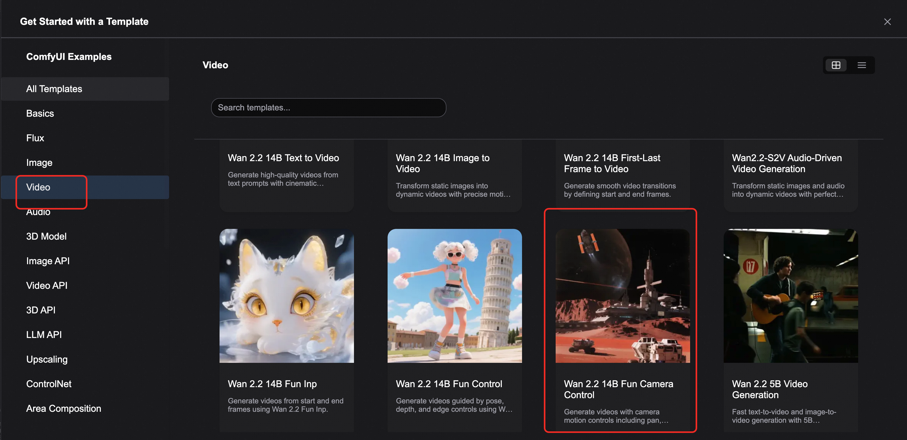

  <h1 style="font-size: 2.5em; margin: 0; font-weight: 600;">📹 Wan2.2-Fun-Camera-Control 相机控制视频生成</h1>
  
ComfyUI 原生工作流 - 专业级相机运动控制的视频生成

  

    📹 相机运动控制
    🎬 影视级质量
    🎯 组合运动
  

## 📋 模型概览

**Wan2.2-Fun-Camera-Control** 是 Alibaba PAI 团队推出的新一代视频生成与相机控制模型，通过引入创新性的相机控制代码（Camera Control Codes）机制，结合深度学习和多模态条件输入，能够生成高质量且符合预设相机运动条件的视频。该模型采用 **Apache 2.0 许可协议**发布，支持商业使用。

  

    <strong>📹 相机运动控制</strong> 
    
支持 Pan Up/Down、Pan Left/Right、Zoom In/Out 等多种运动模式

  

  

    <strong>🎬 高质量视频生成</strong> 
    
基于 Wan2.2 架构，输出影视级质量视频

  

  

    <strong>🎯 组合运动控制</strong> 
    
支持多种相机运动的组合控制

  

  

    <strong>⚙️ 精确参数控制</strong> 
    
可调节运动速度、强度等精细参数

  

  <strong>🔗 相关资源</strong> 
  • <strong>模型仓库</strong>：<a href="https://huggingface.co/alibaba-pai/Wan2.2-Fun-A14B-Control-Camera" target="_blank" style="color: #2563eb;">🤗 Wan2.2-Fun-A14B-Control-Camera</a> 
  • <strong>代码仓库</strong>：<a href="https://github.com/aigc-apps/VideoX-Fun" target="_blank" style="color: #2563eb;">VideoX-Fun</a>

## 🚀 Wan2.2 Fun Camera Control 工作流示例

### 🔧 工作流版本说明

你可以直接从Comfyui的模版仓库中打开：

提供两个版本的工作流供选择：

<h4 style="color: #2563eb; margin: 0 0 8px 0;">⚡ Lightning 加速版</h4>

使用 <a href="https://huggingface.co/lightx2v/Wan2.2-Lightning" target="_blank" style="color: #2563eb;">Wan2.2-Lightning</a> 4步 LoRA

✅ 速度更快

⚠️ 动态损失

<h4 style="color: #059669; margin: 0 0 8px 0;">🎯 标准质量版</h4>

使用 fp8_scaled 版本，无加速 LoRA

✅ 质量更高

⏱️ 耗时更长

#### 📊 性能对比测试

  <strong>🧪 测试环境</strong>：RTX 4090D 24GB 显存，640×640 分辨率，81 帧长度

<table style="width: 100%; border-collapse: collapse; background: white; border-radius: 6px; overflow: hidden; box-shadow: 0 1px 3px rgba(0,0,0,0.1);">
  <thead style="background: #f8fafc;">
    <tr>
      <th style="padding: 12px; text-align: left; border-bottom: 1px solid #e2e8f0; color: #1e40af; font-weight: 600;">模型类型</th>
      <th style="padding: 12px; text-align: left; border-bottom: 1px solid #e2e8f0; color: #1e40af; font-weight: 600;">分辨率</th>
      <th style="padding: 12px; text-align: left; border-bottom: 1px solid #e2e8f0; color: #1e40af; font-weight: 600;">显存占用</th>
      <th style="padding: 12px; text-align: left; border-bottom: 1px solid #e2e8f0; color: #1e40af; font-weight: 600;">首次生成</th>
      <th style="padding: 12px; text-align: left; border-bottom: 1px solid #e2e8f0; color: #1e40af; font-weight: 600;">第二次生成</th>
    </tr>
  </thead>
  <tbody>
    <tr>
      <td style="padding: 12px; border-bottom: 1px solid #f1f5f9; font-weight: 500;">fp8_scaled</td>
      <td style="padding: 12px; border-bottom: 1px solid #f1f5f9;">640×640</td>
      <td style="padding: 12px; border-bottom: 1px solid #f1f5f9;">84%</td>
      <td style="padding: 12px; border-bottom: 1px solid #f1f5f9;">≈ 536秒</td>
      <td style="padding: 12px; border-bottom: 1px solid #f1f5f9;">≈ 513秒</td>
    </tr>
    <tr>
      <td style="padding: 12px; font-weight: 500;">fp8_scaled + 4步LoRA</td>
      <td style="padding: 12px;">640×640</td>
      <td style="padding: 12px;">89%</td>
      <td style="padding: 12px;">≈ 108秒</td>
      <td style="padding: 12px;">≈ 71秒</td>
    </tr>
  </tbody>
</table>

  <strong>💡 版本切换说明</strong> 
  由于 4 步 LoRA 对初次使用工作流的用户体验较好，默认启用加速版本。如需切换到标准版本，框选对应工作流后使用 <strong>Ctrl+B</strong> 即可启用。

### 📥 步骤一：工作流及素材下载

直接通过comfyui 模版仓库打开工作流

或下载以下视频或 JSON 文件并拖入 ComfyUI 中以加载对应的工作流，工作流会提示下载模型。

  <video controls style="width: 100%; max-width: 800px; border-radius: 8px; box-shadow: 0 4px 8px rgba(0,0,0,0.1);" src="https://raw.githubusercontent.com/Comfy-Org/example_workflows/refs/heads/main/video/wan/wan2.2_fun_camera/wan2.2_14B_fun_camera.mp4"></video>

  <a href="https://raw.githubusercontent.com/Comfy-Org/workflow_templates/refs/heads/main/templates/video_wan2_2_14B_fun_camera.json" target="_blank" style="display: inline-block; background: linear-gradient(135deg, #2563eb, #1e40af); color: white; padding: 12px 24px; border-radius: 8px; text-decoration: none; font-weight: bold; box-shadow: 0 4px 8px rgba(37, 99, 235, 0.3);">
    📄 下载 JSON 格式工作流
  </a>

### 📁 示例素材下载

<h4 style="color: #059669; margin: 0 0 12px 0;">🖼️ 输入起始图片</h4>

  

此图片将作为视频生成的起始帧

### 🔗 步骤二：模型文件说明

#### 📂 模型文件结构

<pre style="margin: 0; color: #e2e8f0; font-family: 'Courier New', monospace; font-size: 14px;"><code>ComfyUI/
├───📂 models/
│   ├───📂 diffusion_models/
│   │   ├─── wan2.2_fun_camera_low_noise_14B_fp8_scaled.safetensors
│   │   └─── wan2.2_fun_camera_high_noise_14B_fp8_scaled.safetensors
│   ├───📂 loras/
│   │   ├─── wan2.2_i2v_lightx2v_4steps_lora_v1_high_noise.safetensors
│   │   └─── wan2.2_i2v_lightx2v_4steps_lora_v1_low_noise.safetensors
│   ├───📂 text_encoders/
│   │   └─── umt5_xxl_fp8_e4m3fn_scaled.safetensors 
│   └───📂 vae/
│       └── wan_2.1_vae.safetensors</code></pre>

### 🔧 步骤三：工作流配置操作

  

  <strong>⚠️ 重要提醒</strong> 
  此工作流使用了 LoRA 加速版本，请确保对应的 Diffusion Model 和 LoRA 文件保持一致，high noise 和 low noise 的模型和 LoRA 需要对应使用。

#### 📋 详细配置步骤

<h4 style="color: #2563eb; margin: 0 0 12px 0;">🔧 High Noise 模型配置</h4>
<ul style="margin: 0; padding-left: 20px; color: #1e40af; font-size: 14px;">
  <li><strong>Load Diffusion Model</strong>： <code>wan2.2_fun_camera_high_noise_14B_fp8_scaled.safetensors</code></li>
  <li><strong>LoraLoaderModelOnly</strong>： <code>wan2.2_i2v_lightx2v_4steps_lora_v1_high_noise.safetensors</code></li>
</ul>

<h4 style="color: #059669; margin: 0 0 12px 0;">🔧 Low Noise 模型配置</h4>
<ul style="margin: 0; padding-left: 20px; color: #065f46; font-size: 14px;">
  <li><strong>Load Diffusion Model</strong>： <code>wan2.2_fun_camera_low_noise_14B_fp8_scaled.safetensors</code></li>
  <li><strong>LoraLoaderModelOnly</strong>： <code>wan2.2_i2v_lightx2v_4steps_lora_v1_low_noise.safetensors</code></li>
</ul>

#### 🎯 基础模型配置

<table style="width: 100%; border-collapse: collapse; background: white; border-radius: 6px; overflow: hidden; box-shadow: 0 1px 3px rgba(0,0,0,0.1);">
  <thead style="background: #f8fafc;">
    <tr>
      <th style="padding: 12px; text-align: left; border-bottom: 1px solid #e2e8f0; color: #1e40af; font-weight: 600;">节点名称</th>
      <th style="padding: 12px; text-align: left; border-bottom: 1px solid #e2e8f0; color: #1e40af; font-weight: 600;">模型文件</th>
      <th style="padding: 12px; text-align: left; border-bottom: 1px solid #e2e8f0; color: #1e40af; font-weight: 600;">说明</th>
    </tr>
  </thead>
  <tbody>
    <tr>
      <td style="padding: 12px; border-bottom: 1px solid #f1f5f9; font-weight: 500;">Load CLIP</td>
      <td style="padding: 12px; border-bottom: 1px solid #f1f5f9; font-family: monospace; font-size: 12px;">umt5_xxl_fp8_e4m3fn_scaled.safetensors</td>
      <td style="padding: 12px; border-bottom: 1px solid #f1f5f9;">文本编码器</td>
    </tr>
    <tr>
      <td style="padding: 12px; font-weight: 500;">Load VAE</td>
      <td style="padding: 12px; font-family: monospace; font-size: 12px;">wan_2.1_vae.safetensors</td>
      <td style="padding: 12px;">变分自编码器</td>
    </tr>
  </tbody>
</table>

#### 📁 输入配置步骤

<h4 style="color: #059669; margin: 0 0 8px 0;">🖼️ 起始帧上传</h4>

在 <strong>Load Image</strong> 节点上传起始帧图片

<h4 style="color: #2563eb; margin: 0 0 8px 0;">📝 提示词修改</h4>

修改 Prompt，支持中英文输入

#### 📹 相机控制参数配置

  <strong>🎬 WanCameraEmbedding 节点配置</strong> 
  在此节点中设置相机控制的各项参数：

<table style="width: 100%; border-collapse: collapse; background: white; border-radius: 6px; overflow: hidden; box-shadow: 0 1px 3px rgba(0,0,0,0.1);">
  <thead style="background: #f8fafc;">
    <tr>
      <th style="padding: 12px; text-align: left; border-bottom: 1px solid #e2e8f0; color: #1e40af; font-weight: 600;">参数名称</th>
      <th style="padding: 12px; text-align: left; border-bottom: 1px solid #e2e8f0; color: #1e40af; font-weight: 600;">可选值</th>
      <th style="padding: 12px; text-align: left; border-bottom: 1px solid #e2e8f0; color: #1e40af; font-weight: 600;">说明</th>
    </tr>
  </thead>
  <tbody>
    <tr>
      <td style="padding: 12px; border-bottom: 1px solid #f1f5f9; font-weight: 500;">Camera Motion</td>
      <td style="padding: 12px; border-bottom: 1px solid #f1f5f9; font-family: monospace; font-size: 12px;">Zoom In, Zoom Out, Pan Up, Pan Down, Pan Left, Pan Right, Static</td>
      <td style="padding: 12px; border-bottom: 1px solid #f1f5f9;">选择相机运动类型</td>
    </tr>
    <tr>
      <td style="padding: 12px; border-bottom: 1px solid #f1f5f9; font-weight: 500;">Width/Height</td>
      <td style="padding: 12px; border-bottom: 1px solid #f1f5f9;">640×640（默认）</td>
      <td style="padding: 12px; border-bottom: 1px solid #f1f5f9;">设置视频分辨率</td>
    </tr>
    <tr>
      <td style="padding: 12px; border-bottom: 1px solid #f1f5f9; font-weight: 500;">Length</td>
      <td style="padding: 12px; border-bottom: 1px solid #f1f5f9;">81（默认）</td>
      <td style="padding: 12px; border-bottom: 1px solid #f1f5f9;">设置视频帧数</td>
    </tr>
    <tr>
      <td style="padding: 12px; font-weight: 500;">Speed</td>
      <td style="padding: 12px;">1.0（默认）</td>
      <td style="padding: 12px;">设置视频速度</td>
    </tr>
  </tbody>
</table>

#### 🚀 执行生成

  

    <strong>⌨️ 点击 Run 按钮或使用快捷键 Ctrl(Cmd) + Enter 执行视频生成</strong>
  

## 📹 相机运动类型详解

🔍

<h4 style="margin: 0 0 8px 0; color: #1e40af;">Zoom In（放大）</h4>

相机向前推进，画面逐渐放大

🔎

<h4 style="margin: 0 0 8px 0; color: #059669;">Zoom Out（缩小）</h4>

相机向后拉远，画面逐渐缩小

⬆️

<h4 style="margin: 0 0 8px 0; color: #ea580c;">Pan Up（向上平移）</h4>

相机向上移动，展现上方内容

⬇️

<h4 style="margin: 0 0 8px 0; color: #7c3aed;">Pan Down（向下平移）</h4>

相机向下移动，展现下方内容

⬅️

<h4 style="margin: 0 0 8px 0; color: #d97706;">Pan Left（向左平移）</h4>

相机向左移动，展现左侧内容

➡️

<h4 style="margin: 0 0 8px 0; color: #dc2626;">Pan Right（向右平移）</h4>

相机向右移动，展现右侧内容

## 🎯 应用场景

🎬

<h4 style="margin: 0 0 8px 0; color: #1e40af;">电影制作</h4>

专业级相机运动，创造电影级视觉效果

📱

<h4 style="margin: 0 0 8px 0; color: #059669;">短视频创作</h4>

社交媒体内容的动态视觉呈现

🏢

<h4 style="margin: 0 0 8px 0; color: #ea580c;">产品展示</h4>

产品宣传视频的专业相机运动

🎨

<h4 style="margin: 0 0 8px 0; color: #7c3aed;">艺术创作</h4>

艺术作品的动态展示和表现

## 💡 使用技巧与建议

<h4 style="color: #059669; margin: 0 0 8px 0;">✅ 最佳实践</h4>
<ul style="margin: 0; padding-left: 20px; color: #065f46;">
  <li>选择合适的相机运动匹配内容主题</li>
  <li>调整运动速度以获得最佳视觉效果</li>
  <li>根据显存情况选择合适的分辨率</li>
  <li>提示词要与相机运动保持协调</li>
</ul>

<h4 style="color: #dc2626; margin: 0 0 8px 0;">⚠️ 注意事项</h4>
<ul style="margin: 0; padding-left: 20px; color: #991b1b;">
  <li>确保 High/Low Noise 模型与 LoRA 匹配</li>
  <li>过快的相机运动可能导致画面不稳定</li>
  <li>复杂场景建议使用较慢的运动速度</li>
  <li>长时间生成需要更多计算资源</li>
</ul>

## 🔧 技术规格

### 💻 系统要求

<table style="width: 100%; border-collapse: collapse; background: white; border-radius: 6px; overflow: hidden; box-shadow: 0 1px 3px rgba(0,0,0,0.1);">
  <thead style="background: #f8fafc;">
    <tr>
      <th style="padding: 12px; text-align: left; border-bottom: 1px solid #e2e8f0; color: #1e40af; font-weight: 600;">配置项</th>
      <th style="padding: 12px; text-align: left; border-bottom: 1px solid #e2e8f0; color: #1e40af; font-weight: 600;">最低要求</th>
      <th style="padding: 12px; text-align: left; border-bottom: 1px solid #e2e8f0; color: #1e40af; font-weight: 600;">推荐配置</th>
    </tr>
  </thead>
  <tbody>
    <tr>
      <td style="padding: 12px; border-bottom: 1px solid #f1f5f9; font-weight: 500;">GPU 显存</td>
      <td style="padding: 12px; border-bottom: 1px solid #f1f5f9;">20GB</td>
      <td style="padding: 12px; border-bottom: 1px solid #f1f5f9;">24GB+</td>
    </tr>
    <tr>
      <td style="padding: 12px; border-bottom: 1px solid #f1f5f9; font-weight: 500;">系统内存</td>
      <td style="padding: 12px; border-bottom: 1px solid #f1f5f9;">32GB</td>
      <td style="padding: 12px; border-bottom: 1px solid #f1f5f9;">64GB+</td>
    </tr>
    <tr>
      <td style="padding: 12px; border-bottom: 1px solid #f1f5f9; font-weight: 500;">存储空间</td>
      <td style="padding: 12px; border-bottom: 1px solid #f1f5f9;">50GB</td>
      <td style="padding: 12px; border-bottom: 1px solid #f1f5f9;">100GB+ SSD</td>
    </tr>
    <tr>
      <td style="padding: 12px; font-weight: 500;">推荐 GPU</td>
      <td style="padding: 12px;">RTX 4090</td>
      <td style="padding: 12px;">RTX 4090 / A100</td>
    </tr>
  </tbody>
</table>

### 📹 相机控制精度

<h3 style="margin-top: 0; color: #1e40af;">🎯 运动精度</h3>
<ul style="margin: 0; padding-left: 20px;">
  <li><strong>平移控制</strong>: 像素级精度</li>
  <li><strong>缩放控制</strong>: 平滑渐进式</li>
  <li><strong>速度控制</strong>: 0.1-2.0 倍速</li>
</ul>

<h3 style="margin-top: 0; color: #1e40af;">⚡ 性能优化</h3>
<ul style="margin: 0; padding-left: 20px;">
  <li><strong>Lightning LoRA</strong>: 5倍速度提升</li>
  <li><strong>FP8 量化</strong>: 显存优化</li>
  <li><strong>智能缓存</strong>: 减少重复计算</li>
</ul>

### 🎬 高级相机功能

<strong>🎯 组合运动</strong> 

支持多种相机运动的组合控制

<strong>⏱️ 时序控制</strong> 

精确控制运动的开始和结束时间

<strong>📐 运动轨迹</strong> 

自定义相机运动的轨迹路径

---

  

    📹 <strong>Wan2.2-Fun-Camera-Control 相机控制视频生成</strong> | 专业级相机运动的视频创作
  

  

    © 2025 Alibaba PAI 团队 | Apache 2.0 开源协议 | 让每个镜头都充满电影感
  

