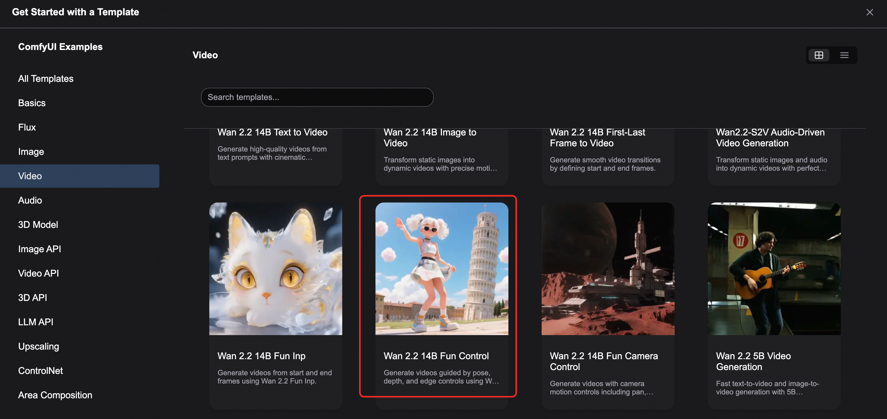

<div style="background: linear-gradient(135deg, #2563eb, #1e40af); padding: 24px; border-radius: 8px; color: white; text-align: center; margin-bottom: 24px;">
  <h1 style="font-size: 2.5em; margin: 0; font-weight: 600;">🎮 Wan2.2-Fun-Control Video Control Generation</h1>
  <p style="font-size: 1.2em; margin: 16px 0 0 0; opacity: 0.9;">ComfyUI Native Workflow - Precise Video Generation with Multi-Modal Control Conditions</p>
  <div style="margin-top: 20px;">
    <span style="background: rgba(255,255,255,0.2); color: white; padding: 4px 12px; border-radius: 12px; font-size: 14px; margin: 0 8px;">🎯 Multi-Modal Control</span>
    <span style="background: rgba(255,255,255,0.2); color: white; padding: 4px 12px; border-radius: 12px; font-size: 14px; margin: 0 8px;">🎬 Cinematic Quality</span>
    <span style="background: rgba(255,255,255,0.2); color: white; padding: 4px 12px; border-radius: 12px; font-size: 14px; margin: 0 8px;">🌐 Multi-Language</span>
  </div>
</div>

## 📋 Model Overview

<div style="background: #f8fafc; border: 1px solid #e2e8f0; border-radius: 8px; padding: 20px; margin: 16px 0;">

**Wan2.2-Fun-Control** is a next-generation video generation and control model developed by the Alibaba PAI team. By introducing innovative Control Codes mechanisms combined with deep learning and multi-modal conditional inputs, it can generate high-quality videos that conform to preset control conditions. The model is released under the **Apache 2.0 license** and supports commercial use.

<div style="display: grid; grid-template-columns: repeat(auto-fit, minmax(250px, 1fr)); gap: 16px; margin: 16px 0;">
  <div style="background: #eff6ff; border-left: 4px solid #2563eb; padding: 16px; border-radius: 4px;">
    <strong>🎯 Multi-Modal Control</strong><br>
    <p style="margin: 8px 0 0 0; color: #1e40af; font-size: 14px;">Supports Canny, Depth, OpenPose, MLSD and other control conditions</p>
  </div>

  <div style="background: #f0fdf4; border-left: 4px solid #059669; padding: 16px; border-radius: 4px;">
    <strong>🎬 High-Quality Video Generation</strong><br>
    <p style="margin: 8px 0 0 0; color: #065f46; font-size: 14px;">Based on Wan2.2 architecture, outputs cinematic-quality videos</p>
  </div>

  <div style="background: #fef3c7; border-left: 4px solid #d97706; padding: 16px; border-radius: 4px;">
    <strong>🌐 Multi-Language Support</strong><br>
    <p style="margin: 8px 0 0 0; color: #9a3412; font-size: 14px;">Supports Chinese, English and other multi-language prompt inputs</p>
  </div>

  <div style="background: #f3e8ff; border-left: 4px solid #7c3aed; padding: 16px; border-radius: 4px;">
    <strong>🎮 Trajectory Control</strong><br>
    <p style="margin: 8px 0 0 0; color: #5b21b6; font-size: 14px;">Supports precise motion trajectory control functionality</p>
  </div>
</div>

<div style="background: #eff6ff; border-left: 4px solid #2563eb; padding: 16px; margin: 16px 0; border-radius: 4px;">
  <strong>🔗 Related Resources</strong><br>
  • <strong>Model Repository</strong>: <a href="https://huggingface.co/alibaba-pai/Wan2.2-Fun-A14B-Control" target="_blank" style="color: #2563eb;">🤗 Wan2.2-Fun-A14B-Control</a><br>
  • <strong>Code Repository</strong>: <a href="https://github.com/aigc-apps/VideoX-Fun" target="_blank" style="color: #2563eb;">VideoX-Fun</a>
</div>

</div>


## 🚀 Wan2.2 Fun Control Workflow Example

### ⚠️ Environment Requirements

<div style="background: #fef3c7; border-left: 4px solid #d97706; padding: 16px; margin: 16px 0; border-radius: 4px;">
  <strong>📋 Pre-usage Checklist</strong><br>
  • Ensure ComfyUI is updated to the latest version<br>
  • Recommend using the latest development version (nightly) for full functionality<br>
  • The workflow in this guide can be found in ComfyUI's workflow templates<br>
  • If nodes are missing when loading the workflow, check ComfyUI version or node import status
</div>

<div style="display: grid; grid-template-columns: 1fr 1fr; gap: 16px; margin: 16px 0;">

<div style="background: #dcfce7; border-left: 4px solid #059669; padding: 16px; border-radius: 4px;">
<h4 style="color: #059669; margin: 0 0 8px 0;">📥 Download Links</h4>
<ul style="margin: 0; padding-left: 20px; color: #065f46;">
  <li><a href="https://www.comfy.org/download" target="_blank" style="color: #059669;">ComfyUI Download</a></li>
  <li><a href="/installation/update_comfyui" target="_blank" style="color: #059669;">ComfyUI Update Tutorial</a></li>
  <li><a href="/interface/features/template" target="_blank" style="color: #059669;">Workflow Templates</a></li>
</ul>
</div>

<div style="background: #fef2f2; border-left: 4px solid #dc2626; padding: 16px; border-radius: 4px;">
<h4 style="color: #dc2626; margin: 0 0 8px 0;">🔧 Common Issues</h4>
<ul style="margin: 0; padding-left: 20px; color: #991b1b;">
  <li>Missing nodes: Version too old or import failed</li>
  <li>Incomplete features: Using stable version instead of dev version</li>
  <li>Loading failure: Node import exception during startup</li>
</ul>
</div>

</div>

### 🔧 Workflow Version Description

<div style="background: #f8fafc; border: 1px solid #e2e8f0; border-radius: 8px; padding: 20px; margin: 16px 0;">

Two workflow versions are provided for selection:

<div style="display: grid; grid-template-columns: 1fr 1fr; gap: 16px; margin: 16px 0;">

<div style="background: #eff6ff; border-left: 4px solid #2563eb; padding: 16px; border-radius: 4px;">
<h4 style="color: #2563eb; margin: 0 0 8px 0;">⚡ Lightning Accelerated Version</h4>
<p style="margin: 0 0 8px 0; color: #1e40af; font-size: 14px;">Uses <a href="https://huggingface.co/lightx2v/Wan2.2-Lightning" target="_blank" style="color: #2563eb;">Wan2.2-Lightning</a> 4-step LoRA</p>
<div style="background: #dcfce7; color: #059669; padding: 4px 12px; border-radius: 12px; font-size: 12px; display: inline-block; margin-right: 8px;">✅ Faster Speed</div>
<div style="background: #fed7aa; color: #ea580c; padding: 4px 12px; border-radius: 12px; font-size: 12px; display: inline-block;">⚠️ Dynamic Loss</div>
</div>

<div style="background: #f0fdf4; border-left: 4px solid #059669; padding: 16px; border-radius: 4px;">
<h4 style="color: #059669; margin: 0 0 8px 0;">🎯 Standard Quality Version</h4>
<p style="margin: 0 0 8px 0; color: #065f46; font-size: 14px;">Uses fp8_scaled version without acceleration LoRA</p>
<div style="background: #dcfce7; color: #059669; padding: 4px 12px; border-radius: 12px; font-size: 12px; display: inline-block; margin-right: 8px;">✅ Higher Quality</div>
<div style="background: #fed7aa; color: #ea580c; padding: 4px 12px; border-radius: 12px; font-size: 12px; display: inline-block;">⏱️ Longer Time</div>
</div>

</div>

#### 📊 Performance Comparison Test

<div style="background: #f0fdf4; border-left: 4px solid #059669; padding: 16px; margin: 16px 0; border-radius: 4px;">
  <strong>🧪 Test Environment</strong>: RTX 4090D 24GB VRAM, 640×640 resolution, 81 frames length
</div>

<div style="overflow-x: auto; margin: 16px 0;">
<table style="width: 100%; border-collapse: collapse; background: white; border-radius: 6px; overflow: hidden; box-shadow: 0 1px 3px rgba(0,0,0,0.1);">
  <thead style="background: #f8fafc;">
    <tr>
      <th style="padding: 12px; text-align: left; border-bottom: 1px solid #e2e8f0; color: #1e40af; font-weight: 600;">Model Type</th>
      <th style="padding: 12px; text-align: left; border-bottom: 1px solid #e2e8f0; color: #1e40af; font-weight: 600;">Resolution</th>
      <th style="padding: 12px; text-align: left; border-bottom: 1px solid #e2e8f0; color: #1e40af; font-weight: 600;">VRAM Usage</th>
      <th style="padding: 12px; text-align: left; border-bottom: 1px solid #e2e8f0; color: #1e40af; font-weight: 600;">First Generation</th>
      <th style="padding: 12px; text-align: left; border-bottom: 1px solid #e2e8f0; color: #1e40af; font-weight: 600;">Second Generation</th>
    </tr>
  </thead>
  <tbody>
    <tr>
      <td style="padding: 12px; border-bottom: 1px solid #f1f5f9; font-weight: 500;">fp8_scaled</td>
      <td style="padding: 12px; border-bottom: 1px solid #f1f5f9;">640×640</td>
      <td style="padding: 12px; border-bottom: 1px solid #f1f5f9;">83%</td>
      <td style="padding: 12px; border-bottom: 1px solid #f1f5f9;">≈ 524s</td>
      <td style="padding: 12px; border-bottom: 1px solid #f1f5f9;">≈ 520s</td>
    </tr>
    <tr>
      <td style="padding: 12px; font-weight: 500;">fp8_scaled + 4-step LoRA</td>
      <td style="padding: 12px;">640×640</td>
      <td style="padding: 12px;">89%</td>
      <td style="padding: 12px;"><span style="background: #dcfce7; color: #059669; padding: 2px 8px; border-radius: 4px; font-size: 12px;">≈ 138s</span></td>
      <td style="padding: 12px;"><span style="background: #dcfce7; color: #059669; padding: 2px 8px; border-radius: 4px; font-size: 12px;">≈ 79s</span></td>
    </tr>
  </tbody>
</table>
</div>

<div style="background: #eff6ff; border-left: 4px solid #2563eb; padding: 16px; margin: 16px 0; border-radius: 4px;">
  <strong>💡 Version Switching Instructions</strong><br>
  Since the 4-step LoRA provides better user experience for first-time workflow users, the accelerated version is enabled by default. To switch to the standard version, select the corresponding workflow and use <strong>Ctrl+B</strong> to enable it.
</div>

</div>

### 📥 Step 1: Download Workflow and Materials

<div style="background: #f8fafc; border: 1px solid #e2e8f0; border-radius: 8px; padding: 20px; margin: 16px 0;">
you can find the workflow file in the following figure



Download the following video or JSON file and drag it into ComfyUI to load the corresponding workflow.

<div style="text-align: center; margin: 20px 0;">
  <video controls style="width: 100%; max-width: 800px; border-radius: 8px; box-shadow: 0 4px 8px rgba(0,0,0,0.1);" src="https://raw.githubusercontent.com/Comfy-Org/example_workflows/refs/heads/main/video/wan/wan2.2_fun_control/wan2.2_14B_fun_inp.mp4"></video>
</div>

<div style="text-align: center; margin: 20px 0;">
  <a href="https://raw.githubusercontent.com/Comfy-Org/workflow_templates/refs/heads/main/templates/video_wan2_2_14B_fun_control.json" target="_blank" style="display: inline-block; background: linear-gradient(135deg, #2563eb, #1e40af); color: white; padding: 12px 24px; border-radius: 8px; text-decoration: none; font-weight: bold; box-shadow: 0 4px 8px rgba(37, 99, 235, 0.3);">
    📄 Download JSON Workflow File
  </a>
</div>

### 📁 Sample Material Download

<div style="display: grid; grid-template-columns: 1fr 1fr; gap: 16px; margin: 16px 0;">

<div style="background: #f0fdf4; border-left: 4px solid #059669; padding: 16px; border-radius: 4px;">
<h4 style="color: #059669; margin: 0 0 12px 0;">🖼️ Input Starting Image</h4>
<div style="text-align: center; margin: 12px 0;">
  
</div>
</div>

<div style="background: #fff7ed; border-left: 4px solid #ea580c; padding: 16px; border-radius: 4px;">
<h4 style="color: #ea580c; margin: 0 0 12px 0;">🎬 Control Video</h4>
<div style="text-align: center; margin: 12px 0;">
  <video controls style="width: 100%; max-width: 300px; border-radius: 6px; box-shadow: 0 2px 4px rgba(0,0,0,0.1);" src="https://raw.githubusercontent.com/Comfy-Org/example_workflows/refs/heads/main/video/wan/wan2.2_fun_control/control_video.mp4"></video>
</div>
<p style="margin: 8px 0 0 0; color: #9a3412; font-size: 13px;">This video has been pre-processed and can be used directly for control video generation</p>
</div>

</div>

</div>

### 🔗 Step 2: Model Files


#### 📂 Model File Structure

<div style="background: #1e293b; border-radius: 6px; padding: 16px; margin: 16px 0;">
<pre style="margin: 0; color: #e2e8f0; font-family: 'Courier New', monospace; font-size: 14px;"><code>ComfyUI/
├───📂 models/
│   ├───📂 diffusion_models/
│   │   ├─── wan2.2_fun_control_low_noise_14B_fp8_scaled.safetensors
│   │   └─── wan2.2_fun_control_high_noise_14B_fp8_scaled.safetensors
│   ├───📂 loras/
│   │   ├─── wan2.2_i2v_lightx2v_4steps_lora_v1_high_noise.safetensors
│   │   └─── wan2.2_i2v_lightx2v_4steps_lora_v1_low_noise.safetensors
│   ├───📂 text_encoders/
│   │   └─── umt5_xxl_fp8_e4m3fn_scaled.safetensors 
│   └───📂 vae/
│       └── wan_2.1_vae.safetensors</code></pre>
</div>

### 🔧 Step 3: Workflow Configuration Operations

<div style="background: #f8fafc; border: 1px solid #e2e8f0; border-radius: 8px; padding: 20px; margin: 16px 0;">

<div style="text-align: center; margin: 20px 0;">
  
</div>

<div style="background: #fef3c7; border-left: 4px solid #d97706; padding: 16px; margin: 16px 0; border-radius: 4px;">
  <strong>⚠️ Important Reminder</strong><br>
  This workflow uses the LoRA accelerated version. Please ensure that the corresponding Diffusion Model and LoRA files are consistent, with high noise and low noise models and LoRAs used correspondingly.
</div>

#### 📋 Detailed Configuration Steps

<div style="display: grid; grid-template-columns: 1fr 1fr; gap: 16px; margin: 16px 0;">

<div style="background: #eff6ff; border-left: 4px solid #2563eb; padding: 16px; border-radius: 4px;">
<h4 style="color: #2563eb; margin: 0 0 12px 0;">🔧 High Noise Model Configuration</h4>
<ul style="margin: 0; padding-left: 20px; color: #1e40af; font-size: 14px;">
  <li><strong>Load Diffusion Model</strong>:<br><code>wan2.2_fun_control_high_noise_14B_fp8_scaled.safetensors</code></li>
  <li><strong>LoraLoaderModelOnly</strong>:<br><code>wan2.2_i2v_lightx2v_4steps_lora_v1_high_noise.safetensors</code></li>
</ul>
</div>

<div style="background: #f0fdf4; border-left: 4px solid #059669; padding: 16px; border-radius: 4px;">
<h4 style="color: #059669; margin: 0 0 12px 0;">🔧 Low Noise Model Configuration</h4>
<ul style="margin: 0; padding-left: 20px; color: #065f46; font-size: 14px;">
  <li><strong>Load Diffusion Model</strong>:<br><code>wan2.2_fun_control_low_noise_14B_fp8_scaled.safetensors</code></li>
  <li><strong>LoraLoaderModelOnly</strong>:<br><code>wan2.2_i2v_lightx2v_4steps_lora_v1_low_noise.safetensors</code></li>
</ul>
</div>

</div>

#### 🎯 Base Model Configuration

<div style="overflow-x: auto; margin: 16px 0;">
<table style="width: 100%; border-collapse: collapse; background: white; border-radius: 6px; overflow: hidden; box-shadow: 0 1px 3px rgba(0,0,0,0.1);">
  <thead style="background: #f8fafc;">
    <tr>
      <th style="padding: 12px; text-align: left; border-bottom: 1px solid #e2e8f0; color: #1e40af; font-weight: 600;">Node Name</th>
      <th style="padding: 12px; text-align: left; border-bottom: 1px solid #e2e8f0; color: #1e40af; font-weight: 600;">Model File</th>
      <th style="padding: 12px; text-align: left; border-bottom: 1px solid #e2e8f0; color: #1e40af; font-weight: 600;">Description</th>
    </tr>
  </thead>
  <tbody>
    <tr>
      <td style="padding: 12px; border-bottom: 1px solid #f1f5f9; font-weight: 500;">Load CLIP</td>
      <td style="padding: 12px; border-bottom: 1px solid #f1f5f9; font-family: monospace; font-size: 12px;">umt5_xxl_fp8_e4m3fn_scaled.safetensors</td>
      <td style="padding: 12px; border-bottom: 1px solid #f1f5f9;">Text encoder</td>
    </tr>
    <tr>
      <td style="padding: 12px; font-weight: 500;">Load VAE</td>
      <td style="padding: 12px; font-family: monospace; font-size: 12px;">wan_2.1_vae.safetensors</td>
      <td style="padding: 12px;">Variational autoencoder</td>
    </tr>
  </tbody>
</table>
</div>

#### 📁 Input Configuration Steps

<div style="display: grid; grid-template-columns: repeat(auto-fit, minmax(300px, 1fr)); gap: 16px; margin: 16px 0;">

<div style="background: #f0fdf4; border-left: 4px solid #059669; padding: 16px; border-radius: 4px;">
<h4 style="color: #059669; margin: 0 0 8px 0;">🖼️ Starting Frame Upload</h4>
<p style="margin: 0; color: #065f46; font-size: 14px;">Upload the starting frame image in the <strong>Load Image</strong> node</p>
</div>

<div style="background: #eff6ff; border-left: 4px solid #2563eb; padding: 16px; border-radius: 4px;">
<h4 style="color: #2563eb; margin: 0 0 8px 0;">🎬 Control Video Upload</h4>
<p style="margin: 0; color: #1e40af; font-size: 14px;">Upload the control video's pose video in the second <strong>Load Video</strong> node</p>
</div>

<div style="background: #fff7ed; border-left: 4px solid #ea580c; padding: 16px; border-radius: 4px;">
<h4 style="color: #ea580c; margin: 0 0 8px 0;">🔧 Disable Preprocessing Nodes</h4>
<p style="margin: 0; color: #9a3412; font-size: 14px;">Since the provided video is pre-processed, disable corresponding preprocessing nodes (select and use <strong>Ctrl+B</strong>)</p>
</div>

<div style="background: #f3e8ff; border-left: 4px solid #7c3aed; padding: 16px; border-radius: 4px;">
<h4 style="color: #7c3aed; margin: 0 0 8px 0;">📝 Modify Prompts</h4>
<p style="margin: 0; color: #5b21b6; font-size: 14px;">Modify prompts, supports Chinese and English input</p>
</div>

</div>

#### ⚙️ Parameter Adjustment

<div style="background: #fff7ed; border-left: 4px solid #ea580c; padding: 16px; margin: 16px 0; border-radius: 4px;">
  <strong>🎬 Wan22FunControlToVideo Node Configuration</strong><br>
  • Modify the corresponding video dimension parameters<br>
  • Default set to 640×640 resolution to avoid excessive time consumption for low-VRAM users<br>
  • Can be adjusted to higher resolution as needed
</div>

#### 🚀 Execute Generation

<div style="text-align: center; margin: 20px 0;">
  <div style="background: linear-gradient(135deg, #059669, #047857); color: white; padding: 16px 32px; border-radius: 8px; display: inline-block; box-shadow: 0 4px 8px rgba(5, 150, 105, 0.3);">
    <strong>⌨️ Click the Run button or use shortcut Ctrl(Cmd) + Enter to execute video generation</strong>
  </div>
</div>

</div>

## API调用
<details style="border: 2px solid #2563eb; border-radius: 12px; padding: 20px; margin: 20px 0; background: linear-gradient(145deg, #f8fafc, #eff6ff); box-shadow: 0 8px 16px rgba(37, 99, 235, 0.15);">
<summary style="font-weight: bold; font-size: 18px; color: white; cursor: pointer; padding: 16px; background: linear-gradient(135deg, #2563eb, #1e40af); border-radius: 8px; margin: -20px -20px 20px -20px; text-shadow: 1px 1px 2px rgba(0,0,0,0.2); transition: all 0.3s ease; display: flex; align-items: center; box-shadow: 0 4px 8px rgba(37, 99, 235, 0.3);">
📋 点击展开ComfyUI API调用Python代码
</summary>

```python

import requests
import json
import uuid
import time
import random
import os

# Configuration Parameters - Wan2.2 Fun Control Specific
COMFYUI_SERVER = "127.0.0.1:8188"  # Local server
COMFYUI_TOKEN = ""  # Usually no token needed for local

# Model Configuration
HIGH_NOISE_UNET = "wan2.2_fun_control_high_noise_14B_fp8_scaled.safetensors"
LOW_NOISE_UNET = "wan2.2_fun_control_low_noise_14B_fp8_scaled.safetensors"
CLIP_MODEL = "umt5_xxl_fp8_e4m3fn_scaled.safetensors"
VAE_MODEL = "wan_2.1_vae.safetensors"
HIGH_NOISE_LORA = "wan2.2_i2v_lightx2v_4steps_lora_v1_high_noise.safetensors"
LOW_NOISE_LORA = "wan2.2_i2v_lightx2v_4steps_lora_v1_low_noise.safetensors"

# Default Parameters
DEFAULT_POSITIVE_PROMPT = "On a sunny summer day, there are marshmallow - like clouds, and the sunlight is bright and warm. A girl with white curly double - ponytails is wearing unique sunglasses, distinctive clothes and shoes. Her posture is natural and full of dynamic tension. The background is the scene of the Leaning Tower of Pisa in Italy, emphasizing the realistic contrast of details in reality. The whole picture is in a realistic 3D style, rich in details and with a relaxed atmosphere. She is dancing slowly, waving her hands."

DEFAULT_NEGATIVE_PROMPT = "色调艳丽，过曝，静态，细节模糊不清，字幕，风格，作品，画作，画面，静止，整体发灰，最差质量，低质量，JPEG压缩残留，丑陋的，残缺的，多余的手指，画得不好的手部，画得不好的脸部，畸形的，毁容的，形态畸形的肢体，手指融合，静止不动的画面，杂乱的背景，三条腿，背景人很多，倒着走"

DEFAULT_REF_IMAGE = "fun_control.jpg"
DEFAULT_CONTROL_VIDEO = "control_video.mp4"

class ComfyUIWan22FunControlClient:
    def __init__(self, server=COMFYUI_SERVER, token=COMFYUI_TOKEN):
        self.base_url = f"http://{server}"
        self.token = token
        self.client_id = str(uuid.uuid4())
        self.headers = {"Content-Type": "application/json"}
        if token:
            self.headers["Authorization"] = f"Bearer {token}"

    def upload_image(self, image_path):
        """Upload image to ComfyUI server"""
        try:
            with open(image_path, 'rb') as f:
                files = {'image': f}
                response = requests.post(f"{self.base_url}/upload/image", files=files)
                if response.status_code == 200:
                    result = response.json()
                    return result.get('name', os.path.basename(image_path))
                else:
                    raise Exception(f"Failed to upload image: {response.text}")
        except Exception as e:
            print(f"Image upload error: {e}")
            return None

    def upload_video(self, video_path):
        """Upload video to ComfyUI server"""
        try:
            with open(video_path, 'rb') as f:
                files = {'video': f}
                response = requests.post(f"{self.base_url}/upload/video", files=files)
                if response.status_code == 200:
                    result = response.json()
                    return result.get('name', os.path.basename(video_path))
                else:
                    raise Exception(f"Failed to upload video: {response.text}")
        except Exception as e:
            print(f"Video upload error: {e}")
            return None

    def generate_fun_control_video(self, positive_prompt, negative_prompt=None,
                                  ref_image_path=None, ref_image_name=None,
                                  control_video_path=None, control_video_name=None,
                                  width=640, height=640, length=81, fps=16,
                                  steps=4, cfg=1, seed=None,
                                  canny_low_threshold=0.1, canny_high_threshold=0.6,
                                  shift=8.0, lora_strength=1.0):
        """Generate Fun Control video using Wan2.2 based on original JSON workflow"""
        print("Starting Wan2.2 Fun Control video generation...")
        
        # Use default negative prompt if not provided
        if negative_prompt is None:
            negative_prompt = DEFAULT_NEGATIVE_PROMPT
            
        # Generate random seed if not provided
        if seed is None:
            seed = random.randint(1, 1000000000000000)

        # Handle reference image
        if ref_image_path and not ref_image_name:
            ref_image_name = self.upload_image(ref_image_path)
            if not ref_image_name:
                raise Exception("Failed to upload reference image")
        elif not ref_image_name:
            ref_image_name = DEFAULT_REF_IMAGE

        # Handle control video
        if control_video_path and not control_video_name:
            control_video_name = self.upload_video(control_video_path)
            if not control_video_name:
                raise Exception("Failed to upload control video")
        elif not control_video_name:
            control_video_name = DEFAULT_CONTROL_VIDEO

        # Workflow based on your provided JSON
        workflow = {
            "162": {
                "inputs": {
                    "text": negative_prompt,
                    "clip": ["167", 0]
                },
                "class_type": "CLIPTextEncode",
                "_meta": {"title": "CLIP Text Encode (Negative Prompt)"}
            },
            "163": {
                "inputs": {
                    "fps": fps,
                    "images": ["164", 0]
                },
                "class_type": "CreateVideo",
                "_meta": {"title": "Create Video"}
            },
            "164": {
                "inputs": {
                    "samples": ["175", 0],
                    "vae": ["168", 0]
                },
                "class_type": "VAEDecode",
                "_meta": {"title": "VAE Decode"}
            },
            "165": {
                "inputs": {
                    "unet_name": HIGH_NOISE_UNET,
                    "weight_dtype": "default"
                },
                "class_type": "UNETLoader",
                "_meta": {"title": "UNet Loader (High Noise)"}
            },
            "166": {
                "inputs": {
                    "unet_name": LOW_NOISE_UNET,
                    "weight_dtype": "default"
                },
                "class_type": "UNETLoader",
                "_meta": {"title": "UNet Loader (Low Noise)"}
            },
            "167": {
                "inputs": {
                    "clip_name": CLIP_MODEL,
                    "type": "wan",
                    "device": "default"
                },
                "class_type": "CLIPLoader",
                "_meta": {"title": "CLIP Loader"}
            },
            "168": {
                "inputs": {
                    "vae_name": VAE_MODEL
                },
                "class_type": "VAELoader",
                "_meta": {"title": "VAE Loader"}
            },
            "169": {
                "inputs": {
                    "add_noise": "enable",
                    "noise_seed": seed,
                    "steps": steps,
                    "cfg": cfg,
                    "sampler_name": "euler",
                    "scheduler": "simple",
                    "start_at_step": 0,
                    "end_at_step": 2,
                    "return_with_leftover_noise": "enable",
                    "model": ["176", 0],
                    "positive": ["180", 0],
                    "negative": ["180", 1],
                    "latent_image": ["180", 2]
                },
                "class_type": "KSamplerAdvanced",
                "_meta": {"title": "K Sampler Advanced (High Noise)"}
            },
            "170": {
                "inputs": {
                    "filename_prefix": "wan22_fun_control/video",
                    "format": "auto",
                    "codec": "auto",
                    "video": ["163", 0]
                },
                "class_type": "SaveVideo",
                "_meta": {"title": "Save Video"}
            },
            "171": {
                "inputs": {
                    "video": ["174", 0]
                },
                "class_type": "GetVideoComponents",
                "_meta": {"title": "Get Video Components"}
            },
            "172": {
                "inputs": {
                    "images": ["173", 0]
                },
                "class_type": "PreviewImage",
                "_meta": {"title": "Preview Image"}
            },
            "173": {
                "inputs": {
                    "low_threshold": canny_low_threshold,
                    "high_threshold": canny_high_threshold,
                    "image": ["171", 0]
                },
                "class_type": "Canny",
                "_meta": {"title": "Canny Edge Detection"}
            },
            "174": {
                "inputs": {
                    "file": control_video_name,
                    "video-preview": ""
                },
                "class_type": "LoadVideo",
                "_meta": {"title": "Load Video"}
            },
            "175": {
                "inputs": {
                    "add_noise": "disable",
                    "noise_seed": 0,
                    "steps": steps,
                    "cfg": cfg,
                    "sampler_name": "euler",
                    "scheduler": "simple",
                    "start_at_step": 2,
                    "end_at_step": 4,
                    "return_with_leftover_noise": "disable",
                    "model": ["177", 0],
                    "positive": ["180", 0],
                    "negative": ["180", 1],
                    "latent_image": ["169", 0]
                },
                "class_type": "KSamplerAdvanced",
                "_meta": {"title": "K Sampler Advanced (Low Noise)"}
            },
            "176": {
                "inputs": {
                    "shift": shift,
                    "model": ["181", 0]
                },
                "class_type": "ModelSamplingSD3",
                "_meta": {"title": "Model Sampling SD3 (High Noise)"}
            },
            "177": {
                "inputs": {
                    "shift": shift,
                    "model": ["182", 0]
                },
                "class_type": "ModelSamplingSD3",
                "_meta": {"title": "Model Sampling SD3 (Low Noise)"}
            },
            "178": {
                "inputs": {
                    "image": ref_image_name
                },
                "class_type": "LoadImage",
                "_meta": {"title": "Load Reference Image"}
            },
            "179": {
                "inputs": {
                    "text": positive_prompt,
                    "clip": ["167", 0]
                },
                "class_type": "CLIPTextEncode",
                "_meta": {"title": "CLIP Text Encode (Positive Prompt)"}
            },
            "180": {
                "inputs": {
                    "width": width,
                    "height": height,
                    "length": length,
                    "batch_size": 1,
                    "positive": ["179", 0],
                    "negative": ["162", 0],
                    "vae": ["168", 0],
                    "ref_image": ["178", 0],
                    "control_video": ["173", 0]
                },
                "class_type": "Wan22FunControlToVideo",
                "_meta": {"title": "Wan22 Fun Control To Video"}
            },
            "181": {
                "inputs": {
                    "lora_name": HIGH_NOISE_LORA,
                    "strength_model": lora_strength,
                    "model": ["165", 0]
                },
                "class_type": "LoraLoaderModelOnly",
                "_meta": {"title": "LoRA Loader (High Noise)"}
            },
            "182": {
                "inputs": {
                    "lora_name": LOW_NOISE_LORA,
                    "strength_model": lora_strength,
                    "model": ["166", 0]
                },
                "class_type": "LoraLoaderModelOnly",
                "_meta": {"title": "LoRA Loader (Low Noise)"}
            }
        }

        print("Submitting Wan2.2 Fun Control video generation workflow...")
        print(f"Positive Prompt: {positive_prompt}")
        print(f"Reference Image: {ref_image_name}")
        print(f"Control Video: {control_video_name}")
        print(f"Video Dimensions: {width}x{height}")
        print(f"Video Length: {length} frames")
        print(f"FPS: {fps}")
        print(f"Random Seed: {seed}")
        
        response = requests.post(
            f"{self.base_url}/prompt", 
            headers=self.headers, 
            json={"prompt": workflow, "client_id": self.client_id}
        )
        
        print(f"API Response: {response.text}")

        if response.status_code != 200:
            raise Exception(f"API request failed with status code: {response.status_code}")

        result = response.json()
        if "error" in result:
            raise Exception(f"Workflow error: {result['error']}")
        if "prompt_id" not in result:
            raise Exception(f"No prompt_id in response: {result}")
        
        return result["prompt_id"], seed

    def get_status(self, task_id):
        """Get task status"""
        try:
            # Check queue status
            queue_data = requests.get(f"{self.base_url}/queue", headers=self.headers).json()
            
            # Check if in running queue
            if any(item[1] == task_id for item in queue_data.get("queue_running", [])):
                return "processing"
            
            # Check if in pending queue
            if any(item[1] == task_id for item in queue_data.get("queue_pending", [])):
                return "pending"
            
            # Check history
            history_response = requests.get(f"{self.base_url}/history/{task_id}", headers=self.headers)
            if history_response.status_code == 200:
                history = history_response.json()
                if task_id in history:
                    return "completed"
            
            return "processing"
        except Exception as e:
            print(f"Status check error: {e}")
            return "processing"

    def download_video(self, task_id, output_dir="outputs"):
        """Download generated video and preview files"""
        try:
            # Ensure output directory exists
            os.makedirs(output_dir, exist_ok=True)
            
            response = requests.get(f"{self.base_url}/history/{task_id}", headers=self.headers)
            history = response.json()
            
            if task_id in history:
                outputs = history[task_id]['outputs']
                downloaded_files = []
                
                for node_id, output in outputs.items():
                    # Check for video files
                    if 'videos' in output:
                        for video_info in output['videos']:
                            filename = video_info['filename']
                            # Download video
                            video_response = requests.get(
                                f"{self.base_url}/view?filename={filename}", 
                                headers=self.headers
                            )
                            
                            if video_response.status_code == 200:
                                output_path = os.path.join(output_dir, filename)
                                with open(output_path, "wb") as f:
                                    f.write(video_response.content)
                                downloaded_files.append(output_path)
                                print(f"Video saved: {output_path}")
                    
                    # Check for preview images
                    if 'images' in output:
                        for img_info in output['images']:
                            filename = img_info['filename']
                            # Download preview image
                            img_response = requests.get(
                                f"{self.base_url}/view?filename={filename}", 
                                headers=self.headers
                            )
                            
                            if img_response.status_code == 200:
                                output_path = os.path.join(output_dir, filename)
                                with open(output_path, "wb") as f:
                                    f.write(img_response.content)
                                downloaded_files.append(output_path)
                                print(f"Preview image saved: {output_path}")
                
                return downloaded_files
                
        except Exception as e:
            print(f"Download error: {e}")
        
        return []

    def generate_batch(self, prompt_configs, **kwargs):
        """Batch generate videos with different configurations"""
        results = []
        
        for i, config in enumerate(prompt_configs):
            print(f"\nStarting Fun Control video generation task {i+1}/{len(prompt_configs)}...")
            
            try:
                task_id, seed = self.generate_fun_control_video(**config, **kwargs)
                
                # Wait for completion
                while True:
                    status = self.get_status(task_id)
                    print(f"Task {i+1} status: {status}")
                    
                    if status == "completed":
                        files = self.download_video(task_id)
                        results.append({
                            'task_id': task_id,
                            'seed': seed,
                            'files': files,
                            'config': config
                        })
                        break
                    elif status == "failed":
                        print(f"Task {i+1} failed")
                        break
                    
                    time.sleep(15)  # Video generation takes longer
                    
            except Exception as e:
                print(f"Task {i+1} error: {e}")
        
        return results

def main():
    """Main function - Execute Wan2.2 Fun Control video generation"""
    client = ComfyUIWan22FunControlClient()
    
    try:
        print("Wan2.2 Fun Control video generation client started...")
        
        # Single video generation example
        print("\n=== Single Fun Control Video Generation ===")
        
        # You can provide local file paths or use existing file names
        ref_image_path = None  # Set to your image path, e.g., "reference.jpg"
        control_video_path = None  # Set to your video path, e.g., "control.mp4"
        
        task_id, seed = client.generate_fun_control_video(
            positive_prompt=DEFAULT_POSITIVE_PROMPT,
            negative_prompt=DEFAULT_NEGATIVE_PROMPT,
            ref_image_path=ref_image_path,
            ref_image_name=DEFAULT_REF_IMAGE,
            control_video_path=control_video_path,
            control_video_name=DEFAULT_CONTROL_VIDEO,
            width=640,
            height=640,
            length=81,
            fps=16,
            steps=4,
            cfg=1
        )
        
        print(f"Task ID: {task_id}")
        print(f"Seed: {seed}")

        # Wait for task completion (video generation takes longer)
        while True:
            status = client.get_status(task_id)
            print(f"Current status: {status}")
            
            if status == "completed":
                print("Fun Control video generation completed!")
                break
            elif status == "failed":
                print("Generation failed!")
                return
            
            time.sleep(15)

        # Download video and preview files
        downloaded_files = client.download_video(task_id)
        if downloaded_files:
            print(f"Successfully downloaded {len(downloaded_files)} files!")
            for file in downloaded_files:
                print(f"File path: {file}")
        else:
            print("Download failed")

        # Batch generation example
        print("\n=== Batch Generation Example ===")
        batch_configs = [
            {
                'positive_prompt': "A dancer performing ballet in a beautiful garden with flowers",
                'ref_image_name': DEFAULT_REF_IMAGE,
                'control_video_name': DEFAULT_CONTROL_VIDEO,
                'width': 640,
                'height': 640,
                'length': 49
            },
            {
                'positive_prompt': "A person walking through a bustling city street at sunset",
                'ref_image_name': DEFAULT_REF_IMAGE,
                'control_video_name': DEFAULT_CONTROL_VIDEO,
                'width': 640,
                'height': 640,
                'length': 65
            }
        ]
        
        # Uncomment to run batch generation
        # batch_results = client.generate_batch(batch_configs, fps=16, steps=4)
        # print(f"Batch generation completed, generated {len(batch_results)} videos")

    except Exception as e:
        print(f"Error: {e}")

if __name__ == "__main__":
    main()


```

</details>


## 🎯 Control Types Explained

<div style="display: grid; grid-template-columns: repeat(auto-fit, minmax(280px, 1fr)); gap: 16px; margin: 16px 0;">

<div style="background: #eff6ff; border-left: 4px solid #2563eb; padding: 16px; border-radius: 4px; text-align: center;">
<div style="font-size: 2.5em; margin-bottom: 12px; color: #2563eb;">✏️</div>
<h4 style="margin: 0 0 8px 0; color: #1e40af;">Canny (Edge Detection)</h4>
<p style="margin: 0; color: #1e40af;">Edge detection control, suitable for contour and line control</p>
</div>

<div style="background: #f0fdf4; border-left: 4px solid #059669; padding: 16px; border-radius: 4px; text-align: center;">
<div style="font-size: 2.5em; margin-bottom: 12px; color: #059669;">🏔️</div>
<h4 style="margin: 0 0 8px 0; color: #059669;">Depth (Depth Map)</h4>
<p style="margin: 0; color: #065f46;">Depth information control, maintains spatial structure of scenes</p>
</div>

<div style="background: #fff7ed; border-left: 4px solid #ea580c; padding: 16px; border-radius: 4px; text-align: center;">
<div style="font-size: 2.5em; margin-bottom: 12px; color: #ea580c;">🤸</div>
<h4 style="margin: 0 0 8px 0; color: #ea580c;">OpenPose (Human Pose)</h4>
<p style="margin: 0; color: #9a3412;">Human skeleton point control, precise control of character actions</p>
</div>

<div style="background: #f5f3ff; border-left: 4px solid #7c3aed; padding: 16px; border-radius: 4px; text-align: center;">
<div style="font-size: 2.5em; margin-bottom: 12px; color: #7c3aed;">📐</div>
<h4 style="margin: 0 0 8px 0; color: #7c3aed;">MLSD (Geometric Lines)</h4>
<p style="margin: 0; color: #5b21b6;">Geometric line detection, suitable for architectural and structural control</p>
</div>

</div>

## 💡 Additional Notes and Extensions

<div style="background: #f8fafc; border: 1px solid #e2e8f0; border-radius: 8px; padding: 20px; margin: 16px 0;">

### 🔧 Preprocessor Extensions

<div style="background: #eff6ff; border-left: 4px solid #2563eb; padding: 16px; margin: 16px 0; border-radius: 4px;">
  <strong>📦 ComfyUI-comfyui_controlnet_aux</strong><br>
  Since ComfyUI's built-in nodes only include Canny preprocessor, you can use <a href="https://github.com/Fannovel16/comfyui_controlnet_aux" target="_blank" style="color: #2563eb;">ComfyUI-comfyui_controlnet_aux</a> to implement other types of image preprocessing.
</div>

### 🎨 Supported Preprocessing Types

<div style="display: grid; grid-template-columns: repeat(auto-fit, minmax(200px, 1fr)); gap: 12px; margin: 16px 0;">
  <div style="background: #eff6ff; padding: 12px; border-radius: 6px; text-align: center;">
    <span style="background: #2563eb; color: white; padding: 4px 12px; border-radius: 12px; font-size: 12px;">Canny Edge</span>
  </div>
  <div style="background: #f0fdf4; padding: 12px; border-radius: 6px; text-align: center;">
    <span style="background: #059669; color: white; padding: 4px 12px; border-radius: 12px; font-size: 12px;">Depth Map</span>
  </div>
  <div style="background: #fff7ed; padding: 12px; border-radius: 6px; text-align: center;">
    <span style="background: #ea580c; color: white; padding: 4px 12px; border-radius: 12px; font-size: 12px;">OpenPose</span>
  </div>
  <div style="background: #f3e8ff; padding: 12px; border-radius: 6px; text-align: center;">
    <span style="background: #7c3aed; color: white; padding: 4px 12px; border-radius: 12px; font-size: 12px;">MLSD Lines</span>
  </div>
  <div style="background: #fef3c7; padding: 12px; border-radius: 6px; text-align: center;">
    <span style="background: #d97706; color: white; padding: 4px 12px; border-radius: 12px; font-size: 12px;">Normal Map</span>
  </div>
  <div style="background: #fef2f2; padding: 12px; border-radius: 6px; text-align: center;">
    <span style="background: #dc2626; color: white; padding: 4px 12px; border-radius: 12px; font-size: 12px;">Segmentation</span>
  </div>
</div>

</div>

## 🎯 Application Scenarios

<div style="display: grid; grid-template-columns: repeat(auto-fit, minmax(280px, 1fr)); gap: 16px; margin: 16px 0;">

<div style="background: #eff6ff; border-left: 4px solid #2563eb; padding: 16px; border-radius: 4px; text-align: center;">
<div style="font-size: 2.5em; margin-bottom: 12px; color: #2563eb;">🎬</div>
<h4 style="margin: 0 0 8px 0; color: #1e40af;">Animation Production</h4>
<p style="margin: 0; color: #1e40af;">Precise control of character actions and scene changes</p>
</div>

<div style="background: #f0fdf4; border-left: 4px solid #059669; padding: 16px; border-radius: 4px; text-align: center;">
<div style="font-size: 2.5em; margin-bottom: 12px; color: #059669;">🎨</div>
<h4 style="margin: 0 0 8px 0; color: #059669;">Artistic Creation</h4>
<p style="margin: 0; color: #065f46;">Convert static artworks into dynamic expressions</p>
</div>

<div style="background: #fff7ed; border-left: 4px solid #ea580c; padding: 16px; border-radius: 4px; text-align: center;">
<div style="font-size: 2.5em; margin-bottom: 12px; color: #ea580c;">🏃</div>
<h4 style="margin: 0 0 8px 0; color: #ea580c;">Motion Analysis</h4>
<p style="margin: 0; color: #9a3412;">Sports action analysis and training video production</p>
</div>

<div style="background: #f5f3ff; border-left: 4px solid #7c3aed; padding: 16px; border-radius: 4px; text-align: center;">
<div style="font-size: 2.5em; margin-bottom: 12px; color: #7c3aed;">🏗️</div>
<h4 style="margin: 0 0 8px 0; color: #7c3aed;">Architectural Visualization</h4>
<p style="margin: 0; color: #5b21b6;">Dynamic display and walkthrough of architectural designs</p>
</div>

</div>

## 💡 Usage Tips and Recommendations

<div style="display: grid; grid-template-columns: 1fr 1fr; gap: 16px; margin: 16px 0;">

<div style="background: #dcfce7; border-left: 4px solid #059669; padding: 16px; border-radius: 4px;">
<h4 style="color: #059669; margin: 0 0 8px 0;">✅ Best Practices</h4>
<ul style="margin: 0; padding-left: 20px; color: #065f46;">
  <li>Choose appropriate control type to match content requirements</li>
  <li>Ensure control video quality is clear and stable</li>
  <li>Select appropriate resolution based on VRAM capacity</li>
  <li>Keep prompts consistent with control content</li>
</ul>
</div>

<div style="background: #fef2f2; border-left: 4px solid #dc2626; padding: 16px; border-radius: 4px;">
<h4 style="color: #dc2626; margin: 0 0 8px 0;">⚠️ Important Notes</h4>
<ul style="margin: 0; padding-left: 20px; color: #991b1b;">
  <li>Ensure High/Low Noise models match with LoRA</li>
  <li>Disable corresponding nodes when preprocessing videos</li>
  <li>Control video frame rate should match target video</li>
  <li>Complex controls may require more compute resources</li>
</ul>
</div>

</div>

## 🔧 Technical Specifications

<div style="background: #f8fafc; border: 1px solid #e2e8f0; border-radius: 8px; padding: 20px; margin: 16px 0;">

### 💻 System Requirements

<div style="overflow-x: auto; margin: 16px 0;">
<table style="width: 100%; border-collapse: collapse; background: white; border-radius: 6px; overflow: hidden; box-shadow: 0 1px 3px rgba(0,0,0,0.1);">
  <thead style="background: #f8fafc;">
    <tr>
      <th style="padding: 12px; text-align: left; border-bottom: 1px solid #e2e8f0; color: #1e40af; font-weight: 600;">Component</th>
      <th style="padding: 12px; text-align: left; border-bottom: 1px solid #e2e8f0; color: #1e40af; font-weight: 600;">Minimum</th>
      <th style="padding: 12px; text-align: left; border-bottom: 1px solid #e2e8f0; color: #1e40af; font-weight: 600;">Recommended</th>
    </tr>
  </thead>
  <tbody>
    <tr>
      <td style="padding: 12px; border-bottom: 1px solid #f1f5f9; font-weight: 500;">GPU VRAM</td>
      <td style="padding: 12px; border-bottom: 1px solid #f1f5f9;">20GB</td>
      <td style="padding: 12px; border-bottom: 1px solid #f1f5f9;">24GB+</td>
    </tr>
    <tr>
      <td style="padding: 12px; border-bottom: 1px solid #f1f5f9; font-weight: 500;">System RAM</td>
      <td style="padding: 12px; border-bottom: 1px solid #f1f5f9;">32GB</td>
      <td style="padding: 12px; border-bottom: 1px solid #f1f5f9;">64GB+</td>
    </tr>
    <tr>
      <td style="padding: 12px; border-bottom: 1px solid #f1f5f9; font-weight: 500;">Storage Space</td>
      <td style="padding: 12px; border-bottom: 1px solid #f1f5f9;">50GB</td>
      <td style="padding: 12px; border-bottom: 1px solid #f1f5f9;">100GB+ SSD</td>
    </tr>
    <tr>
      <td style="padding: 12px; font-weight: 500;">Recommended GPU</td>
      <td style="padding: 12px;">RTX 4090</td>
      <td style="padding: 12px;">RTX 4090 / A100</td>
    </tr>
  </tbody>
</table>
</div>

### 🎬 Supported Control Precision

<div style="display: grid; grid-template-columns: repeat(auto-fit, minmax(200px, 1fr)); gap: 16px; margin: 16px 0;">

<div style="background: #f8fafc; border: 1px solid #e2e8f0; border-radius: 8px; padding: 20px;">
<h3 style="margin-top: 0; color: #1e40af;">🎯 Precise Control</h3>
<ul style="margin: 0; padding-left: 20px;">
  <li><strong>OpenPose</strong>: Joint-level precision</li>
  <li><strong>Depth</strong>: Pixel-level depth control</li>
  <li><strong>Canny</strong>: Edge contour control</li>
</ul>
</div>

<div style="background: #f8fafc; border: 1px solid #e2e8f0; border-radius: 8px; padding: 20px;">
<h3 style="margin-top: 0; color: #1e40af;">⚡ Performance Optimization</h3>
<ul style="margin: 0; padding-left: 20px;">
  <li><strong>Lightning LoRA</strong>: 4x speed improvement</li>
  <li><strong>FP8 Quantization</strong>: VRAM optimization</li>
  <li><strong>Batch Processing</strong>: Multi-video parallel</li>
</ul>
</div>

</div>

### 🎨 Advanced Control Features

<div style="background: #f8fafc; border: 1px solid #e2e8f0; border-radius: 8px; padding: 20px; margin: 16px 0;">

<div style="display: grid; grid-template-columns: repeat(auto-fit, minmax(250px, 1fr)); gap: 16px; margin: 16px 0;">

<div style="background: #eff6ff; border-left: 4px solid #2563eb; padding: 16px; border-radius: 4px;">
<strong>🎯 Multi-Condition Control</strong><br>
<p style="margin: 8px 0 0 0; color: #1e40af; font-size: 14px;">Combine multiple control types for complex scene generation</p>
</div>

<div style="background: #f0fdf4; border-left: 4px solid #059669; padding: 16px; border-radius: 4px;">
<strong>🔄 Temporal Consistency</strong><br>
<p style="margin: 8px 0 0 0; color: #065f46; font-size: 14px;">Maintain consistent control across video frames</p>
</div>

<div style="background: #fff7ed; border-left: 4px solid #ea580c; padding: 16px; border-radius: 4px;">
<strong>⚙️ Adaptive Processing</strong><br>
<p style="margin: 8px 0 0 0; color: #9a3412; font-size: 14px;">Automatically adjust control strength based on content</p>
</div>

</div>

</div>

</div>

---

<div style="text-align: center; padding: 16px; background: #f8fafc; border-radius: 6px; margin-top: 24px;">
  <p style="margin: 0; color: #64748b; font-size: 14px;">
    🎮 <strong>Wan2.2-Fun-Control Video Control Generation</strong> | Precise Video Creation with Multi-Modal Control Conditions
  </p>
  <p style="margin: 4px 0 0 0; color: #94a3b8; font-size: 12px;">
    © 2025 Alibaba PAI Team | Apache 2.0 Open Source License | Every Frame Under Precise Control
  </p>
</div>