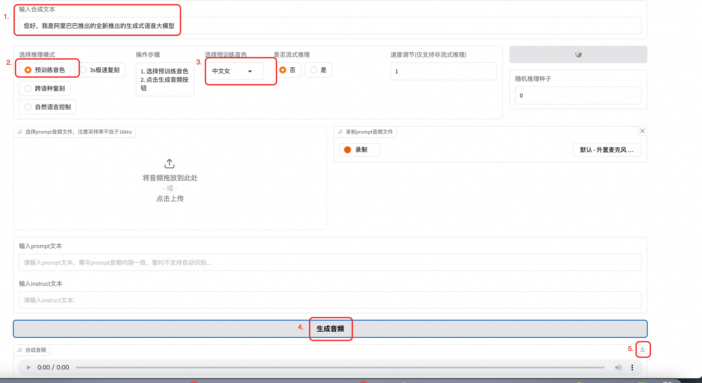
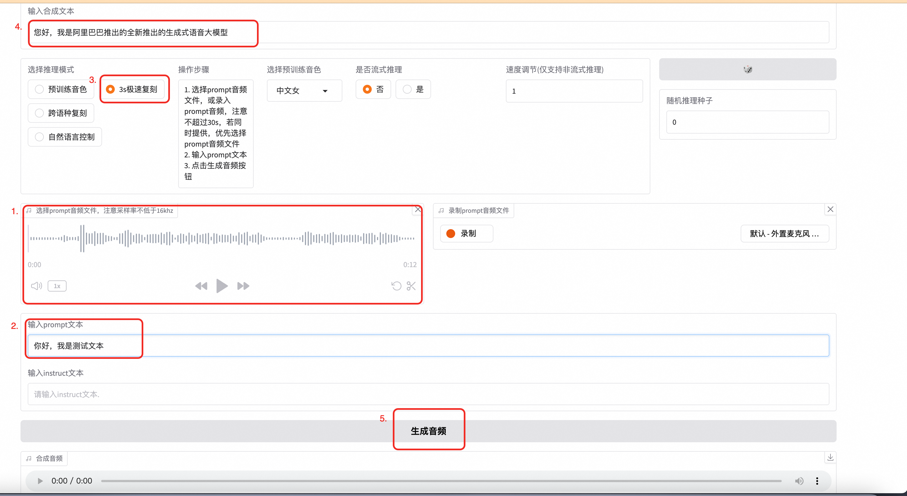
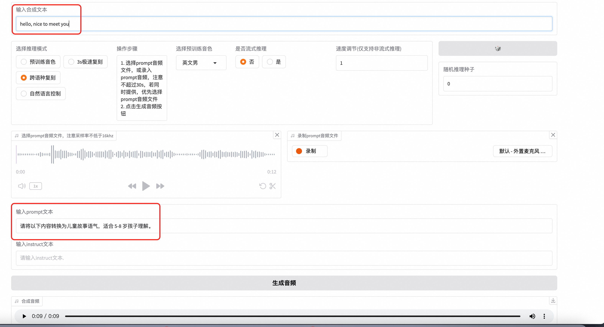
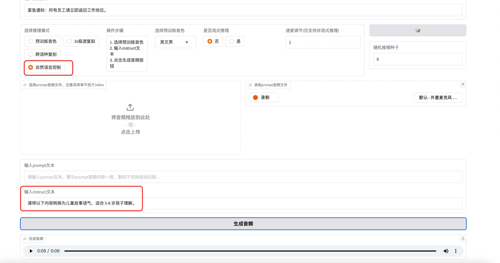

## Introduction
CosyVoice is a text-to-speech service launched by Alibaba Cloud, capable of converting text into natural and fluent speech. This service supports multiple languages and dialects, meeting the needs of various scenarios such as news broadcasting, audiobook production, and intelligent customer service. By leveraging advanced deep learning technologies, CosyVoice generates speech with near-human voice quality, providing users with a richer and more humanized interactive experience.

### Multilingual Support
- Supported Languages: Chinese, English, Japanese, Korean, and Chinese dialects (e.g., Cantonese, Sichuanese, Shanghainese, Tianjin dialect, Wuhan dialect).
- Cross-language and Code-switching: Supports zero-shot cross-language and code-switching scenarios for voice cloning.
### Ultra-low Latency
- Bidirectional Streaming Support: CosyVoice 2.0 integrates offline and streaming modeling techniques.
- Fast First Packet Synthesis: Achieves low latency as low as 150 milliseconds while maintaining high-quality audio output.
### High Accuracy
- Improved Pronunciation: Compared to CosyVoice 1.0, pronunciation errors are reduced by 30% to 50%.
- Benchmark Performance: Achieves the lowest character error rate in the challenging test set of the Seed-TTS evaluation.
### Strong Stability
- Voice Consistency: Ensures reliable voice consistency in zero-shot and cross-language speech synthesis.
- Cross-language Synthesis: Demonstrates significant improvements compared to version 1.0.
### Natural Experience
- Enhanced Rhythm and Audio Quality: Improves the consistency of synthesized audio, raising the MOS score from 5.4 to 5.53.
- Emotion and Accent Flexibility: Now supports finer-grained emotion control and accent adjustments.

## Usage Instructions
### Web-based Usage
If you are using the CosyVoice-300M-Instruct model, you can generate speech using pre-trained voices as shown in the following example:

Input the text you want to synthesize.
Select a pre-trained voice.
Click Generate.
After the audio is generated, click Download to view the result.


 For **3-second Rapid Cloning**: 1. Record an audio clip (e.g., read a sentence or speak freely for up to 30 seconds). Ensure the recording has minimal background noise. 2. Upload the audio file and input the corresponding text in the **Prompt** field. 3. Enter the synthesis text and click **Generate Audio**. The final audio will be synthesized using the voice from your uploaded audio.

 For **Cross-language Cloning**: 1. Input the **Prompt Audio** and its corresponding text. 2. Ensure the synthesized text and prompt text are in different languages.

 For **Natural Voice Control**: 1. Use the **Instruct** field to input control text for tone, speed, and other parameters.
API Access
To access the service via API, use the following Python code. Replace your_valid_token with the ApiKey from the service instance's details page, and update the IP address to your server's public IP.
```python
import argparse
import logging
import requests
import torch
import torchaudio
import numpy as np


def main():
    url = "http://{}:{}/inference_{}".format(args.host, args.port, args.mode)
    headers = {
        "X-API-TOKEN": "your_valid_token"  # 添加自定义 Header
    }
    if args.mode == 'sft':
        payload = {
            'tts_text': args.tts_text,
            'spk_id': args.spk_id
        }
        response = requests.request("GET", url, data=payload, stream=True, headers=headers)
    elif args.mode == 'zero_shot':
        payload = {
            'tts_text': args.tts_text,
            'prompt_text': args.prompt_text
        }
        files = [('prompt_wav', ('prompt_wav', open(args.prompt_wav, 'rb'), 'application/octet-stream'))]
        response = requests.request("GET", url, data=payload, files=files, stream=True, headers=headers)
    elif args.mode == 'cross_lingual':
        payload = {
            'tts_text': args.tts_text,
        }
        files = [('prompt_wav', ('prompt_wav', open(args.prompt_wav, 'rb'), 'application/octet-stream'))]
        response = requests.request("GET", url, data=payload, files=files, stream=True, headers=headers)
    else:
        payload = {
            'tts_text': args.tts_text,
            'spk_id': args.spk_id,
            'instruct_text': args.instruct_text
        }
        response = requests.request("GET", url, data=payload, stream=True, headers=headers)
    tts_audio = b''
    for r in response.iter_content(chunk_size=16000):
        tts_audio += r
    tts_speech = torch.from_numpy(np.array(np.frombuffer(tts_audio, dtype=np.int16))).unsqueeze(dim=0)
    logging.info('save response to {}'.format(args.tts_wav))
    torchaudio.save(args.tts_wav, tts_speech, target_sr)
    logging.info('get response')


if __name__ == "__main__":
    parser = argparse.ArgumentParser()
    parser.add_argument('--host',
                        type=str,
                        default='116.62.86.145')
    parser.add_argument('--port',
                        type=int,
                        default='80')
    parser.add_argument('--mode',
                        default='sft',
                        choices=['sft', 'zero_shot', 'cross_lingual', 'instruct'],
                        help='request mode')
    parser.add_argument('--tts_text',
                        type=str,
                        default='你好，我是通义千问语音合成大模型，请问有什么可以帮您的吗？')
    parser.add_argument('--spk_id',
                        type=str,
                        default='中文女')
    parser.add_argument('--prompt_text',
                        type=str,
                        default='希望你以后能够做的比我还好呦。')
    parser.add_argument('--prompt_wav',
                        type=str,
                        default='../../../asset/zero_shot_prompt.wav')
    parser.add_argument('--instruct_text',
                        type=str,
                        default='Theo \'Crimson\', is a fiery, passionate rebel leader. \
                                 Fights with fervor for justice, but struggles with impulsiveness.')
    parser.add_argument('--tts_wav',
                        type=str,
                        default='demo.wav')
    args = parser.parse_args()
    prompt_sr, target_sr = 16000, 22050
    main()
```