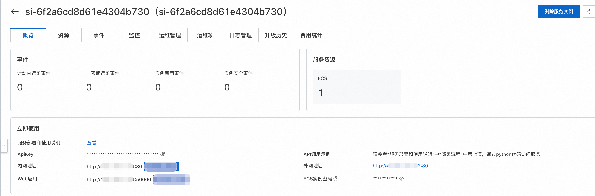

<div style="background: linear-gradient(135deg, #2563eb, #1e40af); padding: 24px; border-radius: 8px; color: white; text-align: center; margin-bottom: 24px;">
  <h2 style="margin: 0; color: white;">🎤 CosyVoice 语音合成服务</h2>
  <p style="margin: 8px 0 0 0; opacity: 0.9;">阿里云推出的先进语音合成技术</p>
</div>
CosyVoice是阿里云推出的一款语音合成服务，它能够将文本转换成自然流畅的语音。这项服务支持多种语言和方言，可以满足不同场景下的需求，如新闻播报、有声读物制作、智能客服等。通过使用先进的深度学习技术，CosyVoice能够生成接近真人发声效果的声音，为用户提供更加丰富和人性化的交互体验。

<div style="background: #eff6ff; border-left: 4px solid #2563eb; padding: 16px; margin: 16px 0; border-radius: 4px;">
  <strong>🌍 多语言支持</strong><br>
  • 支持的语言: 中文、英文、日文、韩文、中文方言（粤语、四川话、上海话、天津话、武汉话等）
• 跨语言及混合语言：支持零样本的跨语言和代码转换场景的语音克隆。
</div>

<div style="background: #dcfce7; border-left: 4px solid #059669; padding: 16px; margin: 16px 0; border-radius: 4px;">
  <strong>⚡ 超低延迟</strong><br>
  • 双向流支持: CosyVoice 2.0 集成了离线和流式建模技术。
• 快速首包合成: 在保持高质量音频输出的同时，实现了低至150毫秒的延迟。
</div>

<div style="background: #fef3c7; border-left: 4px solid #f59e0b; padding: 16px; margin: 16px 0; border-radius: 4px;">
  <strong>🎯 高精度</strong><br>
  • 改进发音: 与CosyVoice 1.0相比，减少了30%到50%的发音错误。
• 基准测试成就: 在Seed-TTS评估集的困难测试集中达到了最低字符错误率。
</div>

<div style="background: #e0e7ff; border-left: 4px solid #6366f1; padding: 16px; margin: 16px 0; border-radius: 4px;">
  <strong>🛡️ 强稳定性</strong><br>
  • 音色一致性: 确保了在零样本和跨语言语音合成中的可靠音色一致性。
• 跨语言合成: 相比1.0版本有了显著提升。
</div>

<div style="background: #fdf2f8; border-left: 4px solid #ec4899; padding: 16px; margin: 16px 0; border-radius: 4px;">
  <strong>🎵 自然体验</strong><br>
  • 增强韵律和音质: 改善了合成音频的一致性，将MOS评分从5.4提高到了5.53。
• 情感和方言灵活性: 现在支持更多细粒度的情感控制和口音调整。
</div>


<div style="background: #f8fafc; border: 1px solid #e2e8f0; border-radius: 8px; padding: 20px; margin: 24px 0 16px 0;">
  <h3 style="margin: 0; color: #1e40af; font-size: 1.3rem;">📖 使用说明</h3>
</div>
在完成模型部署后，可以在计算巢服务实例概览页面看到模型的使用方式，里面提供了Api调用示例、内网访问地址、公网访问地址和ApiKey，下面会分别介绍如何访问使用。
<div style="text-align: center; margin: 20px 0;">
  
  <p style="color: #64748b; font-size: 14px; margin-top: 8px;">1.png</p>
</div>
<h4 style="color: #1e40af; margin: 20px 0 12px 0; font-size: 1.1rem;">🔹 API调用</h4>
<div style="background: #f8fafc; border: 1px solid #e2e8f0; border-radius: 8px; padding: 20px; margin: 16px 0;">
  <h4 style="margin: 0 0 12px 0; color: #1e40af;">🐍 Python 调用示例</h4>
  <p style="color: #64748b; margin: 0;">以下为完整的 Python 调用示例代码：</p>
</div>
以下为 Python 示例代码： 其中${ApiKey}需要填写页面上的ApiKey；${ServerUrl}需要填写页面上的公网地址或内网地址。

``` python
import argparse
import logging
import os
import requests
import torch
import torchaudio
import numpy as np
from contextlib import closing

# 配置日志
logging.basicConfig(level=logging.INFO, format='%(asctime)s - %(levelname)s - %(message)s')

def build_url(args):
    """构建API请求URL"""
    return f"http://{args.host}:{args.port}/inference_{args.mode}"

def create_payload(args):
    """创建请求负载"""
    payload = {'tts_text': args.tts_text}
    
    if args.mode == 'sft':
        payload['spk_id'] = args.spk_id
    elif args.mode == 'instruct':
        payload.update({
            'spk_id': args.spk_id,
            'instruct_text': args.instruct_text
        })
    return payload

def create_files(args):
    """创建文件上传参数"""
    if args.mode in ['zero_shot', 'cross_lingual']:
        return [('prompt_wav', 
                ('prompt_wav', open(args.prompt_wav, 'rb'), 'application/octet-stream'))]
    return None

def main():
    try:
        # 获取参数
        args = get_args()
        
        # 构建请求参数
        url = build_url(args)
        headers = {
            "X-API-TOKEN": os.getenv("TTS_API_KEY", "${ApiKey}"),  # 从环境变量获取密钥
            "User-Agent": "TTS Client/1.0"
        }
        
        # 创建请求参数
        payload = create_payload(args)
        files = create_files(args)
        
        # 发起请求
        with closing(requests.get(
            url,
            params=payload,
            files=files,
            headers=headers,
            stream=True,
            timeout=30
        )) as response:
            response.raise_for_status()
            
            # 处理音频数据
            audio_data = b''
            for chunk in response.iter_content(chunk_size=16000):
                if chunk:
                    audio_data += chunk
            
            # 转换音频格式
            audio_tensor = torch.from_numpy(
                np.frombuffer(audio_data, dtype=np.int16)
            ).unsqueeze(0)
            
            # 保存音频文件
            torchaudio.save(args.tts_wav, audio_tensor, args.target_sr)
            logging.info(f"音频已保存到: {args.tts_wav}")
            
    except requests.exceptions.RequestException as e:
        logging.error(f"请求失败: {e}")
    except Exception as e:
        logging.error(f"发生错误: {e}", exc_info=True)

def get_args():
    """解析命令行参数"""
    parser = argparse.ArgumentParser(description='TTS客户端')
    
    # 服务器配置
    parser.add_argument('--host', type=str, default=os.getenv("TTS_HOST", "localhost"))
    parser.add_argument('--port', type=int, default=80)
    parser.add_argument('--target-sr', type=int, default=22050, help='目标采样率')
    
    # 模式配置
    parser.add_argument('--mode', default='sft',
                        choices=['sft', 'zero_shot', 'cross_lingual', 'instruct'],
                        help='请求模式')
    
    # 文本参数
    parser.add_argument('--tts_text', type=str, 
                        default='你好，我是通义千问语音合成大模型，请问有什么可以帮您的吗？')
    
    # 模式相关参数
    parser.add_argument('--spk_id', type=str, default='中文女')
    parser.add_argument('--prompt_text', type=str, 
                        default='希望你以后能够做的比我还好呦。')
    parser.add_argument('--prompt_wav', type=str, 
                        default='../../../asset/zero_shot_prompt.wav')
    parser.add_argument('--instruct_text', type=str, 
                        default='Theo \'Crimson\', is a fiery, passionate rebel leader. '
                              'Fights with fervor for justice, but struggles with impulsiveness.')
    
    # 输出参数
    parser.add_argument('--tts_wav', type=str, default='demo.wav')
    
    args = parser.parse_args()
    return args

if __name__ == "__main__":
    main()


```

<h4 style="color: #1e40af; margin: 20px 0 12px 0; font-size: 1.1rem;">🔹 Web应用</h4>
点击安全代理访问，跳转到对应的页面就可以直接进行模型服务在线访问了。

<div style="background: linear-gradient(135deg, #f8fafc, #eff6ff); border: 1px solid #bfdbfe; border-radius: 8px; padding: 24px; margin: 32px 0;">
  <h3 style="margin: 0 0 16px 0; color: #1e40af;">🎯 快速开始</h3>
  <div style="display: grid; grid-template-columns: repeat(auto-fit, minmax(250px, 1fr)); gap: 16px;">
    <div style="background: white; padding: 16px; border-radius: 6px; border: 1px solid #e2e8f0;">
      <h4 style="margin: 0 0 8px 0; color: #1e40af;">1️⃣ 获取访问信息</h4>
      <p style="margin: 0; color: #64748b; font-size: 14px;">在计算巢服务实例概览页面获取 ApiKey 和访问地址</p>
    </div>
    <div style="background: white; padding: 16px; border-radius: 6px; border: 1px solid #e2e8f0;">
      <h4 style="margin: 0 0 8px 0; color: #1e40af;">2️⃣ 选择调用方式</h4>
      <p style="margin: 0; color: #64748b; font-size: 14px;">支持 Python API 调用和 Web 应用直接访问</p>
    </div>
    <div style="background: white; padding: 16px; border-radius: 6px; border: 1px solid #e2e8f0;">
      <h4 style="margin: 0 0 8px 0; color: #1e40af;">3️⃣ 开始使用</h4>
      <p style="margin: 0; color: #64748b; font-size: 14px;">配置参数后即可享受高质量的语音合成服务</p>
    </div>
  </div>
</div>

<div style="text-align: center; padding: 16px; background: #f8fafc; border-radius: 6px; margin-top: 24px;">
  <p style="margin: 0; color: #64748b; font-size: 14px;">
    🎤 <strong>CosyVoice</strong> | 让文字拥有生命力的声音
  </p>
</div>