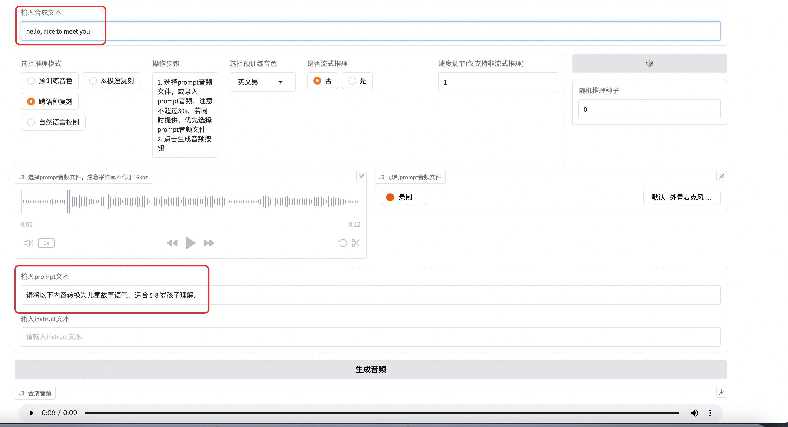

## 简介
CosyVoice是阿里云推出的一款语音合成服务，它能够将文本转换成自然流畅的语音。这项服务支持多种语言和方言，可以满足不同场景下的需求，如新闻播报、有声读物制作、智能客服等。通过使用先进的深度学习技术，CosyVoice能够生成接近真人发声效果的声音，为用户提供更加丰富和人性化的交互体验。

多语言 
- 支持的语言: 中文、英文、日文、韩文、中文方言（粤语、四川话、上海话、天津话、武汉话等）
- 跨语言及混合语言：支持零样本的跨语言和代码转换场景的语音克隆。

超低延迟

- 双向流支持: CosyVoice 2.0 集成了离线和流式建模技术。
- 快速首包合成: 在保持高质量音频输出的同时，实现了低至150毫秒的延迟。

高精度
- 改进发音: 与CosyVoice 1.0相比，减少了30%到50%的发音错误。
- 基准测试成就: 在Seed-TTS评估集的困难测试集中达到了最低字符错误率。

强稳定性

- 音色一致性: 确保了在零样本和跨语言语音合成中的可靠音色一致性。
- 跨语言合成: 相比1.0版本有了显著提升。

自然体验
- 增强韵律和音质: 改善了合成音频的一致性，将MOS评分从5.4提高到了5.53。
- 情感和方言灵活性: 现在支持更多细粒度的情感控制和口音调整。


## 使用说明
### 通过web使用

如果您使用的是CosyVoice-300M-Instruct模型，则可以使用预训练音色生成语音，如图输入您需要生成的文案，选择预训练音色，点击生成即可。音频生成完成后即可点击下载查看生成效果。
<br>
<br>
如果您选择的是3秒极速复刻。您需要先录一段音频，可以读一段话，也可随便说点什么，不超过30秒，注意录音效果不能噪音很多。上传完成后，将您录音中的文案输入到prompt文本中
最后，输入合成文本后点击生成音频即可。最终生成的音频是根据生成文本，依靠您输入音频的音色生成的。
<br>
<br>
如果您使用的是跨语言复制，则需要输入prompt音频和文字。需要注意的是，需要确保合成文本和prompt文本为不同语言。
<br>
<br>
如果您使用的是自然语音控制，您可以在instruct填写控制文本，用于控制语气语速等。

### 通过API访问
如果您想通过api访问服务，您可以使用下面的python代码通过sdk访问。请注意，需要将访问的ip更换为您服务器的公网ip，端口为80端口。另外需将your_valid_token更新为服务实例详情页，立即使用中的ApiKey
``` python
import argparse
import logging
import requests
import torch
import torchaudio
import numpy as np


def main():
    url = "http://{}:{}/inference_{}".format(args.host, args.port, args.mode)
    headers = {
        "X-API-TOKEN": "your_valid_token"  # 添加自定义 Header
    }
    if args.mode == 'sft':
        payload = {
            'tts_text': args.tts_text,
            'spk_id': args.spk_id
        }
        response = requests.request("GET", url, data=payload, stream=True, headers=headers)
    elif args.mode == 'zero_shot':
        payload = {
            'tts_text': args.tts_text,
            'prompt_text': args.prompt_text
        }
        files = [('prompt_wav', ('prompt_wav', open(args.prompt_wav, 'rb'), 'application/octet-stream'))]
        response = requests.request("GET", url, data=payload, files=files, stream=True, headers=headers)
    elif args.mode == 'cross_lingual':
        payload = {
            'tts_text': args.tts_text,
        }
        files = [('prompt_wav', ('prompt_wav', open(args.prompt_wav, 'rb'), 'application/octet-stream'))]
        response = requests.request("GET", url, data=payload, files=files, stream=True, headers=headers)
    else:
        payload = {
            'tts_text': args.tts_text,
            'spk_id': args.spk_id,
            'instruct_text': args.instruct_text
        }
        response = requests.request("GET", url, data=payload, stream=True, headers=headers)
    tts_audio = b''
    for r in response.iter_content(chunk_size=16000):
        tts_audio += r
    tts_speech = torch.from_numpy(np.array(np.frombuffer(tts_audio, dtype=np.int16))).unsqueeze(dim=0)
    logging.info('save response to {}'.format(args.tts_wav))
    torchaudio.save(args.tts_wav, tts_speech, target_sr)
    logging.info('get response')


if __name__ == "__main__":
    parser = argparse.ArgumentParser()
    parser.add_argument('--host',
                        type=str,
                        default='116.62.86.145')
    parser.add_argument('--port',
                        type=int,
                        default='80')
    parser.add_argument('--mode',
                        default='sft',
                        choices=['sft', 'zero_shot', 'cross_lingual', 'instruct'],
                        help='request mode')
    parser.add_argument('--tts_text',
                        type=str,
                        default='你好，我是通义千问语音合成大模型，请问有什么可以帮您的吗？')
    parser.add_argument('--spk_id',
                        type=str,
                        default='中文女')
    parser.add_argument('--prompt_text',
                        type=str,
                        default='希望你以后能够做的比我还好呦。')
    parser.add_argument('--prompt_wav',
                        type=str,
                        default='../../../asset/zero_shot_prompt.wav')
    parser.add_argument('--instruct_text',
                        type=str,
                        default='Theo \'Crimson\', is a fiery, passionate rebel leader. \
                                 Fights with fervor for justice, but struggles with impulsiveness.')
    parser.add_argument('--tts_wav',
                        type=str,
                        default='demo.wav')
    args = parser.parse_args()
    prompt_sr, target_sr = 16000, 22050
    main()

```