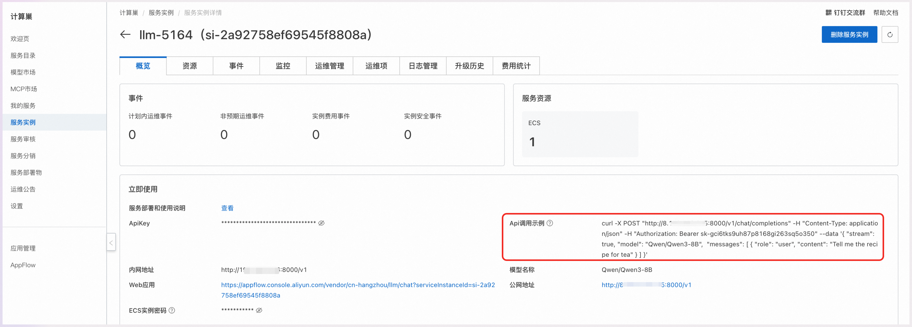

<div style="background: linear-gradient(135deg, #2563eb, #1e40af); padding: 24px; border-radius: 8px; color: white; text-align: center; margin-bottom: 24px;">
  <h2 style="margin: 0; color: white;">🚀 DeepSeek-V3 大语言模型</h2>
  <p style="margin: 8px 0 0 0; opacity: 0.9;">6710 亿参数专家混合模型 - 开源 AI 的新里程碑</p>
</div>

## 🎯 产品简介

<div style="background: #f8fafc; border: 1px solid #e2e8f0; border-radius: 8px; padding: 20px; margin: 16px 0;">

DeepSeek-V3 是一个强大的专家混合（MoE）语言模型，总参数为 **6710 亿**，其中每个 token 激活 **370 亿个参数**。为了实现高效的推理和经济的训练成本，DeepSeek-V3 采用了多头潜在注意力（MLA）和 DeepSeekMoE 架构，这些架构在 DeepSeek-V2 中已经经过彻底验证。

<div style="background: #eff6ff; border-left: 4px solid #2563eb; padding: 16px; margin: 16px 0; border-radius: 4px;">
  <strong>🏆 突破性成就</strong><br>
  DeepSeek-V3 优于其他开源模型，并实现了与领先的闭源模型相当的性能，标志着开源 AI 技术的重大突破。
</div>

</div>

## 📊 核心参数

<div style="background: #f8fafc; border: 1px solid #e2e8f0; border-radius: 8px; padding: 20px; margin: 16px 0;">

<div style="overflow-x: auto; margin: 16px 0;">
<table style="width: 100%; border-collapse: collapse; background: white; border-radius: 6px; overflow: hidden; box-shadow: 0 1px 3px rgba(0,0,0,0.1);">
  <thead style="background: #f8fafc;">
    <tr>
      <th style="padding: 12px; text-align: left; border-bottom: 1px solid #e2e8f0; color: #1e40af; font-weight: 600;">参数类型</th>
      <th style="padding: 12px; text-align: center; border-bottom: 1px solid #e2e8f0; color: #1e40af; font-weight: 600;">数值</th>
      <th style="padding: 12px; text-align: left; border-bottom: 1px solid #e2e8f0; color: #1e40af; font-weight: 600;">说明</th>
    </tr>
  </thead>
  <tbody>
    <tr>
      <td style="padding: 12px; border-bottom: 1px solid #f1f5f9; font-weight: 500;">总参数量</td>
      <td style="padding: 12px; border-bottom: 1px solid #f1f5f9; text-align: center;">
        <span style="background: #fecaca; color: #dc2626; padding: 6px 12px; border-radius: 6px; font-weight: 600;">6710 亿</span>
      </td>
      <td style="padding: 12px; border-bottom: 1px solid #f1f5f9;">超大规模参数量</td>
    </tr>
    <tr>
      <td style="padding: 12px; border-bottom: 1px solid #f1f5f9; font-weight: 500;">激活参数</td>
      <td style="padding: 12px; border-bottom: 1px solid #f1f5f9; text-align: center;">
        <span style="background: #dcfce7; color: #059669; padding: 6px 12px; border-radius: 6px; font-weight: 600;">370 亿/token</span>
      </td>
      <td style="padding: 12px; border-bottom: 1px solid #f1f5f9;">高效推理设计</td>
    </tr>
    <tr>
      <td style="padding: 12px; border-bottom: 1px solid #f1f5f9; font-weight: 500;">训练数据</td>
      <td style="padding: 12px; border-bottom: 1px solid #f1f5f9; text-align: center;">
        <span style="background: #dbeafe; color: #2563eb; padding: 6px 12px; border-radius: 6px; font-weight: 600;">14.8 万亿 tokens</span>
      </td>
      <td style="padding: 12px; border-bottom: 1px solid #f1f5f9;">多样且高质量数据</td>
    </tr>
    <tr>
      <td style="padding: 12px; font-weight: 500;">训练成本</td>
      <td style="padding: 12px; text-align: center;">
        <span style="background: #fed7aa; color: #ea580c; padding: 6px 12px; border-radius: 6px; font-weight: 600;">2.788M H800 小时</span>
      </td>
      <td style="padding: 12px;">经济高效的训练</td>
    </tr>
  </tbody>
</table>
</div>

</div>

## 🏗️ 技术架构

<div style="display: grid; grid-template-columns: repeat(auto-fit, minmax(300px, 1fr)); gap: 16px; margin: 16px 0;">

<div style="background: #eff6ff; border-left: 4px solid #2563eb; padding: 16px; border-radius: 4px;">
  <strong>🧠 多头潜在注意力（MLA）</strong><br>
  采用先进的 MLA 架构，在 DeepSeek-V2 中已经过彻底验证，提供高效的注意力机制和优异的性能表现。
</div>

<div style="background: #f0fdf4; border-left: 4px solid #059669; padding: 16px; border-radius: 4px;">
  <strong>⚡ DeepSeekMoE 架构</strong><br>
  专家混合模型架构，实现参数高效利用，在保持强大能力的同时显著降低推理成本。
</div>

<div style="background: #fef7ff; border-left: 4px solid #a855f7; padding: 16px; border-radius: 4px;">
  <strong>⚖️ 无辅助损失负载平衡</strong><br>
  率先采用创新的负载平衡策略，无需辅助损失即可实现专家间的均衡负载分配。
</div>

<div style="background: #fff7ed; border-left: 4px solid #ea580c; padding: 16px; border-radius: 4px;">
  <strong>🎯 多 Token 预测训练</strong><br>
  设定多 token 预测的训练目标，显著提升模型的预测准确性和生成质量。
</div>

</div>

## 📈 性能表现

<div style="background: #f8fafc; border: 1px solid #e2e8f0; border-radius: 8px; padding: 20px; margin: 16px 0;">

<h3 style="margin-top: 0; color: #1e40af;">🏆 竞争力对比</h3>

<div style="display: grid; grid-template-columns: repeat(auto-fit, minmax(250px, 1fr)); gap: 16px; margin: 16px 0;">

<div style="background: #dcfce7; border-left: 4px solid #059669; padding: 16px; border-radius: 4px;">
  <strong>🥇 开源模型领先</strong><br>
  <div style="margin-top: 8px; color: #065f46;">
    在所有开源大语言模型中表现最优，树立了新的性能标杆
  </div>
</div>

<div style="background: #dbeafe; border-left: 4px solid #2563eb; padding: 16px; border-radius: 4px;">
  <strong>⚡ 闭源模型匹敌</strong><br>
  <div style="margin-top: 8px; color: #1e3a8a;">
    与领先的闭源模型性能相当，打破开源与闭源的性能差距
  </div>
</div>

<div style="background: #fef3c7; border-left: 4px solid #f59e0b; padding: 16px; border-radius: 4px;">
  <strong>💡 全面评估验证</strong><br>
  <div style="margin-top: 8px; color: #92400e;">
    通过全面的基准测试评估，在多个维度均表现卓越
  </div>
</div>

<div style="background: #f3e8ff; border-left: 4px solid #a855f7; padding: 16px; border-radius: 4px;">
  <strong>🔧 推理效率高</strong><br>
  <div style="margin-top: 8px; color: #6b21a8;">
    MoE 架构确保高效推理，大幅降低实际部署成本
  </div>
</div>

</div>

</div>

## 🎯 应用价值

<div style="display: grid; grid-template-columns: 1fr 1fr; gap: 16px; margin: 16px 0;">

<div style="background: #dcfce7; border-left: 4px solid #059669; padding: 16px; border-radius: 4px;">
<h3 style="margin-top: 0; color: #059669;">✅ 核心优势</h3>
<ul style="margin: 0; padding-left: 20px; color: #065f46;">
  <li><strong>性能卓越</strong>：匹敌顶级闭源模型</li>
  <li><strong>成本可控</strong>：训练和推理成本合理</li>
  <li><strong>架构先进</strong>：MoE + MLA 双重优化</li>
  <li><strong>训练稳定</strong>：零故障完成训练</li>
</ul>
</div>

<div style="background: #eff6ff; border-left: 4px solid #2563eb; padding: 16px; border-radius: 4px;">
<h3 style="margin-top: 0; color: #2563eb;">🚀 应用场景</h3>
<ul style="margin: 0; padding-left: 20px; color: #1e3a8a;">
  <li><strong>企业级 AI 服务</strong>：高性能智能应用</li>
  <li><strong>科研机构</strong>：前沿 AI 研究平台</li>
  <li><strong>开发者社区</strong>：开源 AI 基础设施</li>
  <li><strong>商业化部署</strong>：成本效益最优解</li>
</ul>
</div>

</div>

## 📖 使用说明

<div style="background: #eff6ff; border-left: 4px solid #2563eb; padding: 16px; margin: 16px 0; border-radius: 4px;">
  <strong>💡 快速开始</strong><br>
  在完成模型部署后，可以在计算巢服务实例概览页面看到模型的使用方式，里面提供了 API 调用示例、内网访问地址、公网访问地址和 ApiKey。
</div>

<div style="background: #f8fafc; border: 1px solid #e2e8f0; border-radius: 8px; padding: 20px; margin: 16px 0;">
  <div style="text-align: center; margin-bottom: 16px;">
    
  </div>
</div>

### 🔌 API 调用方式

#### 🖥️ Curl 命令调用

<div style="background: #f8fafc; border: 1px solid #e2e8f0; border-radius: 8px; padding: 20px; margin: 16px 0;">

<div style="text-align: center; margin-bottom: 16px;">
  
</div>

<div style="background: #eff6ff; border-left: 4px solid #2563eb; padding: 16px; margin: 16px 0; border-radius: 4px;">
  <strong>📋 参数说明</strong><br>
  • <code>${ServerIP}</code>：内网地址或公网地址中的 IP 地址<br>
  • <code>${ApiKey}</code>：页面提供的 ApiKey<br>
  • <code>${ModelName}</code>：模型名称
</div>

Curl 命令调用可以直接使用服务实例概览页面中的 API 调用示例，调用模型 API 的具体结构如下：

```bash
curl -X Post http://${ServerIP}:8000/v1/chat/completions \
  -H "Content-Type: application/json" \
  -H "Authorization: Bearer ${ApiKey}" \
  -d '{
    "model": "${ModelName}",
    "messages": [
      {
        "role": "user",
        "content": "给闺女写一份来自未来2035的信，同时告诉她要好好学习科技，做科技的主人，推动科技，经济发展；她现在是3年级"
      }
    ]
  }'
```

</div>

#### 🐍 Python SDK 调用

<div style="background: #f8fafc; border: 1px solid #e2e8f0; border-radius: 8px; padding: 20px; margin: 16px 0;">

<div style="background: #eff6ff; border-left: 4px solid #2563eb; padding: 16px; margin: 16px 0; border-radius: 4px;">
  <strong>⚙️ 配置说明</strong><br>
  • <code>${ApiKey}</code>：填写页面上的 ApiKey<br>
  • <code>${ServerUrl}</code>：填写页面上的公网地址或内网地址，需要带上 <code>/v1</code>
</div>

以下为 Python 示例代码：

```python
from openai import OpenAI

##### API 配置 #####
openai_api_key = "${ApiKey}"
openai_api_base = "${ServerUrl}"

client = OpenAI(
    api_key=openai_api_key,
    base_url=openai_api_base,
)

models = client.models.list()
model = models.data[0].id
print(model)


def main():
    stream = True

    chat_completion = client.chat.completions.create(
        messages=[
            {
                "role": "user",
                "content": [
                    {
                        "type": "text",
                        "text": "你好，介绍一下你自己，越详细越好。",
                    }
                ],
            }
        ],
        model=model,
        max_completion_tokens=1024,
        stream=stream,
    )

    if stream:
        for chunk in chat_completion:
            print(chunk.choices[0].delta.content, end="")
    else:
        result = chat_completion.choices[0].message.content
        print(result)


if __name__ == "__main__":
    main()
```

</div>

---

<div style="text-align: center; padding: 16px; background: #f8fafc; border-radius: 6px; margin-top: 24px;">
  <p style="margin: 0; color: #64748b; font-size: 14px;">
    🚀 <strong>DeepSeek-V3</strong> | 6710 亿参数，开源 AI 的新里程碑
  </p>
</div>


