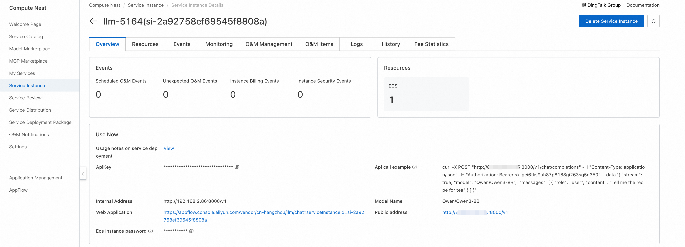
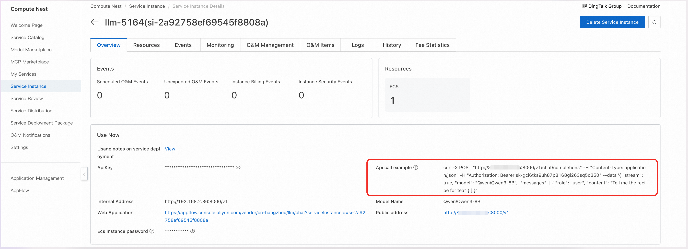
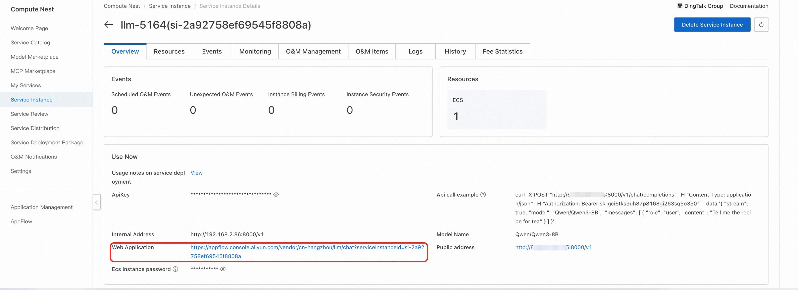

## Model Introduction

DeepSeek-V4 is a new generation of large language models developed and open-sourced by DeepSeek, marking the entry of large models into the era of universal million-token context. The V4 series introduces innovative architectural upgrades, leveraging core components such as Sparse MQA and Fused MoE Mega Kernel to achieve a leap in computational efficiency for ultra-long sequences, while reaching top-tier performance in Agent capabilities, world knowledge, and reasoning.

DeepSeek-V4 is available in two versions: **Pro** and **Flash**:

- **DeepSeek-V4-Pro**: 1.6T total parameters (49B activated), designed for high-quality reasoning and complex Agent scenarios, with performance on par with the world's top closed-source models
- **DeepSeek-V4-Flash**: 284B total parameters (13B activated), optimized for speed and cost, ideal for real-time interaction and large-scale deployment

DeepSeek-V4 large language model offers the following core features:

- **Million-token Ultra-long Context**: Equipped with a 1M token context window by default, capable of processing entire novels, complete code repositories, or large document collections in a single pass, completely breaking the limitations of long-text processing scenarios
- **World-class Reasoning Performance**: In benchmarks covering mathematics, STEM, and competitive coding, V4-Pro surpasses all publicly evaluated open-source models, reaching a level comparable to top-tier closed-source models
- **Powerful Agent Capabilities**: As the Agentic Coding model used daily by DeepSeek's internal team, it offers coding and tool-calling capabilities superior to Sonnet 4.5 and approaching Opus 4.6 in non-thinking mode
- **Thinking Mode Switching**: Supports free switching between thinking and non-thinking modes, balancing the needs of deep reasoning and rapid response scenarios
- **Structured Output and Function Calling**: Natively supports JSON output, Function Calling, and other features, enabling seamless integration with various business systems and Agent frameworks
- **Innovative Architecture and Efficient Inference**: Adopts Sparse MQA, Fused MoE Mega Kernel and other architectures, delivering significantly leading inference efficiency in long-context scenarios, with adaptation to domestic Ascend chips

## User Guide

**Quick Start**

After the model deployment is complete, you can see how to use the model on the ComputeNest service instance overview page, which provides API call examples, private network address, public network address, web application address, and ApiKey.



### API Call Methods

#### Curl Command



**Parameter Description**

- `${ServerIP}`: IP address from internal or public network address
- `${ApiKey}`: ApiKey provided on the page
- `${ModelName}`: Model name

You can directly use the API call example on the service instance overview page. The specific structure of the model API call is as follows:

```bash
curl -X Post http://${ServerIP}:8000/v1/chat/completions \
  -H "Content-Type: application/json" \
  -H "Authorization: Bearer ${ApiKey}" \
  -d '{
    "model": "${ModelName}",
    "messages": [
      {
        "role": "user",
        "content": "给闺女写一份来自未来2035的信，同时告诉她要好好学习科技，做科技的主人，推动科技，经济发展；她现在是3年级"
      }
    ]
  }'
```

#### Python SDK Call

**Configuration**

- `${ApiKey}`: Fill in the ApiKey from the page
- `${ServerUrl}`: Fill in the public or private network address from the page, with `/v1` appended

Python example code:

```python
from openai import OpenAI

##### API 配置 #####
openai_api_key = "${ApiKey}"
openai_api_base = "${ServerUrl}"

client = OpenAI(
    api_key=openai_api_key,
    base_url=openai_api_base,
)

models = client.models.list()
model = models.data[0].id
print(model)

def main():
    stream = True

    chat_completion = client.chat.completions.create(
        messages=[
            {
                "role": "user",
                "content": [
                    {
                        "type": "text",
                        "text": "你好，介绍一下你自己，越详细越好。",
                    }
                ],
            }
        ],
        model=model,
        max_completion_tokens=1024,
        stream=stream,
    )

    if stream:
        for chunk in chat_completion:
            print(chunk.choices[0].delta.content, end="")
    else:
        result = chat_completion.choices[0].message.content
        print(result)

if __name__ == "__main__":
    main()
```

### Web Application Access

1. On the service instance overview page, click the link for the web application.



2. Enter your question in the model service web page input box to chat with the large model.

