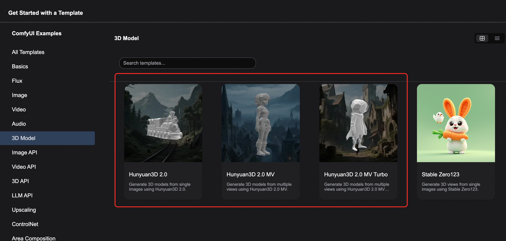

  <h1 style="font-size: 2.5em; margin: 0; font-weight: 600;">🎯 ComfyUI Hunyuan3D-2 3D Asset Generation</h1>
  
ComfyUI Native Workflow - Complete Pipeline from Images to High-Quality 3D Models

  

    🎨 Multi-View Generation
    🎬 High-Fidelity Textures
    ⚡ Lightweight Deployment
  

## 📋 Hunyuan3D 2.0 Model Overview

  

    
  

[Hunyuan3D 2.0](https://github.com/Tencent/Hunyuan3D-2) is an open-source 3D asset generation model launched by Tencent that can generate high-fidelity 3D models with high-resolution texture maps through text, images, or sketches.

  <strong>🔗 Related Resources</strong> 
  • <strong>Project Repository</strong>: <a href="https://github.com/Tencent/Hunyuan3D-2" target="_blank" style="color: #2563eb;">GitHub - Hunyuan3D-2</a> 
  • <strong>Model Repository</strong>: <a href="https://huggingface.co/tencent" target="_blank" style="color: #2563eb;">🤗 Tencent HuggingFace</a>

### 🏗️ Two-Stage Generation Architecture

Hunyuan3D 2.0 adopts a two-stage generation approach that effectively separates the complexity of shape and texture generation:

<h4 style="color: #2563eb; margin: 0 0 8px 0;">🎯 Geometry Generation Model (Hunyuan3D-DiT)</h4>

Based on flow diffusion Transformer architecture, generates texture-free geometric models that precisely match input conditions

<h4 style="color: #059669; margin: 0 0 8px 0;">🎨 Texture Generation Model (Hunyuan3D-Paint)</h4>

Combines geometric conditions and multi-view diffusion techniques to add high-resolution textures to models, supporting PBR materials

### ✨ Key Advantages

<strong>🎯 High-Precision Generation</strong> 

Sharp geometric structures, rich texture colors, supports PBR material generation, achieving near-realistic lighting effects

<strong>🛠️ Diverse Usage Methods</strong> 

Provides code calls, Blender plugins, Gradio applications, and official website online experience, suitable for different user needs

<strong>⚡ Lightweight & Compatibility</strong> 

Mini model requires only 5GB VRAM, standard version shape generation needs 6GB VRAM, complete pipeline only needs 12GB VRAM

### 🆕 Latest Updates

  <strong>📅 March 18, 2025 Update</strong> 
  Hunyuan3D 2.0 adds multi-view shape generation model (Hunyuan3D-2mv), supporting input from different viewpoints to generate more refined geometric structures.

## 🚀 Workflow Examples Overview

workflow template can be seen in 

This example includes three complete workflows covering different usage scenarios:

🎯

<h4 style="margin: 0 0 8px 0; color: #1e40af;">Hunyuan3D-2mv</h4>

Multi-view input generates high-precision 3D models

⚡

<h4 style="margin: 0 0 8px 0; color: #059669;">Hunyuan3D-2mv-turbo</h4>

Fast multi-view generation with step distillation optimization

🖼️

<h4 style="margin: 0 0 8px 0; color: #ea580c;">Hunyuan3D-2</h4>

Standard 3D generation from single-view input

### ⚠️ Environment Requirements

  <strong>📋 Pre-usage Checklist</strong> 
  • Ensure ComfyUI is updated to the latest version with native Hunyuan3D-2mv support 
  • Currently does not support texture and material generation features 
  • Workflow image metadata contains complete workflow JSON 
  • Generated .glb format models will be output to <code>ComfyUI/output/mesh</code> folder

<h4 style="color: #dc2626; margin: 0 0 8px 0;">🔧 Common Issues</h4>
<ul style="margin: 0; padding-left: 20px; color: #991b1b;">
  <li>Missing nodes: Version too old or import failed</li>
  <li>Incomplete features: Using stable version instead of dev version</li>
  <li>Loading failure: Node import exception during startup</li>
</ul>

## 🎯 Workflow 1: Hunyuan3D-2mv Multi-View Generation

The Hunyuan3D-2mv workflow supports generating 3D models using multi-view images. Multiple viewpoint images are not mandatory; you can also input only the `front` view image to generate 3D models.

### 📥 Step 1: Download Workflow and Materials

  
  
Click image to download, drag into ComfyUI to load workflow

### 📁 Multi-View Input Materials

<h4 style="color: #059669; margin: 0 0 12px 0;">🖼️ Front View</h4>

<h4 style="color: #ea580c; margin: 0 0 12px 0;">🖼️ Left View</h4>

<h4 style="color: #7c3aed; margin: 0 0 12px 0;">🖼️ Back View</h4>

  <strong>💡 Material Processing Tips</strong> 
  The input images in the example have been pre-processed to remove backgrounds. In actual use, you can use custom nodes like <a href="https://github.com/cubiq/ComfyUI_essentials" target="_blank" style="color: #2563eb;">ComfyUI_essentials</a> to automatically remove backgrounds.

### 🔧 Step 2: Workflow Configuration

  

#### 📋 Configuration Steps

<h4 style="color: #2563eb; margin: 0 0 8px 0;">🔧 Model Loading</h4>

Ensure the <strong>Image Only Checkpoint Loader</strong> node loads the renamed <code>hunyuan3d-dit-v2-mv.safetensors</code> model

<h4 style="color: #059669; margin: 0 0 8px 0;">📁 Image Loading</h4>

Load corresponding viewpoint images in each <strong>Load Image</strong> node

<h4 style="color: #ea580c; margin: 0 0 8px 0;">🚀 Execute Generation</h4>

Click <strong>Queue</strong> button or use shortcut <strong>Ctrl+Enter</strong> to run workflow

  <strong>💡 Extended Views</strong> 
  To add more viewpoints, ensure both the <code>Hunyuan3Dv2ConditioningMultiView</code> node and corresponding <code>Load Image</code> nodes load images for the respective viewpoints.

## ⚡ Workflow 2: Hunyuan3D-2mv-turbo Fast Generation

Hunyuan3D-2mv-turbo is a step distillation version of Hunyuan3D-2mv that can generate 3D models faster. In this version, set `cfg` to 1.0 and add a `flux guidance` node to control `distilled cfg` generation.

### 📁 Multi-View Input Materials

<h4 style="color: #059669; margin: 0 0 12px 0;">🖼️ Front View</h4>

<h4 style="color: #ea580c; margin: 0 0 12px 0;">🖼️ Right View</h4>

### 🔧 Step 2: Workflow Configuration

  

#### 📋 Configuration Steps

<h4 style="color: #2563eb; margin: 0 0 8px 0;">🔧 Model Loading</h4>

Ensure the <strong>Image Only Checkpoint Loader</strong> node loads the <code>hunyuan3d-dit-v2-mv-turbo.safetensors</code> model

<h4 style="color: #059669; margin: 0 0 8px 0;">📁 Image Loading</h4>

Load corresponding viewpoint images in each <strong>Load Image</strong> node

<h4 style="color: #ea580c; margin: 0 0 8px 0;">🚀 Execute Generation</h4>

Click <strong>Queue</strong> button or use shortcut <strong>Ctrl+Enter</strong> to run workflow

## 🖼️ Workflow 3: Hunyuan3D-2 Single-View Generation

The Hunyuan3D-2 workflow uses single-view input to generate 3D models. In this workflow, the `Hunyuan3Dv2Conditioning` node replaces the `Hunyuan3Dv2ConditioningMultiView` node.

### 📥 Step 1: Download Workflow and Materials

  
  
Click image to download, drag into ComfyUI to load workflow

### 📁 Single-View Input Material

<h4 style="color: #059669; margin: 0 0 12px 0;">🖼️ Input Image</h4>

### 🔧 Step 2: Workflow Configuration

  

#### 📋 Configuration Steps

<h4 style="color: #2563eb; margin: 0 0 8px 0;">🔧 Model Loading</h4>

Ensure the <strong>Image Only Checkpoint Loader</strong> node loads the <code>hunyuan3d-dit-v2.safetensors</code> model

<h4 style="color: #059669; margin: 0 0 8px 0;">📁 Image Loading</h4>

Load the input image in the <strong>Load Image</strong> node

<h4 style="color: #ea580c; margin: 0 0 8px 0;">🚀 Execute Generation</h4>

Click <strong>Queue</strong> button or use shortcut <strong>Ctrl+Enter</strong> to run workflow

## 🛠️ Community Resources

Here are Hunyuan3D-2 related ComfyUI community resources:

<strong>🔧 ComfyUI-Hunyuan3DWrapper</strong> 

  <a href="https://github.com/kijai/ComfyUI-Hunyuan3DWrapper" target="_blank" style="color: #2563eb;">GitHub Repository</a> - Complete Hunyuan3D wrapper

<strong>📦 Pre-processed Models</strong> 

  <a href="https://huggingface.co/Kijai/Hunyuan3D-2_safetensors/tree/main" target="_blank" style="color: #059669;">Kijai/Hunyuan3D-2_safetensors</a> - Pre-processed safetensors format models

<strong>🎯 ComfyUI-3D-Pack</strong> 

  <a href="https://github.com/MrForExample/ComfyUI-3D-Pack" target="_blank" style="color: #ea580c;">GitHub Repository</a> - Comprehensive 3D generation toolkit

## 💡 Usage Tips and Recommendations

<h4 style="color: #059669; margin: 0 0 8px 0;">✅ Best Practices</h4>
<ul style="margin: 0; padding-left: 20px; color: #065f46;">
  <li>Use background-removed high-quality input images</li>
  <li>Ensure viewpoint consistency for multi-view inputs</li>
  <li>Choose appropriate model version based on VRAM capacity</li>
  <li>Prioritize turbo version for quick previews</li>
</ul>

<h4 style="color: #dc2626; margin: 0 0 8px 0;">⚠️ Important Notes</h4>
<ul style="margin: 0; padding-left: 20px; color: #991b1b;">
  <li>Ensure ComfyUI version is the latest development version</li>
  <li>Input images need clear subject outlines</li>
  <li>Multi-view images should maintain subject consistency</li>
  <li>Generation process requires sufficient VRAM support</li>
</ul>

## 🔧 Technical Specifications

### 💻 System Requirements

<table style="width: 100%; border-collapse: collapse; background: white; border-radius: 6px; overflow: hidden; box-shadow: 0 1px 3px rgba(0,0,0,0.1);">
  <thead style="background: #f8fafc;">
    <tr>
      <th style="padding: 12px; text-align: left; border-bottom: 1px solid #e2e8f0; color: #1e40af; font-weight: 600;">Model Version</th>
      <th style="padding: 12px; text-align: left; border-bottom: 1px solid #e2e8f0; color: #1e40af; font-weight: 600;">VRAM Requirement</th>
      <th style="padding: 12px; text-align: left; border-bottom: 1px solid #e2e8f0; color: #1e40af; font-weight: 600;">Recommended Configuration</th>
    </tr>
  </thead>
  <tbody>
    <tr>
      <td style="padding: 12px; border-bottom: 1px solid #f1f5f9; font-weight: 500;">Hunyuan3D-2mini</td>
      <td style="padding: 12px; border-bottom: 1px solid #f1f5f9;">5GB</td>
      <td style="padding: 12px; border-bottom: 1px solid #f1f5f9;">RTX 3060 12GB</td>
    </tr>
    <tr>
      <td style="padding: 12px; border-bottom: 1px solid #f1f5f9; font-weight: 500;">Hunyuan3D-2 (Shape Generation)</td>
      <td style="padding: 12px; border-bottom: 1px solid #f1f5f9;">6GB</td>
      <td style="padding: 12px; border-bottom: 1px solid #f1f5f9;">RTX 4060 Ti 16GB</td>
    </tr>
    <tr>
      <td style="padding: 12px; font-weight: 500;">Hunyuan3D-2 (Complete Pipeline)</td>
      <td style="padding: 12px;">12GB</td>
      <td style="padding: 12px;">RTX 4070 Ti / RTX 4080</td>
    </tr>
  </tbody>
</table>

### 📐 Supported Output Formats

  

    .glb Format
  

  

    PBR Materials
  

  

    High-Resolution Textures
  

---

  

    🎯 <strong>ComfyUI Hunyuan3D-2 3D Asset Generation</strong> | Complete Solution from Images to High-Quality 3D Models
  

