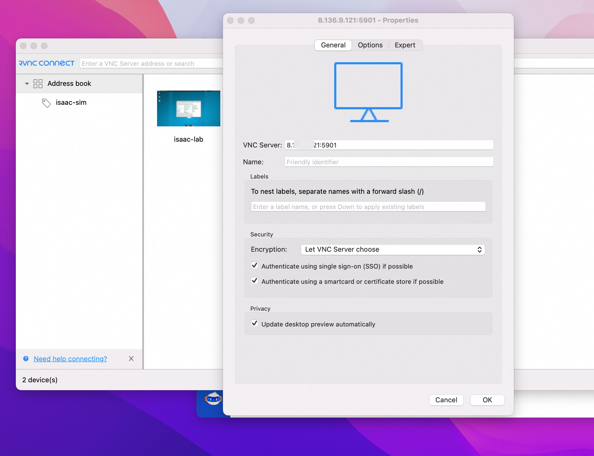

  <h2 style="margin: 0; color: white;">🤖 NVIDIA Isaac Lab User Guide</h2>
  
Open-source Unified Framework for Robot Learning - High-Fidelity Physics Simulation and Intelligent Training Platform

## 🎯 Product Overview

**NVIDIA Isaac™ Lab** is an open-source unified framework specifically designed for robot learning, dedicated to helping developers efficiently train robot policies.

  <strong>🔧 Core Technology Stack</strong> 
  

    NVIDIA Isaac Sim™
    NVIDIA PhysX®
    NVIDIA RTX™ Rendering
  

### ✨ Core Advantages

  

    <strong>🯠High-Fidelity Simulation</strong> 
    Physics-based RTX rendering providing realistic physical environments
  

  

    <strong>🔗 Seamless Integration</strong> 
    Bridging the gap between high-fidelity simulation and perception-based training
  

  

    <strong>⚡ Efficient Development</strong> 
    Helping researchers build robot applications faster
  

## 🚀 Usage Instructions

  <strong>📋 After Deployment</strong> 
  View model usage methods on the Computing Nest service instance overview page. The server IP is the public IP of the corresponding ECS instance, supporting remote client access connections.

### 🎮 Method 1: Omniverse Streaming Client Graphical Development

Isaac Lab service automatically starts Isaac Sim upon launch. You can remotely connect to Isaac Sim through Omniverse Streaming Client and use the graphical interface for rapid development and debugging.

#### 📥 Step 1: Download and Install Streaming Client

💻 System Requirements and Preparation

  <strong>⚠️ Hardware Requirements</strong> 
  Requires a Windows computer with GPU and GPU Grid driver installation

  <strong>☁️ Cloud Solution</strong> 
  If you don't have a Windows GPU device, you can purchase a GPU-enabled Windows cloud computer through Alibaba Cloud Wuying service 
  <strong>Minimum Configuration:</strong> 4 vCPU / 10 GiB / 2GiB VRAM 
  <a href="https://help.aliyun.com/zh/wuying-workspace/user-guide/create-a-cloud-computer-3" style="color: #2563eb;">📖 Wuying Cloud Computer Purchase Guide</a>

<h4 style="margin-top: 0; color: #1e40af;">📦 Download Client</h4>

Visit the <a href="https://docs.isaacsim.omniverse.nvidia.com/latest/installation/download.html#isaac-sim-latest-release" style="color: #2563eb;">Isaac Sim Official Download Page</a> and select the Windows version

<h4 style="margin-top: 0; color: #1e40af;">🔧 Installation and Launch</h4>

Extract the downloaded file, navigate to the directory, and double-click <code>omniverse-streaming-client.exe</code> to launch

#### 🔗 Step 2: Connect to Isaac Sim for Development

##### Connection Steps

1. **Launch Connection Interface**: Open Omniverse Streaming Client
2. **Enter Server Address**: Input the Isaac Lab service instance IP address in the Server field
3. **Establish Connection**: Click the Connect button to connect to Isaac Sim

  <strong>✅ Successful Connection Example</strong> 
  Refer to the <a href="https://docs.isaacsim.omniverse.nvidia.com/latest/introduction/quickstart_isaacsim.html" style="color: #059669;">Isaac Sim Getting Started Tutorial</a> to create canvas planes and cubes for basic operations

### 💻 Method 2: SSH Remote Python Script Training

Isaac Lab service is deployed through Docker images, using official standard images plus the plugin cache required for Isaac Sim startup, supporting training script execution within containers.

#### 🔧 Operation Steps

<h4 style="margin-top: 0; color: #1e40af;">1️⃣ Remote Login to Server</h4>

In the service instance details page resources section, click "Remote Connection" to log into the ECS server

<h4 style="margin-top: 0; color: #1e40af;">2️⃣ Check Container Status</h4>

Execute command to check isaac-lab container running status:

<code style="color: #e2e8f0; font-family: 'Courier New', monospace;">docker ps -a</code>

<h4 style="margin-top: 0; color: #1e40af;">3️⃣ Enter Container Environment</h4>

Execute command to enter isaac-lab container:

<code style="color: #e2e8f0; font-family: 'Courier New', monospace;">docker exec -it isaac-lab bash</code>

<h4 style="margin-top: 0; color: #1e40af;">4️⃣ Execute Training Script</h4>

Refer to the <a href="https://docs.robotsfan.com/isaaclab/source/deployment/docker.html" style="color: #2563eb;">official tutorial</a> and execute the example script:

<code style="color: #e2e8f0; font-family: 'Courier New', monospace;">./isaaclab.sh -p scripts/tutorials/00_sim/log_time.py --headless</code>

  <strong>✅ Execution Success</strong> 
  The script executes successfully. You can also run custom training scripts for robot learning experiments

## 📚 Related Resources

<h4 style="margin-top: 0; color: #1e40af;">📖 Official Documentation</h4>
<ul style="margin: 0; padding-left: 20px;">
  <li><a href="https://docs.isaacsim.omniverse.nvidia.com/latest/introduction/quickstart_isaacsim.html" style="color: #2563eb;">Isaac Sim Quick Start</a></li>
  <li><a href="https://docs.robotsfan.com/isaaclab/source/deployment/docker.html" style="color: #2563eb;">Isaac Lab Docker Deployment Guide</a></li>
</ul>

<h4 style="margin-top: 0; color: #1e40af;">☁️ Cloud Service Support</h4>
<ul style="margin: 0; padding-left: 20px;">
  <li><a href="https://help.aliyun.com/zh/wuying-workspace/user-guide/create-a-cloud-computer-3" style="color: #2563eb;">Alibaba Cloud Wuying Cloud Computer</a></li>
</ul>

---

  

    🤖 <strong>NVIDIA Isaac Lab</strong> | Making Robot Learning Simpler and More Efficient
  

