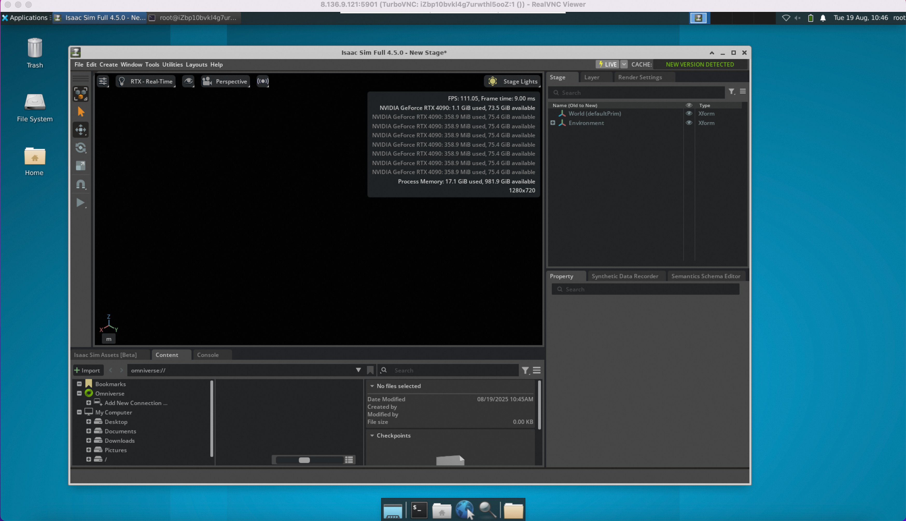
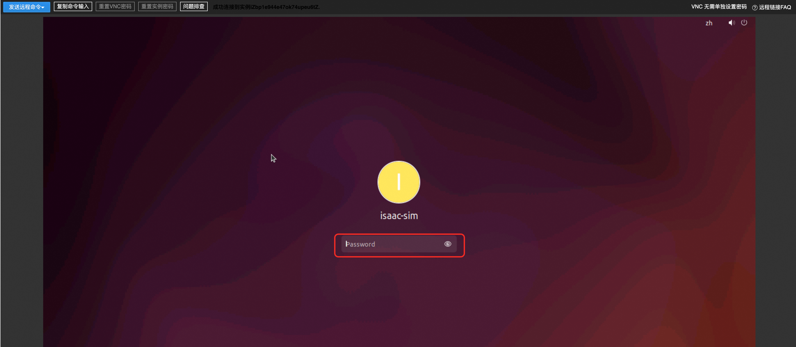
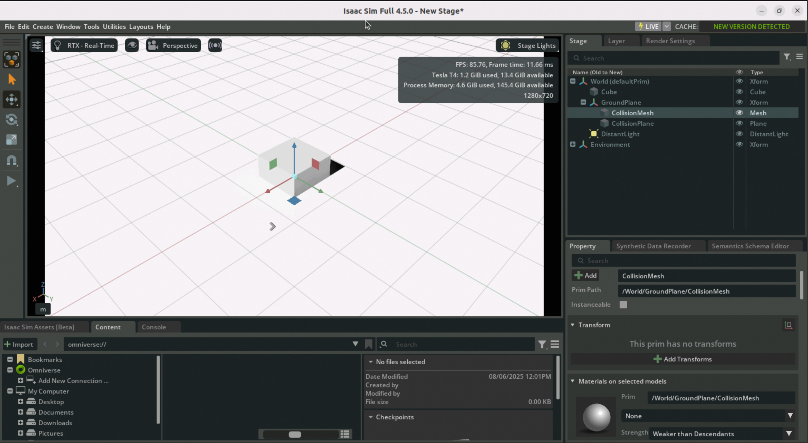
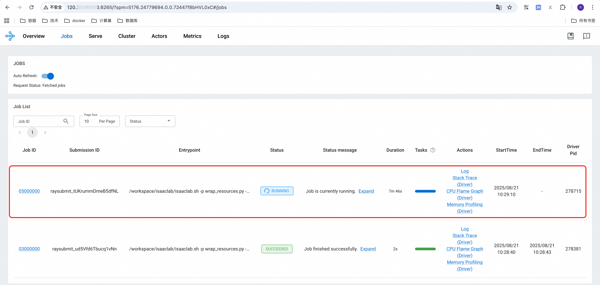

<div style="background: linear-gradient(135deg, #2563eb, #1e40af); padding: 24px; border-radius: 8px; color: white; text-align: center; margin-bottom: 24px;">
  <h2 style="margin: 0; color: white;">🤖 NVIDIA Isaac Lab User Guide</h2>
  <p style="margin: 8px 0 0 0; opacity: 0.9;">Open-source Unified Framework for Robot Learning - Complete Tutorial for Standalone and Cluster Versions</p>
</div>

## 🎯 Framework Overview

<div style="background: #f8fafc; border: 1px solid #e2e8f0; border-radius: 8px; padding: 20px; margin: 16px 0;">

**NVIDIA Isaac™ Lab** is an open-source unified framework for robot learning, designed to help train robot policies.

<div style="background: #eff6ff; border-left: 4px solid #2563eb; padding: 16px; margin: 16px 0; border-radius: 4px;">
  <strong>🔧 Core Technology Stack</strong><br>
  • Built on <strong>NVIDIA Isaac Sim™</strong><br>
  • Uses <strong>NVIDIA® PhysX®</strong> physics engine<br>
  • Integrates <strong>NVIDIA RTX™</strong> rendering technology<br>
  • Provides high-fidelity physics simulation environment
</div>

**Core Value**: Bridges the gap between high-fidelity simulation and perception-based robot training, helping developers and researchers build more robot applications more efficiently.

</div>

---

## 🖥️ IsaacLab Standalone Version Tutorial

<div style="background: #f8fafc; border: 1px solid #e2e8f0; border-radius: 8px; padding: 20px; margin: 16px 0;">

### 🎮 Service Features

Isaac Lab service instances come with complete Isaac Sim applications built-in, supporting two training modes:
- **Independent Simulation Training**: Using Isaac Sim for simulation training
- **Reinforcement Learning Training**: RL training based on Isaac Lab framework

<div style="background: #dcfce7; border-left: 4px solid #059669; padding: 16px; margin: 16px 0; border-radius: 4px;">
  <strong>✅ System Configuration</strong><br>
  ECS instances come pre-installed with Ubuntu graphical interface, supporting direct use through VNC in ECS console
</div>

</div>

### 🔗 VNC Access to ECS Instance

<details style="border: 2px solid #2563eb; border-radius: 12px; padding: 20px; margin: 20px 0; background: linear-gradient(145deg, #f8fafc, #eff6ff); box-shadow: 0 8px 16px rgba(37, 99, 235, 0.15);">
<summary style="font-weight: bold; font-size: 18px; color: white; cursor: pointer; padding: 16px; background: linear-gradient(135deg, #2563eb, #1e40af); border-radius: 8px; margin: -20px -20px 20px -20px; text-shadow: 1px 1px 2px rgba(0,0,0,0.2); transition: all 0.3s ease; display: flex; align-items: center; box-shadow: 0 4px 8px rgba(37, 99, 235, 0.3);">
🖥️ VncServer + VncRealViewer Method (Recommended)
</summary>

#### 📋 Operation Steps

**Step 1: Login to ECS Instance**
1. In the service instance details page resources, find the corresponding ECS instance
2. Click **Remote Connection** to login


**Step 2: Configure VNC Service**
```bash
# Switch to root account
sudo su root

# Set VNC service password (Note: password length maximum 8 characters)
/opt/TurboVNC/bin/vncpasswd

# Start VNC Server service (listening on port 5901)
/opt/TurboVNC/bin/vncserver :1 -geometry 1920x1080 -depth 24 -xstartup ~/.vnc/xstartup
```

**Step 3: Client Connection**
1. Download [VncRealViewer client](https://www.realvnc.com/en/connect/download/viewer/)
2. Connection address: `<Server Public IP>:5901`


**Step 4: Launch Isaac Sim**
```bash
cd /home/isaac-sim/isaacsim
./isaac-sim.sh --allow-root
```



</details>

<details style="border: 2px solid #64748b; border-radius: 12px; padding: 20px; margin: 20px 0; background: linear-gradient(145deg, #f8fafc, #f1f5f9); box-shadow: 0 8px 16px rgba(100, 116, 139, 0.15);">
<summary style="font-weight: bold; font-size: 18px; color: white; cursor: pointer; padding: 16px; background: linear-gradient(135deg, #64748b, #475569); border-radius: 8px; margin: -20px -20px 20px -20px; text-shadow: 1px 1px 2px rgba(0,0,0,0.2); transition: all 0.3s ease; display: flex; align-items: center; box-shadow: 0 4px 8px rgba(100, 116, 139, 0.3);">
🖥️ ECS Console Native VNC Method
</summary>

#### 📋 Operation Steps

**Step 1: Enter ECS Console**
1. In the service instance details page resources, find the corresponding ECS instance
2. Click **Go to ECS Console**


**Step 2: VNC Login**
1. Click **Remote Connection** in the upper right corner
2. Select **VNC Login Method**
3. Enter isaac-sim account password (same as ECS instance password)


<div style="background: #fed7aa; border-left: 4px solid #ea580c; padding: 16px; margin: 16px 0; border-radius: 4px;">
  <strong>⚠️ Notes</strong><br>
  Password can be viewed on the service instance overview page
</div>



</details>

### 🎮 Isaac Sim Usage

<div style="background: #f8fafc; border: 1px solid #e2e8f0; border-radius: 8px; padding: 20px; margin: 16px 0;">

#### 📁 Directory Structure

After logging into the ECS instance, the isaac-sim account contains two important directories:

<div style="display: grid; grid-template-columns: 1fr 1fr; gap: 16px; margin: 16px 0;">

<div style="background: #eff6ff; border-left: 4px solid #2563eb; padding: 16px; border-radius: 4px;">
<strong>📂 isaacsim</strong><br>
Isaac Sim installation directory<br>
Contains startup and training scripts
</div>

<div style="background: #f0fdf4; border-left: 4px solid #059669; padding: 16px; border-radius: 4px;">
<strong>📂 isaacsim_assets</strong><br>
Isaac Sim assets directory<br>
Pre-downloaded training resources
</div>

</div>


</div>

#### 🔬 Example 1: Headless Scene Synthetic Dataset Generation

<div style="background: #f8fafc; border: 1px solid #e2e8f0; border-radius: 8px; padding: 20px; margin: 16px 0;">

**Function Description**: Use omni.replicator extension to generate synthetic datasets, with data stored offline for deep neural network training.

```bash
# Create working directory
cd /home/isaac-sim
mkdir -p isaacsim_test
cd /home/isaac-sim/isaacsim_test
mkdir -p scene_based_sdg

# Copy example code
cp -rf /home/isaac-sim/isaacsim/standalone_examples/replicator/scene_based_sdg/* \
       /home/isaac-sim/isaacsim_test/scene_based_sdg/

# Execute rendering synthesis
/home/isaac-sim/isaacsim/python.sh ./scene_based_sdg/scene_based_sdg.py \
  --config="/home/isaac-sim/isaacsim_test/scene_based_sdg/config/config_coco_writer.yaml" \
  --/persistent/isaac/asset_root/default="/home/isaac-sim/isaacsim_assets/Assets/Isaac/4.5"
```

<div style="background: #dcfce7; border-left: 4px solid #059669; padding: 16px; margin: 16px 0; border-radius: 4px;">
  <strong>✅ Output Results</strong><br>
  Generated results are stored in the <code>./isaacsim_test/_out_coco</code> directory
</div>

Generated results are stored in "./isaacsim_test/_out_coco", visualization effects are as follows:


</div>

#### 🖼️ Example 2: Using Isaac Sim with GUI

<div style="background: #f8fafc; border: 1px solid #e2e8f0; border-radius: 8px; padding: 20px; margin: 16px 0;">

```bash
cd /home/isaac-sim/isaacsim
./isaac-sim.sh
```

<div style="background: #fed7aa; border-left: 4px solid #ea580c; padding: 16px; margin: 16px 0; border-radius: 4px;">
  <strong>⚠️ Startup Notice</strong><br>
  Isaac Sim starts slowly and will show a waiting window, please be patient and no operation is needed
</div>


**Reference Resources**: You can create basic scenes following the [Official Getting Started Tutorial](https://docs.isaacsim.omniverse.nvidia.com/4.5.0/introduction/quickstart_isaacsim.html)

Below is a cube created following the steps in the getting started tutorial.



</div>

### 🤖 Isaac Lab Usage

<div style="background: #f8fafc; border: 1px solid #e2e8f0; border-radius: 8px; padding: 20px; margin: 16px 0;">

**Installation Path**: `/home/isaac-sim/IsaacLab`

</div>

#### 🎯 Example 1: Headless Mode Agent Training

<div style="background: #f8fafc; border: 1px solid #e2e8f0; border-radius: 8px; padding: 20px; margin: 16px 0;">

**Training Objective**: Use Stable-Baselines3 reinforcement learning framework to solve Cartpole balance control task

<div style="background: #eff6ff; border-left: 4px solid #2563eb; padding: 16px; margin: 16px 0; border-radius: 4px;">
  <strong>🎯 Task Description</strong><br>
  Let the agent learn to control the cart's left-right movement to keep the pole upright
</div>

```bash
# Create working directory
cd /home/isaac-sim
mkdir -p isaaclab_test
cd /home/isaac-sim/isaaclab_test
mkdir -p sb3

# Copy example code
cp -rf /home/isaac-sim/IsaacLab/scripts/reinforcement_learning/sb3/* \
       /home/isaac-sim/isaaclab_test/sb3/

# Start training
/home/isaac-sim/IsaacLab/isaaclab.sh -p ./sb3/train.py \
  --task Isaac-Cartpole-v0 \
  --num_envs 64 \
  --headless \
  --video
```

<div style="background: #dcfce7; border-left: 4px solid #059669; padding: 16px; margin: 16px 0; border-radius: 4px;">
  <strong>✅ Training Results</strong><br>
  Results saved to: <code>./logs/sb3/Isaac-Cartpole-v0</code>
</div>

Training results are saved to ./logs/sb3/Isaac-Cartpole-v0; visualization results are as follows:


</div>

#### 🎮 Example 2: GUI Mode Scene Generation

<div style="background: #f8fafc; border: 1px solid #e2e8f0; border-radius: 8px; padding: 20px; margin: 16px 0;">

```bash
cd /home/isaac-sim/IsaacLab
./isaaclab.sh -p scripts/tutorials/00_sim/spawn_prims.py
```

**Function**: Generate basic objects into the scene in GUI interface


</div>

---

## ☁️ IsaacLab Cluster Version Tutorial

<div style="background: #f8fafc; border: 1px solid #e2e8f0; border-radius: 8px; padding: 20px; margin: 16px 0;">

Isaac Lab supports the **Ray** framework for simplifying the scheduling of multiple training tasks (including parallel and serial) and hyperparameter tuning, suitable for local and remote configurations.

<div style="background: #eff6ff; border-left: 4px solid #2563eb; padding: 16px; margin: 16px 0; border-radius: 4px;">
  <strong>📚 Official Documentation</strong><br>
  Isaac Lab service Ray job scheduling and tuning official documentation is Ray Job Dispatch and Tuning
</div>

</div>

### 🛠️ Environment Setup

<div style="background: #f8fafc; border: 1px solid #e2e8f0; border-radius: 8px; padding: 20px; margin: 16px 0;">

#### Step 1: Configure Remote Ray Cluster

```bash
# Configure cluster information (ISAACRAY_ADDRESS obtained from service instance overview page)
echo "name: isaacray address: <ISAACRAY_ADDRESS>" > ~/.cluster_config
export RAY_ADDRESS="<ISAACRAY_ADDRESS>"
```

#### Step 2: Download Source Code

Download [Isaac Lab source code](https://github.com/isaac-sim/IsaacLab) from GitHub

#### Step 3: Install Ray Client

```bash
pip install "ray[default]"
```

</div>

### 🧪 Test Job: Log Output Example

<div style="background: #f8fafc; border: 1px solid #e2e8f0; border-radius: 8px; padding: 20px; margin: 16px 0;">

#### Create Test File

Create `test.py` in the `scripts/reinforcement_learning/ray/` directory:

```python
import ray
import os

# Connect to local or remote ray cluster
ray.init()

@ray.remote(num_cpus=1)
class Counter:
    def __init__(self):
        self.name = "test_counter"
        self.counter = 0

    def increment(self):
        self.counter += 1

    def get_counter(self):
        return "{} got {}".format(self.name, self.counter)

counter = Counter.remote()

for _ in range(10):
    counter.increment.remote()
    print(ray.get(counter.get_counter.remote()))
```

#### Submit Job

```bash
python3 scripts/reinforcement_learning/ray/submit_job.py \
  --aggregate_jobs wrap_resources.py \
  --sub_jobs "/workspace/isaaclab/isaaclab.sh -p test.py"
```

<div style="background: #dcfce7; border-left: 4px solid #059669; padding: 16px; margin: 16px 0; border-radius: 4px;">
  <strong>✅ Execution Results</strong><br>
  • The <code>scripts/reinforcement_learning/ray</code> directory will be packaged during submission<br>
  • Output information can be viewed in logs after completion
</div>

After successful submission, you can see the following information in the logs:
- When submitting the job, the scripts/reinforcement_learning/ray directory will be packaged as the working directory and uploaded to the cluster, so our test.py will also be uploaded.


- After the job completes, you can see the output runtime information:


</div>

### 🚀 Isaac Lab Training Task Execution

<div style="background: #f8fafc; border: 1px solid #e2e8f0; border-radius: 8px; padding: 20px; margin: 16px 0;">

#### Submit Training Job

```bash
python3 scripts/reinforcement_learning/ray/submit_job.py \
  --aggregate_jobs wrap_resources.py \
  --sub_jobs "/workspace/isaaclab/isaaclab.sh -p /workspace/isaaclab/scripts/reinforcement_learning/rsl_rl/train.py --task=Isaac-Ant-v0 --headless"
```

#### Monitor Job Execution

<div style="display: grid; grid-template-columns: repeat(auto-fit, minmax(300px, 1fr)); gap: 16px; margin: 16px 0;">

<div style="background: #eff6ff; border-left: 4px solid #2563eb; padding: 16px; border-radius: 4px;">
<strong>🔍 Step 1: View Logs</strong><br>
Check working directory after successful submission<br>
Example: <code>_ray_pkg_18b3cac8e32d6f62</code>
</div>

<div style="background: #f0fdf4; border-left: 4px solid #059669; padding: 16px; border-radius: 4px;">
<strong>🌐 Step 2: Web UI Monitoring</strong><br>
Access Ray cluster URL<br>
View Job running status
</div>

<div style="background: #fef3c7; border-left: 4px solid #f59e0b; padding: 16px; border-radius: 4px;">
<strong>🔎 Step 3: Locate Node</strong><br>
Record scheduled node ID<br>
Example: <code>c9db26a6c016fb43...</code>
</div>

<div style="background: #fef2f2; border-left: 4px solid #dc2626; padding: 16px; border-radius: 4px;">
<strong>📊 Step 4: View Results</strong><br>
Search for node in Cluster Tab<br>
Login to corresponding Pod to view training results
</div>

</div>

After successful submission, you can see the output information in the logs. Here you can mainly see the job's working directory on the cluster, which in this example is _ray_pkg_18b3cac8e32d6f62.


Click the ray cluster url to view job running status in the cluster's web ui.



Click on the running job to see the job's scheduling logs. In this example, it was scheduled to node c9db26a6c016fb4394991190f132afe99cd4a2b0a696f14185001650, and the corresponding training results should also be viewed on this node.


Switch to the Cluster Tab, enter the node id to search, and you can find the corresponding Pod in the container cluster.


Find the corresponding container cluster from the service instance resources, go to the container cluster to find the corresponding Pod above, and login to the Pod.


#### View Training Results

After logging into the Pod, training results save path:

```bash
# Temporary directory structure explanation
# _ray_pkg_18b3cac8e32d6f62: Upload file directory (varies based on actual situation)
# 2025-08-21_08-08-24: Specific runtime
cd /tmp/ray/session_latest/runtime_resources/working_dir_files/_ray_pkg_18b3cac8e32d6f62/logs/rsl_rl/ant/2025-08-21_08-08-24
```

After logging into the Pod, you can see the training results. In this example, the Ant environment was trained, and the training results are saved in the temporary directory below:


</div>

---

<div style="text-align: center; padding: 16px; background: #f8fafc; border-radius: 6px; margin-top: 24px;">
  <p style="margin: 0; color: #64748b; font-size: 14px;">
    🤖 <strong>NVIDIA Isaac Lab</strong> | Making Robot Learning Simpler and More Efficient
  </p>
</div>