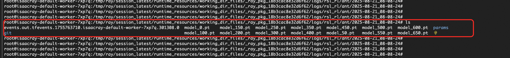

<div style="background: linear-gradient(135deg, #2563eb, #1e40af); padding: 24px; border-radius: 8px; color: white; text-align: center; margin-bottom: 24px;">
  <h2 style="margin: 0; color: white;">🤖 NVIDIA Isaac Lab 使用指南</h2>
  <p style="margin: 8px 0 0 0; opacity: 0.9;">机器人学习的开源统一框架 - 单机版与集群版完整教程</p>
</div>

## 🎯 框架简介

<div style="background: #f8fafc; border: 1px solid #e2e8f0; border-radius: 8px; padding: 20px; margin: 16px 0;">

**NVIDIA Isaac™ Lab** 是一个用于机器人学习的开源统一框架，旨在帮助训练机器人策略。

<div style="background: #eff6ff; border-left: 4px solid #2563eb; padding: 16px; margin: 16px 0; border-radius: 4px;">
  <strong>🔧 核心技术栈</strong><br>
  • 基于 <strong>NVIDIA Isaac Sim™</strong> 开发<br>
  • 使用 <strong>NVIDIA® PhysX®</strong> 物理引擎<br>
  • 集成 <strong>NVIDIA RTX™</strong> 渲染技术<br>
  • 提供高保真物理模拟环境
</div>

**核心价值**：弥合高保真模拟和基于感知的机器人训练之间的差距，帮助开发者和研究人员更高效地构建更多机器人应用。

</div>

---

## 🖥️ IsaacLab 单机版使用教程

<div style="background: #f8fafc; border: 1px solid #e2e8f0; border-radius: 8px; padding: 20px; margin: 16px 0;">

### 🎮 服务特性

Isaac Lab服务实例内置完整的Isaac Sim应用，支持两种训练模式：
- **独立仿真训练**：使用Isaac Sim进行仿真训练
- **强化学习训练**：基于Isaac Lab框架进行RL训练

<div style="background: #dcfce7; border-left: 4px solid #059669; padding: 16px; margin: 16px 0; border-radius: 4px;">
  <strong>✅ 系统配置</strong><br>
  ECS实例预装Ubuntu图形界面，支持通过VNC方式在ECS控制台直接使用
</div>

</div>

### 🔗 VNC方式访问ECS实例

<details style="border: 2px solid #2563eb; border-radius: 12px; padding: 20px; margin: 20px 0; background: linear-gradient(145deg, #f8fafc, #eff6ff); box-shadow: 0 8px 16px rgba(37, 99, 235, 0.15);">
<summary style="font-weight: bold; font-size: 18px; color: white; cursor: pointer; padding: 16px; background: linear-gradient(135deg, #2563eb, #1e40af); border-radius: 8px; margin: -20px -20px 20px -20px; text-shadow: 1px 1px 2px rgba(0,0,0,0.2); transition: all 0.3s ease; display: flex; align-items: center; box-shadow: 0 4px 8px rgba(37, 99, 235, 0.3);">
🖥️ VncServer + VncRealViewer 方式（推荐）
</summary>

#### 📋 操作步骤

**步骤 1：登录ECS实例**
1. 在服务实例详情页的资源中，找到对应的ECS实例
2. 点击**远程连接**进行登录


**步骤 2：配置VNC服务**
```bash
# 切换到root账户
sudo su root

# 设置VNC服务密码（注意：密码长度最大为8位）
/opt/TurboVNC/bin/vncpasswd

# 启动VNC Server服务（监听5901端口）
/opt/TurboVNC/bin/vncserver :1 -geometry 1920x1080 -depth 24 -xstartup ~/.vnc/xstartup
```

**步骤 3：客户端连接**
1. 下载 [VncRealViewer客户端](https://www.realvnc.com/en/connect/download/viewer/)
2. 连接地址：`<服务器公网IP>:5901`


**步骤 4：启动Isaac Sim**
```bash
cd /home/isaac-sim/isaacsim
./isaac-sim.sh --allow-root
```


</details>

<details style="border: 2px solid #64748b; border-radius: 12px; padding: 20px; margin: 20px 0; background: linear-gradient(145deg, #f8fafc, #f1f5f9); box-shadow: 0 8px 16px rgba(100, 116, 139, 0.15);">
<summary style="font-weight: bold; font-size: 18px; color: white; cursor: pointer; padding: 16px; background: linear-gradient(135deg, #64748b, #475569); border-radius: 8px; margin: -20px -20px 20px -20px; text-shadow: 1px 1px 2px rgba(0,0,0,0.2); transition: all 0.3s ease; display: flex; align-items: center; box-shadow: 0 4px 8px rgba(100, 116, 139, 0.3);">
🖥️ ECS控制台原生VNC方式
</summary>

#### 📋 操作步骤

**步骤 1：进入ECS控制台**
1. 在服务实例详情页的资源中，找到对应的ECS实例
2. 点击**去到ECS控制台**


**步骤 2：VNC登录**
1. 点击右上角的**远程连接**
2. 选择**VNC登录方式**
3. 输入isaac-sim账户密码（与ECS实例密码一致）


<div style="background: #fed7aa; border-left: 4px solid #ea580c; padding: 16px; margin: 16px 0; border-radius: 4px;">
  <strong>⚠️ 注意事项</strong><br>
  密码可在服务实例概览页面查看
</div>


</details>

### 🎮 Isaac Sim使用方式

<div style="background: #f8fafc; border: 1px solid #e2e8f0; border-radius: 8px; padding: 20px; margin: 16px 0;">

#### 📁 目录结构

登录ECS实例后，isaac-sim账户下包含两个重要目录：

<div style="display: grid; grid-template-columns: 1fr 1fr; gap: 16px; margin: 16px 0;">

<div style="background: #eff6ff; border-left: 4px solid #2563eb; padding: 16px; border-radius: 4px;">
<strong>📂 isaacsim</strong><br>
Isaac Sim安装目录<br>
包含启动和训练脚本
</div>

<div style="background: #f0fdf4; border-left: 4px solid #059669; padding: 16px; border-radius: 4px;">
<strong>📂 isaacsim_assets</strong><br>
Isaac Sim资源目录<br>
预下载的训练资源
</div>

</div>


</div>

#### 🔬 示例1：无GUI场景合成数据集生成

<div style="background: #f8fafc; border: 1px solid #e2e8f0; border-radius: 8px; padding: 20px; margin: 16px 0;">

**功能说明**：使用omni.replicator扩展生成合成数据集，数据离线存储用于深度神经网络训练。

```bash
# 创建工作目录
cd /home/isaac-sim
mkdir -p isaacsim_test
cd /home/isaac-sim/isaacsim_test
mkdir -p scene_based_sdg

# 复制示例代码
cp -rf /home/isaac-sim/isaacsim/standalone_examples/replicator/scene_based_sdg/* \
       /home/isaac-sim/isaacsim_test/scene_based_sdg/

# 执行渲染合成
/home/isaac-sim/isaacsim/python.sh ./scene_based_sdg/scene_based_sdg.py \
  --config="/home/isaac-sim/isaacsim_test/scene_based_sdg/config/config_coco_writer.yaml" \
  --/persistent/isaac/asset_root/default="/home/isaac-sim/isaacsim_assets/Assets/Isaac/4.5"
```

<div style="background: #dcfce7; border-left: 4px solid #059669; padding: 16px; margin: 16px 0; border-radius: 4px;">
  <strong>✅ 输出结果</strong><br>
  生成结果存储在 <code>./isaacsim_test/_out_coco</code> 目录中
</div>

生成结果存储在"./isaacsim_test/_out_coco"中，可视化效果如下：


</div>

#### 🖼️ 示例2：GUI方式使用Isaac Sim

<div style="background: #f8fafc; border: 1px solid #e2e8f0; border-radius: 8px; padding: 20px; margin: 16px 0;">

```bash
cd /home/isaac-sim/isaacsim
./isaac-sim.sh
```

<div style="background: #fed7aa; border-left: 4px solid #ea580c; padding: 16px; margin: 16px 0; border-radius: 4px;">
  <strong>⚠️ 启动提示</strong><br>
  Isaac Sim启动较慢，会弹出等待窗口，请耐心等待，无需操作
</div>


**参考资源**：可按照 [官方入门教程](https://docs.isaacsim.omniverse.nvidia.com/4.5.0/introduction/quickstart_isaacsim.html) 创建基础场景

下面是按入门教程中的步骤创建了个正方体。


</div>

### 🤖 Isaac Lab使用方式

<div style="background: #f8fafc; border: 1px solid #e2e8f0; border-radius: 8px; padding: 20px; margin: 16px 0;">

**安装路径**：`/home/isaac-sim/IsaacLab`

</div>

#### 🎯 示例1：无GUI模式智能体训练

<div style="background: #f8fafc; border: 1px solid #e2e8f0; border-radius: 8px; padding: 20px; margin: 16px 0;">

**训练目标**：使用Stable-Baselines3强化学习框架解决Cartpole平衡控制任务

<div style="background: #eff6ff; border-left: 4px solid #2563eb; padding: 16px; margin: 16px 0; border-radius: 4px;">
  <strong>🎯 任务描述</strong><br>
  让智能体学习控制小车左右移动，保持摆杆直立不倒
</div>

```bash
# 创建工作目录
cd /home/isaac-sim
mkdir -p isaaclab_test
cd /home/isaac-sim/isaaclab_test
mkdir -p sb3

# 复制示例代码
cp -rf /home/isaac-sim/IsaacLab/scripts/reinforcement_learning/sb3/* \
       /home/isaac-sim/isaaclab_test/sb3/

# 开始训练
/home/isaac-sim/IsaacLab/isaaclab.sh -p ./sb3/train.py \
  --task Isaac-Cartpole-v0 \
  --num_envs 64 \
  --headless \
  --video
```

<div style="background: #dcfce7; border-left: 4px solid #059669; padding: 16px; margin: 16px 0; border-radius: 4px;">
  <strong>✅ 训练结果</strong><br>
  结果保存至：<code>./logs/sb3/Isaac-Cartpole-v0</code>
</div>

训练结果保存到./logs/sb3/Isaac-Cartpole-v0中；可视化结果如下


</div>

#### 🎮 示例2：GUI模式场景生成

<div style="background: #f8fafc; border: 1px solid #e2e8f0; border-radius: 8px; padding: 20px; margin: 16px 0;">

```bash
cd /home/isaac-sim/IsaacLab
./isaaclab.sh -p scripts/tutorials/00_sim/spawn_prims.py
```

**功能**：在GUI界面中生成基本物体到场景中


</div>

---

## ☁️ IsaacLab 集群版使用教程

<div style="background: #f8fafc; border: 1px solid #e2e8f0; border-radius: 8px; padding: 20px; margin: 16px 0;">

Isaac Lab 支持 **Ray** 框架，用于简化多个训练任务的调度（包括并行和串行）以及超参数调优，适用于本地和远程配置。

<div style="background: #eff6ff; border-left: 4px solid #2563eb; padding: 16px; margin: 16px 0; border-radius: 4px;">
  <strong>📚 官方文档</strong><br>
  Isaac Lab服务Ray作业调度和调优官方文档为Ray Job Dispatch and Tuning
</div>

</div>

### 🛠️ 环境准备

<div style="background: #f8fafc; border: 1px solid #e2e8f0; border-radius: 8px; padding: 20px; margin: 16px 0;">

#### 步骤1：配置远程Ray集群

```bash
# 配置集群信息（ISAACRAY_ADDRESS从服务实例概览页获取）
echo "name: isaacray address: <ISAACRAY_ADDRESS>" > ~/.cluster_config
export RAY_ADDRESS="<ISAACRAY_ADDRESS>"
```

#### 步骤2：下载源码

从GitHub下载 [Isaac Lab源码](https://github.com/isaac-sim/IsaacLab)

#### 步骤3：安装Ray客户端

```bash
pip install "ray[default]"
```

</div>

### 🧪 测试Job：日志输出示例

<div style="background: #f8fafc; border: 1px solid #e2e8f0; border-radius: 8px; padding: 20px; margin: 16px 0;">

#### 创建测试文件

在 `scripts/reinforcement_learning/ray/` 目录下创建 `test.py`：

```python
import ray
import os

# 连接本地或者远程ray cluster
ray.init()

@ray.remote(num_cpus=1)
class Counter:
    def __init__(self):
        self.name = "test_counter"
        self.counter = 0

    def increment(self):
        self.counter += 1

    def get_counter(self):
        return "{} got {}".format(self.name, self.counter)

counter = Counter.remote()

for _ in range(10):
    counter.increment.remote()
    print(ray.get(counter.get_counter.remote()))
```

#### 提交作业

```bash
python3 scripts/reinforcement_learning/ray/submit_job.py \
  --aggregate_jobs wrap_resources.py \
  --sub_jobs "/workspace/isaaclab/isaaclab.sh -p test.py"
```

<div style="background: #dcfce7; border-left: 4px solid #059669; padding: 16px; margin: 16px 0; border-radius: 4px;">
  <strong>✅ 执行结果</strong><br>
  • 提交时会打包 <code>scripts/reinforcement_learning/ray</code> 目录<br>
  • 运行完成后可在日志中查看输出信息
</div>

提交成功后，可以从日志里看到以下信息：
- 提交作业时，会把scripts/reinforcement_learning/ray目录当作工作目录进行打包，上传到集群中，所以我们的test.py也会被上传。


- job运行完成后，可以看到输出的运行信息：


</div>

### 🚀 Isaac Lab训练任务执行

<div style="background: #f8fafc; border: 1px solid #e2e8f0; border-radius: 8px; padding: 20px; margin: 16px 0;">

#### 提交训练作业

```bash
python3 scripts/reinforcement_learning/ray/submit_job.py \
  --aggregate_jobs wrap_resources.py \
  --sub_jobs "/workspace/isaaclab/isaaclab.sh -p /workspace/isaaclab/scripts/reinforcement_learning/rsl_rl/train.py --task=Isaac-Ant-v0 --headless"
```

#### 监控作业执行

<div style="display: grid; grid-template-columns: repeat(auto-fit, minmax(300px, 1fr)); gap: 16px; margin: 16px 0;">

<div style="background: #eff6ff; border-left: 4px solid #2563eb; padding: 16px; border-radius: 4px;">
<strong>🔍 步骤1：查看日志</strong><br>
提交成功后查看工作目录<br>
例：<code>_ray_pkg_18b3cac8e32d6f62</code>
</div>

<div style="background: #f0fdf4; border-left: 4px solid #059669; padding: 16px; border-radius: 4px;">
<strong>🌐 步骤2：Web UI监控</strong><br>
访问Ray集群URL<br>
查看Job运行状态
</div>

<div style="background: #fef3c7; border-left: 4px solid #f59e0b; padding: 16px; border-radius: 4px;">
<strong>🔎 步骤3：定位节点</strong><br>
记录调度节点ID<br>
例：<code>c9db26a6c016fb43...</code>
</div>

<div style="background: #fef2f2; border-left: 4px solid #dc2626; padding: 16px; border-radius: 4px;">
<strong>📊 步骤4：查看结果</strong><br>
在Cluster Tab搜索节点<br>
登录对应Pod查看训练结果
</div>

</div>

提交成功后，可以看到日志里输出的信息，这里主要可以看到job在集群上的工作目录，本例上为_ray_pkg_18b3cac8e32d6f62。


点击ray集群url, 可以到集群的web ui中查看job运行情况。


点击正在运行的这个job，可以看到job的调度日志，本例是调度到了c9db26a6c016fb4394991190f132afe99cd4a2b0a696f14185001650节点，对应的训练结果也要到这个节点上查看。


切到Cluster Tab下，输入node id进行搜索，可以找到容器集群中对应的Pod。


从服务实例资源中找到对应的容器集群，去容器集群中找到上面对应的Pod，并登录到Pod中。


#### 训练结果查看

登录到Pod后，训练结果保存路径：

```bash
# 临时目录结构说明
# _ray_pkg_18b3cac8e32d6f62: 上传文件目录（根据实际情况变化）
# 2025-08-21_08-08-24: 具体运行时间
cd /tmp/ray/session_latest/runtime_resources/working_dir_files/_ray_pkg_18b3cac8e32d6f62/logs/rsl_rl/ant/2025-08-21_08-08-24
```

登录到Pod中，可以看到训练结果，本例训练的Ant环境，训练的结果保存在下面的临时目录中：



</div>

---

<div style="text-align: center; padding: 16px; background: #f8fafc; border-radius: 6px; margin-top: 24px;">
  <p style="margin: 0; color: #64748b; font-size: 14px;">
    🤖 <strong>NVIDIA Isaac Lab</strong> | 让机器人学习更简单高效
  </p>
</div>