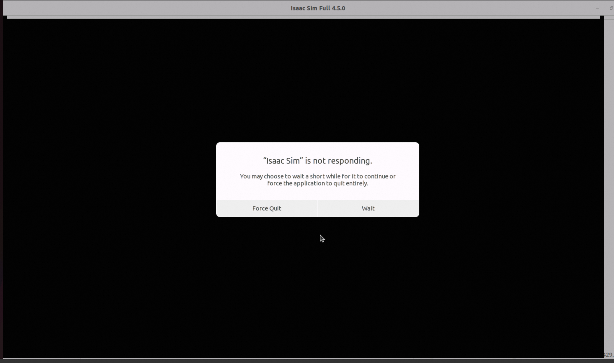
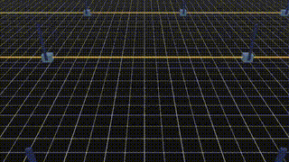

<div style="background: linear-gradient(135deg, #2563eb, #1e40af); padding: 24px; border-radius: 8px; color: white; text-align: center; margin-bottom: 24px;">
  <h2 style="margin: 0; color: white;">🤖 NVIDIA Isaac Lab 使用指南</h2>
  <p style="margin: 8px 0 0 0; opacity: 0.9;">基于Isaac Sim的机器人学习统一框架完整教程</p>
</div>

## 🎯 产品简介

<div style="background: #f8fafc; border: 1px solid #e2e8f0; border-radius: 8px; padding: 20px; margin: 16px 0;">

**NVIDIA Isaac™ Lab** 是一个用于机器人学习的开源统一框架，旨在帮助训练机器人策略。

Isaac Lab 基于 **NVIDIA Isaac Sim™** 开发，使用 **NVIDIA® PhysX®** 以及基于物理性质的 **NVIDIA RTX™** 渲染提供高保真物理模拟。它弥合了高保真模拟和基于感知的机器人训练之间的差距，帮助开发者和研究人员更高效地构建更多机器人。

</div>

<div style="background: #eff6ff; border-left: 4px solid #2563eb; padding: 16px; margin: 16px 0; border-radius: 4px;">
  <strong>🎯 核心特性</strong><br>
  Isaac Lab服务实例内置完整的Isaac Sim应用，支持两种训练模式：既可独立使用Isaac Sim进行仿真训练，也可基于Isaac Lab框架进行强化学习训练。
</div>

## 🖥️ 环境访问配置

<div style="background: #f8fafc; border: 1px solid #e2e8f0; border-radius: 8px; padding: 20px; margin: 16px 0;">
<h3 style="margin-top: 0; color: #1e40af;">💻 系统环境</h3>

对应的ECS实例安装了Ubuntu图形界面，支持在ECS控制台通过VNC的方式直接使用。

</div>

### 🔗 VNC方式访问ECS实例

<div style="display: grid; grid-template-columns: 1fr; gap: 16px; margin: 16px 0;">

<div style="background: #f8fafc; border: 1px solid #e2e8f0; border-radius: 8px; padding: 20px;">
<h4 style="margin-top: 0; color: #1e40af;">步骤 1：进入ECS控制台</h4>
<p>在服务实例详情页的资源中，找到对应的ECS实例，点击去到ECS控制台。</p>


</div>

<div style="background: #f8fafc; border: 1px solid #e2e8f0; border-radius: 8px; padding: 20px;">
<h4 style="margin-top: 0; color: #1e40af;">步骤 2：选择VNC登录</h4>
<p>点击右上角的远程连接，选择VNC登录方式，即可进入到Ubuntu系统的图形界面。</p>


</div>

<div style="background: #f8fafc; border: 1px solid #e2e8f0; border-radius: 8px; padding: 20px;">
<h4 style="margin-top: 0; color: #1e40af;">步骤 3：输入登录密码</h4>
<p>这里需要输入isaac-sim账户对应登录密码，对应的密码和ECS实例密码一致，可以去服务实例概览页面查看。</p>


</div>

</div>

## 🎮 Isaac Sim 使用指南

<div style="background: #f8fafc; border: 1px solid #e2e8f0; border-radius: 8px; padding: 20px; margin: 16px 0;">
<h3 style="margin-top: 0; color: #1e40af;">📁 目录结构</h3>

通过上面的方式登录到ECS实例后，打开Terminal，可以看到isaac-sim账户下有两个重要目录：

<div style="display: grid; grid-template-columns: 1fr 1fr; gap: 16px; margin: 16px 0;">
  <div style="background: #eff6ff; border-left: 4px solid #2563eb; padding: 16px; border-radius: 4px;">
    <strong>📂 isaacsim</strong><br>
    Isaac Sim的安装目录，包含相关的启动和训练脚本
  </div>
  <div style="background: #eff6ff; border-left: 4px solid #2563eb; padding: 16px; border-radius: 4px;">
    <strong>📦 isaacsim_assets</strong><br>
    Isaac Sim的资源目录，预下载资源便于训练使用
  </div>
</div>


</div>

### 🔬 示例1：无GUI模式场景合成数据集生成

<div style="background: #f8fafc; border: 1px solid #e2e8f0; border-radius: 8px; padding: 20px; margin: 16px 0;">

<h4 style="margin-top: 0; color: #1e40af;">📋 功能说明</h4>
该示例展示使用omni.replicator扩展生成合成数据集的过程。生成的数据将离线存储（在磁盘上），使其可用于深度神经网络的训练。示例可以在Isaac Sim的Python独立环境中运行，并利用Isaac Sim和Replicator创建离线合成数据集，用于训练机器学习模型。

<div style="background: #fed7aa; border-left: 4px solid #ea580c; padding: 16px; margin: 16px 0; border-radius: 4px;">
  <strong>⚠️ 重要提示</strong><br>
  建议将官方示例代码拷贝到用户目录下进行修改及使用。
</div>

</div>

<details style="border: 2px solid #2563eb; border-radius: 12px; padding: 20px; margin: 20px 0; background: linear-gradient(145deg, #f8fafc, #eff6ff);">
<summary style="font-weight: bold; font-size: 16px; color: white; cursor: pointer; padding: 16px; background: linear-gradient(135deg, #2563eb, #1e40af); border-radius: 8px; margin: -20px -20px 20px -20px;">
💻 点击查看完整执行代码
</summary>

```bash
cd /home/isaac-sim
mkdir -p isaacsim_test
cd /home/isaac-sim/isaacsim_test
mkdir -p scene_based_sdg
cp -rf /home/isaac-sim/isaacsim/standalone_examples/replicator/scene_based_sdg/* /home/isaac-sim/isaacsim_test/scene_based_sdg/

# 渲染合成
# --config指定配置文件路径，其中设置了headless=true
# --/persistent/isaac/asset_root/default指定3D资产存储路径
/home/isaac-sim/isaacsim/python.sh ./scene_based_sdg/scene_based_sdg.py \
  --config="/home/isaac-sim/isaacsim_test/scene_based_sdg/config/config_coco_writer.yaml" \
  --/persistent/isaac/asset_root/default="/home/isaac-sim/isaacsim_assets/Assets/Isaac/4.5"
```

</details>

<div style="background: #dcfce7; border-left: 4px solid #059669; padding: 16px; margin: 16px 0; border-radius: 4px;">
  <strong>✅ 执行结果</strong><br>
  生成结果存储在"./isaacsim_test/_out_coco"中，可视化效果如下：
</div>


### 🖼️ 示例2：GUI模式使用Isaac Sim

<div style="background: #f8fafc; border: 1px solid #e2e8f0; border-radius: 8px; padding: 20px; margin: 16px 0;">

<h4 style="margin-top: 0; color: #1e40af;">🚀 启动命令</h4>
在Terminal中执行以下命令，即可进入Isaac Sim的GUI界面：

```bash
cd /home/isaac-sim/isaacsim
./isaac-sim.sh
```

<div style="background: #fed7aa; border-left: 4px solid #ea580c; padding: 16px; margin: 16px 0; border-radius: 4px;">
  <strong>⚠️ 注意事项</strong><br>
  Isaac Sim启动的时候会比较慢，会弹出等待的窗口，不用进行操作，等待一段时间即可。
</div>



</div>

<div style="background: #dcfce7; border-left: 4px solid #059669; padding: 16px; margin: 16px 0; border-radius: 4px;">
  <strong>✅ 操作示例</strong><br>
  下面是按<a href="https://docs.isaacsim.omniverse.nvidia.com/4.5.0/introduction/quickstart_isaacsim.html" style="color: #2563eb;">入门教程</a>中的步骤创建了个正方体。
</div>


## 🧠 Isaac Lab 使用指南

<div style="background: #f8fafc; border: 1px solid #e2e8f0; border-radius: 8px; padding: 20px; margin: 16px 0;">
<h3 style="margin-top: 0; color: #1e40af;">📍 安装位置</h3>

Isaac Lab服务安装目录在 `/home/isaac-sim/IsaacLab` 中，里面有Isaac Lab的安装目录和启动脚本。

</div>

### 🎯 示例1：无GUI模式训练智能体

<div style="background: #f8fafc; border: 1px solid #e2e8f0; border-radius: 8px; padding: 20px; margin: 16px 0;">

<h4 style="margin-top: 0; color: #1e40af;">🎮 训练任务说明</h4>
本案例使用 **Stable-Baselines3** 强化学习（RL）框架，解决Cartpole平衡控制的智能体任务。

<div style="background: #eff6ff; border-left: 4px solid #2563eb; padding: 16px; margin: 16px 0; border-radius: 4px;">
  <strong>🎯 训练目标</strong><br>
  让智能体学习如何控制小车的左右移动，保持摆杆直立不倒。
</div>

<div style="background: #eff6ff; border-left: 4px solid #2563eb; padding: 16px; margin: 16px 0; border-radius: 4px;">
  <strong>🔧 技术框架</strong><br>
  Stable-Baselines3是一个基于 PyTorch 的强化学习库，提供了多种稳定且易用的 RL 算法，如 PPO、SAC、DQN等。
</div>

</div>

<details style="border: 2px solid #2563eb; border-radius: 12px; padding: 20px; margin: 20px 0; background: linear-gradient(145deg, #f8fafc, #eff6ff);">
<summary style="font-weight: bold; font-size: 16px; color: white; cursor: pointer; padding: 16px; background: linear-gradient(135deg, #2563eb, #1e40af); border-radius: 8px; margin: -20px -20px 20px -20px;">
💻 点击查看训练代码
</summary>

```bash
cd /home/isaac-sim
mkdir -p isaaclab_test
cd /home/isaac-sim/isaaclab_test
mkdir -p sb3
cp -rf /home/isaac-sim/IsaacLab/scripts/reinforcement_learning/sb3/* /home/isaac-sim/isaaclab_test/sb3/

# 开始训练
# --task 指定训练任务
# --num_envs 指定并行环境数量
# --headless 无GUI模式
# --video 生成训练视频
/home/isaac-sim/IsaacLab/isaaclab.sh -p ./sb3/train.py \
  --task Isaac-Cartpole-v0 \
  --num_envs 64 \
  --headless \
  --video
```

</details>

<div style="background: #dcfce7; border-left: 4px solid #059669; padding: 16px; margin: 16px 0; border-radius: 4px;">
  <strong>✅ 训练结果</strong><br>
  训练结果保存到 <code>./logs/sb3/Isaac-Cartpole-v0</code> 中，可视化结果如下：
</div>



### 🎨 示例2：GUI模式生成基本物体

<div style="background: #f8fafc; border: 1px solid #e2e8f0; border-radius: 8px; padding: 20px; margin: 16px 0;">

<h4 style="margin-top: 0; color: #1e40af;">🚀 启动命令</h4>
在Terminal中执行以下命令，即可进入Isaac Lab的GUI界面：

```bash
cd /home/isaac-sim/IsaacLab
./isaaclab.sh -p scripts/tutorials/00_sim/spawn_prims.py
```


</div>

---

<div style="text-align: center; padding: 16px; background: #f8fafc; border-radius: 6px; margin-top: 24px;">
  <p style="margin: 0; color: #64748b; font-size: 14px;">
    🤖 <strong>NVIDIA Isaac Lab</strong> | 让机器人学习更简单高效
  </p>
</div>