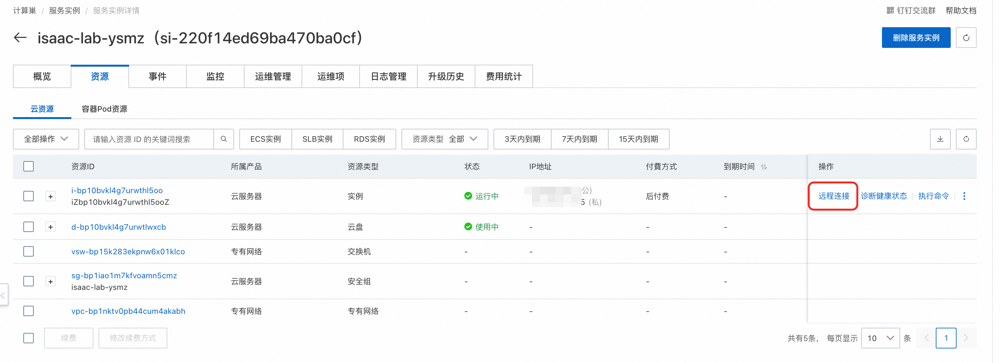

## 简介
NVIDIA Isaac™ Lab 是一个用于机器人学习的开源统一框架，旨在帮助训练机器人策略。

Isaac Lab 基于 NVIDIA Isaac Sim™ 开发，使用 NVIDIA®PhysX® 以及基于物理性质的 NVIDIA RTX™ 渲染提供高保真物理模拟。它弥合了高保真模拟和基于感知的机器人训练之间的差距，帮助开发者和研究人员更高效地构建更多机器人。
## 使用说明
在完成模型部署后，可以在计算巢服务实例概览页面看到模型的使用方式，服务器IP为对应ECS实例的公网IP，可以通过Client连接这个IP进行远程访问。



### 使用方式一：通过Omniverse Streaming Client远程连接使用
Isaac Lab服务在启动时会自动启动Isaac Sim，您可以通过Omniverse Streaming Client远程连接Isaac Sim，使用图形界面快速开发和调试机器人。

#### 第一步：下载安装Omniverse Streaming Client

1. Omniverse Streaming Client安装需要准备一台带GPU的Windows系统电脑，并需要安装GPU Grid驱动。
```
如果您当前没有Windows系统的带GPU的PC，您可以通过阿里云无影服务购买一台带GPU的Windows系统电脑，来进行Client安装，
最低配置要求为4 vCPU / 10 GiB / 2GiB 显存，无影云电脑会自动安装GPU Grid驱动，无需进行手动安装。
无影云电脑购买方式见:https://help.aliyun.com/zh/wuying-workspace/user-guide/create-a-cloud-computer-3?spm=a2c4g.11186623.help-menu-68242.d_2_0_1_1_0.7aa232ccLyfHZl
```
2. Omniverse Streaming Client下载地址为[链接](https://docs.isaacsim.omniverse.nvidia.com/latest/installation/download.html#isaac-sim-latest-release),选择其中的Windows版本进行下载。


3. 下载完成后，解压文件，进入解压后的目录，点击omniverse-streaming-client.exe即可打开连接界面。


#### 第二步：Client连接Isaac Sim, 进行图形化开发和调试

1. Omniverse Streaming Client打开连接界面后，在Server里输入Isaac Lab服务实例的IP地址，点击Connect即可连接Isaac Sim。


2. 这里以[Issac Sim入门教程](https://docs.isaacsim.omniverse.nvidia.com/latest/introduction/quickstart_isaacsim.html)为例，可以创建出一个画布平面和一个立方体，如下所示。


3. 您也可以进行其他更复杂的操作，例如创建一个机器人，并进行运动规划、控制、训练等。

### 使用方式二：通过SSH远程连接执行python脚本进行训练
Isaac Lab服务目前通过docker镜像的方式进行安装，使用的镜像为官方提供的标准镜像加上Isaac Sim启动所需要的插件cache，可以到容器内部去执行训练使用的python脚本。
1. 在服务实例详情页的资源中，点击远程连接可以登录到Ecs服务器中。


2. 执行docker ps -a命令，可以看到isaac-lab容器的运行状态。


3. 执行docker exec -it isaac-lab bash命令，进入到容器内部。


4. 这里以[官网教程](https://docs.robotsfan.com/isaaclab/source/deployment/docker.html)为例，执行./isaaclab.sh -p scripts/tutorials/00_sim/log_time.py --headless，
   可以看到能顺利执行，您也可以执行您自己的训练脚本。

