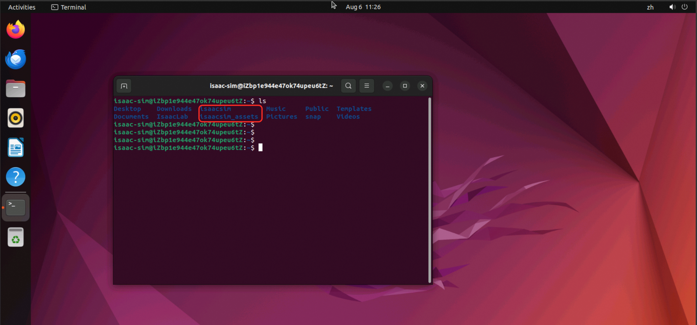
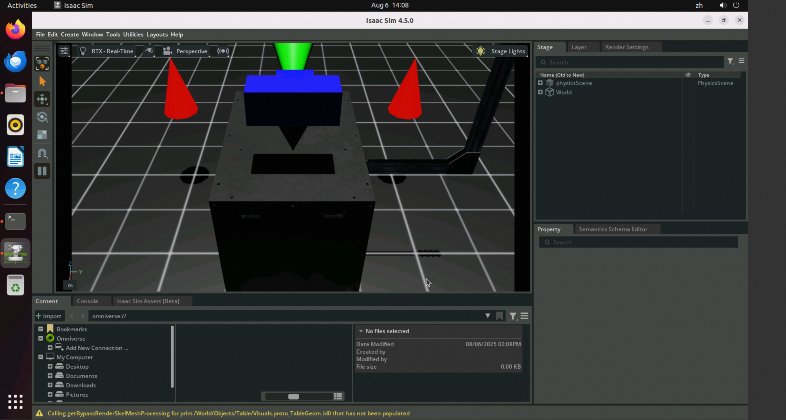
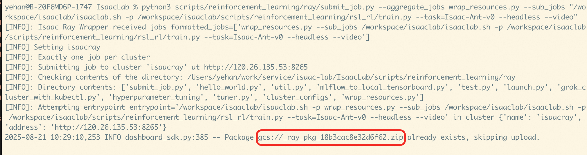

## 简介
NVIDIA Isaac™ Lab 是一个用于机器人学习的开源统一框架，旨在帮助训练机器人策略。

Isaac Lab 基于 NVIDIA Isaac Sim™ 开发，使用 NVIDIA®PhysX® 以及基于物理性质的 NVIDIA RTX™ 渲染提供高保真物理模拟。它弥合了高保真模拟和基于感知的机器人训练之间的差距，帮助开发者和研究人员更高效地构建更多机器人。
## IsaacLab 单机版使用教程
Isaac Lab服务实例内置完整的Isaac Sim应用，支持两种训练模式：既可独立使用Isaac Sim进行仿真训练，也可基于Isaac Lab框架进行强化学习训练。

对应的ECS实例安装了Ubuntu图形界面，支持在ECS控制台通过VNC的方式直接使用。
### VNC方式访问ECS实例
目前提供了两种方式去访问Ubuntu实例，这里推荐使用VncServer+VncRealViewer方式访问，可以比较方便的调整分辨率，整体使用也更加流畅。

#### VncServer+VncRealViewer方式访问 （推荐）
1. 在服务实例详情页的资源中，找到对应的ECS实例，点击远程连接进行登录。


2. 登录到ECS实例后执行以下命令：
```shell
# 切换到root账户
sudo su root
# 设置VNC服务密码，注意密码长度最大为8位
/opt/TurboVNC/bin/vncpasswd
# 启动VNC Server服务,服务会listen 5901端口,安装组已预先设置为开放
/opt/TurboVNC/bin/vncserver :1 -geometry 1920x1080 -depth 24 -xstartup ~/.vnc/xstartup
```
3. 下载[VncRealViewer客户端](https://www.realvnc.com/en/connect/download/viewer/)，连接输入<服务器公网IP>:5901, 即可连接服务器。


4. 在/home/isaac-sim/isaacsim路径下，执行./isaac-sim.sh --allow-root命令，即可打开Isaac Sim界面。


#### Ecs控制台自带原生的VNC登录方式
1. 在服务实例详情页的资源中，找到对应的ECS实例，点击去到ECS控制台。

   

2. 点击右上角的远程连接，选择VNC登录方式，即可进入到Ubuntu系统的图形界面。

   

3. 这里需要输入isaac-sim账户对应登录密码，对应的密码和ECS实例密码一致，可以去服务实例概览页面查看。

   

### Isaac Sim使用方式
通过上面的方式登录到ECS实例后，打开Terminal，可以看到isaac-sim账户下有isaacsim和isaacsim_assets两个目录。
- isaacsim目录为Isaac Sim的安装目录，里面有Isaac Sim相关的启动和训练脚本。
- isaacsim_assets目录为Isaac Sim的资源目录，这里做了提前下载，方便后面训练使用。



#### 示例1: 以无GUI的方式进行场景合成数据集生成
该示例展示使用omni.replicator扩展生成合成数据集的过程。生成的数据将离线存储（在磁盘上），使其可用于深度神经网络的训练。示例可以在Isaac Sim的Python独立环境中运行，并利用Isaac Sim和Replicator创建离线合成数据集，用于训练机器学习模型。建议将官方示例代码拷贝到用户目录下进行修改及使用。
```shell
cd /home/isaac-sim
mkdir -p isaacsim_test
cd /home/isaac-sim/isaacsim_test
mkdir -p scene_based_sdg
cp -rf /home/isaac-sim/isaacsim/standalone_examples/replicator/scene_based_sdg/* /home/isaac-sim/isaacsim_test/scene_based_sdg/
## 渲染合成(--config指定配置文件路径，其中设置了headless=true；--/persistent/isaac/asset_root/default指定3D资产存储路径)
/home/isaac-sim/isaacsim/python.sh ./scene_based_sdg/scene_based_sdg.py --config="/home/isaac-sim/isaacsim_test/scene_based_sdg/config/config_coco_writer.yaml" --/persistent/isaac/asset_root/default="/home/isaac-sim/isaacsim_assets/Assets/Isaac/4.5"
```
生成结果存储在”./isaacsim_test/_out_coco“中，可视化效果如下：


#### 示例2: 以GUI的方式使用Isaac Sim
在termial中执行以下命令，即可进入Isaac Sim的GUI界面。
```shell
cd /home/isaac-sim/isaacsim
./isaac-sim.sh
```
这里要注意的是，Isaac Sim启动的时候会比较慢，会弹出等待的窗口，不用进行操作，等待一段时间即可。


下面是按[入门教程](https://docs.isaacsim.omniverse.nvidia.com/4.5.0/introduction/quickstart_isaacsim.html)中的步骤创建了个正方体。


### Isaac Lab的使用方式
Isaac Lab服务安装目录在/home/isaac-sim/IsaacLab中，里面有Isaac Lab的安装目录和启动脚本。

#### 示例1： 使用无GUI模式训练智能体
本案例，我们将使用Stable-Baselines3强化学习（RL）框架，以解决Cartpole平衡控制的智能体任务。Stable-Baselines3是一个基于 PyTorch 的强化学习库，提供了多种稳定且易用的 RL 算法，如 PPO、SAC、DQN等。训练目标是，让智能体学习如何控制小车的左右移动，保持摆杆直立不倒。建议将示例代码拷贝到个人目录进行修改和调试。
```shell
cd /home/isaac-sim
mkdir -p isaaclab_test
cd /home/isaac-sim/isaaclab_test
mkdir -p sb3
cp -rf /home/isaac-sim/IsaacLab/scripts/reinforcement_learning/sb3/* /home/isaac-sim/isaaclab_test/sb3/
## 渲染合成(--config指定配置文件路径，其中设置了headless=true；--/persistent/isaac/asset_root/default指定3D资产存储路径)
/home/isaac-sim/IsaacLab/isaaclab.sh -p ./sb3/train.py --task Isaac-Cartpole-v0 --num_envs 64 --headless --video
```
训练结果保存到./logs/sb3/Isaac-Cartpole-v0中；可视化结果如下


#### 示例2： 使用GUI模式生成基本物体到场景中
在Terminal中执行以下命令，即可进入Isaac Lab的GUI界面。
```shell
cd /home/isaac-sim/IsaacLab
./isaaclab.sh -p scripts/tutorials/00_sim/spawn_prims.py
```


## IsaacLab 集群版使用教程
Isaac Lab 支持 Ray ，用于简化多个训练任务的调度（包括并行和串行），以及超参数调优，适用于本地和远程配置。

Isaac Lab服务Ray作业调度和调优官方文档为Ray Job Dispatch and Tuning。

### 环境准备
1. 在本地电脑配置远程Ray集群信息，具体命令如下：
```shell
# 这里的<ISAACRAY_ADDRESS>为ray集群的url，可以从服务实例概览页中获取
echo "name: isaacray address: <ISAACRAY_ADDRESS>" > ~/.cluster_config
export RAY_ADDRESS="<ISAACRAY_ADDRESS>"
```
2. 从git上下载[Isaac Lab源码](https://github.com/isaac-sim/IsaacLab), 用来做后续的作业提交。
3. 在本地电脑安装ray客户端，命令如下：
```shell
pip install "ray[default]"
```

### 在日志中打印执行结果的测试job
1. 在Isaac Lab源码目录scripts/reinforcement_learning/ray下新建
   个测试用的python文件test.py，内容如下：
```python
import ray
import os

# 连接本地或者远程ray cluster
ray.init()

@ray.remote(num_cpus=1)
class Counter:
    def __init__(self):
        self.name = "test_counter"
        self.counter = 0

    def increment(self):
        self.counter += 1

    def get_counter(self):
        return "{} got {}".format(self.name, self.counter)

counter = Counter.remote()

for _ in range(10):
    counter.increment.remote()
    print(ray.get(counter.get_counter.remote()))
```
2. 在Isaac Lab源代码目录下，使用ray提交作业，具体命令如下：
```shell
python3 scripts/reinforcement_learning/ray/submit_job.py --aggregate_jobs wrap_resources.py --sub_jobs "/workspace/isaaclab/isaaclab.sh -p test.py"
```
3. 提交成功后，可以从日志里看到以下信息：
   - 提交作业时，会把scripts/reinforcement_learning/ray目录当作工作目录进行打包，上传到集群中，所以我们的test.py也会被上传。
     

   - job运行完成后，可以看到输出的运行信息：
     

### 执行Isaac Lab训练任务
1. 在Isaac Lab源代码目录下，执行命令提交作业，具体命令如下：
```shell
python3 scripts/reinforcement_learning/ray/submit_job.py --aggregate_jobs wrap_resources.py --sub_jobs "/workspace/isaaclab/isaaclab.sh -p /workspace/isaaclab/scripts/reinforcement_learning/rsl_rl/train.py --task=Isaac-Ant-v0 --headless"
```
2. 提交成功后，可以看到日志里输出的信息，这里主要可以看到job在集群上的工作目录，本例上为_ray_pkg_18b3cac8e32d6f62。



3. 点击ray集群url, 可以到集群的web ui中查看job运行情况。


4. 点击正在运行的这个job，可以看到job的调度日志，本例是调度到了c9db26a6c016fb4394991190f132afe99cd4a2b0a696f14185001650节点，
   对应的训练结果也要到这个节点上查看。


5. 切到Cluster Tab下，输入node id进行搜索，可以找到容器集群中对应的Pod。


6. 从服务实例资源中找到对应的容器集群，去容器集群中找到上面对应的Pod，并登录到Pod中。


7. 登录到Pod中，可以看到训练结果，本例训练的Ant环境，训练的结果保存在下面的临时目录中：
```shell
# 执行job的临时目录，其中_ray_pkg_18b3cac8e32d6f62取决于上传文件的目录，2025-08-21_08-08-24 是具体运行时间
cd /tmp/ray/session_latest/runtime_resources/working_dir_files/_ray_pkg_18b3cac8e32d6f62/logs/rsl_rl/ant/2025-08-21_08-08-24 
```

