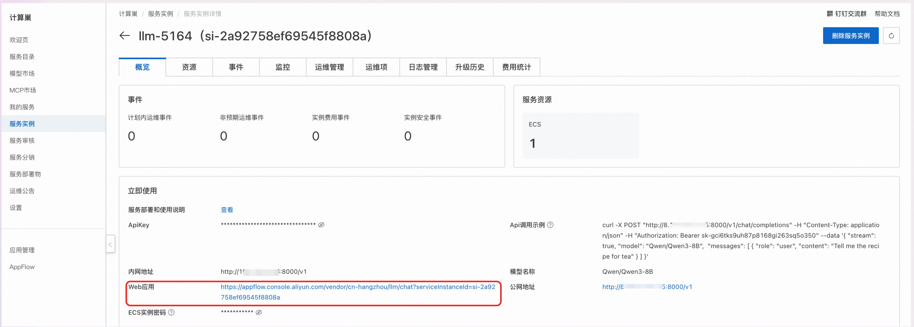

<div style="background: linear-gradient(135deg, #2563eb, #1e40af); padding: 24px; border-radius: 8px; color: white; text-align: center; margin-bottom: 24px;">
  <h2 style="margin: 0; color: white;">🤖 Kimi K2 语言模型</h2>
  <p style="margin: 8px 0 0 0; opacity: 0.9;">最先进的混合专家（MoE）语言模型技术解析</p>
</div>

## 🎯 核心概述

<div style="background: #f8fafc; border: 1px solid #e2e8f0; border-radius: 8px; padding: 20px; margin: 16px 0;">

Kimi K2 是一款最先进的混合专家（MoE）语言模型，拥有 **320 亿激活参数**和 **1 万亿总参数**。通过 Muon 优化器训练，Kimi K2 在前沿知识、推理和编程任务上表现出色，同时在智能体能力方面进行了精心优化。

</div>

## 🏗️ 技术架构特点

<div style="display: grid; grid-template-columns: repeat(auto-fit, minmax(300px, 1fr)); gap: 16px; margin: 16px 0;">

<div style="background: #eff6ff; border-left: 4px solid #2563eb; padding: 16px; border-radius: 4px;">
<h3 style="margin-top: 0; color: #1e40af;">📊 大规模训练</h3>
<ul style="margin: 8px 0 0 0; padding-left: 20px;">
<li><strong>训练规模</strong>：15.5T 个标记预训练</li>
<li><strong>模型参数</strong>：1T 参数的 MoE 架构</li>
<li><strong>稳定性</strong>：无训练不稳定问题</li>
</ul>
</div>

<div style="background: #f0fdf4; border-left: 4px solid #059669; padding: 16px; border-radius: 4px;">
<h3 style="margin-top: 0; color: #059669;">⚡ MuonClip 优化器</h3>
<ul style="margin: 8px 0 0 0; padding-left: 20px;">
<li><strong>创新应用</strong>：Muon 优化器前所未有的规模</li>
<li><strong>技术突破</strong>：新的优化技术</li>
<li><strong>稳定性保障</strong>：解决扩展过程中的不稳定性</li>
</ul>
</div>

<div style="background: #fef3c7; border-left: 4px solid #f59e0b; padding: 16px; border-radius: 4px;">
<h3 style="margin-top: 0; color: #d97706;">🧠 智能体智能</h3>
<ul style="margin: 8px 0 0 0; padding-left: 20px;">
<li><strong>工具使用</strong>：专门优化的工具调用能力</li>
<li><strong>推理能力</strong>：高级逻辑推理</li>
<li><strong>自主解决</strong>：独立问题解决能力</li>
</ul>
</div>

</div>


## 📖 使用说明

<div style="background: #eff6ff; border-left: 4px solid #2563eb; padding: 16px; margin: 16px 0; border-radius: 4px;">
  <strong>💡 快速开始</strong><br>
  在完成模型部署后，可以在计算巢服务实例概览页面看到模型的使用方式，里面提供了 API 调用示例、内网访问地址、公网访问地址、Web应用地址和 ApiKey。
</div>

<div style="background: #f8fafc; border: 1px solid #e2e8f0; border-radius: 8px; padding: 20px; margin: 16px 0;">
  <div style="text-align: center; margin-bottom: 16px;">
    
  </div>
</div>

### 🔌 API 调用方式

#### 🖥️ Curl 命令调用

<div style="background: #f8fafc; border: 1px solid #e2e8f0; border-radius: 8px; padding: 20px; margin: 16px 0;">

<div style="text-align: center; margin-bottom: 16px;">
  
</div>

<div style="background: #eff6ff; border-left: 4px solid #2563eb; padding: 16px; margin: 16px 0; border-radius: 4px;">
  <strong>📋 参数说明</strong><br>
  • <code>${ServerIP}</code>：内网地址或公网地址中的 IP 地址<br>
  • <code>${ApiKey}</code>：页面提供的 ApiKey<br>
  • <code>${ModelName}</code>：模型名称
</div>

Curl 命令调用可以直接使用服务实例概览页面中的 API 调用示例，调用模型 API 的具体结构如下：

```bash
curl -X Post http://${ServerIP}:8000/v1/chat/completions \
  -H "Content-Type: application/json" \
  -H "Authorization: Bearer ${ApiKey}" \
  -d '{
    "model": "${ModelName}",
    "messages": [
      {
        "role": "user",
        "content": "给闺女写一份来自未来2035的信，同时告诉她要好好学习科技，做科技的主人，推动科技，经济发展；她现在是3年级"
      }
    ]
  }'
```

</div>

#### 🐍 Python SDK 调用

<div style="background: #f8fafc; border: 1px solid #e2e8f0; border-radius: 8px; padding: 20px; margin: 16px 0;">

<div style="background: #eff6ff; border-left: 4px solid #2563eb; padding: 16px; margin: 16px 0; border-radius: 4px;">
  <strong>⚙️ 配置说明</strong><br>
  • <code>${ApiKey}</code>：填写页面上的 ApiKey<br>
  • <code>${ServerUrl}</code>：填写页面上的公网地址或内网地址，需要带上 <code>/v1</code>
</div>

以下为 Python 示例代码：

```python
from openai import OpenAI

##### API 配置 #####
openai_api_key = "${ApiKey}"
openai_api_base = "${ServerUrl}"

client = OpenAI(
    api_key=openai_api_key,
    base_url=openai_api_base,
)

models = client.models.list()
model = models.data[0].id
print(model)


def main():
    stream = True

    chat_completion = client.chat.completions.create(
        messages=[
            {
                "role": "user",
                "content": [
                    {
                        "type": "text",
                        "text": "你好，介绍一下你自己，越详细越好。",
                    }
                ],
            }
        ],
        model=model,
        max_completion_tokens=1024,
        stream=stream,
    )

    if stream:
        for chunk in chat_completion:
            print(chunk.choices[0].delta.content, end="")
    else:
        result = chat_completion.choices[0].message.content
        print(result)


if __name__ == "__main__":
    main()
```

</div>

### 🌐 Web 应用访问

<div style="background: #f8fafc; border: 1px solid #e2e8f0; border-radius: 8px; padding: 20px; margin: 16px 0;">

#### 📱 访问步骤

<div style="display: grid; grid-template-columns: repeat(auto-fit, minmax(250px, 1fr)); gap: 16px; margin: 16px 0;">

<div style="background: #eff6ff; border-left: 4px solid #2563eb; padding: 16px; border-radius: 4px;">
<h4 style="margin-top: 0; color: #1e40af;">🔗 步骤一：获取访问链接</h4>
<p style="margin: 0;">在服务实例概览页面中，点击 Web 应用对应的链接，即可直接进行模型服务 Web 访问。</p>
</div>

<div style="background: #dcfce7; border-left: 4px solid #059669; padding: 16px; border-radius: 4px;">
<h4 style="margin-top: 0; color: #059669;">💬 步骤二：开始对话</h4>
<p style="margin: 0;">在模型服务 Web 页面输入框中输入问题，就可以和大模型进行对话了。</p>
</div>

</div>

#### 🖼️ 界面展示

<div style="text-align: center; margin: 20px 0;">
  
</div>

<div style="background: #eff6ff; border-left: 4px solid #2563eb; padding: 16px; margin: 16px 0; border-radius: 4px;">
  <strong>💡 访问提示</strong><br>
  在服务实例概览页面中找到 Web 应用对应的链接，点击即可直接访问模型服务的 Web 界面。
</div>

<div style="text-align: center; margin: 20px 0;">
  
</div>

<div style="background: #dcfce7; border-left: 4px solid #059669; padding: 16px; margin: 16px 0; border-radius: 4px;">
  <strong>✅ 使用说明</strong><br>
  在输入框中输入您的问题或需求，系统将实时响应并提供相应的模型服务。
</div>

</div>


---

<div style="text-align: center; padding: 16px; background: #f8fafc; border-radius: 6px; margin-top: 24px;">
  <p style="margin: 0; color: #64748b; font-size: 14px;">
    🤖 <strong>Kimi K2</strong> | 下一代混合专家语言模型的技术突破
  </p>
</div>