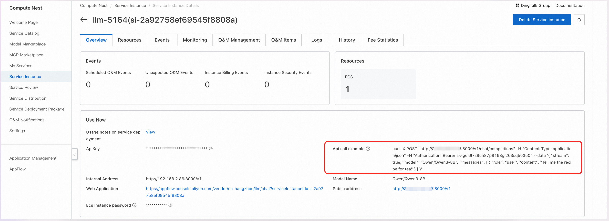

<div style="background: linear-gradient(135deg, #2563eb, #1e40af); padding: 24px; border-radius: 8px; color: white; text-align: center; margin-bottom: 24px;">
  <h2 style="margin: 0; color: white;">🌟 Qwen2.5 Open Source Model</h2>
  <p style="margin: 8px 0 0 0; opacity: 0.9;">Tongyi Qianwen Next-Generation Open Source Model - Breakthrough Performance Surpassing Llama-405B</p>
</div>

## 🎯 Product Overview

<div style="background: #f8fafc; border: 1px solid #e2e8f0; border-radius: 8px; padding: 20px; margin: 16px 0;">

At the Yunqi Conference on September 19th, Alibaba Cloud released Tongyi Qianwen's next-generation open source model Qwen2.5, with the flagship model Qwen2.5-72B surpassing Llama-405B in performance. All Qwen2.5 series models are pre-trained on 18T tokens of data, achieving an overall performance improvement of over 18% compared to Qwen2, with more knowledge and stronger programming and mathematical capabilities.

<div style="background: #eff6ff; border-left: 4px solid #2563eb; padding: 16px; margin: 16px 0; border-radius: 4px;">
  <strong>🏆 Performance Breakthrough</strong><br>
  The Qwen2.5-72B model demonstrates excellence in multiple authoritative benchmark tests, achieving industry-leading levels in general knowledge, coding capabilities, and mathematical abilities.
</div>

</div>

## ✨ Core Features

<div style="display: grid; grid-template-columns: repeat(auto-fit, minmax(300px, 1fr)); gap: 16px; margin: 16px 0;">

<div style="background: #eff6ff; border-left: 4px solid #2563eb; padding: 16px; border-radius: 4px;">
  <strong>📚 Extended Context Support</strong><br>
  Supports context lengths up to 128K and can generate up to 8K content, meeting the needs for long document processing and complex conversations.
</div>

<div style="background: #f0fdf4; border-left: 4px solid #059669; padding: 16px; border-radius: 4px;">
  <strong>🌍 Powerful Multilingual Capabilities</strong><br>
  Supports over 29 languages including Chinese, English, French, Spanish, Russian, Japanese, Vietnamese, and Arabic.
</div>

<div style="background: #fef7ff; border-left: 4px solid #a855f7; padding: 16px; border-radius: 4px;">
  <strong>🎭 Flexible Role-Playing</strong><br>
  Can smoothly respond to diverse system prompts, enabling role-playing and chatbot tasks.
</div>

<div style="background: #fff7ed; border-left: 4px solid #ea580c; padding: 16px; border-radius: 4px;">
  <strong>📊 Structured Data Processing</strong><br>
  Shows significant improvement in instruction following, understanding structured data (such as tables), and generating structured output (especially JSON).
</div>

</div>

## 🔧 Model Specifications

<div style="background: #f8fafc; border: 1px solid #e2e8f0; border-radius: 8px; padding: 20px; margin: 16px 0;">

<h3 style="margin-top: 0; color: #1e40af;">📦 Complete Model Series</h3>

<div style="display: grid; grid-template-columns: repeat(auto-fit, minmax(200px, 1fr)); gap: 12px; margin: 16px 0;">

<div style="background: white; border: 2px solid #dbeafe; border-radius: 8px; padding: 16px; text-align: center;">
  <div style="background: #dbeafe; color: #1e40af; padding: 8px 16px; border-radius: 6px; font-weight: 600; margin-bottom: 8px;">0.5B</div>
  <div style="color: #64748b; font-size: 14px;">Lightweight Deployment</div>
</div>

<div style="background: white; border: 2px solid #dbeafe; border-radius: 8px; padding: 16px; text-align: center;">
  <div style="background: #dbeafe; color: #1e40af; padding: 8px 16px; border-radius: 6px; font-weight: 600; margin-bottom: 8px;">1.5B</div>
  <div style="color: #64748b; font-size: 14px;">Mobile Optimization</div>
</div>

<div style="background: white; border: 2px solid #dcfce7; border-radius: 8px; padding: 16px; text-align: center;">
  <div style="background: #dcfce7; color: #059669; padding: 8px 16px; border-radius: 6px; font-weight: 600; margin-bottom: 8px;">3B</div>
  <div style="color: #64748b; font-size: 14px;">Edge Computing</div>
</div>

<div style="background: white; border: 2px solid #dcfce7; border-radius: 8px; padding: 16px; text-align: center;">
  <div style="background: #dcfce7; color: #059669; padding: 8px 16px; border-radius: 6px; font-weight: 600; margin-bottom: 8px;">7B</div>
  <div style="color: #64748b; font-size: 14px;">General Applications</div>
</div>

<div style="background: white; border: 2px solid #fed7aa; border-radius: 8px; padding: 16px; text-align: center;">
  <div style="background: #fed7aa; color: #ea580c; padding: 8px 16px; border-radius: 6px; font-weight: 600; margin-bottom: 8px;">14B</div>
  <div style="color: #64748b; font-size: 14px;">Enterprise Applications</div>
</div>

<div style="background: white; border: 2px solid #fed7aa; border-radius: 8px; padding: 16px; text-align: center;">
  <div style="background: #fed7aa; color: #ea580c; padding: 8px 16px; border-radius: 6px; font-weight: 600; margin-bottom: 8px;">32B</div>
  <div style="color: #64748b; font-size: 14px;">High-Performance Services</div>
</div>

<div style="background: white; border: 2px solid #fecaca; border-radius: 8px; padding: 16px; text-align: center;">
  <div style="background: #fecaca; color: #dc2626; padding: 8px 16px; border-radius: 6px; font-weight: 600; margin-bottom: 8px;">72B</div>
  <div style="color: #64748b; font-size: 14px;">Flagship Performance</div>
</div>

</div>

</div>

## 📖 User Guide

<div style="background: #eff6ff; border-left: 4px solid #2563eb; padding: 16px; margin: 16px 0; border-radius: 4px;">
  <strong>💡 Quick Start</strong><br>
  After completing the model deployment, you can view the model usage instructions on the Computing Nest service instance overview page, which provides API call examples, internal network access addresses, public network access addresses, and ApiKey.
</div>

<div style="background: #f8fafc; border: 1px solid #e2e8f0; border-radius: 8px; padding: 20px; margin: 16px 0;">
  <div style="text-align: center; margin-bottom: 16px;">
    
  </div>
</div>

### 🔌 API Call Methods

#### 🖥️ Curl Command Call

<div style="background: #f8fafc; border: 1px solid #e2e8f0; border-radius: 8px; padding: 20px; margin: 16px 0;">

<div style="text-align: center; margin-bottom: 16px;">
  
</div>

<div style="background: #eff6ff; border-left: 4px solid #2563eb; padding: 16px; margin: 16px 0; border-radius: 4px;">
  <strong>📋 Parameter Description</strong><br>
  • <code>${ServerIP}</code>: IP address from internal or public network address<br>
  • <code>${ApiKey}</code>: ApiKey provided on the page<br>
  • <code>${ModelName}</code>: Model name
</div>

Curl command calls can directly use the API call examples from the service instance overview page. The specific structure for calling the model API is as follows:

```bash
curl -X Post http://${ServerIP}:8000/v1/chat/completions \
  -H "Content-Type: application/json" \
  -H "Authorization: Bearer ${ApiKey}" \
  -d '{
    "model": "${ModelName}",
    "messages": [
      {
        "role": "user",
        "content": "Write a letter to my daughter from the future year 2035, telling her to study technology well, become the master of technology, and promote technological and economic development; she is currently in 3rd grade"
      }
    ]
  }'
```

</div>

#### 🐍 Python SDK Call

<div style="background: #f8fafc; border: 1px solid #e2e8f0; border-radius: 8px; padding: 20px; margin: 16px 0;">

<div style="background: #eff6ff; border-left: 4px solid #2563eb; padding: 16px; margin: 16px 0; border-radius: 4px;">
  <strong>⚙️ Configuration Instructions</strong><br>
  • <code>${ApiKey}</code>: Fill in the ApiKey from the page<br>
  • <code>${ServerUrl}</code>: Fill in the public or internal network address from the page, must include <code>/v1</code>
</div>

The following is Python example code:

```python
from openai import OpenAI

##### API Configuration #####
openai_api_key = "${ApiKey}"
openai_api_base = "${ServerUrl}"

client = OpenAI(
    api_key=openai_api_key,
    base_url=openai_api_base,
)

models = client.models.list()
model = models.data[0].id
print(model)


def main():
    stream = True

    chat_completion = client.chat.completions.create(
        messages=[
            {
                "role": "user",
                "content": [
                    {
                        "type": "text",
                        "text": "Hello, please introduce yourself in as much detail as possible.",
                    }
                ],
            }
        ],
        model=model,
        max_completion_tokens=1024,
        stream=stream,
    )

    if stream:
        for chunk in chat_completion:
            print(chunk.choices[0].delta.content, end="")
    else:
        result = chat_completion.choices[0].message.content
        print(result)


if __name__ == "__main__":
    main()
```

</div>

### 🌐 Web Application Access

<div style="background: #f8fafc; border: 1px solid #e2e8f0; border-radius: 8px; padding: 20px; margin: 16px 0;">

#### 📱 Access Steps

<div style="display: grid; grid-template-columns: repeat(auto-fit, minmax(250px, 1fr)); gap: 16px; margin: 16px 0;">

<div style="background: #eff6ff; border-left: 4px solid #2563eb; padding: 16px; border-radius: 4px;">
<h4 style="margin-top: 0; color: #1e40af;">🔗 Step 1: Get Access Link</h4>
<p style="margin: 0;">On the service instance overview page, click the link corresponding to the Web application to directly access the model service Web interface.</p>
</div>

<div style="background: #dcfce7; border-left: 4px solid #059669; padding: 16px; border-radius: 4px;">
<h4 style="margin-top: 0; color: #059669;">💬 Step 2: Start Conversation</h4>
<p style="margin: 0;">Enter your question in the input box on the model service Web page to start conversing with the large language model.</p>
</div>

</div>

#### 🖼️ Interface Display

<div style="text-align: center; margin: 20px 0;">
  
</div>

<div style="background: #eff6ff; border-left: 4px solid #2563eb; padding: 16px; margin: 16px 0; border-radius: 4px;">
  <strong>💡 Access Tips</strong><br>
  Find the link corresponding to the Web application on the service instance overview page and click it to directly access the model service Web interface.
</div>

<div style="text-align: center; margin: 20px 0;">
  
</div>

<div style="background: #dcfce7; border-left: 4px solid #059669; padding: 16px; margin: 16px 0; border-radius: 4px;">
  <strong>✅ Usage Instructions</strong><br>
  Enter your questions or requirements in the input box, and the system will respond in real-time and provide corresponding model services.
</div>

</div>

---

<div style="text-align: center; padding: 16px; background: #f8fafc; border-radius: 6px; margin-top: 24px;">
  <p style="margin: 0; color: #64748b; font-size: 14px;">
    🌟 <strong>Qwen2.5 Open Source Model</strong> | Performance Surpassing Llama-405B, New Benchmark for Open Source AI
  </p>
</div>