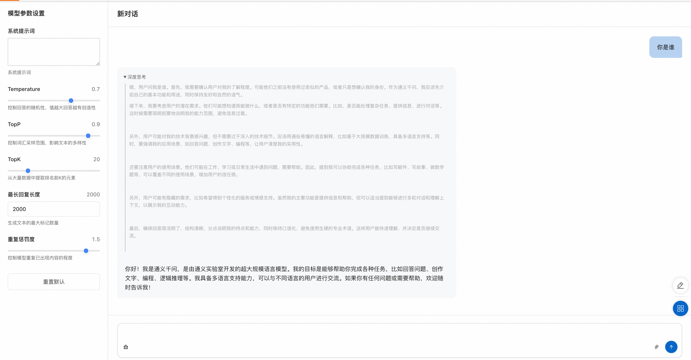

<div style="background: linear-gradient(135deg, #2563eb, #1e40af); padding: 24px; border-radius: 8px; color: white; text-align: center; margin-bottom: 24px;">
  <h2 style="margin: 0; color: white;">👁️ Qwen2.5-VL 视觉语言模型</h2>
  <p style="margin: 8px 0 0 0; opacity: 0.9;">更有用的视觉语言模型 - 理解图像、视频与文档的 AI 专家</p>
</div>

## 🎯 产品简介

<div style="background: #f8fafc; border: 1px solid #e2e8f0; border-radius: 8px; padding: 20px; margin: 16px 0;">

Qwen2.5-VL 是阿里云 Qwen 团队在 Qwen2-VL 基础上结合众多开发者的宝贵反馈构建的更有用的视觉语言模型。该模型在视觉理解、代理能力、视频分析、视觉定位和结构化输出等方面实现了显著提升。

<div style="background: #eff6ff; border-left: 4px solid #2563eb; padding: 16px; margin: 16px 0; border-radius: 4px;">
  <strong>🚀 核心升级</strong><br>
  基于开发者反馈持续优化，Qwen2.5-VL 在实用性和功能完整性方面取得了重大突破，成为更加实用的视觉语言 AI 助手。
</div>

</div>

## ✨ 核心功能

<div style="display: grid; grid-template-columns: repeat(auto-fit, minmax(300px, 1fr)); gap: 16px; margin: 16px 0;">

<div style="background: #f0fdf4; border-left: 4px solid #059669; padding: 16px; border-radius: 4px;">
  <strong>👁️ 视觉理解事物</strong><br>
  不仅能够熟练识别花、鸟、鱼、昆虫等常见物体，而且还能够分析图像中的文本、图表、图标、图形和布局。
</div>

<div style="background: #eff6ff; border-left: 4px solid #2563eb; padding: 16px; border-radius: 4px;">
  <strong>🤖 智能代理性</strong><br>
  直接扮演视觉代理的角色，具有推理和动态指挥工具的功能，可用于电脑和手机操作控制。
</div>

<div style="background: #fef7ff; border-left: 4px solid #a855f7; padding: 16px; border-radius: 4px;">
  <strong>🎬 长视频理解</strong><br>
  可以理解超过 1 小时的视频，具有通过精确定位相关视频片段来捕捉事件的新功能。
</div>

<div style="background: #fff7ed; border-left: 4px solid #ea580c; padding: 16px; border-radius: 4px;">
  <strong>🎯 视觉定位能力</strong><br>
  可以通过生成边界框或点来准确定位图像中的对象，并且可以为坐标和属性提供稳定的 JSON 输出。
</div>

<div style="background: #ecfdf5; border-left: 4px solid #10b981; padding: 16px; border-radius: 4px;">
  <strong>📊 结构化输出</strong><br>
  对于发票、表格、表单等扫描件数据，支持其内容的结构化输出，有利于金融、商业等领域的应用。
</div>

</div>

## 🔍 视觉理解能力

<div style="background: #f8fafc; border: 1px solid #e2e8f0; border-radius: 8px; padding: 20px; margin: 16px 0;">

<h3 style="margin-top: 0; color: #1e40af;">🌟 全方位视觉识别</h3>

<div style="display: grid; grid-template-columns: repeat(auto-fit, minmax(250px, 1fr)); gap: 16px; margin: 16px 0;">

<div style="background: white; border: 2px solid #dcfce7; border-radius: 8px; padding: 16px;">
  <h4 style="margin-top: 0; color: #059669; text-align: center;">🌺 自然物体识别</h4>
  <div style="background: #f0fdf4; padding: 12px; border-radius: 6px; margin: 8px 0;">
    <strong>识别范围：</strong><br>
    • 花卉植物分类<br>
    • 鸟类动物识别<br>
    • 鱼类水生生物<br>
    • 昆虫微生物检测
  </div>
  <div style="text-align: center; margin-top: 12px;">
    <span style="background: #dcfce7; color: #059669; padding: 4px 12px; border-radius: 12px; font-size: 12px;">专业级精度</span>
  </div>
</div>

<div style="background: white; border: 2px solid #dbeafe; border-radius: 8px; padding: 16px;">
  <h4 style="margin-top: 0; color: #2563eb; text-align: center;">📝 文本图表分析</h4>
  <div style="background: #eff6ff; padding: 12px; border-radius: 6px; margin: 8px 0;">
    <strong>分析能力：</strong><br>
    • 图像文本提取<br>
    • 图表数据解读<br>
    • 图标符号识别<br>
    • 布局结构分析
  </div>
  <div style="text-align: center; margin-top: 12px;">
    <span style="background: #dbeafe; color: #2563eb; padding: 4px 12px; border-radius: 12px; font-size: 12px;">多模态理解</span>
  </div>
</div>

<div style="background: white; border: 2px solid #f3e8ff; border-radius: 8px; padding: 16px;">
  <h4 style="margin-top: 0; color: #a855f7; text-align: center;">🎨 图形设计理解</h4>
  <div style="background: #fef7ff; padding: 12px; border-radius: 6px; margin: 8px 0;">
    <strong>设计分析：</strong><br>
    • 图形元素识别<br>
    • 设计风格分析<br>
    • 色彩搭配理解<br>
    • 视觉层次解构
  </div>
  <div style="text-align: center; margin-top: 12px;">
    <span style="background: #f3e8ff; color: #a855f7; padding: 4px 12px; border-radius: 12px; font-size: 12px;">美学感知</span>
  </div>
</div>

</div>

</div>

## 🎬 长视频理解

<div style="background: #f8fafc; border: 1px solid #e2e8f0; border-radius: 8px; padding: 20px; margin: 16px 0;">

<h3 style="margin-top: 0; color: #1e40af;">⏰ 超长时间视频分析</h3>

<div style="overflow-x: auto; margin: 16px 0;">
<table style="width: 100%; border-collapse: collapse; background: white; border-radius: 6px; overflow: hidden; box-shadow: 0 1px 3px rgba(0,0,0,0.1);">
  <thead style="background: #f8fafc;">
    <tr>
      <th style="padding: 12px; text-align: left; border-bottom: 1px solid #e2e8f0; color: #1e40af; font-weight: 600;">视频长度</th>
      <th style="padding: 12px; text-align: left; border-bottom: 1px solid #e2e8f0; color: #1e40af; font-weight: 600;">分析能力</th>
      <th style="padding: 12px; text-align: left; border-bottom: 1px solid #e2e8f0; color: #1e40af; font-weight: 600;">应用场景</th>
    </tr>
  </thead>
  <tbody>
    <tr>
      <td style="padding: 12px; border-bottom: 1px solid #f1f5f9;">
        <span style="background: #dcfce7; color: #059669; padding: 4px 8px; border-radius: 4px; font-size: 12px; font-weight: 500;">短视频 (< 10分钟)</span>
      </td>
      <td style="padding: 12px; border-bottom: 1px solid #f1f5f9;">精细动作识别、情感分析</td>
      <td style="padding: 12px; border-bottom: 1px solid #f1f5f9;">社交媒体内容分析</td>
    </tr>
    <tr>
      <td style="padding: 12px; border-bottom: 1px solid #f1f5f9;">
        <span style="background: #dbeafe; color: #2563eb; padding: 4px 8px; border-radius: 4px; font-size: 12px; font-weight: 500;">中等视频 (10-30分钟)</span>
      </td>
      <td style="padding: 12px; border-bottom: 1px solid #f1f5f9;">事件序列理解、主题提取</td>
      <td style="padding: 12px; border-bottom: 1px solid #f1f5f9;">教育培训视频分析</td>
    </tr>
    <tr>
      <td style="padding: 12px;">
        <span style="background: #fed7aa; color: #ea580c; padding: 4px 8px; border-radius: 4px; font-size: 12px; font-weight: 500;">长视频 (> 1小时)</span>
      </td>
      <td style="padding: 12px;">全局理解、事件定位、片段检索</td>
      <td style="padding: 12px;">电影分析、会议记录</td>
    </tr>
  </tbody>
</table>
</div>

<div style="display: grid; grid-template-columns: repeat(auto-fit, minmax(250px, 1fr)); gap: 16px; margin: 16px 0;">

<div style="background: #f0fdf4; border-left: 4px solid #059669; padding: 16px; border-radius: 4px;">
  <strong>🎯 事件捕捉</strong><br>
  <div style="margin-top: 8px; color: #065f46;">
    • 关键事件自动识别<br>
    • 精确时间戳定位<br>
    • 相关片段智能检索<br>
    • 事件关联性分析
  </div>
</div>

<div style="background: #eff6ff; border-left: 4px solid #2563eb; padding: 16px; border-radius: 4px;">
  <strong>📊 内容理解</strong><br>
  <div style="margin-top: 8px; color: #1e3a8a;">
    • 视频主题提取<br>
    • 情节发展跟踪<br>
    • 人物行为分析<br>
    • 场景变化检测
  </div>
</div>

</div>

</div>

## 🚀 应用场景

<div style="display: grid; grid-template-columns: repeat(auto-fit, minmax(300px, 1fr)); gap: 16px; margin: 16px 0;">

<div style="background: #eff6ff; border-left: 4px solid #2563eb; padding: 16px; border-radius: 4px;">
  <strong>💼 商业办公</strong><br>
  <div style="margin-top: 8px; color: #1e3a8a;">
    • 文档自动化处理<br>
    • 发票票据识别<br>
    • 表格数据提取<br>
    • 办公流程自动化
  </div>
</div>

<div style="background: #f0fdf4; border-left: 4px solid #059669; padding: 16px; border-radius: 4px;">
  <strong>🎓 教育培训</strong><br>
  <div style="margin-top: 8px; color: #065f46;">
    • 教学视频分析<br>
    • 学习内容提取<br>
    • 知识点定位<br>
    • 互动教学辅助
  </div>
</div>

<div style="background: #fef7ff; border-left: 4px solid #a855f7; padding: 16px; border-radius: 4px;">
  <strong>🎬 媒体娱乐</strong><br>
  <div style="margin-top: 8px; color: #6b21a8;">
    • 视频内容分析<br>
    • 精彩片段提取<br>
    • 字幕生成优化<br>
    • 内容推荐系统
  </div>
</div>

<div style="background: #fff7ed; border-left: 4px solid #ea580c; padding: 16px; border-radius: 4px;">
  <strong>🏥 医疗健康</strong><br>
  <div style="margin-top: 8px; color: #92400e;">
    • 医学影像分析<br>
    • 病历文档处理<br>
    • 检查报告解读<br>
    • 诊断辅助支持
  </div>
</div>

</div>

## 📖 使用说明

<div style="background: #eff6ff; border-left: 4px solid #2563eb; padding: 16px; margin: 16px 0; border-radius: 4px;">
  <strong>💡 部署完成后</strong><br>
  在完成模型部署后，可以在计算巢服务实例概览页面看到模型的使用方式，里面提供了 API 调用示例、内网访问地址、公网访问地址（开启公网访问后会有）和 Api_Key。
</div>

<div style="background: #f8fafc; border: 1px solid #e2e8f0; border-radius: 8px; padding: 20px; margin: 16px 0;">
  <div style="text-align: center; margin-bottom: 16px;">
    
  </div>
</div>

### 🔌 API 调用方式

#### 🖥️ Curl 命令调用

<div style="background: #f8fafc; border: 1px solid #e2e8f0; border-radius: 8px; padding: 20px; margin: 16px 0;">

<div style="text-align: center; margin-bottom: 16px;">
  
</div>

<div style="background: #eff6ff; border-left: 4px solid #2563eb; padding: 16px; margin: 16px 0; border-radius: 4px;">
  <strong>📋 参数说明</strong><br>
  • <code>${ServerIP}</code>：内网地址或公网地址中的 IP 地址<br>
  • <code>${ApiKey}</code>：页面提供的 ApiKey<br>
  • <code>${ModelName}</code>：模型名称
</div>

<div style="background: #f0fdf4; border-left: 4px solid #059669; padding: 16px; margin: 16px 0; border-radius: 4px;">
  <strong>🖼️ 图片格式支持</strong><br>
  <code>image_url</code> 参数支持两种格式：<br>
  • <strong>HTTP URL</strong>：如 <code>https://modelscope.oss-cn-beijing.aliyuncs.com/resource/qwen.png</code><br>
  • <strong>Base64 编码</strong>：<code>data:image/jpeg;base64,&lt;图片的 base64 编码格式&gt;</code>
</div>

Curl 命令调用可以直接使用服务实例概览页面中的 API 调用示例，调用模型 API 的具体结构如下：

```bash
curl -X Post http://${ServerIP}:8000/v1/chat/completions \
    -H "Content-Type: application/json" \
    -H "Authorization: ${ApiKey}" \
    -d '{
        "model": "${ModelName}",
        "messages": [
        {
            "role": "system",
            "content": "You are a helpful assistant."
        },
        {
            "role": "user",
            "content": [
                {
                    "type": "image_url",
                    "image_url": {
                        "url": "data:image/jpeg;base64,<图片的 base64 编码格式>"
                    }
                },
                {
                    "type": "text",
                    "text": "How many sheep are there in the picture?"
                }
            ]
        }
        ]
    }'
```

</div>

#### 🐍 Python SDK 调用

<div style="background: #f8fafc; border: 1px solid #e2e8f0; border-radius: 8px; padding: 20px; margin: 16px 0;">

<div style="background: #eff6ff; border-left: 4px solid #2563eb; padding: 16px; margin: 16px 0; border-radius: 4px;">
  <strong>⚙️ 配置说明</strong><br>
  • <code>${ApiKey}</code>：填写页面上的 ApiKey<br>
  • <code>${ServerUrl}</code>：填写页面上的公网地址或内网地址，需要带上 <code>/v1</code>
</div>

以下为 Python 示例代码，支持图像和视频处理：

```python
import base64
import requests
from openai import OpenAI

##### API 配置 #####
openai_api_key = "${ApiKey}"
openai_api_base = "${ServerUrl}"

client = OpenAI(
    api_key=openai_api_key,
    base_url=openai_api_base,
)

models = client.models.list()
model = models.data[0].id


def encode_base64_content_from_url(content_url: str) -> str:
    """Encode a content retrieved from a remote url to base64 format."""
    
    with requests.get(content_url) as response:
        response.raise_for_status()
        result = base64.b64encode(response.content).decode("utf-8")
    
    return result


def infer_image():
    image_url = "https://qianwen-res.oss-cn-beijing.aliyuncs.com/QVQ/demo.png"
    
    stream = True
    
    image_base64 = encode_base64_content_from_url(image_url)
    
    chat_completion_from_base64 = client.chat.completions.create(
        messages=[
            {
                "role": "user",
                "content": [
                    {
                        "type": "text",
                        "text": "使用中文回答，图中方框处应该是数字多少?",
                    },
                    {
                        "type": "image_url",
                        "image_url": {"url": f"data:image/jpeg;base64,{image_base64}"},
                    },
                ],
            }
        ],
        model=model,
        max_completion_tokens=1024,
        stream=stream,
    )
    
    if stream:
        for chunk in chat_completion_from_base64:
            print(chunk.choices[0].delta.content, end="")
    else:
        result = chat_completion_from_base64.choices[0].message.content
        print(result)


def infer_video():
    video_url = "https://pai-quickstart-predeploy-hangzhou.oss-cn-hangzhou.aliyuncs.com/modelscope/algorithms/ms-swift/video_demo.mp4"
    
    stream = True
    
    video_base64 = encode_base64_content_from_url(video_url)
    
    chat_completion_from_base64 = client.chat.completions.create(
        messages=[
            {
                "role": "user",
                "content": [
                    {"type": "text", "text": "请描述下视频内容"},
                    {
                        "type": "video_url",
                        "video_url": {"url": f"data:video/mp4;base64,{video_base64}"},
                    },
                ],
            }
        ],
        model=model,
        max_completion_tokens=512,
        stream=stream,
    )
    
    if stream:
        for chunk in chat_completion_from_base64:
            print(chunk.choices[0].delta.content, end="")
    else:
        result = chat_completion_from_base64.choices[0].message.content
        print(result)


if __name__ == "__main__":
    infer_image()
    infer_video()
```

</div>

### 🌐 Web 应用访问

<div style="background: #f8fafc; border: 1px solid #e2e8f0; border-radius: 8px; padding: 20px; margin: 16px 0;">

#### 📱 访问步骤

<div style="display: grid; grid-template-columns: repeat(auto-fit, minmax(250px, 1fr)); gap: 16px; margin: 16px 0;">

<div style="background: #eff6ff; border-left: 4px solid #2563eb; padding: 16px; border-radius: 4px;">
<h4 style="margin-top: 0; color: #1e40af;">🔗 步骤一：获取访问链接</h4>
<p style="margin: 0;">在服务实例概览页面中，点击 Web 应用对应的链接，即可直接进行模型服务 Web 访问。</p>
</div>

<div style="background: #dcfce7; border-left: 4px solid #059669; padding: 16px; border-radius: 4px;">
<h4 style="margin-top: 0; color: #059669;">💬 步骤二：开始对话</h4>
<p style="margin: 0;">在模型服务 Web 页面输入框中输入问题，就可以和大模型进行对话了。</p>
</div>

</div>

#### 🖼️ 界面展示

<div style="text-align: center; margin: 20px 0;">
  
</div>

<div style="background: #eff6ff; border-left: 4px solid #2563eb; padding: 16px; margin: 16px 0; border-radius: 4px;">
  <strong>💡 访问提示</strong><br>
  在服务实例概览页面中找到 Web 应用对应的链接，点击即可直接访问模型服务的 Web 界面。
</div>

<div style="text-align: center; margin: 20px 0;">
  
</div>

<div style="background: #dcfce7; border-left: 4px solid #059669; padding: 16px; margin: 16px 0; border-radius: 4px;">
  <strong>✅ 使用说明</strong><br>
  在输入框中输入您的问题或需求，系统将实时响应并提供相应的模型服务，对于。
</div>

</div>


---

<div style="text-align: center; padding: 16px; background: #f8fafc; border-radius: 6px; margin-top: 24px;">
  <p style="margin: 0; color: #64748b; font-size: 14px;">
    👁️ <strong>Qwen2.5-VL</strong> | 更有用的视觉语言模型，理解世界的 AI 之眼
  </p>
</div>


