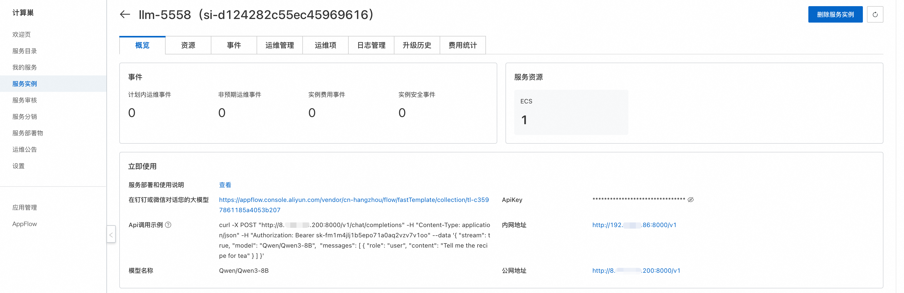

<div style="background: linear-gradient(135deg, #3b82f6, #2563eb); padding: 24px; border-radius: 8px; color: white; text-align: center; margin-bottom: 24px;">
<h1>🤖 Qwen3 大语言模型使用指南</h1>
</div>

## 📚 简介

Qwen3 是 Qwen 系列的最新一代大语言模型，提供密集（Dense）和混合专家（MOE）模型。它在多个方面取得了突破性进展：

<div style="background: #f8fafc; border: 1px solid #e2e8f0; border-radius: 8px; padding: 20px; margin: 16px 0;">

- 🔄 独特的思考模式切换
- 🧠 显著增强的推理能力
- 🎭 卓越的人类偏好对齐
- 🛠️ 强大的 Agent 能力
- 🌍 支持 100+ 种语言和方言

</div>

## 💻 部署配置

<table style="width: 100%; border-collapse: collapse; background: white; border-radius: 6px; overflow: hidden; box-shadow: 0 1px 3px rgba(0,0,0,0.1);">
  <thead>
    <tr style="background: #eff6ff;">
      <th style="padding: 12px; text-align: left; border-bottom: 1px solid #e2e8f0;">模型规模</th>
      <th style="padding: 12px; text-align: left; border-bottom: 1px solid #e2e8f0;">最低显存需求</th>
    </tr>
  </thead>
  <tbody>
    <tr>
      <td style="padding: 12px; border-bottom: 1px solid #e2e8f0;">0.6B, 1.7B, 4B, 8B</td>
      <td style="padding: 12px; border-bottom: 1px solid #e2e8f0;">24G</td>
    </tr>
    <tr>
      <td style="padding: 12px; border-bottom: 1px solid #e2e8f0;">14B</td>
      <td style="padding: 12px; border-bottom: 1px solid #e2e8f0;">48G</td>
    </tr>
    <tr>
      <td style="padding: 12px; border-bottom: 1px solid #e2e8f0;">30B, 32B</td>
      <td style="padding: 12px; border-bottom: 1px solid #e2e8f0;">96G</td>
    </tr>
    <tr>
      <td style="padding: 12px;">235B</td>
      <td style="padding: 12px;">8 * 96G</td>
    </tr>
  </tbody>
</table>

## 🚀 使用说明

完成模型部署后，您可以在计算巢服务实例概览页面查看模型使用方式：

<div style="text-align: center; margin: 20px 0;">
  
  <p style="margin-top: 8px; color: #64748b; font-size: 14px;">服务实例概览页面</p>
</div>

### API 调用

#### Curl 命令调用

<div style="background: #f8fafc; border: 1px solid #e2e8f0; border-radius: 8px; padding: 20px; margin: 16px 0;">

```shell
curl -X Post http://${ServerIP}:8000/v1/chat/completions \
  -H "Content-Type: application/json" \
  -H "Authorization: Bearer ${ApiKey}" \
  -d '{
    "model": "${ModelName}",
    "messages": [
      {
        "role": "user",
        "content": "给闺女写一份来自未来2035的信，同时告诉她要好好学习科技，做科技的主人，推动科技，经济发展；她现在是3年级"
      }
    ]
  }'
```

<p><strong>参数说明：</strong></p>
<ul>
  <li><code>${ServerIP}</code>: 内网地址或公网地址中的 IP</li>
  <li><code>${ApiKey}</code>: 页面提供的 ApiKey</li>
  <li><code>${ModelName}</code>: 模型名称</li>
</ul>
</div>

#### Python 调用

<div style="background: #f8fafc; border: 1px solid #e2e8f0; border-radius: 8px; padding: 20px; margin: 16px 0;">

```python
from openai import OpenAI

openai_api_key = "${ApiKey}"
openai_api_base = "${ServerUrl}"

client = OpenAI(
    api_key=openai_api_key,
    base_url=openai_api_base,
)

models = client.models.list()
model = models.data[0].id
print(model)

def main():
    stream = True
    chat_completion = client.chat.completions.create(
        messages=[
            {
                "role": "user",
                "content": [
                    {
                        "type": "text",
                        "text": "你好，介绍一下你自己，越详细越好。",
                    }
                ],
            }
        ],
        model=model,
        max_completion_tokens=1024,
        stream=stream,
    )

    if stream:
        for chunk in chat_completion:
            print(chunk.choices[0].delta.content, end="")
    else:
        result = chat_completion.choices[0].message.content
        print(result)

if __name__ == "__main__":
    main()
```

<p><strong>注意事项：</strong></p>
<ul>
  <li><code>${ApiKey}</code>: 填写页面上的 ApiKey</li>
  <li><code>${ServerUrl}</code>: 填写页面上的公网地址或内网地址，需要带上 <code>/v1</code></li>
</ul>
</div>

<div style="background: #eff6ff; border-left: 4px solid #2563eb; padding: 16px; margin: 16px 0; border-radius: 4px;">
<strong>💡 提示：</strong> 在使用 API 时，请确保正确填写所有必要参数，包括 ServerIP、ApiKey 和 ModelName。这些信息对于成功调用模型至关重要。
</div>