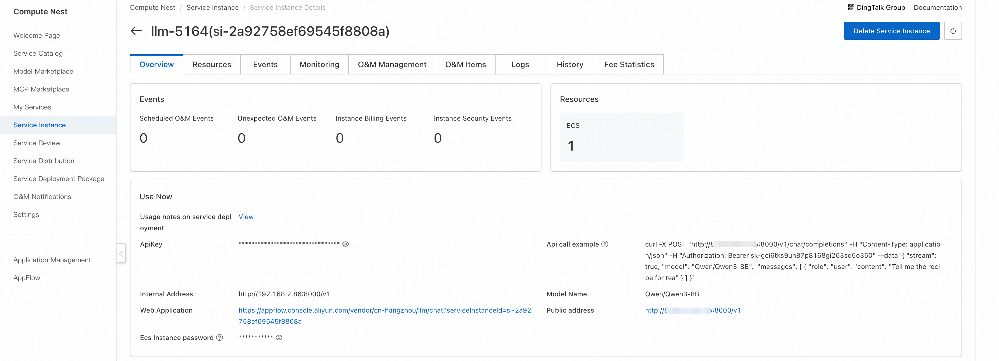

<div style="background: linear-gradient(135deg, #2563eb, #1e40af); padding: 24px; border-radius: 8px; color: white; text-align: center; margin-bottom: 24px;">
  <h2 style="margin: 0; color: white;">🧠 QwQ Reasoning Model</h2>
  <p style="margin: 8px 0 0 0; opacity: 0.9;">Qwen Series Professional Reasoning Model - Breakthrough in Thinking and Reasoning Capabilities</p>
</div>

## 🎯 Product Overview

<div style="background: #f8fafc; border: 1px solid #e2e8f0; border-radius: 8px; padding: 20px; margin: 16px 0;">

QwQ is a reasoning model in the Qwen series. Compared to traditional instruction-tuned models, QwQ with thinking and reasoning capabilities can significantly improve performance in downstream tasks, especially when solving difficult problems.

<div style="background: #eff6ff; border-left: 4px solid #2563eb; padding: 16px; margin: 16px 0; border-radius: 4px;">
  <strong>💡 Core Advantage</strong><br>
  Through the "Chain-of-Thought" mechanism, QwQ can perform step-by-step reasoning like humans, demonstrating excellence in complex problem solving.
</div>

</div>

## ✨ Core Features

<div style="display: grid; grid-template-columns: repeat(auto-fit, minmax(300px, 1fr)); gap: 16px; margin: 16px 0;">

<div style="background: #f0fdf4; border-left: 4px solid #059669; padding: 16px; border-radius: 4px;">
  <strong>📊 Mathematical Reasoning Capability</strong><br>
  Supports analysis and solving of mathematical problems including algebra, geometry, calculus, and can derive complex formulas step by step, providing strong support for mathematics education and research.
</div>

<div style="background: #eff6ff; border-left: 4px solid #2563eb; padding: 16px; border-radius: 4px;">
  <strong>💻 Code Generation and Understanding</strong><br>
  Can generate high-quality Python/Java/C++ code based on natural language descriptions, and supports code debugging and optimization, improving development efficiency.
</div>

<div style="background: #fef7ff; border-left: 4px solid #a855f7; padding: 16px; border-radius: 4px;">
  <strong>🔗 Multi-step Reasoning</strong><br>
  Through the "Chain-of-Thought" mechanism, solves complex problems step by step, such as step-by-step derivation of mathematical proofs, ensuring the reasoning process is clear and traceable.
</div>

<div style="background: #fff7ed; border-left: 4px solid #ea580c; padding: 16px; border-radius: 4px;">
  <strong>🎯 Reinforcement Learning Fine-tuning</strong><br>
  Optimizes reasoning accuracy through feedback mechanisms, performing exceptionally well in tasks requiring precise calculations, continuously improving model performance.
</div>

</div>

## 🚀 Application Scenarios

<div style="background: #f8fafc; border: 1px solid #e2e8f0; border-radius: 8px; padding: 20px; margin: 16px 0;">

<h3 style="margin-top: 0; color: #1e40af;">🎓 Education Field</h3>

<div style="display: grid; grid-template-columns: repeat(auto-fit, minmax(250px, 1fr)); gap: 16px; margin: 16px 0;">

<div style="background: #dcfce7; border-left: 4px solid #059669; padding: 16px; border-radius: 4px;">
  <strong>📐 Mathematics Teaching</strong><br>
  <div style="margin-top: 8px; color: #065f46;">
    • Step-by-step analysis of complex math problems<br>
    • Providing detailed derivation processes<br>
    • Supporting multiple solution method demonstrations
  </div>
</div>

<div style="background: #dbeafe; border-left: 4px solid #2563eb; padding: 16px; border-radius: 4px;">
  <strong>💡 Programming Education</strong><br>
  <div style="margin-top: 8px; color: #1e3a8a;">
    • Code logic analysis and explanation<br>
    • Detailed algorithm concept elaboration<br>
    • Programming error diagnosis and correction
  </div>
</div>

</div>

<h3 style="margin-top: 24px; color: #1e40af;">🏢 Professional Applications</h3>

<div style="display: grid; grid-template-columns: repeat(auto-fit, minmax(250px, 1fr)); gap: 16px; margin: 16px 0;">

<div style="background: #fef3c7; border-left: 4px solid #f59e0b; padding: 16px; border-radius: 4px;">
  <strong>🔬 Research Analysis</strong><br>
  <div style="margin-top: 8px; color: #92400e;">
    • Complex data analysis reasoning<br>
    • Experimental result logical verification<br>
    • Theoretical model construction support
  </div>
</div>

<div style="background: #f3e8ff; border-left: 4px solid #a855f7; padding: 16px; border-radius: 4px;">
  <strong>⚖️ Logical Reasoning</strong><br>
  <div style="margin-top: 8px; color: #6b21a8;">
    • Legal clause logical analysis<br>
    • Business decision reasoning support<br>
    • Complex problem decomposition and solving
  </div>
</div>

</div>

</div>

## 📖 User Guide

<div style="background: #eff6ff; border-left: 4px solid #2563eb; padding: 16px; margin: 16px 0; border-radius: 4px;">
  <strong>💡 Quick Start</strong><br>
  After completing the model deployment, you can view the model usage instructions on the Computing Nest service instance overview page, which provides API call examples, internal network access addresses, public network access addresses, and ApiKey.
</div>

<div style="background: #f8fafc; border: 1px solid #e2e8f0; border-radius: 8px; padding: 20px; margin: 16px 0;">
  <div style="text-align: center; margin-bottom: 16px;">
    
  </div>
</div>

### 🔌 API Call Methods

#### 🖥️ Curl Command Call

<div style="background: #f8fafc; border: 1px solid #e2e8f0; border-radius: 8px; padding: 20px; margin: 16px 0;">

<div style="text-align: center; margin-bottom: 16px;">
  
</div>

<div style="background: #eff6ff; border-left: 4px solid #2563eb; padding: 16px; margin: 16px 0; border-radius: 4px;">
  <strong>📋 Parameter Description</strong><br>
  • <code>${ServerIP}</code>: IP address from internal or public network address<br>
  • <code>${ApiKey}</code>: ApiKey provided on the page<br>
  • <code>${ModelName}</code>: Model name
</div>

Curl command calls can directly use the API call examples from the service instance overview page. The specific structure for calling the model API is as follows:

```bash
curl -X Post http://${ServerIP}:8000/v1/chat/completions \
  -H "Content-Type: application/json" \
  -H "Authorization: Bearer ${ApiKey}" \
  -d '{
    "model": "${ModelName}",
    "messages": [
      {
        "role": "user",
        "content": "Write a letter to my daughter from the future year 2035, telling her to study technology well, become the master of technology, and promote technological and economic development; she is currently in 3rd grade"
      }
    ]
  }'
```

</div>

#### 🐍 Python SDK Call

<div style="background: #f8fafc; border: 1px solid #e2e8f0; border-radius: 8px; padding: 20px; margin: 16px 0;">

<div style="background: #eff6ff; border-left: 4px solid #2563eb; padding: 16px; margin: 16px 0; border-radius: 4px;">
  <strong>⚙️ Configuration Instructions</strong><br>
  • <code>${ApiKey}</code>: Fill in the ApiKey from the page<br>
  • <code>${ServerUrl}</code>: Fill in the public or internal network address from the page, must include <code>/v1</code>
</div>

The following is Python example code:

```python
from openai import OpenAI

##### API Configuration #####
openai_api_key = "${ApiKey}"
openai_api_base = "${ServerUrl}"

client = OpenAI(
    api_key=openai_api_key,
    base_url=openai_api_base,
)

models = client.models.list()
model = models.data[0].id
print(model)


def main():
    stream = True

    chat_completion = client.chat.completions.create(
        messages=[
            {
                "role": "user",
                "content": [
                    {
                        "type": "text",
                        "text": "Hello, please introduce yourself in as much detail as possible.",
                    }
                ],
            }
        ],
        model=model,
        max_completion_tokens=1024,
        stream=stream,
    )

    if stream:
        for chunk in chat_completion:
            print(chunk.choices[0].delta.content, end="")
    else:
        result = chat_completion.choices[0].message.content
        print(result)


if __name__ == "__main__":
    main()
```

</div>

### 🌐 Web Application Access

<div style="background: #f8fafc; border: 1px solid #e2e8f0; border-radius: 8px; padding: 20px; margin: 16px 0;">

#### 📱 Access Steps

<div style="display: grid; grid-template-columns: repeat(auto-fit, minmax(250px, 1fr)); gap: 16px; margin: 16px 0;">

<div style="background: #eff6ff; border-left: 4px solid #2563eb; padding: 16px; border-radius: 4px;">
<h4 style="margin-top: 0; color: #1e40af;">🔗 Step 1: Get Access Link</h4>
<p style="margin: 0;">On the service instance overview page, click the link corresponding to the Web application to directly access the model service Web interface.</p>
</div>

<div style="background: #dcfce7; border-left: 4px solid #059669; padding: 16px; border-radius: 4px;">
<h4 style="margin-top: 0; color: #059669;">💬 Step 2: Start Conversation</h4>
<p style="margin: 0;">Enter your question in the input box on the model service Web page to start conversing with the large language model.</p>
</div>

</div>

#### 🖼️ Interface Display

<div style="text-align: center; margin: 20px 0;">
  
</div>

<div style="background: #eff6ff; border-left: 4px solid #2563eb; padding: 16px; margin: 16px 0; border-radius: 4px;">
  <strong>💡 Access Tips</strong><br>
  Find the link corresponding to the Web application on the service instance overview page and click it to directly access the model service Web interface.
</div>

<div style="text-align: center; margin: 20px 0;">
  
</div>

<div style="background: #dcfce7; border-left: 4px solid #059669; padding: 16px; margin: 16px 0; border-radius: 4px;">
  <strong>✅ Usage Instructions</strong><br>
  Enter your questions or requirements in the input box, and the system will respond in real-time and provide corresponding model services.
</div>

</div>

---

<div style="text-align: center; padding: 16px; background: #f8fafc; border-radius: 6px; margin-top: 24px;">
  <p style="margin: 0; color: #64748b; font-size: 14px;">
    🧠 <strong>QwQ Reasoning Model</strong> | Making AI Think and Reason Like Humans
  </p>
</div>