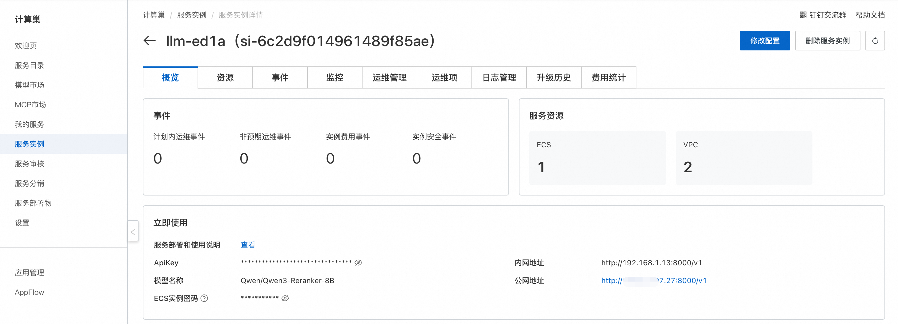

## 简介
Qwen3 嵌入模型系列是 Qwen 家族的最新专有模型，专门设计用于文本嵌入和排名任务。基于 Qwen3 系列的密集基础模型，它提供了各种大小（0.6B、4B 和 8B）的全面文本嵌入和重新排名模型。该系列继承了其基础模型出色的多语言能力、长文本理解和推理技能。Qwen3 嵌入系列在多个文本嵌入和排名任务中代表了显著的进步，包括文本检索、代码检索、文本分类、文本聚类和双语文本挖掘。

## 使用说明
在完成模型部署后，可以在计算巢服务实例概览页面看到模型的使用方式，里面提供了内网访问地址、公网访问地址和ApiKey，下面会分别介绍如何访问使用。



### API调用

#### Python调用
以下为 Python 示例代码： 其中${ApiKey}需要填写页面上的ApiKey；${ServerUrl}需要填写页面上的公网地址或内网地址，不需要带上/v1。
```python
import json

import requests

url = "${ServerUrl}/v1/rerank"
token = "${ApiKey}"
headers = {"Authorization": token}

prefix = '<|im_start|>system\nJudge whether the Document meets the requirements based on the Query and the Instruct provided. Note that the answer can only be "yes" or "no".<|im_end|>\n<|im_start|>user\n'
suffix = "<|im_end|>\n<|im_start|>assistant\n<think>\n\n</think>\n\n"

query_template = "{prefix}<Instruct>: {instruction}\n<Query>: {query}\n"
document_template = "<Document>: {doc}{suffix}"
instruction = "Given a web search query, retrieve relevant passages that answer the query"

data = {
    "model": "Qwen3-Reranker-8B",
    "query": query_template.format(prefix=prefix, instruction=instruction, query="中国首都是哪儿?"),
    "documents": [
        document_template.format(doc="中国首都是北京。", suffix=suffix),
        document_template.format(doc="美国首都是华盛顿。", suffix=suffix),
        document_template.format(doc="今天是星期五。", suffix=suffix)
    ],
}


def main():
    response = requests.post(url, headers=headers, json=data)

    # Check the response
    if response.status_code == 200:
        print("Request successful!")
        print(json.dumps(response.json(), indent=2))
    else:
        print(f"Request failed with status code: {response.status_code}")
        print(response.text)


if __name__ == "__main__":
    main()
```
