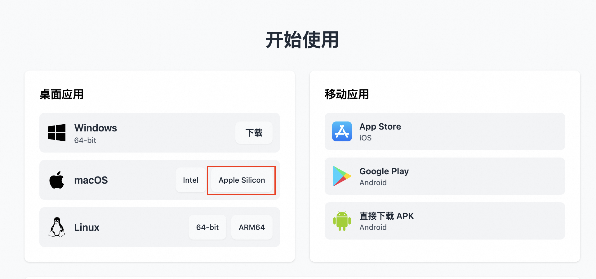

## 简介
Qwen3 是 Qwen 系列最新一代的大语言模型，提供了一系列密集（Dense）和混合专家(MOE）模型。基于广泛的训练，Qwen3 在推理、指令跟随、代理能力和多语言支持方面取得了突破性的进展，具有以下关键特性：

- 独特支持在思考模式（用于复杂逻辑推理、数学和编码）和 非思考模式（用于高效通用对话）之间无缝切换，确保在各种场景下的最佳性能。
- 显著增强的推理能力，在数学、代码生成和常识逻辑推理方面超越了之前的 QwQ （在思考模式下）和 Qwen2.5 指令模型（在非思考模式下）。
- 卓越的人类偏好对齐，在创意写作、角色扮演、多轮对话和指令跟随方面表现出色，提供更自然、更吸引人和更具沉浸感的对话体验。
- 擅长 Agent 能力，可以在思考和非思考模式下精确集成外部工具，在复杂的基于代理的任务中在开源模型中表现领先。
- 支持 100 多种语言和方言，具有强大的多语言理解、推理、指令跟随和生成能力。

## 部署配置
0.6B、1.7B、4B、8B 模型部署需要最低配置为 24G 显存

14B 模型部署需要最低配置为 48G 显存

30B、32B 模型部署需要最低配置为 96G 显存

235B 模型部署需要最低配置为 8* 96G 显存

## 使用说明
在完成模型部署后，可以在计算巢服务实例详情概览页面看到模型的使用方式，里面提供了Api调用示例、内网访问地址、公网访问地址（开启公网访问后会有）和Api_Key，下面会分别介绍如何访问使用。


### 私网API访问
在和部署服务器同一VPC内的ECS中调用概览页面中的Api调用示例，其中的${PrivateIP}要替换成内网IP,${API_KEY}替换成对应的Api_Key。
```shell
# 私网有认证请求，流式访问，若想关闭流式访问，删除stream即可。
curl http://{$PrivateIP}:8000/v1/chat/completions \
  -H "Content-Type: application/json" \
  -H "Authorization: Bearer ${API_KEY}" \
  -d '{
    "model": "ds",
    "messages": [
      {
        "role": "user",
        "content": "给闺女写一份来自未来2035的信，同时告诉她要好好学习科技，做科技的主人，推动科技，经济发展；她现在是3年级"
      }
    ],
    "max_tokens": 1024,
    "temperature": 0,
    "top_p": 0.9,
    "seed": 10,
    "stream": true
  }'
```

### 公网API访问
在开通公网访问权限的情况下，公网API访问和私网API访问一样，只是访问地址不同，具体参见下面的API调用示例，其中的${PublicIp}要替换成公网IP, ${API_KEY}替换成对应的Api_Key。
```shell
curl http://${PublicIp}:8000/v1/chat/completions \
  -H "Content-Type: application/json" \
  -H "Authorization: Bearer ${API_KEY}" \
  -d '{
    "model": "ds",
    "messages": [
      {
        "role": "user",
        "content": "给闺女写一份来自未来2035的信，同时告诉她要好好学习科技，做科技的主人，推动科技，经济发展；她现在是3年级"
      }
    ],
    "max_tokens": 1024,
    "temperature": 0,
    "top_p": 0.9,
    "seed": 10,
    "stream": true
  }'
```

### 使用 Chatbox 客户端配置 vLLM API 进行对话
在开通公网访问权限的情况下，除了使用Curl命令进行API调用，还可以使用Chatbox客户端进行对话，具体操作步骤如下：
1. 访问 Chatbox [下载地址](https://chatboxai.app/zh#download)下载并安装客户端，本方案以 macOS M3 为例。



2. 运行并配置 vLLM API ，单击设置。


3. 在弹出的看板中按照如下表格进行配置。

| 项目     | 说明               | 示例值                       |
|--------|------------------|---------------------------|
| 模型提供方  | 下拉选择模型提供方。       | 添加自定义提供方                  |
| 名称     | 填写定义模型提供方名称。     | vLLM API                  |
| API 域名 | 填写模型服务调用地址。      | http://<公网IP>:8000        |
| API 路径 | 填写 API 路径。       | /v1/chat/completions      |
| 网络兼容性  | 点击开启改善网络兼容性      | 开启                        |
| API 密钥 | 填写模型服务调用 API 密钥。 | 部署服务实例后，在服务实例页面可获取Api_Key |
| 模型     | 填写调用的模型。         | Qwen/QwQ-32B              |

4. 保存配置。在文本输入框中可以进行对话交互。输入问题你是谁？或者其他指令后，调用模型服务获得相应的响应。


