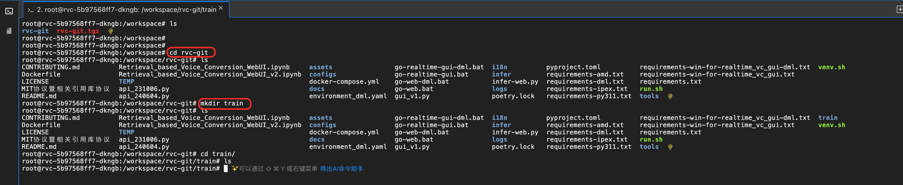
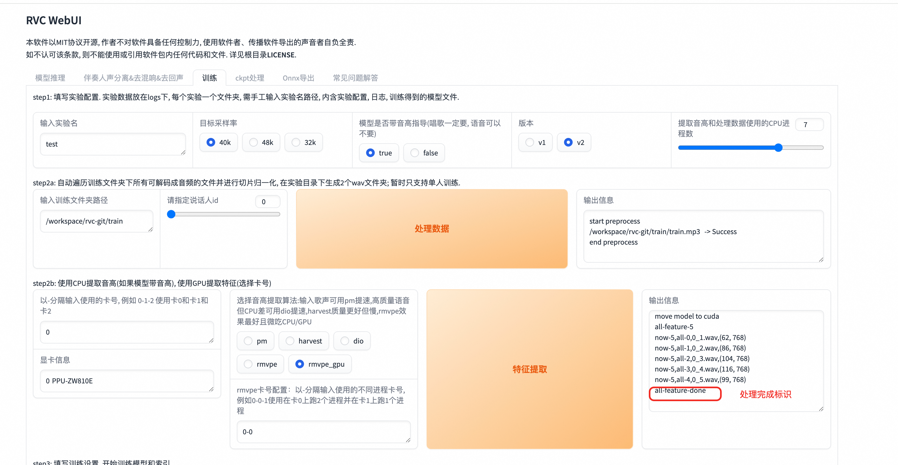
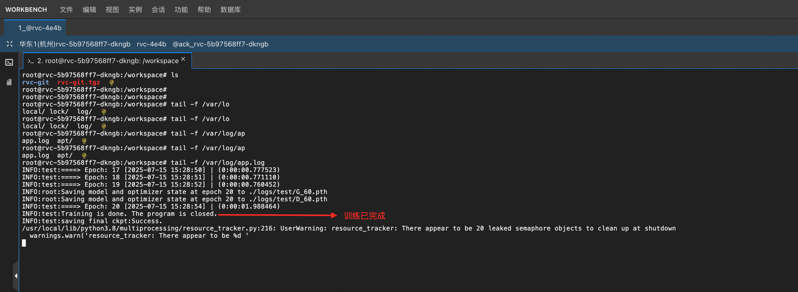
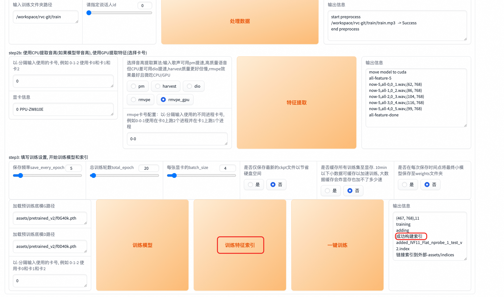

  <h2 style="margin: 0; color: white;">🎤 RVC Voice Cloning Technology Guide</h2>
  
Professional Voice Synthesis and Conversion Solution Based on Deep Learning

## 🔬 Technical Overview

**RVC Voice Cloning Technology** (Retrieval-based-Voice-Conversion-WebUI) is a voice synthesis technology based on deep learning. Its core principle lies in training deep learning models to learn and match the input voice samples with the target speaker's voice characteristics. Subsequently, this model is used to synthesize speech for new text, making the synthesized voice sound like the target speaker.

  <strong>🎯 Workflow</strong> 
  Voice Sample Training → Feature Learning & Matching → Model Generation → New Audio Inference → Voice Cloning Complete

## 🚀 Quick Start

### 📍 Service Access

After completing model deployment, you can see the model usage instructions on the service instance overview page. The public network address opens the corresponding Web page.

  

  <strong>💡 Usage Process</strong> 
  RVC requires training with prepared voice samples first. After training to obtain the corresponding model, inference is performed on the audio to be processed, which can convert the target audio to the voice used in training, achieving voice conversion effects.

## 🎓 Training Tutorial

### Step 1: Enter Training Page

Click the public network address in the service instance details to enter the RVC Web page, first go to the training page.

  

### Step 2: Configure Training Parameters

Configure training-related settings, mainly setting the experiment name and training folder. Note that the folder here refers to the corresponding directory in the container Pod.

  

  <strong>⚠️ Important Note</strong> 
  The folder path must point to the actual directory within the container Pod, ensure path accuracy

### Step 3: Upload Voice Samples

Upload the voice samples to be trained to the set training folder:

#### 3.1 Connect to Container Pod
In the service instance, click "Resources" → "Container Pod Resources", find the rvc corresponding Pod, click "Remote Connection".

  

#### 3.2 Create Training Directory
Create a train directory under /workspace/rvc-git directory inside the Pod as the training folder.

  

#### 3.3 Upload Voice Files
Upload prepared voice samples to the train directory through the file tree interface.

  

    
  

  

    
  

  

### Step 4: Data Processing

After uploading voice samples, click "Process Data" to perform data processing. The output information will show processing progress.

  

### Step 5: Feature Extraction

Click "Feature Extraction" to perform feature extraction. The output information will show feature extraction progress.

  

### Step 6: Model Training

Click "Train Model" to perform model training.

  <strong>⚠️ Important Notes</strong> 
  An Error message may appear here, but it's actually a false alarm - training is still proceeding normally. Training progress can be monitored by executing <code>tail -f /var/logs/app.log</code> command in the Pod.

  

    
  

  

    
  

### Step 7: Build Feature Index

After training completion, click "Train Feature Index". When you see successful index construction, the training is complete.

  

  <strong>✅ Training Complete</strong> 
  Successful index construction indicates model training is complete and inference operations can be performed

## 🎯 Inference Tutorial

After training completion, we can perform inference on the voice we want to convert:

### Step 1: Load Trained Model

Return to the model inference page on the RVC web interface, click "Refresh Voice List and Index Path" to load the just-trained model.

  

### Step 2: Configure Inference Parameters

Select our just-trained model and set the path for the audio file to be processed.

  

  <strong>💡 Path Setting Instructions</strong> 
  • <strong>Single Inference</strong>: Path should point to specific filename 
  • <strong>Batch Inference</strong>: Set to directory 
  • Files need to be uploaded to Pod container first (refer to training step 3)

### Step 3: Execute Voice Conversion

Click convert to start voice conversion on the target audio. After conversion completion, the output audio can be played directly or downloaded.

  

  <strong>⚠️ Important Notes</strong> 
  The conversion process may fail, simply retry if it fails. It's recommended to operate in a stable network environment.

## 📋 Key Points Summary

<h3 style="margin-top: 0; color: #059669;">✅ Success Factors</h3>
<ul style="margin: 0; padding-left: 20px; color: #065f46;">
  <li><strong>High-quality voice samples</strong>: Clear, noise-free</li>
  <li><strong>Sufficient training data</strong>: Recommended 10-30 minutes of audio</li>
  <li><strong>Correct path configuration</strong>: Ensure file path accuracy</li>
  <li><strong>Patient training wait</strong>: Long training time is normal</li>
</ul>

<h3 style="margin-top: 0; color: #dc2626;">❌ Common Issues</h3>
<ul style="margin: 0; padding-left: 20px; color: #991b1b;">
  <li>Incorrect file paths causing file not found</li>
  <li>Poor voice sample quality affecting results</li>
  <li>Insufficient training time preventing model convergence</li>
  <li>Unstable network causing operation failures</li>
</ul>

---

  

    🎤 <strong>RVC Voice Cloning Technology</strong> | Making Every Voice Perfectly Replicable
  

