

  <h2 style="margin: 0; color: white;">🎤 RVC声音克隆技术指南</h2>
  
基于深度学习的专业声音合成与变声解决方案

## 🔬 技术简介

**RVC声音克隆技术**（Retrieval-based-Voice-Conversion-WebUI）是一种基于深度学习的声音合成技术。其核心原理在于通过深度学习模型训练，将输入的语音样本与目标说话者的语音特征进行学习和匹配。随后，利用这个模型对新的文本进行语音合成，使得合成的语音听起来就像目标说话者一样。

  <strong>🎯 工作流程</strong> 
  语音样本训练 → 特征学习匹配 → 模型生成 → 新音频推理 → 声音克隆完成

## 🚀 快速开始

### 📍 访问服务

在完成模型部署后，可以在计算巢服务实例概览页面看到模型的使用方式，这里的公网地址打开就是对应的Web页面。

  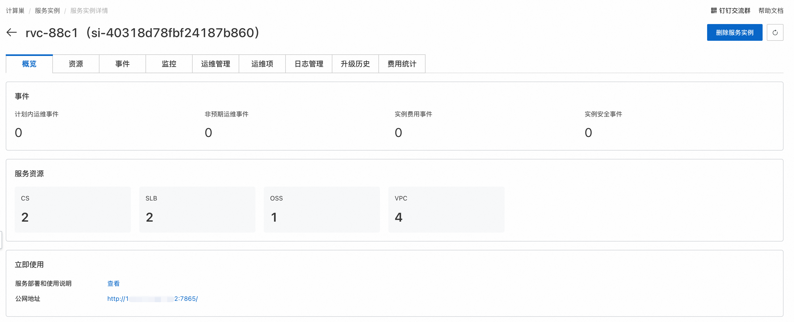

  <strong>💡 使用流程</strong> 
  RVC的使用要先用准备好的语音样本进行训练，训练获取对应的模型后，再对待处理音频进行推理，就可以将待处理音频转换为训练所用的语声，达到变声的效果。

## 🎓 训练教程

### 步骤 1：进入训练页面

点击服务实例详情中的公网地址，即可进入到RVC Web页面，首先进到训练页面。

  

### 步骤 2：配置训练参数

进行训练相关的配置，主要要设置实验名称，训练文件夹，注意这里的文件夹为容器Pod里对应的目录。

  

  <strong>⚠️ 重要提示</strong> 
  文件夹路径必须指向容器Pod内的实际目录，确保路径正确性

### 步骤 3：上传语音样本

将要训练的语音样本上传到设置的训练文件夹中：

#### 3.1 连接到容器Pod
在计算巢服务实例中，点击《资源》→《容器Pod资源》，找到rvc对应的Pod，点击《远程连接》。

  

#### 3.2 创建训练目录
在Pod内部/workspace/rvc-git目录下创建train目录，作为训练文件夹。

  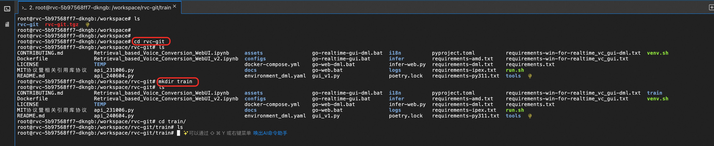

#### 3.3 上传语音文件
通过文件树界面上传准备好的语音样本到train目录。

  

    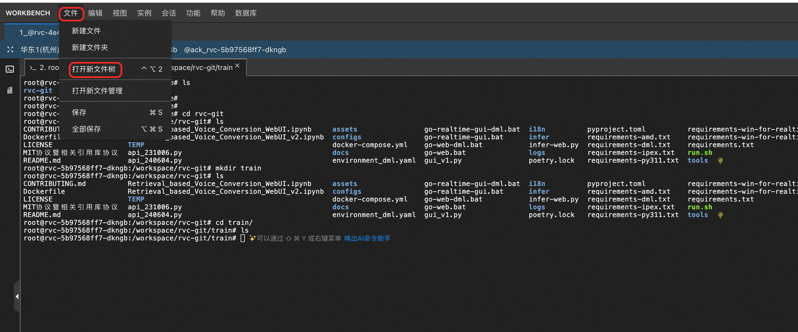
  

  

    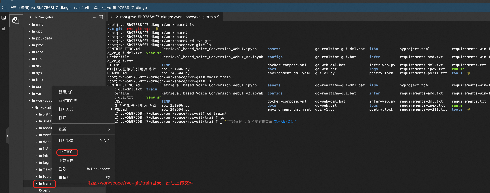
  

  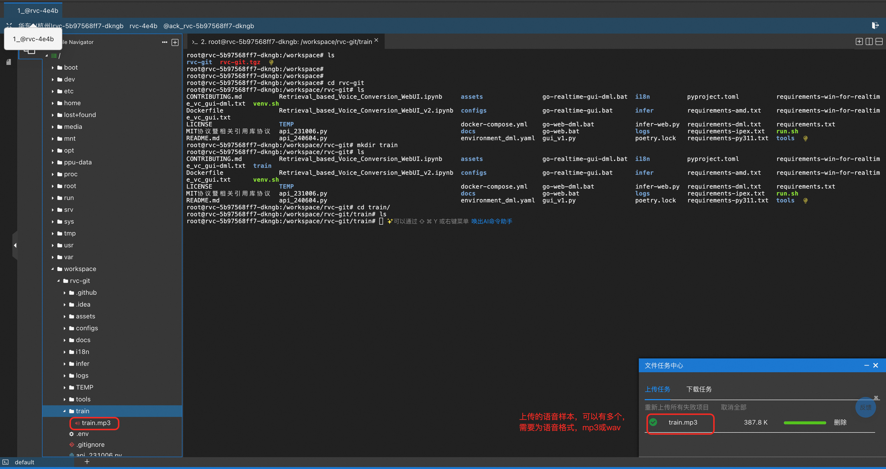

### 步骤 4：数据处理

语音样本上传完成后，点击《处理数据》进行数据处理，输出信息会提示处理进度。

  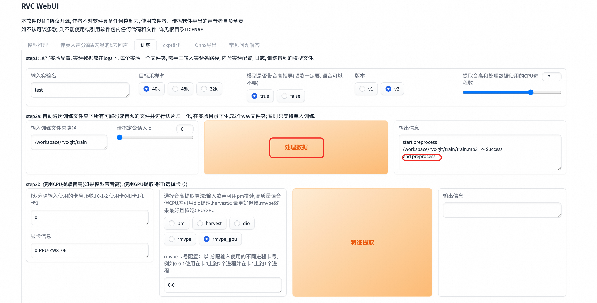

### 步骤 5：特征提取

点击《特征提取》进行特征提取，输出信息会提示特征提取进度。

  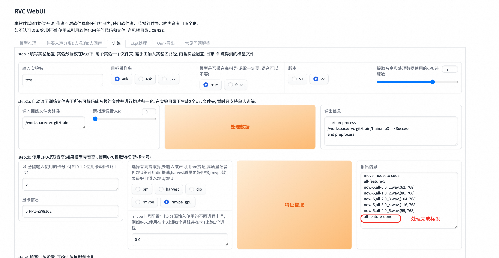

### 步骤 6：模型训练

点击《训练模型》进行模型训练。

  <strong>⚠️ 注意事项</strong> 
  这里会提示Error，但实际上是误报，训练还是在正常进行。训练进度可以在Pod中执行 <code>tail -f /var/logs/app.log</code> 命令查看。

  

    
  

  

    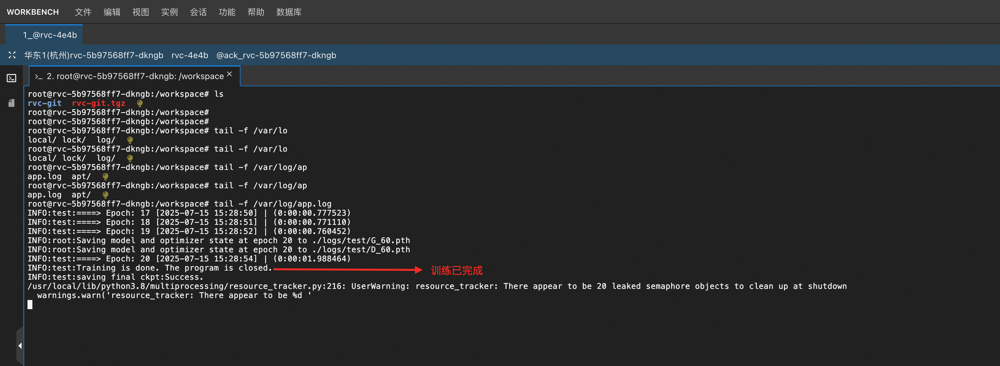
  

### 步骤 7：构建特征索引

训练完成后，点击《训练特征索引》，看到成功构建索引，就是训练成功了。

  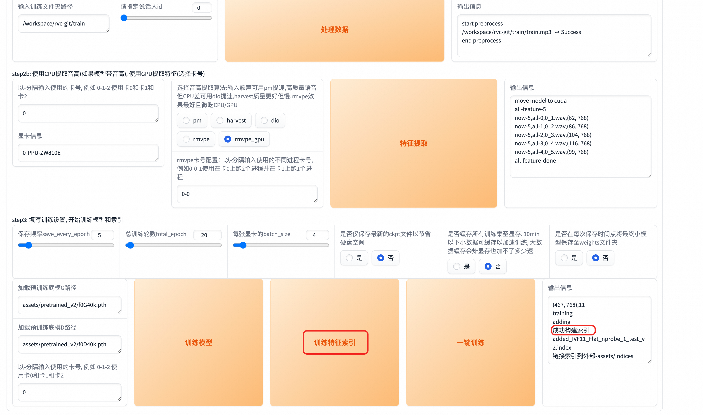

  <strong>✅ 训练完成</strong> 
  成功构建索引表示模型训练完成，可以进行推理操作

## 🎯 推理教程

训练完成后，我们就可以对我们想要变声的语音进行推理了：

### 步骤 1：加载训练模型

RVC web页面回到模型推理页面，点击《刷新音色列表和索引路径》，去加载刚才训练完成的模型。

  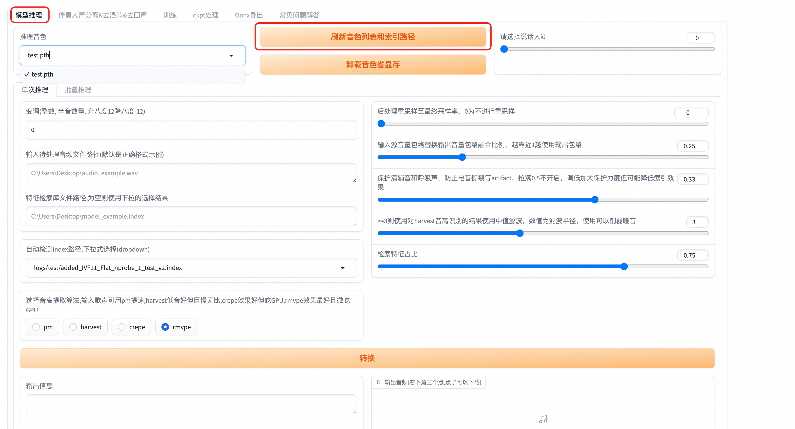

### 步骤 2：配置推理参数

选择我们刚训练好的模型，设置待处理音频文件路径。

  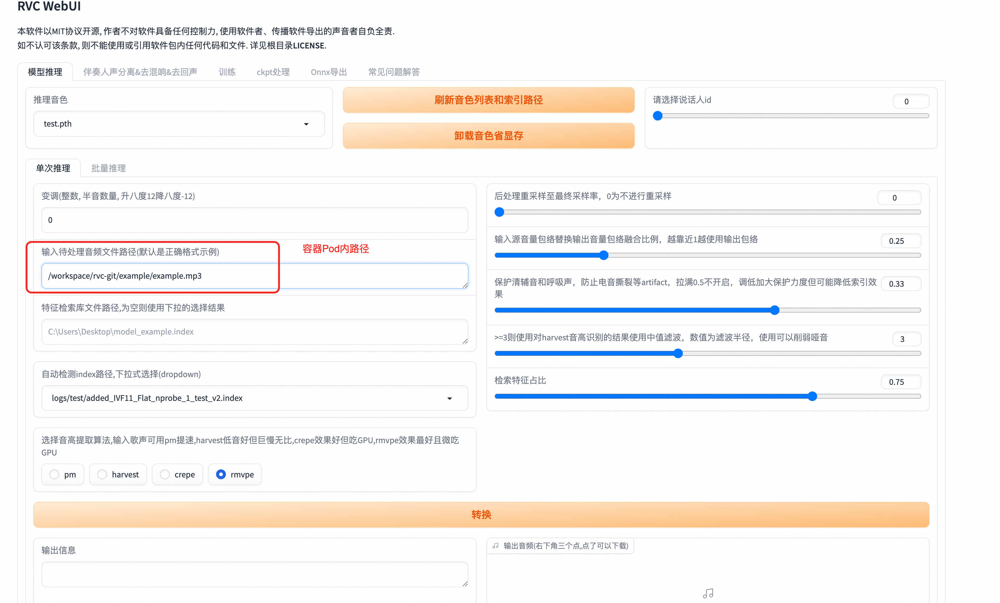

  <strong>💡 路径设置说明</strong> 
  • <strong>单次推理</strong>：路径要到具体文件名称 
  • <strong>批量推理</strong>：设置到目录即可 
  • 文件需要先上传到Pod容器中（参考训练步骤3）

### 步骤 3：执行声音转换

点击转换，开始将待处理的音频进行变声，变声完成后，输出音频可以直接播放或下载。

  

  <strong>⚠️ 注意事项</strong> 
  转换过程可能会失败，失败后重试即可。建议在网络稳定的环境下进行操作。

## 📋 操作要点总结

<h3 style="margin-top: 0; color: #059669;">✅ 成功要素</h3>
<ul style="margin: 0; padding-left: 20px; color: #065f46;">
  <li><strong>高质量语音样本</strong>：清晰、无噪音</li>
  <li><strong>充足的训练数据</strong>：建议10-30分钟音频</li>
  <li><strong>正确的路径配置</strong>：确保文件路径准确</li>
  <li><strong>耐心等待训练</strong>：训练时间较长属正常</li>
</ul>

<h3 style="margin-top: 0; color: #dc2626;">❌ 常见问题</h3>
<ul style="margin: 0; padding-left: 20px; color: #991b1b;">
  <li>文件路径错误导致找不到文件</li>
  <li>语音样本质量差影响效果</li>
  <li>训练时间不足模型未收敛</li>
  <li>网络不稳定导致操作失败</li>
</ul>

---

  

    🎤 <strong>RVC声音克隆技术</strong> | 让每个声音都能被完美复制
  

