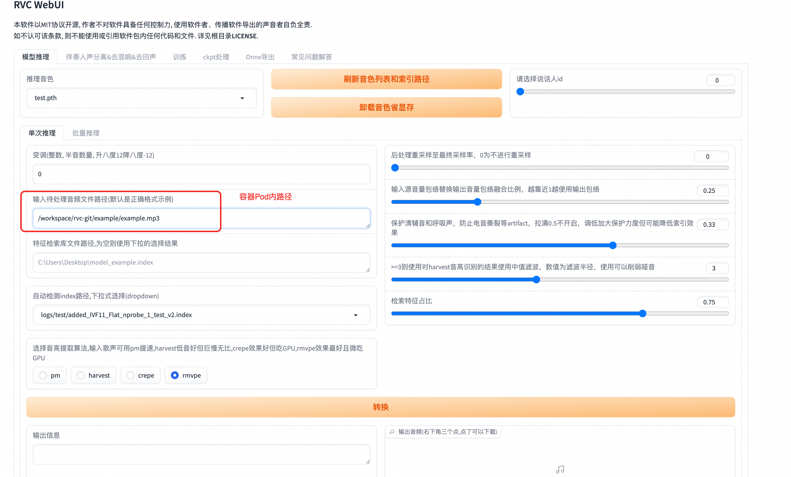
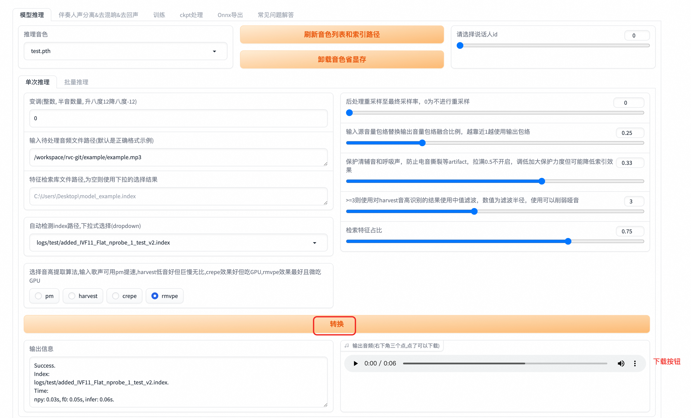

## 简介
RVC声音克隆技术（Retrieval-based-Voice-Conversion-WebUI）是一种基于深度学习的声音合成技术。 其核心原理在于通过深度学习模型训练，
将输入的语音样本与目标说话者的语音特征进行学习和匹配。 随后，利用这个模型对新的文本进行语音合成，使得合成的语音听起来就像目标说话者一样。

## 使用说明
在完成模型部署后，可以在计算巢服务实例概览页面看到模型的使用方式，这里的公网地址打开就是对应的Web页面。

RVC的使用要先用准备好的语音样本进行训练，训练获取对应的模型后，再对待处理音频进行推理，就可以将待处理音频转换为训练所用的语声，达到变声的效果。

### 训练教程
1. 点击服务实例详情中的公网地址，即可进入到RVC Web页面，首先进到训练页面。

2. 这里先要进行训练相关的配置，主要要设置实验名称，训练文件夹，注意这里的文件夹为容器Pod里对应的目录，具体如下所示。

3. 将要训练的语音样本上传到我们上面设置的训练文件夹中，下面给出具体过程。
    - 在计算巢服务实例中，点击《资源》，然后点击《容器Pod资源》，可以找到rvc对应的Pod，点击《远程连接》。

   

    - 点击《远程连接》后，可以进到Pod内部，在Pod内部/workspace/rvc-git目录下创建一个train目录，作为训练文件夹。

   

    - 将准备好的语音样本上传到train目录中，这里先点击控制台上的文件打开文件树，然后找到train目录，就可以把事先准备好的语音样本进行上传了。

   

   

   
4. 语音样本上传完成后，就可以开始进行训练了，首先进行数据处理，点击《处理数据》进行数据处理，输出信息会提示处理进度。

5. 点击《特征提取》进行特征提取，输出信息会提示特征提取进度。

6. 点击《训练模型》进行模型训练，这里会提示Error，但实际上是误报，训练还是在正常进行，
   训练进度可以在步骤3中的Pod中执行 tail -f /var/logs/app.log 命令查看训练进度。

7. 训练完成后，点击《训练特征索引》，看到成功构建索引，就是训练成功了。

### 推理教程
训练完成后，我们就可以对我们想要变声的语音进行推理了，具体步骤如下：
1. RVC web页面回到模型推理页面，点击《刷新音色列表和索引路径》，去加载刚才训练完成的模型。

2. 选择我们刚训练好的模型，设置待处理音频文件路径，这里需要注意的是，单次推理对应的路径要到文件名称，
   多次推理设置到目录即可，这里我们设置待处理音频的路径，和训练过程一样，文件要先上传到Pod容器中，具体见
   训练过程中的步骤3。

3. 点击转换，就会开始将待处理的音频进行变声，变声完成后，输出音频会有对应的音频，可以直接播放，也可以进行下载。
   这个过程可能会失败，失败后重试即可。

