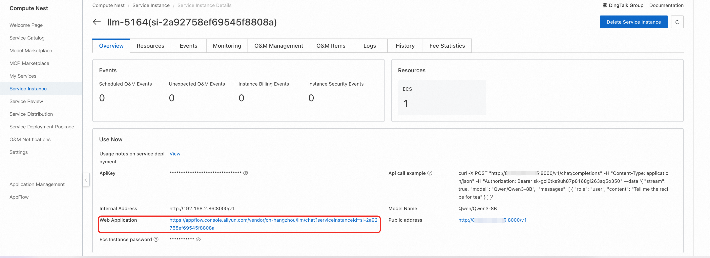

## 📖 User Guide

<div style="background: #eff6ff; border-left: 4px solid #2563eb; padding: 16px; margin: 16px 0; border-radius: 4px;">
  <strong>💡 After Deployment</strong><br>
  After completing the model deployment, you can view the model usage instructions on the Computing Nest service instance overview page, which provides API call examples, internal network access addresses, public network access addresses (available after enabling public network access), and Api_Key.
</div>

<div style="background: #f8fafc; border: 1px solid #e2e8f0; border-radius: 8px; padding: 20px; margin: 16px 0;">
  <div style="text-align: center; margin-bottom: 16px;">
    
  </div>
</div>

### 🔌 API Call Methods

#### 🖥️ Curl Command Call

<div style="background: #f8fafc; border: 1px solid #e2e8f0; border-radius: 8px; padding: 20px; margin: 16px 0;">

<div style="text-align: center; margin-bottom: 16px;">
  
</div>

<div style="background: #eff6ff; border-left: 4px solid #2563eb; padding: 16px; margin: 16px 0; border-radius: 4px;">
  <strong>📋 Parameter Description</strong><br>
  • <code>${ServerIP}</code>: IP address from internal or public network address<br>
  • <code>${ApiKey}</code>: ApiKey provided on the page<br>
  • <code>${ModelName}</code>: Model name
</div>

<div style="background: #f0fdf4; border-left: 4px solid #059669; padding: 16px; margin: 16px 0; border-radius: 4px;">
  <strong>🖼️ Image Format Support</strong><br>
  The <code>image_url</code> parameter supports two formats:<br>
  • <strong>HTTP URL</strong>: e.g., <code>https://modelscope.oss-cn-beijing.aliyuncs.com/resource/qwen.png</code><br>
  • <strong>Base64 Encoding</strong>: <code>data:image/jpeg;base64,&lt;base64 encoded image format&gt;</code>
</div>

Curl command calls can directly use the API call examples from the service instance overview page. The specific structure for calling the model API is as follows:

```bash
curl -X Post http://${ServerIP}:8000/v1/chat/completions \
    -H "Content-Type: application/json" \
    -H "Authorization: ${ApiKey}" \
    -d '{
        "model": "${ModelName}",
        "messages": [
        {
            "role": "system",
            "content": "You are a helpful assistant."
        },
        {
            "role": "user",
            "content": [
                {
                    "type": "image_url",
                    "image_url": {
                        "url": "data:image/jpeg;base64,<base64 encoded image format>"
                    }
                },
                {
                    "type": "text",
                    "text": "How many sheep are there in the picture?"
                }
            ]
        }
        ]
    }'
```

</div>

#### 🐍 Python SDK Call

<div style="background: #f8fafc; border: 1px solid #e2e8f0; border-radius: 8px; padding: 20px; margin: 16px 0;">

<div style="background: #eff6ff; border-left: 4px solid #2563eb; padding: 16px; margin: 16px 0; border-radius: 4px;">
  <strong>⚙️ Configuration Instructions</strong><br>
  • <code>${ApiKey}</code>: Fill in the ApiKey from the page<br>
  • <code>${ServerUrl}</code>: Fill in the public or internal network address from the page, must include <code>/v1</code>
</div>

The following is Python example code that supports image and video processing:

```python
import base64
import requests
from openai import OpenAI

##### API Configuration #####
openai_api_key = "${ApiKey}"
openai_api_base = "${ServerUrl}"

client = OpenAI(
    api_key=openai_api_key,
    base_url=openai_api_base,
)

models = client.models.list()
model = models.data[0].id


def encode_base64_content_from_url(content_url: str) -> str:
    """Encode a content retrieved from a remote url to base64 format."""
    
    with requests.get(content_url) as response:
        response.raise_for_status()
        result = base64.b64encode(response.content).decode("utf-8")
    
    return result


def infer_image():
    image_url = "https://qianwen-res.oss-cn-beijing.aliyuncs.com/QVQ/demo.png"
    
    stream = True
    
    image_base64 = encode_base64_content_from_url(image_url)
    
    chat_completion_from_base64 = client.chat.completions.create(
        messages=[
            {
                "role": "user",
                "content": [
                    {
                        "type": "text",
                        "text": "Answer in Chinese, what number should be in the box in the image?",
                    },
                    {
                        "type": "image_url",
                        "image_url": {"url": f"data:image/jpeg;base64,{image_base64}"},
                    },
                ],
            }
        ],
        model=model,
        max_completion_tokens=1024,
        stream=stream,
    )
    
    if stream:
        for chunk in chat_completion_from_base64:
            print(chunk.choices[0].delta.content, end="")
    else:
        result = chat_completion_from_base64.choices[0].message.content
        print(result)


def infer_video():
    video_url = "https://pai-quickstart-predeploy-hangzhou.oss-cn-hangzhou.aliyuncs.com/modelscope/algorithms/ms-swift/video_demo.mp4"
    
    stream = True
    
    video_base64 = encode_base64_content_from_url(video_url)
    
    chat_completion_from_base64 = client.chat.completions.create(
        messages=[
            {
                "role": "user",
                "content": [
                    {"type": "text", "text": "Please describe the video content"},
                    {
                        "type": "video_url",
                        "video_url": {"url": f"data:video/mp4;base64,{video_base64}"},
                    },
                ],
            }
        ],
        model=model,
        max_completion_tokens=512,
        stream=stream,
    )
    
    if stream:
        for chunk in chat_completion_from_base64:
            print(chunk.choices[0].delta.content, end="")
    else:
        result = chat_completion_from_base64.choices[0].message.content
        print(result)


if __name__ == "__main__":
    infer_image()
    infer_video()
```

</div>

### 🌐 Web Application Access

<div style="background: #f8fafc; border: 1px solid #e2e8f0; border-radius: 8px; padding: 20px; margin: 16px 0;">

#### 📱 Access Steps

<div style="display: grid; grid-template-columns: repeat(auto-fit, minmax(250px, 1fr)); gap: 16px; margin: 16px 0;">

<div style="background: #eff6ff; border-left: 4px solid #2563eb; padding: 16px; border-radius: 4px;">
<h4 style="margin-top: 0; color: #1e40af;">🔗 Step 1: Get Access Link</h4>
<p style="margin: 0;">On the service instance overview page, click the link corresponding to the Web application to directly access the model service Web interface.</p>
</div>

<div style="background: #dcfce7; border-left: 4px solid #059669; padding: 16px; border-radius: 4px;">
<h4 style="margin-top: 0; color: #059669;">💬 Step 2: Start Conversation</h4>
<p style="margin: 0;">Enter your question in the input box on the model service Web page to start conversing with the large language model.</p>
</div>

</div>

#### 🖼️ Interface Display

<div style="text-align: center; margin: 20px 0;">
  
</div>

<div style="background: #eff6ff; border-left: 4px solid #2563eb; padding: 16px; margin: 16px 0; border-radius: 4px;">
  <strong>💡 Access Tips</strong><br>
  Find the link corresponding to the Web application on the service instance overview page and click it to directly access the model service Web interface.
</div>

<div style="text-align: center; margin: 20px 0;">
  
</div>

<div style="background: #dcfce7; border-left: 4px solid #059669; padding: 16px; margin: 16px 0; border-radius: 4px;">
  <strong>✅ Usage Instructions</strong><br>
  Enter your questions or requirements in the input box, and the system will respond in real-time and provide corresponding model services.
</div>

</div>