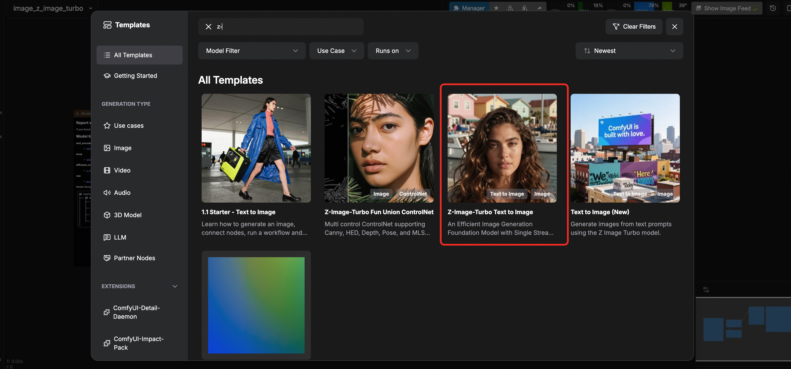
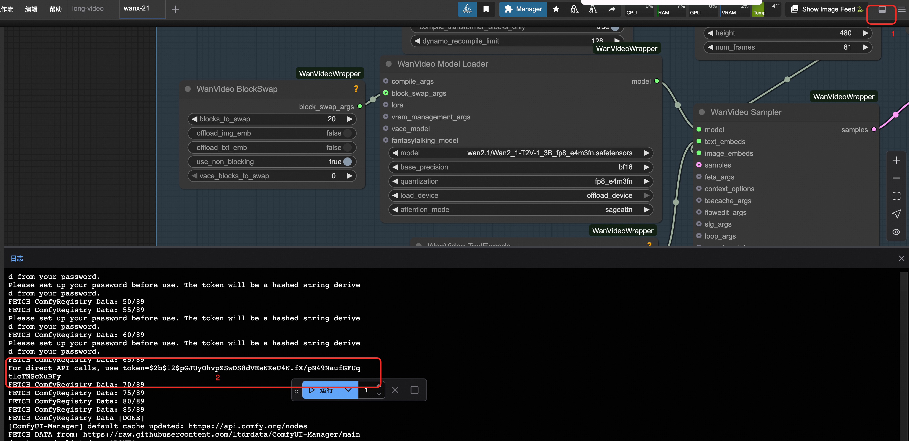

  <h2 style="margin: 0; color: white;">⚡️ Z-Image-Turbo</h2>
  
Efficient Image Generation Model | Sub-second Inference Latency

✨ Model Overview

Z-Image-Turbo is a distilled version of Z-Image that matches or exceeds leading competitors with only 8 NFEs (Number of Function Evaluations). It achieves ⚡️sub-second inference latency⚡️ on enterprise-grade H800 GPUs and runs smoothly on 16GB VRAM consumer devices.

  

    <strong style="color: #1e40af;">📸 Photorealistic Quality</strong> 
    Powerful photorealistic image generation
  

  

    <strong style="color: #1e40af;">📖 Bilingual Text Rendering</strong> 
    Accurate Chinese & English text rendering
  

  

    <strong style="color: #1e40af;">💡 Prompt Enhancement</strong> 
    Reasoning-capable prompt enhancer
  

  

    <strong style="color: #1e40af;">⚡ Fast Inference</strong> 
    Sub-second generation speed
  

🚀 Quick Start

🎨 ComfyUI Workflow

💻 Python API Example

🔑 Authentication

<h4 style="color: #ea580c; margin: 0 0 8px 0;">🔐 Get Token</h4>

Click the settings button in the upper right corner and open the bottom panel to get the API Token

🐍 Click to expand complete Python API code

import requests
import json
import uuid
import time
import random

🔧 Configuration - Z-Image-Turbo
COMFYUISERVER = "127.0.0.1:8188"  Local server
COMFYUITOKEN = ""  
UNETMODEL = "zimageturbobf16.safetensors"
CLIPMODEL = "qwen34b.safetensors"
VAEMODEL = "ae.safetensors"

🎯 Preset parameters
PROMPT = "Latina female with thick wavy hair, harbor boats and pastel houses behind. Breezy seaside light, warm tones, cinematic close-up."
STYLEPREFIX = "Pixel art style,"  Optional style prefix

class ComfyUIZImageClient:
def init(self, server=COMFYUISERVER, token=COMFYUITOKEN):
self.baseurl = f"http://{server}"
self.token = token
self.clientid = str(uuid.uuid4())
self.headers = {"Content-Type": "application/json"}
if token:
self.headers["Authorization"] = f"Bearer {token}"

    def generateimage(self, prompt, styleprefix="", width=1024, height=1024, steps=4, cfg=1, seed=None):
        """🎨 Z-Image-Turbo text-to-image generation"""
        print("🎨 Starting Z-Image-Turbo text-to-image task...")
        
        if seed is None:
            seed = random.randint(0, 232 - 1)
        
        Build workflow based on provided template
        workflow = {
            "9": {
                "inputs": {
                    "filenameprefix": "z-image",
                    "images": ["57:8", 0]
                },
                "classtype": "SaveImage",
                "meta": {"title": "Save Image"}
            },
            "58": {
                "inputs": {
                    "value": prompt
                },
                "classtype": "PrimitiveStringMultiline",
                "meta": {"title": "Prompt"}
            },
            "61": {
                "inputs": {
                    "stringa": styleprefix,
                    "stringb": ["58", 0],
                    "delimiter": ""
                },
                "classtype": "StringConcatenate",
                "meta": {"title": "Concatenate"}
            },
            "57:30": {
                "inputs": {
                    "clipname": CLIPMODEL,
                    "type": "lumina2",
                    "device": "default"
                },
                "classtype": "CLIPLoader",
                "meta": {"title": "Load CLIP"}
            },
            "57:29": {
                "inputs": {
                    "vaename": VAEMODEL
                },
                "classtype": "VAELoader",
                "meta": {"title": "Load VAE"}
            },
            "57:33": {
                "inputs": {
                    "conditioning": ["57:27", 0]
                },
                "classtype": "ConditioningZeroOut",
                "meta": {"title": "ConditioningZeroOut"}
            },
            "57:8": {
                "inputs": {
                    "samples": ["57:3", 0],
                    "vae": ["57:29", 0]
                },
                "classtype": "VAEDecode",
                "meta": {"title": "VAE Decode"}
            },
            "57:28": {
                "inputs": {
                    "unetname": UNETMODEL,
                    "weightdtype": "default"
                },
                "classtype": "UNETLoader",
                "meta": {"title": "Load Diffusion Model"}
            },
            "57:27": {
                "inputs": {
                    "text": ["58", 0],
                    "clip": ["57:30", 0]
                },
                "classtype": "CLIPTextEncode",
                "meta": {"title": "CLIP Text Encode (Prompt)"}
            },
            "57:13": {
                "inputs": {
                    "width": width,
                    "height": height,
                    "batchsize": 1
                },
                "classtype": "EmptySD3LatentImage",
                "meta": {"title": "EmptySD3LatentImage"}
            },
            "57:3": {
                "inputs": {
                    "seed": seed,
                    "steps": steps,
                    "cfg": cfg,
                    "samplername": "resmultistep",
                    "scheduler": "simple",
                    "denoise": 1,
                    "model": ["57:11", 0],
                    "positive": ["57:27", 0],
                    "negative": ["57:33", 0],
                    "latentimage": ["57:13", 0]
                },
                "classtype": "KSampler",
                "meta": {"title": "KSampler"}
            },
            "57:11": {
                "inputs": {
                    "shift": 3,
                    "model": ["57:28", 0]
                },
                "classtype": "ModelSamplingAuraFlow",
                "meta": {"title": "ModelSamplingAuraFlow"}
            }
        }

        print("📤 Submitting Z-Image-Turbo workflow...")
        response = requests.post(
            f"{self.baseurl}/prompt",
            headers=self.headers,
            json={"prompt": workflow, "clientid": self.clientid}
        )
        print(f"API Response: {response.text}")

        if response.statuscode != 200:
            raise Exception(f"API request failed, status code: {response.statuscode}")

        result = response.json()
        if "error" in result:
            raise Exception(f"Workflow error: {result['error']}")
        if "promptid" not in result:
            raise Exception(f"No promptid in response: {result}")
        
        return result["promptid"]

    def getstatus(self, taskid):
        """📊 Get task status"""
        try:
            queuedata = requests.get(f"{self.baseurl}/queue", headers=self.headers).json()
            if any(item[1] == taskid for item in queuedata.get("queuerunning", [])):
                return "processing"
            if any(item[1] == taskid for item in queuedata.get("queuepending", [])):
                return "pending"
            historyresponse = requests.get(f"{self.baseurl}/history/{taskid}", headers=self.headers)
            return "completed" if historyresponse.statuscode == 200 and taskid in historyresponse.json() else "processing"
        except:
            return "processing"

    def downloadimage(self, taskid, outputpath="zimageoutput.png"):
        """📥 Download generated image"""
        try:
            response = requests.get(f"{self.baseurl}/history/{taskid}", headers=self.headers)
            history = response.json()
            if taskid in history:
                for output in history[taskid]['outputs'].values():
                    if 'images' in output:
                        filename = output['images'][0]['filename']
                        subfolder = output['images'][0].get('subfolder', '')
                        
                        Build correct URL
                        if subfolder:
                            url = f"{self.baseurl}/view?filename={filename}&subfolder={subfolder}&type=output"
                        else:
                            url = f"{self.baseurl}/view?filename={filename}&type=output"
                        
                        imageresponse = requests.get(url, headers=self.headers)
                        with open(outputpath, "wb") as f:
                            f.write(imageresponse.content)
                        return outputpath
        except Exception as e:
            print(f"Download error: {e}")
        return None

def main():
"""🚀 Main function - Execute Z-Image-Turbo text-to-image task"""
client = ComfyUIZImageClient()
try:
print(f"🎨 Starting Z-Image-Turbo text-to-image task...")
print(f"📝 Prompt: {PROMPT}")
print(f"🎭 Style prefix: {STYLEPREFIX}")
print(f"🔧 Using model: {UNETMODEL}")

        Generate image
        taskid = client.generateimage(
            prompt=PROMPT,
            styleprefix=STYLEPREFIX,
            width=1024,
            height=1024,
            steps=4,
            cfg=1
        )
        print(f"🆔 Task ID: {taskid}")

        Wait for task completion
        while True:
            status = client.getstatus(taskid)
            print(f"📊 Current status: {status}")
            if status == "completed":
                print("✅ Image generation completed!")
                break
            elif status == "failed":
                print("❌ Generation failed!")
                exit(1)
            time.sleep(3)  Z-Image-Turbo is fast, poll every 3 seconds

        Download image
        outputfile = client.downloadimage(taskid, "zimageoutput.png")
        print("🎉 Image downloaded successfully!" if outputfile else "❌ Failed to download image")
        if outputfile:
            print(f"📁 Saved as: {outputfile}")

    except Exception as e:
        print(f"❌ Error: {e}")

if name == "main":
main()

<strong>💡 Usage Instructions</strong>  

Parameter Configuration:
COMFYUISERVER: ComfyUI server address (default local 127.0.0.1:8188)
PROMPT: Image generation prompt
STYLEPREFIX: Optional style prefix (e.g., "Pixel art style,")
width/height: Image dimensions (default 1024x1024)
steps: Sampling steps (Z-Image-Turbo recommends 4 steps)
cfg: Guidance scale (recommended 1.0)

Quick Start:**
Ensure ComfyUI service is running
Ensure required model files are downloaded
Modify PROMPT to your desired prompt
Run script: python zimage_api.py

📈 Performance

According to Elo-based human preference evaluation, Z-Image-Turbo achieves state-of-the-art results among open-source models while demonstrating highly competitive performance against other leading models.

!AI Arena Rating

  

    ⚡️ <strong>Z-Image-Turbo</strong> | The New Standard for Efficient Image Generation
  

  

    Apache-2.0 License | Powered by Alibaba Tongyi Lab
  

